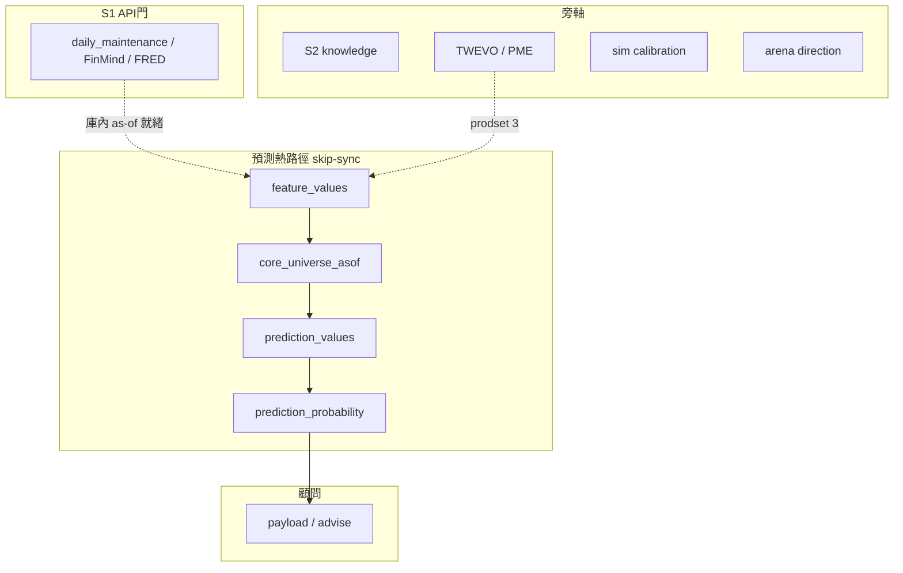

# augur 深化理解報告 r7（2026-08-06）——優化地基・第七輪（日頻 as-of 閉環已落地）

> **性質**：[I] 全專案現況之深化理解，作為 `reports/augur_project_optimization_plan_r7_20260806.md` 之依據。**不創設治權判準**、不改 [N]。  
> **承接**：r6（08-04，S1→S5 **普查**單日收斂）→ **本檔 r7（08-06，生產 as-of **日頻**鏈＋凍結＋封存收斂）**。  
> **S1→S5 閉環執行 SSOT**（仍生效、不撤）：`reports/augur_local_ai_predict_sim_self_evolve_opt_plan_20260804.md`。  
> **self-reported（#32a）**：判讀＝AI 自陳；直播數字附 (b) DB 親查或 (c) audit。  
> **封存錨**：`archive-20260806-b1-b3-p6-other-h-mstop-standing`（`68abfdd`／tip `17bc630`）。

---

## §0 一頁摘要

### 0.1 一句話（相對 r6）

r6 判定「**普查廣度衝很快，生產深度幾乎未變（panel 釘 06-30）**」。  
r7 補一句——**生產深度曲線已追上一段**：庫內價／`feature_values`／`core_universe_asof`／`prediction_probability`（H20／H60）頂齊 **2026-08-05**；日更薄殼 **B3**＋core **B1 incremental**＋P6 FREEZE→08-04 已封；顧問讀相對機率＠最新 D。  
**尚未變的本質**：確立級仍假不了（dgate 無 `evaluated_pass`；H20 `econ=dead`）；新族／宏／β **凍結**；圖邊 asof 仍 **06-30**；sim 禁 `--apply`；predict ⊥ 放量 API。

### 0.2 體量（本輪抽樣；非全表重盤）

| 維度 | r6（08-04） | r7 LIVE（≈08:07+08） |
|---|---|---|
| public 表 | 350 | **353** |
| `feature_values` | 854 萬／113 panel／max **06-30** | **873 萬**／38 feat／**116** panel／max **08-05** |
| core＠最新 asof | 225＠06-30 | **285＠08-05** |
| prodset active | 3 | **3**（未變） |
| `model_registry` | 26／7 族 | **26／7** |
| `prediction_probability` H20／H60＠頂 | （寫庫後推進） | max **08-05**；各 **285** 列＠D |
| `stock_graph_edge` | 13,021＠**06-30** | **同**（錯位仍開） |
| `world_concept_registry_current` | 17 | **20** |
| `knowledge_item` | 285,259 | **285,351** |
| `direction_gate` | pass=0／approved 11／fail 12 | **approved 11**（餘狀態略）；**無產品綠** |
| `scripts/*.py` | ~354 | **362** |
| `audits/*.md` | ~334 | **426** |
| `src/augur` packages | 16 | **16**（不變） |

### 0.3 r6→r7 結構增量（08-04 夜～08-06 晨）

| # | 增量 | 證據 |
|---|---|---|
| 1 | **日頻 as-of 出單鏈** feat→core→predict→emit | runbook／`POST-CLOSE-DAILY-ASOF-standing-go-ADOPTED` |
| 2 | **B1** core asof **incremental upsert**（禁日更全表 DELETE） | `core_gate.build_universe_asof_incremental`；`CORE-B1-INCREMENTAL-EXECUTED` |
| 3 | **B3** `scripts/run_daily_asof_predict.sh`；LIVE＠**08-05** RC=0 | `DAILY-ASOF-B3-P2-LIVE-20260805-EXECUTED` |
| 4 | **P6** FREEZE→**08-04**（H20＋H60）；other-H fit 40／82／120；emit＠08-05＝H40／H120 | `P6-REFIT-*`／`P6-OTHER-H-FIT-*-EXECUTED` |
| 5 | **軌 M-stop**／**β5_stop**／**NF-pause** 書面接受 | 各 `*-ACCEPTED-20260805` |
| 6 | 顧問：**相對 TopN**；絕對方向誠實死（GATE） | constitutional slice＋`advise`／`relevance` |
| 7 | WM.36：`macro_stock` 改 `resolve_sql`；市報＝PriceAdj TAIEX（不直綁 TRI） | 封存 1b；過 vendor／cmd 閘入 `68abfdd` |
| 8 | Archive tag 推 origin | `archive-20260806-b1-b3-p6-other-h-mstop-standing` |
| 9 | A→B3＠**08-06** 監看 armed（首查 WAIT max=08-05） | `A-THAW-PING-LATER-ARMED`；`/tmp/asof-ping-0806/watch.log` |

---

## §1 覆蓋方法（誠實）

| 方法 | 做了什麼 | 標級 |
|---|---|---|
| 承接 r6 定版 | 16 package／scripts 桶／治權地圖／36 債表結構 | 沿用；標過時處 |
| LIVE DB 親查 | §0.2 表內錨（2026-08-06 晨） | (b) |
| 封存／standing／runbook | 08-05～08-06 audits＋reports | (c) |
| 本對話執行史 | B1／B3／P6／M-stop／archive／A watcher | (a)+(c) |

**未覆蓋**：未重掃 scripts 12 桶全部分類；未重讀 MC／靈魂／原則全文；未重跑全量 vendor／false-assert；TWEVO／arena 當日進程未逐 PID 複核。

---

## §2 軸地圖（穩定本質；r7 只標增量）

### 2.1 專案是什麼（多軸共槽）

**正交硬規則**（不變）：

1. **Predict ⊥ live API**——出單只用庫內 as-of；`--skip-sync`；THAW-bounded 只管 A 車道。  
2. **相對機率唯一合法口徑**——P(beat peer median｜as-of,H)；禁絕對漲跌機率當產品敘事。  
3. **#14 經濟終關＋禁假確立級**——dgate／econ_verdict 誠實標籤可長期 `dead`／`thin_*`。  
4. **FZ／GATE-keep**；人閘不可代簽；audit GO→EXECUTED。

### 2.2 S1→S5 閉環狀態（r7）

| 階 | 本質驗收 | r7 現況 |
|---|---|---|
| **S1** | 資料完整（熱路徑 as-of，≠全 339 表） | 價頂 **08-05**；08-06 A 監看中；Dividend／寬 dim-sync 仍否 |
| **S2** | raw 交互→KH | L1–L3 已有；C1 EXPAND／CYCLE 有帳、非日更主刀；語料品質債仍在 |
| **S3** | 特徵完整＋多種重覆驗證 | Wave A–E 大半收口；**prodset 仍 3**；**M-stop／β5_stop**；圖邊＠06-30 |
| **S4** | 多模型重覆驗證 | Wave A–G 普查完；熱路徑仍 **RankRidge**；**NF-pause**；SeqLSTM／多數 sklearn **未過 #14**；H82 **ghost** |
| **S5** | 漲跌比重覆驗證＋sim 旁軸 | **日更 H20／H60 emit＠08-05**；P6 calibrator＠08-04；sim **禁 apply**；OOS／多 seed 史見既有帳 |

**C0／C1／C2**：同一閉環別名。C2 已授≠一鍵重建。C1 Arc B／Cycle 另 GO（有 `LOOP-S2-TO-S1-EXPAND`／`LOOP-CYCLE-1` 帳——**勿與日更 standing 混刀**）。

### 2.3 日更兩車道（r7 新生產形）

| 車道 | 做什麼 | 現況 |
|---|---|---|
| **A** | sync／maintenance → 價到 D | 常與 arena ~20:00 重疊；**08-06 尚未 READY** |
| **B** | B3：feat→B1 core→predict H20+60→emit | standing GO；**禁 cron**；手觸發／半自動（含已核准之 ping→B3） |

### 2.4 旁軸（承 r6；狀態略）

- **KH**：准入四閘 fail-closed；市場軸探針品質仍需誠實（spurious≠G-PROM）。  
- **TWEVO／PME**：八閘＋heavy_slot；prodset active **3**。  
- **Sim**：尺 ⊥ predict 尺；`--apply` 禁。  
- **Arena**：方向閘 AND admission；與相對機率產品敘事分離。

---

## §3 生產熱路徑（r7 實跡）

| 步 | 入口 | 備註 |
|---|---|---|
| 編排 | `scripts/run_daily_asof_predict.sh` | `--date D`；可 `--skip-*`／`--force-core` |
| 特徵 | `build_feature_panel.py --panels D --asof` | 讀 prodset 3 |
| 核心 | `build_core_universe.py … --asof --incremental --asof-date D` | B1；全量路徑保留 |
| 預測 | `predict_asof.py --run --horizon {20,60} --asof D` | `registry.latest`；artifact 不存在＝ghost 跳過 |
| 校準 emit | `calibrate_relative_probability.py --emit` | serve＝最新 `probability_calibrator`（FREEZE 錨 CLI `--asof`） |
| 顧問 | `augur.advisor.payload`／`:8399` | 相對機率；絕對方向誠實拒 |

**P6 紀律**：日 emit ≠ 日 `--fit`；fit／OOS＝週或累積實現後另 GO（other-H 已於 08-05/06 做完一輪）。

---

## §4 結構／治權（承 r6；增量標註）

### 4.1 src 強項（不變）

不變式寫成程式（#8／quota／scan_floor）；104 模組 selftest 文化；WM.36 `resolve_sql` 止血閘；audit 帳本密度極高。

### 4.2 結構債（仍開）

| 債 | 狀態 |
|---|---|
| `advisor↔deliberation`、`core↔audit` 循環依賴 | **仍開**（r6 C 軌） |
| scripts 體積只增不減／全文抓取族冗餘 | **仍開**（部分已 archive） |
| `action_log` 接線 | **已於 08-05 關閉** |
| `sync_memory.sh` 違 #14 | **已刪** |
| graph_edge asof ≠ 日 D | **仍開**（消費端須 SKIP／另授 rebuild） |
| H82 registry ghost | **仍開**（fit 有、predict 無） |
| TRI 等概念未登錄致多 scripts 基線直綁 | **仍開**（macro_stock 已繞開） |

### 4.3 治權日曆

10-14 多筆復審／CS 補正仍有效提醒（見 r6／備料報告）。V2-SUNSET consequence **機械載體仍弱**——監看、勿主動觸發。

---

## §5 凍結／護欄一覽（r7 操作員必背）

| 凍結 | 效力 |
|---|---|
| **M-stop** | 宏 stock 研究暫停；staged 保留 |
| **β5_stop** | 不重跑舊 verify；β2 resume 另句 |
| **NF-pause** | 不開新 S4 族 adapter／train |
| **no cron for B3** | standing＝手／半自動 |
| **no-SIM-apply** | sim 旁軸 |
| **no 假確立級** | dgate／econ 誠實 |
| **API-THAW-bounded** | 禁默認 Dividend／寬 dim-sync |

---

## §6 綜合債表（r7 重排；供計畫書）

標記同 r6：**[治][資][知][徵][模][測][構][腳][運]**。  
**狀態**：🟢已關／🟡監看／🔴開／❄凍結。

| ID | 軸 | 債 | 狀態 | 備註 |
|---|---|---|---|---|
| R7-01 | [運] | 下一交易日 A→B3 | 🟡 | 監看 armed＠08-06 |
| R7-02 | [測] | H20 dead／H60 thin；無確立級 | 🟡 | 產品誠實形，非漏做 |
| R7-03 | [徵] | graph_edge asof 06-30 | 🔴 | rebuild 另 GO |
| R7-04 | [模] | H82 ghost artifact | 🔴 | train_ranker 另 GO |
| R7-05 | [徵] | M-stop／β5／NF | ❄ | 勿解凍 |
| R7-06 | [測] | P6 滾動節奏（非每日 fit） | 🟡 | standing 已排除日 fit |
| R7-07 | [知] | C1 EXPAND／CYCLE | 🔴 | 另 loop GO；⊥日更 |
| R7-08 | [構] | 循環依賴 | 🔴 | 先 explore 再刀 |
| R7-09 | [腳] | 同型腳本冗餘 | 🔴 | #29 收斂另小計畫 |
| R7-10 | [資] | Dividend／dim-sync | ❄ | 另 auth |
| R7-11 | [測] | sim apply／下一格時鐘 | 🟡 | 禁 apply |
| R7-12 | [治] | 10-14 日曆項 | 🟡 | 備料已有 |
| R7-13 | [模] | RankRidge 外族過 #14 | ❄/🔴 | NF-pause 下研究暫停 |
| R7-14 | [運] | 顧問絕對方向誘惑 | 🟢 | 誠實切片已落地 |
| R7-15 | [運] | core 日更成本 | 🟢 | B1 已關主要痛點 |
| R7-16 | [運] | 日更手誤／缺編排 | 🟢 | B3＋standing |
| R7-17 | [治] | RULING-043／CS 等 | 🟢/🟡 | 多已於 r6 追記解決；文檔層殘餘見 r6 |

---

## §7 對優化計畫書的輸入（一句）

**下一階段優化主軸＝「在誠實不膨脹的前提下，讓日頻閉環穩、凍結不破、把仍開的圖／H82／C1／結構債排成可 GO 的小刀」**——不是再開一輪普查衝刺。

---

## §8 SSOT 指針

| 角色 | 路徑 |
|---|---|
| 本檔 | `reports/augur_deep_understanding_r7_20260806.md` |
| 伴侶計畫 | `reports/augur_project_optimization_plan_r7_20260806.md` |
| S1→S5 閉環 | `reports/augur_local_ai_predict_sim_self_evolve_opt_plan_20260804.md` |
| 日更 | `reports/augur_post_close_daily_asof_ops_design_20260805.md`／runbook |
| 前輪理解 | `reports/augur_deep_understanding_r6_20260804.md` |
| 封存 | `audits/ARCHIVE-CHECKPOINT-20260806-B1-B3-P6-MSTOP-STANDING.md` |

*定版（2026-08-06）——生產 as-of 已齊 08-05；08-06 候 A；凍結全集有效。*
