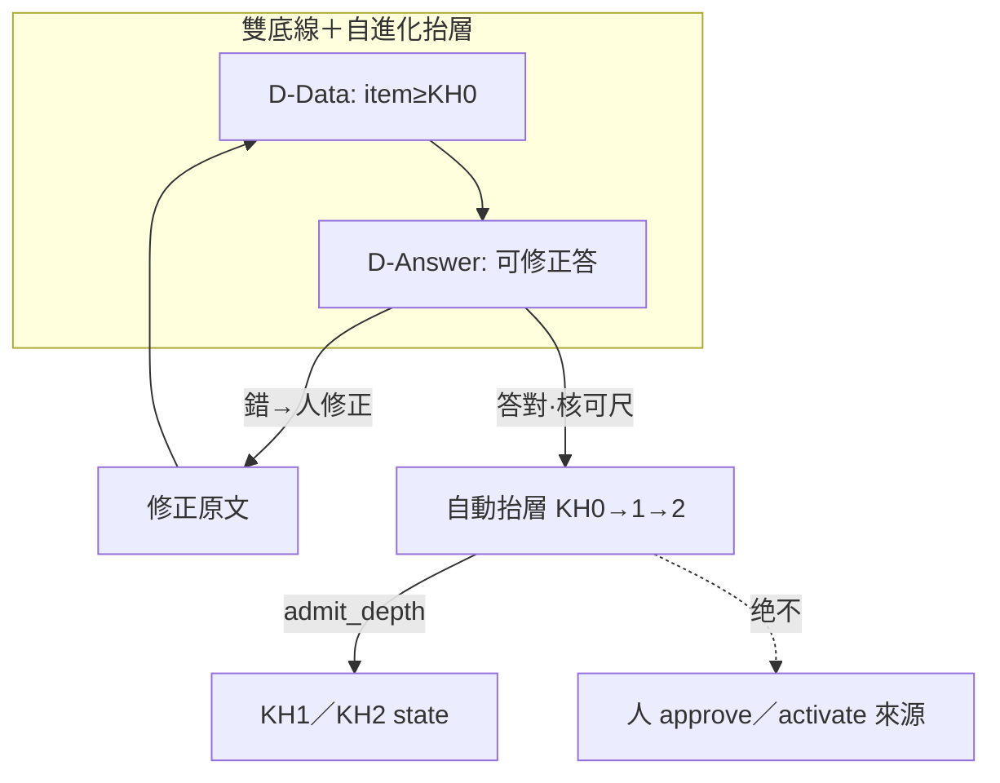
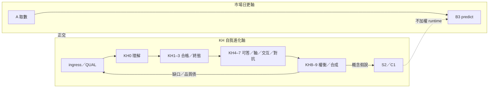

# 本地 AI·KH 閉環自我進化——優化計畫書（2026-08-06）

> **一句**：在**深化理解 r8＋逐步選刀 r10** 的地基上，把「本地 AI 對知識的理解／合格／終態／對抗／合成」收成一條可自我進化的 **KH0→KH9 閉環**；**硬雙底線**＝①**所有資料至少入 KH0（raw／可理解）** ②**問題作答至少可达 KH0（依庫內原文／標題之基本理解）**——與市場 **S1→S5** 在 **S2** 接軌；不全庫 raw 入靈魂；**來源：機械 system 可升级、web／對話 Agent 不可**（T0）；不搶日更 B3。
> **性質**：[I] 優化計畫；不創 [N]；本檔＝**開波導航**，每波仍須各別 GO。  
> **Steward 定錨（本輪）**：全資料至少入 KH0；作答至少達 KH0——**不强制世界真值答對**（錯料可錯答），但須**可修正可見**；**答對→自動抬層 KH0→KH1→KH2**（仍 ≠ AI 來源 approve）。  
> **rev**：`dual-kh0-floor`＋可修正＋**答對自動抬層**（碼候核可尺）。

---

## §0.5 雙底線不變式（本計畫憲章級約束 · [I] 執行）

> 對齊大憲章 v1.53／v1.54「KH0 普遍底線」＋顧問既有 `kh0_floor_citations`；**本優化計畫以雙底線為成功定義**，KH1–KH9 為其上進化，不得用上層綠燈掩蓋底線破口。

| 底線 | 義務（一句） | 機械落點 | 綠燈 | 假綠禁 |
|---|---|---|---|---|
| **D-Data · 全資料≥KH0** | 凡有可理解內容（原文 **或** 標題／`title_zh`）之 `knowledge_item`，一律至少評達 **admit_depth≥0** 且寫入 state | A.1 `_kh0_understandable`；佇列含標題破口；`run_kh_chain --check`→`kh0_breach` | **kh0_breach=0**（普遍口徑） | 只量有全文；靜默丟標題件 |
| **D-Answer · 作答≥KH0** | 有庫內共現材料時須能依引文產出**可據以修正**的基本理解答（錯料可錯答——**不强制世界真值正確**）。**答對**（對該次材料可核）→ **自動抬層** KH0→KH1→KH2（admit_depth／層條件累積）；**仍 ≠** 來源 `approve`／`activate`（唯人） | `kh0_floor_citations`＋引文可見；抬層＝`evaluate_layer`／admit 寫 state（核可尺另 GO 後碼） | 有材料→可修正答；答對→depth 向 1／2 自動推進 | 無引文通識；無核可卻抬層；AI 人簽來源 |

### D-Data 語意（「入 KH0＝raw」）

| 是 | 不是 |
|---|---|
| raw／可理解內容被系統**看見並評過**（state 存在；深度可停在 0） | 整庫 raw dump 進靈魂／[N] |
| 標題即語意（A.1）；無原文不豁免 | 無內容（無 title／title_zh／text）仍強制 pass |
| Drain 排泄破口直至 0 | 一次 5k 就算「計畫完成」 |

### D-Answer 語意（「回答至少 KH0」· Steward 釐清）

Steward（要旨 · 累計）：

> 沒有一定要答對（資料錯→答可錯），但至少可讓使用者修正。  
> **若回答是對的 → 自動抬層 KH0→KH1→KH2**（本地 AI KH 自進化主軸）。

| 是 | 不是 |
|---|---|
| 依庫內原文／標題基本理解；引文可對照 → **可修正** | 保证世界真值 100% 正確 |
| **答對（可核）→ 自動** 走層評估把該 item（或答所據 items）**抬向 KH1／KH2** | 答錯也抬層；無核可尺卻寫 depth |
| 來源 `approve`／`activate` **仍唯人**（TTY＋CLI） | 把「自動抬 admit_depth」當成「AI 放行來源」 |
| 錯答／錯料 → 人修正資料後可再答再抬 | 黑箱結論、無出處 |

**層級條件鏈（答對 → 自動抬層 · 仍走人簽牆外）**：

```text
KH0 材料可見 + 基本理解作答
    ├─ 答錯或資料錯 → 人修正（回饋 D-Data）· depth 可停 0
    └─ 答對（可核：與引文吻合／核可尺）→ 【自動】evaluate／upsert
           → KH1 Qualification 通過（真路徑或憲章允許之旁路）
           → KH2 Admission Assist／來源就緒條件滿足
           ※ 不停在「僅有資格」；主軸＝自動抬層
           ※ 不觸發 knowledge_source approve／activate（唯人）
```

**核可尺（plan-first · 本檔未定數值 · 另 GO 再開碼）**：須預先凍結何謂「答對」——建議候選（Steward 裁一）：

| 候選 | 概要 | 風險 |
|---|---|---|
| **R-cite** | 答中關鍵數字／專詞 ⊆ 引文 span | 漏答對但措辭不同 |
| **R-judge** | 本地 LLM 對答↔引文 yes/no（有界） | 慢／幻覺 |
| **R-human** | 人點「此答可」才抬 | 最穩；非全自動 |
| **R-hybrid** | R-cite 自動抬；邊界案 R-human | 推薦預設討論項 |

> 碼未落地前：敘事生效；**不得**宣稱已自動抬層。下一執行刀＝`KH0-ANSWER-AUTO-LIFT-plan`→裁尺→`…-go`。



**LIVE**：D-Data **破口 0** ✓；D-Answer 地板碼有；**自動抬層碼未開**（候核可尺）。

---

## §0 雙閉環疊用（必讀）

```text
市場閉環 SSOT:  reports/…predict_sim_self_evolve_opt_plan_20260804.md   (S1→S5)
KH 階梯 SSOT:   reports/augur_kh0_to_kh9_project_plan_20260806.md       (已 ADOPTED)
本檔:           KH *閉環自我進化* 的優化／波次／與市場正交紀律
選刀日更:       reports/augur_opt_stepwise_best_next_plan_r10_20260806.md
理解地基:       reports/augur_deep_understanding_r8_20260806.md
```

| 閉環 | 轉什麼 | 進化假說 |
|---|---|---|
| **市場** S1→S5 | 價／特徵／模型／預測＋sim 旁軸 | 預測尺與族選擇改善 |
| **KH** 本檔 | 語料→理解水印→可答／對抗／合成→缺口回餵 | **本地 AI 對內容的理解與紀律**改善 |
| **接點** | **S2**（C1 Arc A/B/C） | S3 特徵缺口→KH 概念；KH 缺口→擴大 S1 raw（另 GO） |

**正交紀律**：市場 Phase1（A→B3＠08-06）與 KH 大扫 **可∥**，但共享 CPU／`augur_llm.lock` 時 **收盤窗讓 #1**。



---

## §1 深化理解 → 優化命題（從 r8／r10／gov／LIVE）

### 1.1 r8 已釘、本檔不重搶的

| 命題 | 處置 |
|---|---|
| 日更 A→B3＠08-06 | 仍屬 r10 **#1**；本檔不改建 standing |
| econ／dgate 誠實死 | r10 **#2**；KH 不作假綠代償 |
| M／β5／NF 凍結 | r10 **#10**；本檔不解凍 |
| 圖消費 S-EQ | r10 **#7** 已 ADOPTED；∥ KH，不塞 B3 |

### 1.2 本檔要優化的 KH 命題（LIVE ≈09:34+08 · Drain×1 後）

| ID | 命題 | LIVE／gov | 優化方向 |
|---|---|---|---|
| **K-01** | **D-Data** 普遍 KH0 破口 | **133,999／285,351＝47.0%**（本輪 −5,000） | 續 `BREACH-DRAIN`→0 |
| **K-02** | depth0↔憲章落差 | A.1＋佇列標題破口 ✅ | 維持；勿回退 text-only JOIN |
| **K-02b** | **D-Answer** 可修正地板 | `kh0_floor` 碼有 | 抽測：有引文可對照；**不**以答對率當綠燈 |
| **K-02c** | 答對→**自動抬** KH0→1→2 | 敘事改釘；碼未開 | `KH0-ANSWER-AUTO-LIFT-plan`→裁核可尺→go |
| **K-03** | 卡在 depth≈7 | d0=5k · d7≈145,952；d9≈2 | KH8 鑑別力 **False**→先修尺再抬 |
| **K-04** | FT／終態不均 | erp 可答 100%；他域 pending／unattempted 大 | domain 分隊 KH3 |
| **K-05** | 治權／assist | active 96/97 ⚠ 無人簽軌；assist=hold／heuristic | AI 不放行；改善真模型率 |
| **K-06** | IMPORT-QUAL 綠 | quals pass=1061；多 dup | 保持；旁路正名（KH1） |
| **K-07** | 錯料／錯讀可見性 | ERP 品質檔 | 錨題測「能否讓人修正」；非强迫答對 |
| **K-08** | C1 回饋弧 | S2-after-S3 L1–L3 已做；EXPAND 另 GO | 進化＝概念缺口→raw→再 KH，非整庫 dump |
| **K-09** | KH7 庫級 | 已知誠實債 | item 化 plan→go |
| **K-10** | KH10 | 自我背書 | **永不納入本優化天花板** |

---

## §2 閉環自我進化定義（本檔正式）

**本地 AI·KH 閉環自我進化**＝下列五節點循環，且**每節點可機械驗收**；**§0.5 雙底線優先於加深**：

1. **製造／准入** — harvest／local_files／IMPORT-QUAL／KIP（KH1）→ 內容可理解者不得因欄位缺漏判死  
2. **普遍理解（D-Data）** — 全部可理解 item ≥KH0（A.1＋Drain→`kh0_breach=0`）  
3. **作答地板＋自動抬層（D-Answer）** — 可修正答；**答對→自動** 抬 item 至 KH1／KH2（admit）；來源 approve **仍唯人**  
4. **終態與可答加深** — KH3→KH4（answerable **或** 誠實 blocked）  
5. **紀律加深** — KH5→KH9；止於具鑑別力之層  
6. **回饋** — 人修正錯料→回 D-Data；概念缺口→S2；**禁止** AI 來源放行、knowledge＝預測權重

> 與十層藍圖、KH0–KH9 專案計畫**同構**；本檔加的是 **雙底線、進化節奏、與市場正交、優化優先序、波次 GO 字**。

---

## §3 優化軌（對齊 r8 五軌語言）

| 軌 | 名稱 | KH 對應 | 與市場 |
|---|---|---|---|
| **K-A** | 底線穩態 | K-01／K-02 破口→0 | ∥ #1；避收盤 LLM 鎖 |
| **K-B** | 閉環加深 | K-03–K-04、K-09 | 夜間／週末 |
| **K-C** | 品質／判準 | K-07、KH8 鑑別 | **須 Steward 裁** |
| **K-D** | C1 接點 | K-08 EXPAND／CYCLE | 與 r10 #8 互斥時讓日更 |
| **K-E** | 治權衛生 | K-05／K-06 | 零 approve by AI |
| **K-F** | 文件地盤 | 本檔＋帳 | ∥ push（另授） |

硬邊界句：

```text
FZ/GATE-keep | no-approve-by-AI | no-SIM-apply | no-KH10 | hold-#1 | NF/M/β5-freeze-monitor
```

---

## §4 逐步最佳下一步（可先／∥）

| # | 問題 | 最佳下一步 | 可先／∥？ | 狀態 |
|---|---|---|---|---|
| **1** | **D-Data** 破口 | — | — | ✅ **0** |
| **1b** | **D-Answer** 可修正地板 | 抽測集／回歸 `kh0_floor` | ∥ | 🟡 碼有 |
| **1c** | 答對→**自動抬** KH1／KH2 | 裁核可尺→`AUTO-LIFT-go` | **現主軸**；∥設計 | 🔴 敘事✅ 碼未開 |
| **2** | KH0 品質／可修正可見 | 錨題測「能否讓人修正」 | ∥文件 | 🔴 |
| **3** | KH3 他域 pending | `KH3-FT-DOMAIN-go` | 閒時∥ | 🔴 |
| **4** | KH1 旁路／KH2 逾時 | hygiene＋assist timeout | ∥抬層碼 | 🔴 |
| **5** | 止於 7／KH8 尺 | `KH8-DISCRIM-go-plan` | 阻塞 8/9 | 🔴 |
| **6** | KH7 item 化 | plan-first | ∥文件 | 🔴 |
| **7** | C1 EXPAND | 另 GO | 讓日更 | 🔴 |
| **8** | 顧問排序 vs 地板 | 不得丟 KH0 共現 | ∥ | 🟡 |
| **9** | gov 人簽 | Steward CLI | **唯人** | 🟡 |
| **10** | 計畫入版控 | commit／push | ∥ | 📄 |

---

## §5 波次（閉環一圈的建議節奏）

### Wave Κ0｜雙底線＋抬層敘事

| 步 | 內容 | GO／狀態 |
|---|---|---|
| Κ0.0–Κ0.2 | A.1＋Drain→`kh0_breach=0` | ✅ |
| Κ0.3 | D-Answer 可修正地板抽測 | 另 probe-go |
| Κ0.4 | **答對→自動抬層** 核可尺＋碼 | `KH0-ANSWER-AUTO-LIFT-plan`→裁尺→go |

**驗收 Κ0**：D-Data 破口 0 ✅；D-Answer 可修正；答對自動抬至 KH1／KH2（碼落地後）；來源 approve 仍唯人。

### Wave Κ1｜衛生與真預審

- KH1 旁路率標註；assist timeout／think（執行層，沿品質檔軌 A）  
- gov 措辭「待放行」≠「只有人」——**不**動 `chk_ks_active_needs_approval`

### Wave Κ2｜終態製造

- 按 domain 降 unattempted／pending；license blocked 保留  
- erp 已滿 → **不**無效重掃；優先 quant_finance／computer_science 等

### Wave Κ3｜KH4–6 逐 item

- axis／interaction ready；禁庫級復辟  

### Wave Κ4｜對抗與權衡（進化上限目前）

- KH7 item 模型（plan→go）  
- **KH8 鑑別力**通過前，**禁止**宣稱 depth≥8 物種進化成功  
- KH9 僅對真過 KH8 者；advisor first-rank 跟尺走；**仍受 D-Answer 約束**

### Wave Κ5｜C1 回接市場假說

- 用 S2 backlog 把「缺的交互概念」餵回特徵／raw 擴大（另 EXPAND GO）  
- **KH 指導假說、不加權 predict runtime**（doctrine 不變）

---

## §6 自我進化度量（儀表 · 誠實）

| 度量 | 綠燈定義 | 假綠禁 |
|---|---|---|
| **KH0 破口率（D-Data）** | **0%** | 只量有全文者 |
| **KH0 作答地板（D-Answer）** | 有材料→引文可對照、人能修正；無→誠實 | 答對率 100%；無引文通識 |
| **答對→自動抬層** | 核可通過→admit 寫入 KH1／KH2 | 無尺抬層；AI approve 來源 |
| IMPORT-QUAL fail 沉默 | 0 silent drop | — |
| 終態完成率 | domain 分段上升 | 把 blocked 改 answerable |
| depth 直方 | 有意義上移 | KH8 尺 False 時抬到 8/9 |
| assist 真模型率 | timeout→0；非純 heuristic | score 當放行 |
| C1 | backlog→授權→再驗 | 未 GO 的 mass ingest |

建議每次開波前：

```bash
python scripts/run_kh_chain.py --check
# 人工掃 http://localhost:8500/gov （唯讀）
# D-Answer：對凍結抽測題跑顧問（帳／人工）
```

---

## §7 與既有計畫的位階

| 檔 | 位階 |
|---|---|
| 大憲章 KH0／入口底線 | [N] 義務 |
| ten-layer 架構 | 能力語義藍圖 |
| KH0–KH9 專案計畫（已 ADOPTED） | **階梯＋Wave A–F 細節** |
| S1→S5／S1–S2–S3 | 市場＋C1 接點 |
| r8 理解／r10 選刀 | 全專案導航（市場偏重） |
| **本檔** | **KH 閉環自我進化的優化總冊**（波次／正交／度量） |

衝突時：憲章 ＞ 本檔執行；本檔波次 GO ＞ 口頭「順手推一下」。

---

## §8 Paste-ready

採納本優化計畫（含雙底線 rev）：

```text
LOCAL-AI-KH-LOOP-EVOLVE-OPT-adopt | dual-kh0-floor | FZ/GATE-keep | no-approve-by-AI | hold-#1
# 讀: reports/augur_local_ai_kh_loop_evolve_opt_plan_20260806.md §0.5
# D-Data: 全資料≥KH0 · D-Answer: 作答≥KH0
```

續 Drain（建議）：

```text
KH0-BREACH-DRAIN-go | FZ/GATE-keep | --limit 5000 | no-activate-source | rounds-N
```

作答地板抽測（另授）：

```text
KH0-ANSWER-FLOOR-probe-go | FZ/GATE-keep | read-only-advisor
```

判準刀（更遠）：

```text
KH8-DISCRIM-go-plan
```

---

## §9 驗收（本計畫書）

1. Steward 能復述：**D-Data ∧ D-Answer** 雙底線；市場日更軸 ⊥ KH 進化軸。  
2. 「入 KH0」＝raw／可理解被評過；「答 KH0」＝依庫內材料基本理解，**≠**保證答對。  
3. 主缺口含 **47% KH0 破口**（Drain×1 後）＋**KH8 無鑑別**＋作答抽測帳薄。  
4. 明文：approve 唯人、KH10 不納、不加權 predict。  
5. 最佳下一步板含可先／∥。  

---

## §10 讀序

1. `reports/augur_deep_understanding_r8_20260806.md`  
2. `reports/augur_opt_stepwise_best_next_plan_r10_20260806.md`（市場選刀）  
3. `reports/augur_kh0_to_kh9_project_plan_20260806.md`  
4. **`reports/augur_local_ai_kh_loop_evolve_opt_plan_20260806.md`（本檔）**  
5. `audits/GOV-TO-KH0-KH9-MAP-20260806.md` · `run_kh_chain.py --check`

*完。[I] self-reported（#32a）。*
