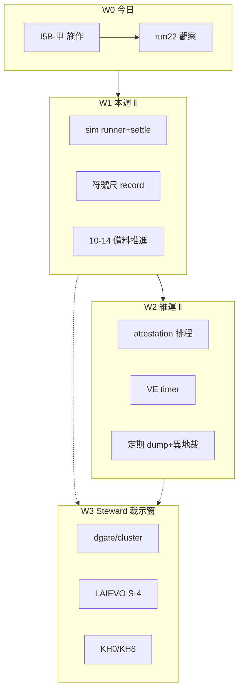

# Augur 全問題優化——逐步執行計畫書（2026-08-03）

> **性質**：[I] 執行計畫（CLAUDE #16/#20；憲章 v1.39.0 附 (a) 表 schema 對映＋(b) python 程式規畫）。**不創設治權判準**；不自動解凍 API；不降閘。  
> **依據**：[`reports/augur_deep_understanding_r4_20260803.md`](augur_deep_understanding_r4_20260803.md)（優化基座）＋ HANDOFF 08-02 餘項＋ I5B／sim W3W5 既有呈案。  
> **現況錨**【親驗 2026-08-03 ~08:37】：prodset active=3；`pending_auto`=17（全 run 21）；direction_gate 無 pass；PriceAdj max=2026-07-31；kill 全 clear。  
> **本檔紀律**：凡標【Steward】＝人裁後才動；標【自動】＝cron／timer；標【AI】＝護欄內可為；標【‖】＝可並行（車道不撞）。  
> **未拍板前零碼改／零 DDL／零 APPLY**（本檔＝計畫；實作另開波次）。

---

## §0 三十秒＋拍板碼

**一句**：先堵住「run 22 混池／世代殘留」結構洞，再讓 sim 時鐘真跑、旁路維運誠實化，方向門與 LAIEVO 量尺走 Steward 裁示車道——全程 **FZ-keep／GATE-keep／NHC-keep**。

**今日最緊**：I5B-甲 diff 施作窗＝**現在 → 2026-08-03 23:00**（週一 cron 起 run 22 前）。逾窗＝run 21 之 17 列 pending 與新世代重演混池風險（見 I5B 呈案）。

### 建議拍板句（開全計畫）

```text
OPT-EXEC-20260803-go + W0-go + W1-go + FZ-keep + GATE-keep + NHC-keep
```

| 碼 | 含義 |
|---|---|
| `OPT-EXEC-20260803-go` | 採納本計畫為後續優化執行 SSOT |
| `W0-go` | 今日緊急：I5B 施作＋run 22 觀察帳 |
| `W1-go` | 本週：sim 證據管線最小閉環（W5 runner→settle→W3 評估骨架） |
| `W2-go` | （另句）維運誠實：attestation／VE／dump |
| `W3-go` | （另句）結構裁：dgate／cluster／LAIEVO S-4／KH0 |
| `I5B-diff-施作` | 專裁：採 I5B-甲 DDL＋碼（見既有呈文） |
| `FZ-keep`／`GATE-keep`／`NHC-keep` | 不解凍／不降閘／不硬編碼答樹 |

可只回：`OPT-EXEC-20260803-go + W0-go + I5B-diff-施作 + FZ-keep + GATE-keep + NHC-keep`（最小今日開跑）。

---

## §1 問題總帳（全部未閉項 → 車道）

> 已兌現不列（G-SIGN 入閘、prodset=3、SIM-CAL-R1 門、RULING-042、假斷言閘、I3 逾時修正等）。

| ID | 問題 | 不修會怎樣 | 車道 | 層級 | 波次 |
|---|---|---|---|---|---|
| **Q01** | I5B：引擎無世代 supersede；run 22 將混舊 pending | I5 整批連舊帶新；人裁佇列失真 | TWEVO／PME 碼＋DDL | Steward→AI | **W0** |
| **Q02** | run 22＝首個全自動輪（08-03 23:00） | 無驗收帳＝不知自動鏈是否真綠 | 觀察／audit | AI 觀察 | **W0** |
| **Q03** | sim 門開、runner／settle／評估器未建 | 時鐘空轉；T-A 無證據 | sim 新碼 | Steward 節奏→AI | **W1** |
| **Q04** | direction_gate 無 pass；cluster 60 vs 250；own_stack h 錯配 | 確立級永紅；SUNSET(a) 難達 | 決策＋可選碼 | **Steward** | W3 |
| **Q05** | LAIEVO 0 輪＋robot 過地板 | 能力宣稱無證據力 | 凍結集／評尺 | Steward→AI | W3 |
| **Q06** | attestation 對帳長停 | 資料真實性機械鏈斷 | raw 維運排程 | AI 呈案→掛 | W2 |
| **Q07** | validation_evidence 排程＋manual 到期 | 紅燈無人見；manual 免疫窗口 | timer／腳本 | AI | W2 |
| **Q08** | 備份單碟（dump+DB+repo） | 碟亡＝全亡 | ops | Steward＋AI | W2 |
| **Q09** | TWEVO close 判準（重試成功仍 failed） | 產能帳失真 | 判準＋碼 | Steward→AI | W2 |
| **Q10** | KH fulltext 誠實旗標／KH0 兩尺 | 覆蓋帳不可信；義務缺口 | knowledge | Steward 裁 KH0→AI | W2‖W3 |
| **Q11** | KH8 鑑別力／GREATEST 再膨脹 | KH9-first 排序退化 | 閾值裁示 | Steward | W3 |
| **Q12** | 10-14 日曆／WM.35–36 懸崖 | 10-15 消費禁令自動生效 | 合規備料 | Steward＋AI | W2 持續 |
| **Q13** | heavy_slot／I3 過慢 | 五軸互斥、優化吞吐差 | 性能 | AI（計畫後） | W4 |
| **Q14** | I6 未接 train_ranker | 晉升不進熱路徑 | TWEVO 授權 | Steward | W4 |
| **Q15** | path_gate「一條路」未收斂 | 六門平行債 | 架構計畫 | #20 另案 | W4 |
| **Q16** | SUNSET consequence 封存腳本缺 | 停損半套 | program 碼 | AI 呈案 | W4 |
| **Q17** | PME-XDOM-SOLAR 等 APPLY | 無雙綠＋無碼硬促＝假晉升 | 禁自動 | 另句 `PME-APPLY-go` | 閘外 |
| **Q18** | I5B 後：pending 17 列 demote／FAIL_SIGN 人裁 | 積壓除役通道 | 人裁 TTY | Steward | W0 後‖ |
| **Q19** | lending／sign 尺與現役對齊 | 週報 (b) 口徑 | sign 表 | AI（slot 空） | W1‖ |
| **Q20** | DESKTOP 並行機／跨庫 drift（若仍存在） | 數字雙真相 | ops | Steward | 機會窗 |

---

## §2 資源與互斥（決定「可先／可 ‖」）

| 資源 | 誰搶 | 規則 |
|---|---|---|
| **DB heavy 寫／長算** | I3 local-gates、panel rebuild、sim 大批 run、pg_dump | **同時只開一條重車道** |
| **CPU 中等** | sign 尺、VE 檢查、KH embed 有界批 | 可與文件／呈案 ‖ |
| **人裁 TTY** | I5B 過目、APPLY、KH0／dgate／S-4、NAS | **不可 ‖ 假多人**；批次湊一窗 |
| **FZ API** | FinMind／FRED | **全計畫預設不開**；arena 日更白名單維持既裁 |
| **治權 [N]** | 10-14、L7.16 後續 | 只備料／登錄，不假關 |



---

## §3 分波執行（最佳下一步序列）

### W0 — 今日（緊急；建議立刻開）

| 步 | 動作 | 可 ‖？ | 層級 | 驗收 |
|---|---|---|---|---|
| **W0-0** | 讀 I5B 呈案＋diff：`reports/w2_20260801/I5B_stale_pending_supersede_proposal.md`、`I5B_engine_supersede_diff_20260802.md` | — | 人 | 懂甲案風險 |
| **W0-1** | Steward 回 `I5B-diff-施作`（或改 B／退回） | — | **Steward** | 有碼 |
| **W0-2** | 施作：CHECK 放寬 `superseded`＋入佇列前 supersede 同 feature 舊 pending＋selftest 突變驗紅 | 否（獨佔短 DDL） | AI（拍板後） | selftest 綠；行為測紅 |
| **W0-3** | 唯讀預檢：pending_auto 仍僅 run 21；引擎 idle | ‖ 文件 | AI | SQL 快照入 audit |
| **W0-4** | **23:00** 起觀察 run 22（勿手動搶 heavy） | 否與 I3 搶 | 【自動】+AI 監看 | ledger／run 狀態落 audit |
| **W0-5** | run 22 後唯讀：舊 pending 是否被 supersede；新列 gate_set；無混池 | — | AI | `audits/OPT-W0-RUN22-*.md` |

**W0 明確不做**：整批 `--allow-apply`；解凍 API；改閘閾值。

**W0 可同步（輕量 ‖）**

| ‖ | 內容 |
|---|---|
| ‖D | 更新本計畫執行進度 audit 骨架（零 DB） |
| ‖E | 10-14 備料目錄對照表（讀 `augur_1014_review_evidence_prep_20260801.md`，只整理缺口清單） |
| ‖F | 五埠／orphan 健康檢查（HANDOFF 重開三件） |

---

### W1 — 本週（sim 時鐘＋符號尺；與 W0 收尾銜接）

> 前置：W0-2 完成（或 Steward 明示延期 I5B 並接受混池風險）。  
> **sim 與 I3 互斥**：若 run 22 仍佔 slot／長跑，sim 大批產 run **等釋放**。

| 步 | 動作 | ‖ | 層級 | 既有計畫 |
|---|---|---|---|---|
| **W1-1** | 依 `sim_w3w5_implementation_plan_20260802.md`：**P0 候選一列**（若仍 0）→ **W5 live runner**（iid_bootstrap、kill 接線、run_id 含 spec_sha）→ **settle_sim_realized** | 內序串行 | AI（`SIM-W1-go` 可併入 W1-go） | 該檔 §2–§4 |
| **W1-2** | **W3 評估器骨架**：五臂表寫入路徑＋`--selftest`（可先 SKIP 真算） | 可與 W1-1 後期 ‖ 測 | AI | 同檔 W3 |
| **W1-3** | 符號尺：對 **現役 active 三顆** `--record`（features 以 live 名單為準；**勿**再假設 mean_20d 現役） | 須 slot 空 | AI | r3 W2-‖A 精神 |
| **W1-4** | 週報 (b) 口徑複驗（all_active＋sign） | ‖ W1-3 後 | AI | `report_triple_evolution_week.py` |
| **W1-5** | Q18：Steward TTY 消化 FAIL_SIGN demote pending（一次一顆或明示批次碼） | ‖ 人裁窗 | Steward | APPLY 紀律 |

**W1 拍板**：`W1-go`（或拆 `SIM-W5-go`／`SIM-W3-go`）。

---

### W2 — 維運誠實（可與 W1 文件／輕腳本 ‖；重 IO 錯開 dump）

| 步 | 動作 | ‖ | 層級 |
|---|---|---|---|
| **W2-1** | attestation／reconcile **掛排程提案**（零放量 API；庫內對帳）＋最小 dry-run 實測 | ‖ 呈案 | AI→Steward 掛 |
| **W2-2** | validation_evidence：timer 或 cron 跑可執行項；manual 90d 到期清單 | ‖ | AI |
| **W2-3** | 定期 `pg_dump -Fd -j4`＋**異地**目標（NAS／第二碟）——異地路徑【Steward】 | dump 時禁 DDL | Steward＋AI |
| **W2-4** | close 判準修法呈案（雙欄 vs 洗敗） | ‖ 文件 | Steward 裁→AI |
| **W2-5** | KH：`unattempted`／fulltext_status 有界回填（#25 最小單位先） | 輕批 ‖ | AI（FZ-keep） |
| **W2-6** | 10-14：合規弧缺口→每週一頁進度（不假關） | ‖ | AI＋Steward |

---

### W3 — Steward 結構裁示窗（決策密集；碼少）

| 裁 | 選項方向（呈案用，非預裁） | 後續碼 |
|---|---|---|
| **dgate／cluster** | 降門／supersede own_stack／補 h 出單／維持 250 並接受長期紅 | 依裁 |
| **LAIEVO S-4** | 新凍結集＋換尺後首輪 | `eval_local_model`＋ledger |
| **KH0** | 甲／乙／丙（覆蓋義務定義） | auto_admit／報告口徑 |
| **KH8 閾值** | MIN_MINORITY_MASS 升／誠實降級排序 | evidence.py |

**可與 W2 文件 ‖；不可與「假裝已過門」的產品宣稱 ‖。**

---

### W4 — 吞吐與架構（W1–W2 穩後）

| 步 | 內容 | 備註 |
|---|---|---|
| W4-1 | I3／panel 性能剖析（先量再改；GATE-keep） | 另小計畫 |
| W4-2 | I6 接 `train_ranker`【明示授權】 | ≠可交易 |
| W4-3 | path_gate 三表收斂——**#20 獨立計畫書** | 觸 ≥3 package |
| W4-4 | SUNSET consequence 封存腳本 | program 軸 |
| W4-5 | PME-XDOM-SOLAR：僅 `PME-APPLY-go`∧雙綠 | 閘外 |

---

## §4 (a) 表 schema 對映＋(b) python 規畫

### 4.1 W0 I5B

| 層 | 內容 |
|---|---|
| **讀** | `promotion_queue`（queue_status／run_id／feature／principle_id／decided_by）、`evolution_run` |
| **改 DDL** | `promotion_queue_queue_status_check`：允許 `superseded`（或零 DDL 備援：沿用 `rejected_gate`＋decided_by——若裁 `I5B-diff-改B`） |
| **寫** | 同交易：`SET LOCAL augur.honesty_write='on'`；UPDATE 舊 pending→superseded；INSERT 新列不變 |
| **程式** | `src/augur/philosophy/evolution.py`（或入佇列路徑所在）新增 `_supersede_stale_pending(...)`；`scripts/run_philosophy_evolution.py` 呼叫；`--selftest` 錄影雙重（零 DB） |
| **驗** | 突變：拔謂詞任一即紅；apply 腳本仍只選 `pending_auto` |
| **結果落點** | `audits/I5B-APPLIED-20260803.md`（施作後） |

### 4.2 W0 run 22 觀察

| 層 | 內容 |
|---|---|
| **讀** | `evolution_iteration_ledger`、`evolution_run`、`promotion_queue`、`evolution_deferred_work`、`evolution_apply_log` |
| **寫** | **無**（純觀察） |
| **程式** | 既有 cron：`run_evolution_iteration.py --run`；監看用一次性 SQL／`audits/OPT-W0-RUN22-*.md` |
| **驗** | status 終態有值；I5 未 APPLY（無 `--allow-apply`）；若 I5B 已上：無跨 run pending 混池 |

### 4.3 W1 sim

| 層 | 內容 |
|---|---|
| **讀** | `evolution_prereg_gate`（SIM-CAL-R1）、`simulation_method_registry`、`mc_simulation_run`、`TaiwanStockPriceAdj`、`evolution_kill_switch` |
| **寫** | `sim_evolution_candidate`（P0 1 列）、`mc_simulation_run`（新 run_id 空間）、`sim_run_link`、`sim_realized_outcome`、`sim_calibration_eval`（W3） |
| **新建程式**（名稱以 sim 計畫為準，可微調） | `scripts/run_sim_calibration_paths.py`（W5 runner）、`scripts/settle_sim_realized.py`、`src/augur/simulation/arms.py`＋`calibration.py`、`scripts/evaluate_sim_calibration.py` |
| **複用** | `simulate_mc_paths._simulate`／kill 純函式；鏡射 `settle_arena_labels` 語意 |
| **驗** | `--selftest` 免 DB；最小 asof 一格 dry→apply；kill=halt 拒跑；門指紋不變 |

### 4.4 W1 符號尺

| 層 | 內容 |
|---|---|
| **讀** | `feature_values`、`evolution_production_feature_set` |
| **寫** | `feature_sign_check`（`--record`） |
| **程式** | `scripts/verify_sign_consistency.py --run --record --features <active 三顆>` |
| **驗** | 三顆皆有列；週報 (b) 可讀 |

### 4.5 W2 維運

| 項 | 讀 | 寫／排程 | 程式 |
|---|---|---|---|
| attestation | raw／attestation_* | 排程觸發既有 reconcile | `daily_maintenance` **audit 段**或專用；**跳過 FinMind fetch** |
| VE | `validation_evidence` | 更新 last_run／結果 | 既有檢查 runner＋timer unit |
| dump | 全庫 | dump 目錄＋異地 | `pg_dump -Fd -j4`；文件化於 ops |
| KH 旗標 | `knowledge_item` | `knowledge_fulltext_status` | `backfill_fulltext_unattempted.py` 有界 |

### 4.6 W3 決策（多數零碼）

結果落點：`governance_proposal`／`evolution_prereg_gate`／audits；碼改僅在裁示後另開波次計畫補 (a)(b)。

---

## §5 元件・端點・分階段驗收

| 階段 | 交付 | 完成定義 |
|---|---|---|
| W0 | I5B 上線＋run22 audit | supersede 行為測綠；run22 觀察檔；無擅自 APPLY |
| W1 | sim 最小證據鏈＋sign 三顆 | candidate≥1；至少一格 settle 或誠實 unsettleable；sign 三列；週報 (b) 可解釋 |
| W2 | 維運三件套提案落地 | attestation／VE 有排程或明確 skip 理由；dump 節奏＋異地裁示紀錄 |
| W3 | 三份 Steward 裁決登錄 | dgate／S-4／KH0（或明示延期碼） |
| W4 | 另案計畫＋授權 | 各子項獨立拍板 |

**端點／服務**：本計畫**不改** advisor:8399／chat:8090 契約；優化期間僅要求五埠健康（W0-‖F）。

---

## §6 明確不做

- 無 `INV2` 解凍 FinMind／FRED  
- 降 G-PROM／G-ECON／G-SIGN  
- cron 加 `--allow-apply`  
- AI 代簽 I5B／APPLY／KH0／dgate  
- 以 cite 率／RKI 命中當晉升  
- 假關 10-14  
- 把本 [I] 計畫貼進憲章  

---

## §7 與舊計畫關係

| 舊檔 | 關係 |
|---|---|
| `augur_deep_understanding_r4_20260803.md` | **問題與槓桿 SSOT**；本檔＝其執行編排 |
| `augur_evolution_execution_plan_20260731.md` | 五軸夜計畫；多項已兑现；剩餘併入本檔 Q／W |
| `I5B_*`／`sim_w3w5_*` | **子計畫不重寫**；本檔只排程與拍板入口 |
| `augur_self_evolution_execution_plan_20260730.md` | 史料 |

---

## §8 建議執行日曆（示意；可滑）

| 時段 | 焦點 |
|---|---|
| **08-03 上午–22:30** | W0-1～W0-3（I5B） |
| **08-03 23:00–翌晨** | W0-4～W0-5（run22） |
| **08-04–08-08** | W1 sim＋sign（錯開 heavy） |
| **08-04–08-15** | W2 維運 ‖ 文件 |
| **任一 Steward 窗** | W3 三裁 |
| **穩定後** | W4 |

---

## §9 你可回的一句

**今日最小開跑：**
```text
OPT-EXEC-20260803-go + W0-go + I5B-diff-施作 + FZ-keep + GATE-keep + NHC-keep
```

**本週含 sim：**
```text
OPT-EXEC-20260803-go + W0-go + W1-go + I5B-diff-施作 + FZ-keep + GATE-keep + NHC-keep
```

拍板後依本檔波次執行；每波收尾寫 `audits/OPT-W*-*.md` 並回寫 HANDOFF 一行狀態。
