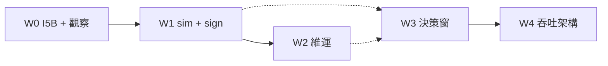

# Augur 深化理解 × 優化執行——統一總冊（2026-08-03）

> **位階**：[I] 理解＋執行計畫合成 SSOT（**非** [N]；不創設治權判準）  
> **觸發**：Steward「深化理解…並做出深化理解的優化專案報告／優化計畫書，作為後續優化基礎」＋問卷選定 **合成一份總冊**、**只出總冊等另句拍板再建碼**。  
> **現況錨**【親驗 2026-08-03 **13:39** CST】：見 §1。HEAD=`c3b338e`（含今晚 watchdog **不發車** 更正）。  
> **「記住」落點**：本檔＋`HANDOFF.md` 指針；跨 session 不靠模型權重。  
> **舊檔降級**：`augur_deep_understanding_r4_20260803.md`、`augur_optimization_execution_plan_20260803.md` → **附錄史料**（細節可溯；以本總冊為準）。r2／r3 仍供假綠方法論與長債表。

**接續讀序**：`HANDOFF.md` → **本總冊** →（需要時）r3 債表／I5B 呈文／sim W3W5 子計畫 → 治權五檔（`ls docs/`）→ constitution-mcp。

---

## §0 三十秒

Augur＝**先立法、再長智慧**的世界建構：半-1 台股相對強弱＋經濟終關／arena；半-2 know-how→檢索→本地 LLM；第三塊五軸自進化＋審議閘。成長唯一合法路＝候選→可證偽／OOS／經濟終審→**人門**→晉升或判死。

**優化主軸（本總冊）**：今晚前堵住 I5B 世代混池 → 讓 sim 證據鏈真跑 → 維運誠實化 → Steward 裁 dgate／LAIEVO／KH → 再談吞吐架構。全程 **FZ-keep／GATE-keep／NHC-keep**。

**綠燈第一句**：「這個綠燈量的是不是它宣稱在量的東西？」

**本檔狀態**：計畫已齊、**實作未開**——等你另回拍板碼（§8）。

---

## §1 終態座標（13:39 親驗）

| 錨 | 值 | 相對今晨 08:37 |
|---|---|---|
| 治權檔 | 靈魂 v1.10.0／原則 v1.12.0／大憲章 v1.54.0／CLAUDE v1.35／MC v1.6；L0–L7 規格全生效 | 同 |
| public 表 | pg_tables **335**／relkind=`r` **334** | 同 |
| prodset active | **3**：`cycle_position_252d`、`inst_cumflow_position_120d`、`lending_fee_rate_mean_30d` | 同 |
| PME runs | 最新 run **21** succeeded；zombie 已 failed | 同 |
| pending_auto | **17**（全 run 21） | 同——I5B 仍未上 |
| kill | tw/raw/lai/sim/global **clear** | 同 |
| direction_gate | approved=11／evaluated_fail=12／superseded=6；**無 pass** | 同 |
| arena 列 | 15,344 | 同 |
| PriceAdj max | **2026-07-31** | 同 |
| TWEVO ledger | succeeded=3／failed=1／halted=1 | 同 |
| **sim_evolution_candidate** | **1**（`simc_r1_iid_baseline`，TR-C，08-02 落地） | ★晨間計畫寫 0→**已有 P0 候選**；run_link／realized／eval 仍 **0** |
| SIM-CAL-R1 | approved；V2-SUNSET-r2=evaluated_pass | 同 |
| KH10 人裁 | approved=4／deferred=6／rejected=13／killed=20 | 同 |
| 常駐埠 | 8090/8500/8600/11434/6333=200；8399 `/`=404（正常） | 同 |
| evo 長跑進程 | **無** local-gates／iteration 佔槽 | 引擎 idle＝I5B DDL 友善 |
| 今晚 cron | HEAD 註：**watchdog 不發車**（前一版「會發車」作廢）——run 22 是否仍 23:00 發車須對照 live crontab／runbook，**勿抄舊記憶** | ★接續必再 `crontab -l`／相關 runbook |

**口徑**：表數兩尺並報；雙綠≠八閘全綠≠prodset；確立級唯 direction_gate；KH0「未評」≠「無原文」。

---

## §2 治權脊椎（優化不可撞）

### 2.1 L0–L7

入口 `constitution/GOVERNANCE-MAP.md`。L0 Meta **v1.6** → L1 WM → L2 ONT → L3 ID → L4 KS **v1.1** → L5 → L6 Agent **v1.2**（CLAUDE 落點）→ L7 Infra。精確義務走 **constitution-mcp**。

### 2.2 十條不變式（摘要）

#1 source-pure · #8 anti-leakage · #15 真兆 · 經濟終關 · 思想≠特定值 · 五鏡 · SSOT 量尺 · 質>量 · lex superior · NoLaundering／人門。

### 2.3 紅線

| 紅線 | 含義 |
|---|---|
| FZ-keep | 取數凍（arena 日更白名單除外）；預測⊥API |
| GATE-keep | 不降閘 |
| HUMAN 門 | APPLY／approve／I5B／KH0／dgate |
| soul≠raw | 概念入靈魂，非整庫 raw |
| clean-room | 不回流 stock_backend |
| INV2 | 解凍須明示句 |
| 10-14 | 日曆項禁假關；WM.35/36 自 **10-15** 消費禁令 |

---

## §3 架構心智模型

```
ingestion ──FZ──► raw → features → universe → evaluation/models → predict
                      └─► arena/direction_* → direction_gate（確立級）

knowledge/philosophy → embed → Qdrant|pgvector → advisor:8399 (qwen3:8b)
        ✗ 不進特徵權重；cite ≠ G-PROM

PME/TWEVO: map → local-gates(八閘含 G-SIGN) → pending_auto → 人裁 APPLY → prodset
RAWEVO / LAIEVO / sim：正交帳本；heavy 長算互斥
KH10：只 propose＋人裁；可橋 PME-XDOM（另碼）
```

**隔離**：預測 7 package 不得 import philosophy/advisor/knowledge/evolution。

**建構 how**：`reports/augur_construction_understanding_20260713.md`（版號已舊、骨架仍準）。

---

## §4 分域現況（優化前必知）

### 4.1 半-1 預測

- 庫內 train／predict／`--skip-sync` arena ✅；取數仍凍  
- **確立級紅**：無 direction_gate pass；cluster 文案≥60 vs live 常 250；own_stack h 與全 h=5 出單錯配  
- PriceAdj 停在 07-31⇒預測可 as-of，live 品質另監  

### 4.2 五軸進化

- TWEVO／PME：run 20/21 完整輪；產產 active=3（08-02 人裁自掙）  
- **I5B 洞未補**：引擎無世代 supersede；17 列 pending 全屬 run 21——下一輪重發將混池  
- RAWEVO 有 succeeded；LAIEVO **0 輪**＋尺 robot 過強  
- sim：**門 approved＋候選 1 列**；**runner／settle／eval 仍 0**→時鐘仍空轉  

### 4.3 半-2 知識／顧問

- 終態＝license 允許可答；KH4 最低閉環；KH10 人裁  
- 債：fulltext 誠實旗標、KH0 兩尺、KH8 尾巴解閘、embed／KIP 缺口  
- SOLAR S1 map 已寫；**PME-APPLY-go 未開**  

### 4.4 假綠防治資產

CLAUDE #35＋pre-commit 假斷言閘；綠燈對準量尺；VE manual 90d；UPDATE-GUC。高風險族：lint 引用≠落地、OCV、LAIEVO robot、KH8 解閘。

---

## §5 問題總帳 Q01–Q20 → 波次

| ID | 問題 | 波次 | 層級 |
|---|---|---|---|
| Q01 | I5B 世代 supersede 缺失 | **W0** | Steward→AI |
| Q02 | run 22／自動輪驗收（發車與否以 live 為準） | **W0** | 觀察 |
| Q03 | sim runner／settle／eval | **W1** | AI（節奏拍板） |
| Q04 | dgate／cluster／own_stack | W3 | Steward |
| Q05 | LAIEVO S-4 | W3 | Steward→AI |
| Q06 | attestation 排程 | W2 | AI→掛 |
| Q07 | VE 排程／manual 到期 | W2 | AI |
| Q08 | dump＋異地 | W2 | Steward＋AI |
| Q09 | close 判準失真 | W2 | Steward→AI |
| Q10 | KH 旗標／KH0 | W2‖W3 | 裁→AI |
| Q11 | KH8 閾值 | W3 | Steward |
| Q12 | 10-14／WM.35–36 | W2 持續 | 雙端 |
| Q13 | I3／panel 性能 | W4 | AI |
| Q14 | I6↔train_ranker | W4 | Steward |
| Q15 | path_gate 一條路 | W4 | #20 另案 |
| Q16 | SUNSET consequence 腳本 | W4 | AI 呈案 |
| Q17 | PME-SOLAR APPLY | 閘外 | 另句 |
| Q18 | pending demote 人裁 | W0 後‖ | Steward |
| Q19 | 現役三顆符號尺 `--record` | W1‖ | AI |
| Q20 | 跨機 drift（若仍在） | 機會 | Steward |

---

## §6 執行編排（先做／可 ‖）

### 資源互斥

| 資源 | 規則 |
|---|---|
| heavy 長算／長寫 | I3、sim 大批、dump：**同時一條** |
| 人裁 TTY | 不可假平行；湊窗 |
| FZ API | 預設不開 |



### W0 — 今日（最緊；**未拍板不施作**）

| 步 | 動作 | ‖？ |
|---|---|---|
| W0-0 | 讀 I5B 呈案＋diff（`reports/w2_20260801/I5B_*`） | — |
| W0-1 | Steward：`I5B-diff-施作`／改B／退回 | — |
| W0-2 | DDL `superseded`＋入佇列 supersede＋selftest 突變驗紅 | 否 |
| W0-3 | 唯讀快照 pending／idle | ‖ 文件 |
| W0-4 | 對照 **live crontab／runbook**：今晚是否發車；發則觀察、不發則記「跳班」audit | 觀察 |
| W0-5 | 事後：混池有無、gate_set、無擅 APPLY | — |

今日可 ‖（輕）：五埠健康、10-14 缺口清單、本總冊進度 audit 骨架。

### W1 — 本週（sim＋符號尺）

前置：I5B 已上 **或** Steward 明示接受混池風險。  
候選已有 1 列→W1 重心＝**runner→settle→eval 骨架**（子計畫：`sim_w3w5_implementation_plan_20260802.md`）。  
符號尺對 **active 三顆** `--record`（勿再假設 mean_20d 現役）。與 I3／dump **錯開**。

### W2 — 維運誠實

attestation 庫內對帳排程、VE timer、定期 dump＋異地裁、close 呈案、KH 旗標有界回填、10-14 週進度。dump 時禁 DDL。

### W3 — Steward 決策窗

dgate／cluster；LAIEVO S-4；KH0；KH8 閾值。多為裁示、少碼。

### W4 — 吞吐／架構

I3 性能、I6 重訓授權、path_gate 另案、consequence 腳本、SOLAR 僅雙綠＋`PME-APPLY-go`。

---

## §7 (a) 表＋(b) 程式對映（計畫完整性）

| 波 | 主要讀表 | 寫／DDL | 主要程式 |
|---|---|---|---|
| W0 I5B | `promotion_queue`、`evolution_run` | CHECK＋supersede UPDATE（honesty GUC） | `philosophy/evolution.py` 入佇列路徑；`run_philosophy_evolution.py`；`--selftest` |
| W0 觀察 | ledger／run／queue／deferred／apply_log | **無** | cron／SQL→`audits/OPT-W0-*` |
| W1 sim | prereg、registry、PriceAdj、kill、candidate | `mc_simulation_run`、`sim_run_link`、`sim_realized_outcome`、`sim_calibration_eval` | W5 runner／`settle_sim_realized`／`evaluate_sim_calibration`＋`src/augur/simulation/*`（新建） |
| W1 sign | `feature_values`、prodset | `feature_sign_check` | `verify_sign_consistency.py --record` |
| W2 | attestation_*、VE、knowledge_* | 排程觸發／有界 backfill | reconcile／VE runner／`backfill_fulltext_unattempted`；`pg_dump` |
| W3 | gate／prereg／ledger | 人簽列 | 裁後另開波次補碼 |
| W4 | 依子計畫 | 依子計畫 | train_ranker 等（須授權） |

**端點**：不改 advisor/chat 契約；維持五埠可驗。

**驗收摘要**

| 波 | 完成定義 |
|---|---|
| W0 | I5B 行為測綠；觀察／跳班 audit；無擅 APPLY |
| W1 | 至少一格 run+link（或誠實 unsettleable）；eval 路徑可跑 selftest；sign×3 |
| W2 | 三件套有排程或書面 skip；異地裁示有紀錄 |
| W3 | 三裁登錄或明示延期碼 |
| W4 | 各子項獨立拍板 |

---

## §8 拍板碼（實作閘——問卷選定「只出總冊」）

```text
# 採納本總冊為唯一優化 SSOT
OPT-FOUNDATION-20260803-go + FZ-keep + GATE-keep + NHC-keep

# 今日最小開跑（I5B）
+ W0-go + I5B-diff-施作

# 本週含 sim
+ W1-go

# 其後另句
+ W2-go / W3-go / W4-go / PME-APPLY-go …
```

**在收到上述碼之前：零 DDL、零進化碼改、零 APPLY。**

---

## §9 明確不做

解凍 API；降閘；cron 加 `--allow-apply`；AI 代簽；cite／RKI 當晉升；假關 10-14；本 [I] 貼進憲章；無雙綠硬 SOLAR APPLY。

---

## §10 關鍵索引

| 用途 | 路徑 |
|---|---|
| **本總冊 SSOT** | `reports/augur_optimization_foundation_unified_20260803.md` |
| 接續 | `HANDOFF.md` |
| 附錄理解 | `reports/augur_deep_understanding_r4_20260803.md` |
| 附錄舊執行編排 | `reports/augur_optimization_execution_plan_20260803.md` |
| I5B | `reports/w2_20260801/I5B_*.md` |
| sim 子計畫 | `reports/sim_w3w5_implementation_plan_20260802.md` |
| 五軸 SSOT | `reports/augur_self_evolution_master_plan_v2_20260726.md` |
| 10-14 | `reports/augur_1014_review_evidence_prep_20260801.md` |
| 治權入口 | `constitution/GOVERNANCE-MAP.md` |

---

## §11 建議你下一步回覆

問卷已定：**總冊完成、等拍板**。若今晚要趕 I5B 窗，回：

```text
OPT-FOUNDATION-20260803-go + W0-go + I5B-diff-施作 + FZ-keep + GATE-keep + NHC-keep
```

若僅凍結本總冊為優化憲法、今晚先觀察是否發車：

```text
OPT-FOUNDATION-20260803-go + FZ-keep + GATE-keep + NHC-keep
```

*結果落點：本檔＋HANDOFF 指針。不寫 DB。不改 [N]。*
