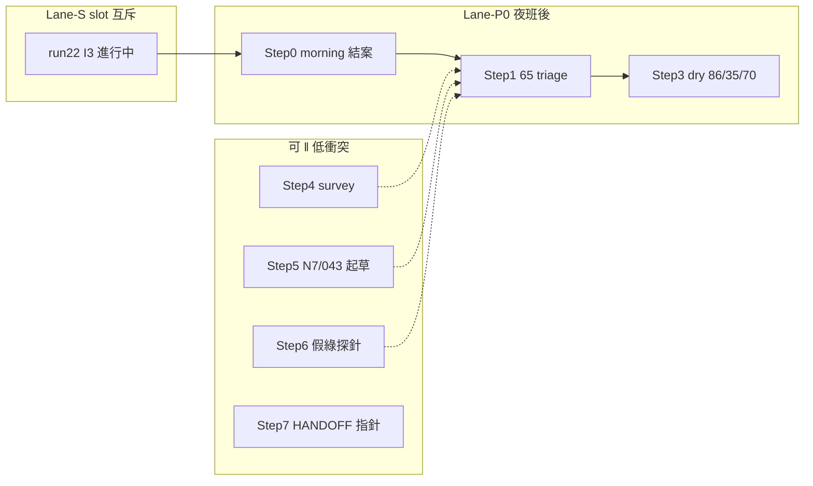

# Augur 優化——逐步執行計畫書 r2（2026-08-04 01:00+08）

## 拍板登錄（Steward · 2026-08-04 ≈01:07+08）

| 項 | 裁 |
|---|---|
| **碼** | `OPT-STEP-R2-20260804-go` ＋ `FZ-keep` ＋ `GATE-keep` ＋ `M-T5-watch` |
| **效力** | 本檔＝後續優化之 **step／runbook 執行 SSOT**（細節註冊仍讀 r2 master；理解讀 r5） |
| **Step 1** | **`wait_done`**——等 Step 0 結輪（run22／I5B 收口）後再開 65 triage；**現在不開工** Lane-R；**喚醒＝auto**（結輪 ping，非自動開 triage） |
| **Step1 喚醒** | **auto**——觀察 succeeded／morning 可寫 → ping（sentinel）；**不**自動開 65 triage、**不**代寫 morning audit |
| **硬守** | 不跑 morning（輪未結）；不搶 `heavy_slot`；不開 65 triage SQL 報告；不解凍 API；不降閘；不代簽 |
| **audit** | `audits/OPT-STEP-R2-20260804-GO.md` |

---

> **性質**：[I] **step／runbook 級操作序**——後續優化依此開工。細節註冊與車道互斥仍以 **r2 master** 為準；理解地基以 **r5** 為準。  
> **本檔不是**第三份 master：不重抄 100+ 項、不另起打架優先序。  
> **硬紀律**：FZ-keep；GATE-keep；M-T5（run 佔 slot → **不搶、不 `--allow-apply`、不手動發 TWEVO**）；honesty＝一証一批、用完作廢；AI 不代簽；本拍板波已授 **commit／push**（僅 step＋audit＋指針）。  
> **拍板碼（上游已填）**：`OPT-MASTER-R2-20260803` ＋ `FZ-keep` ＋ `GATE-keep` ＋ `M-T5-watch` ＋ `W2-65-PHASE-open`（**夜班後**）。  
> **本檔拍板碼（已填）**：`OPT-STEP-R2-20260804-go` ＋ `FZ-keep` ＋ `GATE-keep` ＋ `M-T5-watch`（≈01:07+08；audit＝`audits/OPT-STEP-R2-20260804-GO.md`）。**Step 1＝wait_done**。

| 角色 | 路徑 |
|---|---|
| 理解 SSOT | `reports/augur_deep_understanding_r5_20260803.md` |
| 執行 master | `reports/augur_optimization_master_plan_r2_20260803.md` |
| 拍板 audit | `audits/OPT-R5-R2-SSOT-APPROVED-20260803.md`（對應 git `3a87915`） |
| **本檔** | `reports/augur_optimization_step_plan_r2_20260804.md`（**已拍** `OPT-STEP-R2-20260804-go`） |
| 本檔拍板 audit | `audits/OPT-STEP-R2-20260804-GO.md` |
| 舊 step（午後） | `reports/augur_optimization_step_plan_20260803.md` → **superseded**（M-G1／舊 P0 時代；讀序改本檔） |
| 夜班現場 | `ops/RUNBOOK-20260803-night.md` · `audits/NIGHT-GUARD-CHECKLIST-20260803.md` |

---

## §1 現況時間箱（視點 2026-08-04 ≈01:00–01:04+08）**【親查】**

> #9：下列數字出自程式 stdout／DB query（時點標註）；非估、非假綠。

### 1.1 TWEVO run22／heavy_slot／I3

| 觀測 | 值 | 來源／時點 |
|---|---|---|
| crontab TWEVO | `0 23 * * 1-5` … `--run --slot-wait 10800 >> $HOME/logs/twevo.log` | `crontab -l` 01:04+08 |
| log 開輪 | `✓ 開輪 tw-20260803-r01(trigger=TWEVO-S2-go;apply_allowed=false)` | `~/logs/twevo.log`（mtime 23:00:01；stdout 緩衝中，後續步未 flush） |
| `evolution_run` | **run_id=22／`running`**；`started_at=2026-08-03 23:00:29+08`；`finished_at=NULL`；`code_sha=66b001e…`；`notes=S2 local_gates` | DB 01:04+08 |
| heavy_slot | **持有中** `owner=tw_iteration`，`pid≈254497`，`since=2026-08-03 23:00:01+08` | `python -m augur.core.heavy_slot` 01:04 |
| 活進程 | `run_evolution_iteration.py --run --slot-wait 10800`（父）→ 子程序 **`run_philosophy_evolution.py --local-gates`（I3）**，elapsed ≈2h04m，CPU ≈58% | `ps` 01:04 |
| apply | `apply_allowed=false`；觀察窗內 `evolution_apply_log` 無偷跑新增 | observe `--morning` |

**一句現況**：**run22 已於 23:00 發車、仍 `running`（卡在 I3 local-gates），I5B 已部份生效（superseded>0），整輪未結——觀察中／未結；勿搶 slot。**

### 1.2 I5B／pending／prerun（對照）

| 觀測 | 值 | 來源 |
|---|---|---|
| prerun CSV（22:5x 備） | pending_auto **17** 列，全 **run_id=21** | `audits/prerun22_pending_snapshot_20260803.csv` |
| morning 驗收（01:04） | `latest_run=22/running`；**superseded=8**；pending `{21:9, 22:9}`；gain_basis=`None`；apply 偷跑=0 | `observe_twevo_run22.py --morning` **rc=1（有紅）** |
| ① status=succeeded∧run_id=22 | ✗ | 同上 |
| ② superseded>0（I5B 首見） | ✓（8；樣例含 prerun 之 555／565…） | DB |
| ③ pending_auto 全屬 22（或 0） | ✗（仍殘 21×9） | DB |
| ④ gain≠incomparable | ✗（尚未結輪） | DB |
| ⑤ 無 APPLY 偷跑 | ✓ | observe |
| 舊 morning audit | `audits/OPT-W0-RUN22-20260803.md`＝**15:41 寫太早／已標作廢**——**不得**引為 I5B 失效 | audit 頭註 |

### 1.3 prerun／morning／I5B 狀態總判

| 項 | 狀態（01:00 視點） |
|---|---|
| prerun | **已做**（CSV 在庫） |
| run22 發車 | **已發**（23:00） |
| I5B | **機制已見效（superseded=8）**；全量世代收斂 **未完**（pending 跨 21／22） |
| morning／結輪 audit | **未結**——觀察中；俟 `status=succeeded` 再 `--morning --write-audit` |
| M-T5 | **仍生效**（slot 被 `tw_iteration` 佔） |

### 1.4 覆蓋 KPI（DB 復通 live）

`reconcile_channel_columns.py --survey`（01:04+08）：

| KPI | live | 對照 r5／r2／U1 |
|---|---|---|
| `mapping_status=mapped` | **13／98** | 與 cut card／r2 一致 |
| `source_column` 已填 | **3／98** | 同上 |
| 機械唯一可決 | **9／98（9.2%）** | 與 r5 抽樣口徑一致 |
| 草案殘／無概念 | （本命令未拆「草案 vs 無概念」） | r5／r2 錨：**草案 20／無概念 65**（U1 後；時點 08-03 夜） |

---

## §2 逐步執行序（編號；step／runbook）

> 每步欄位：**做什麼／腳本或檔／驗收／依賴／Steward 閘／預估**。  
> 新表／新腳本之 schema＋python 規畫：**引用 r2 §2／舊 master 對應項，不重複整章**（見 §6）。

### Step 0｜夜班收口（morning／I5B 若未做）——**進行中／不可假綠**

| | |
|---|---|
| **做什麼** | 守 M-T5 至 run22 終態；複跑 morning 五驗收；寫最終觀察 audit（覆寫／新檔皆可，但須標時點）；對照 prerun CSV 解釋 superseded／殘 pending |
| **腳本／檔** | `venv/bin/python scripts/observe_twevo_run22.py --morning`（結輪後加 `--write-audit`）；log=`~/logs/twevo.log`；對照 `audits/prerun22_pending_snapshot_20260803.csv`；產出建議 `audits/OPT-W0-RUN22-FINAL-20260804.md`（檔名可依腳本預設） |
| **驗收** | ① `evolution_run` run_id=22 且 **succeeded**（或誠實記錄 failed／timeout）；② superseded≥1（I5B）；③ pending_auto 全屬 22 或 0，否則說明殘因；④ gain 欄可讀且≠ silently wrong；⑤ 無 `--allow-apply`／apply_log 偷跑；**全程零搶 slot** |
| **依賴** | cron 夜輪自然結束（或 slot-wait 到期後之自然結果）；**禁止**手動 kill／重發／`--allow-apply` |
| **Steward 閘** | 無（觀察）；若終態異常／與 MT3 證據相反→**停並呈案** |
| **預估** | 觀察＝持續至終態（I3 已跑 >2h；歷史單輪可跨數小時）；結輪寫 audit ≈5–15 分 |
| **01:00 可否開工** | **收口本體＝否（輪未結）**；**監看＝是（唯讀）** |

**runbook（結輪後一次做完）**

```bash
cd /home/hugo/project/augur && set -a && . ./.env && set +a
# 1) 確認進程／slot（勿 acquire）
ps -ef | rg 'run_evolution_iteration|run_philosophy_evolution' | rg -v rg
venv/bin/python -m augur.core.heavy_slot
# 2) morning＋寫 audit
venv/bin/python scripts/observe_twevo_run22.py --morning --write-audit
# 3) 有紅 → 停手回報；全綠 → 勾 Step 0 done，開 Step 1
```

---

### Step 1｜**65 triage 唯讀**（已拍＝夜班後第一執行刀）——P0-A

| | |
|---|---|
| **做什麼** | 對 **65 無概念通道**做唯讀分流：每通道 → `{已被草案／mapped 消費, B0/infra 緩登, 需新概念卡, out_of_scope 候補}`；產出可重跑報告；**零 INSERT `world_concept`** |
| **腳本／檔** | 報告：`reports/augur_w2_65_triage_YYYYMMDD.md`；上游：`augur_w2_undefined_concept_unblock_plan_*.md`／`wm_channel_registration_draft_*.md`／解阻 1-C；可選新腳本 `scripts/survey_unmapped_concept_gaps.py`（**尚不存在**——若新寫必 #29 矩陣＋`--selftest`）；或暫以 ad-hoc 唯讀 SQL＋既有 `--survey` 輔助 |
| **驗收** | 65 通道分類覆蓋率→**100%（分類，非登錄）**；報告含可重跑 SQL／指令；DB **無**未授權寫入；不改 heavy_slot |
| **依賴** | DB 通；**建議** Step 0 結輪（M-T5 退場）後再開正式報告窗；上游裁 `W2-65-PHASE-open` 已成立 |
| **Steward 閘** | 報告窗＝**已開（夜班後）**；**寫庫／概念 INSERT＝仍須另裁**； honesty 下批須**新證**（U1 已作廢） |
| **預估** | 4–8h（含 SQL／分流表／對草案殘撞車）；新腳本另＋2–4h |
| **可否立刻開工（01:07 裁）** | **否＝`wait_done`**——等 Step 0 結輪後再開；**現在不開工** Lane-R（Steward 選 §8-(a)） |

---

### Step 2｜P0-OBS 最終封帳（可與 Step 1 文件尾併，但驗收獨立）

| | |
|---|---|
| **做什麼** | 將 Step 0 的 morning 結果＋異常敘事固化為 OPT 觀測結案；對齊 r2 P0-OBS |
| **腳本／檔** | 同上 observe audit；可附 `report_applygo_readiness.py` 唯讀摘 |
| **驗收** | audit 存在且時點 ≥ run22 `finished_at`；五項有明確綠／紅說明 |
| **依賴** | Step 0 終態 |
| **Steward 閘** | 否 |
| **預估** | 30–60 分 |

---

### Step 3｜草案殘「乾淨三條」86／35／70 dry propose（P0-B）

| | |
|---|---|
| **做什麼** | 比照 U1 三份 dry SQL propose，為 binding **86／35／70** 各產一份**不 COMMIT** 報告 |
| **腳本／檔** | 模板＝`reports/augur_w2_u1_binding{31,62,93}_dry_sql_propose_20260803.md`；新檔建議 `reports/augur_w2_draft{86,35,70}_dry_sql_propose_YYYYMMDD.md` |
| **驗收** | 三份就位；文內明示不 COMMIT／不代簽；形制沿用 U1 已裁 (a)／W2-1(a) **假設**並標「執行須親簽」 |
| **依賴** | Step 1 分流不與三條打架（或明示無撞車）；DB 唯讀 OK |
| **Steward 閘** | **圈選＋親簽句**才寫庫；未簽＝停在 dry |
| **預估** | 半天–1 日（三份） |
| **‖** | 與 Step 1 後段可交錯；勿與 heavy 重活同衝 |

---

### Step 4｜覆蓋複核 `--survey`（P0-C）

| | |
|---|---|
| **做什麼** | 複跑 survey；對照 live **13／3** 與任何新批差分 |
| **腳本／檔** | `venv/bin/python scripts/reconcile_channel_columns.py --survey` |
| **驗收** | stdout 入報告／audit；差分可解釋 |
| **依賴** | DB；任何寫庫批之後必跑 |
| **Steward 閘** | 否 |
| **預估** | 5 分 |
| **‖** | 隨時可；**可先做**（本視點已跑過基線） |

---

### Step 5｜本週人裁窗——N7＋043（P1-N7／P1-043）**【本週裁】**

| | |
|---|---|
| **做什麼** | (a) **N7**：vendor 四尺→一權威尺——一頁呈裁 decision；(b) **043／M-P16**：簽核欄或明示「圈選即裁決」收束敘事 |
| **腳本／檔** | 呈案：`reports/augur_n7_vendor_ruler_decision_YYYYMMDD.md`（新）；043＝`constitution/` 裁決檔簽核欄（**原文改動須 Steward**）；AL clarifying 若需 |
| **驗收** | N7 有裁示**字面**；043 簽核或等價收束登錄；**AI 不代勾** |
| **依賴** | 無碼依賴；與 P0 文件可并行起草 |
| **Steward 閘** | **必裁（本週時窗已定於 OPT-R5-R2）**；內容仍待勾 |
| **預估** | 起草各 1–3h；裁示＝人日曆 |

---

### Step 6｜品質閘殘——假綠探針（P1-G：M-G11–16 等）

| | |
|---|---|
| **做什麼** | 殘假綠探針：優先可先做 **M-G11／G12／G14**；探針＋#35 先驗紅；G13／G15／G16 探針可做、升嚴／旁路存廢**需裁** |
| **腳本／檔** | 見舊 master `augur_optimization_master_plan_20260803.md` 對應步（路徑／驗收句）；新探針須入 `ops/` 或既有 probe 登錄 |
| **驗收** | 「壞了會紅」可復現；先驗紅留痕（commit 訊息或 `audits/`） |
| **依賴** | 避開 slot 重活；不改判準升嚴未裁項 |
| **Steward 閘** | G16 `ENABLE ALWAYS`、G15 旁路存廢、G13 機器轉移——需裁才落地行為 |
| **預估** | 每支 0.5–2h |
| **‖** | 與 Step 1／5 起草 **可 ‖**（Lane-G） |

---

### Step 7｜carry 自舊 master／r2（插空執行；不搶 P0）

| 優先（插空） | 項 | 註 |
|---|---|---|
| 高 | **M-T6**＝本檔 Step 0/2 | 進行中 |
| 高 | **HANDOFF／讀序指針→r5／r2／本檔**（P1-DOC） | 機械、可先做 |
| 中 | **M-K\*／M-G14–15** 知識誠實消費側 | 與 G 閘交錯 |
| 中 | sim 首格／settle／M-M\* | **人工節奏**；不排夜窗搶 slot |
| 低 | M-N5 等過期族 | **需 N7 定尺後** |
| 低 | P2 欄位級／權威採認 | **人簽驅動**；經 triage 批次 |
| drop | 再催 M-G1／I5B 施作授權 | **closed**（r2 §1.1／1.3） |
| Pn | FinMind／FRED 放量／Dividend rebuild | **FZ 前禁** |

細節 ID／schema：**只引** r2 §1.2 carry 表＋舊 master 步號——避免雙寫漂移。

---

### Step 8｜P2 概念批量（經 triage 後；非本週默認首刀）

| | |
|---|---|
| **做什麼** | 依 Step 1 分流結果圈選 → dry → **新 honesty 證** → 親簽執行包 → INSERT `world_concept`／version；`source_column` 依 W2-1(a) |
| **驗收** | 每批 audit；mapped 遞增；K1 分母不含強求 98；七欄可解析項集非空者另帳 |
| **Steward 閘** | **每批圈選＋新証** |
| **預估** | 批次制；不預先灌 65 |

---

## §3 可先做／可同步矩陣（parallel lanes）

> 規則：**重活同時間 ≤1**（Ollama／PG／CPU）；**永不**與 `heavy_slot` 持有者搶；FZ 通道零觸碰。



| Lane | 內容 | ‖ 條件 | 互斥 |
|---|---|---|---|
| **Lane-S** | TWEVO／I3／任何 evolve／sim 大批／panel 全量 | 獨佔 heavy_slot | 彼此 |
| **Lane-R** | 唯讀 SQL／survey／observe／寫 reports | 可與 Lane-S **並存**（讀） | 禁止寫庫；**正式 Step 1 報告窗預設等 S0**（除非 Steward 放行） |
| **Lane-D** | N7／043／HANDOFF 文件起草 | 全 ‖ | 人裁不可假多人同時勾 |
| **Lane-G** | 假綠探針／#35 先驗紅（不重訓） | ‖ Lane-R／D | 勿與 I3 搶同機滿載（可降優先） |
| **Lane-W** | 親簽寫庫／honesty 執行包 | 獨佔寫窗 | 無新証不得進 |
| **Lane-FZ** | sync／Dividend／寬窗 | **禁** | — |

**此刻（01:00）建議**

| 立刻可 | 等 S0 | 禁 |
|---|---|---|
| 監看 run22（唯讀）；寫／改本 step plan；N7／043 **起草**；HANDOFF 指針草稿；假綠探針（輕量） | Step 1 正式 triage 報告；P0-B dry；結輪 audit | 搶 slot、`--allow-apply`、手動 TWEVO、FZ sync、假 concept INSERT、未發証 COMMIT |

---

## §4 禁做清單

1. **假概念**：為讓 survey／KPI 變綠而 INSERT 空殼 `world_concept`；用 vendor 表名充 Identity。  
2. **FZ sync／放量**：FinMind／FRED 補洞、寬窗 probe、Dividend rebuild（白名單日頻除外且非本優化弧）。  
3. **未發 honesty 就 COMMIT／寫庫**：U1 通行證**已消費完**；下批須新證。  
4. **M-T5 違規**：搶 `heavy_slot`、改 evolution driver、`--allow-apply`、手動發 TWEVO。  
5. **AI 代簽**：`decided_by`／043 簽核欄／圈選勾選。  
6. **假關**：10-14 日曆假閉合；關 freshness 哨兵假綠；UK 紅改豁免關燈。  
7. **另起打架 master**：與 r5／r2 衝突之新「總排序」。  
8. **把「可預測」讀成「可解凍」**。

---

## §5 本週日曆建議（含 N7／043）

> 語意週：**2026-08-04（一）– 08-10（日）**；可依 Steward 日程微調，**N7／043＝本週必現裁窗**。

| 日 | 建議焦點 |
|---|---|
| **08-04 凌晨–上午** | Step 0 監看→結輪 audit；**本檔已拍**（01:07）；**Step 1＝wait_done**（結輪後再開，不搶 Lane-R） |
| **08-04 午後–08-05** | Step 1 triage 報告完稿；Step 4 survey 入報告；開始 Step 3 dry 草稿 |
| **08-05–08-06** | Step 3 三份 dry 完成；Lane-G 至少 1 支「會紅」探針；**N7 一頁呈案**交付 Steward |
| **08-06–08-07** | **N7 裁**；**043 簽／收束**；依裁示排 M-N5／M-W3 前置 |
| **08-07–08-08** | P0 驗收總表勾選（r2 §3）；若有新 honesty → 僅圈選批可進 Lane-W |
| **08-09–08-10** | 緩衝／sim 人工節奏（不佔週夜 TWEVO）；HANDOFF 讀序定稿；週報勿宣可交易 |

夜窗（23:00 週間）：**繼續純自動 TWEVO**；日間優化不插 `--allow-apply`。

---

## §6 計畫完整性——schema＋python（引用、不複貼）

| 步 | 讀哪些表／資料 | 寫／新物件 | Python／腳本規畫 |
|---|---|---|---|
| 0／2 | `evolution_run`；`promotion_queue`；`evolution_apply_log`；`evolution_deferred_work`；prerun CSV | **僅** audit md（`--write-audit`） | 既有 `scripts/observe_twevo_run22.py` |
| 1 | 通道註冊／草案表（見 W2 解阻與 `wm_channel_registration_draft_*`）；`reconcile` survey 輸出 | **報告 md**；可選新腳本（**無新表**） | 可選 `scripts/survey_unmapped_concept_gaps.py`（#29＋`--selftest`；r2 P0-A） |
| 3 | 同 U1 dry 讀集 | **三份 propose md**；零 COMMIT | 人工／模板複製 U1 dry；執行包另案 |
| 4 | catalog∪實體欄 | 無 | `scripts/reconcile_channel_columns.py --survey` |
| 5 | 治權尺文件／043 檔 | 呈案 md；簽核＝Steward | 無強制新腳本 |
| 6 | 各探針標的 | 測試／探針檔 | 舊 master M-G11–16 路徑 |
| 8 | `world_concept`／`world_concept_version` 等（r2 §2 P2） | INSERT **僅**親簽批 | dry→執行包；對帳仍 `--survey` |

**本波不新增 DDL 表**（與 r2 P0 一致）。若 Step 1 選寫新腳本＝唯一預期新碼；其餘為報告／探針。

完整 KPI／階段綠燈定義：**見 r2 §3–§4**（本檔不重抄以免漂移）。

---

## §7 與舊 step plan 的效力交接

| 舊主張（20260803 午後） | 本檔 |
|---|---|
| 最佳下一步＝**M-G1** | **closed**；改 **65 triage（P0-A）** |
| 今晚催 run22 前清積壓 | run22 **已發／進行中**；改觀察＋I5B 驗收 |
| 操作 SSOT＝舊 step＋舊 master | **操作序＝本檔**；**註冊表＝r2**；理解＝**r5** |
| 拍板碼 `OPT-STEP-20260803-go` | **退場**；改已填 `OPT-STEP-R2-20260804-go`（`audits/OPT-STEP-R2-20260804-GO.md`） |

---

## §8 AskQuestion（呈 Steward）——**已裁（≈01:07+08）**

1. **是否拍板本 step plan 為後續優化之「逐步執行 SSOT」？**  
   → **是**：`OPT-STEP-R2-20260804-go` ＋ `FZ-keep` ＋ `GATE-keep` ＋ `M-T5-watch`（audit＝`audits/OPT-STEP-R2-20260804-GO.md`）
2. **是否立刻開 Step 1（65 triage 唯讀）？**  
   - **(a) 等 Step 0 結輪（推薦預設）**——符合「夜班後首刀」字面與 M-T5 退場。  
   - **(b) 現在就開 Lane-R**——允許與 I3 並行產 triage 報告（仍禁寫庫／禁搶 slot）。  
   → **採 (a)**：Step 1＝**`wait_done`**；**現在不開工** Lane-R；不跑 morning、不搶 slot、不開 65 triage SQL 報告。

---

## §9 回報摘要（給當輪對話）

| 項 | 答 |
|---|---|
| **產出路徑** | `reports/augur_optimization_step_plan_r2_20260804.md` |
| **Step 0 可否立刻開工** | **監看＝可；收口結案＝否**（run22=`running`） |
| **Step 1 可否立刻開工** | **否（已裁 wait_done）**——結輪後再開；不採 §8-(b) |
| **run22 一句** | **23:00 已發、`running`／I3 local-gates 中；superseded=8；pending 跨 21/22；未結** |

---

*意圖寫入＝本檔拍板＋audit＋舊 step superseded 互指。零概念登錄；git 另授（本波已授 commit／push）。*
