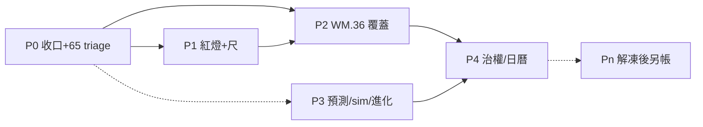

# Augur 專案深化理解摘要 × 優化計畫書（2026-08-04）

> **性質**：[I] 理解摘要＋優化計畫（CLAUDE.md #16／#20）。**不創設治權判準**；不改 [N]；不解凍 FinMind／FRED；不代簽。  
> **觸發**：Steward 委託「深化理解後產出詳細理解摘要＋專案優化計畫書，作為後續優化基礎」。  
> **寫入時點**：2026-08-04 ≈09:28+08（本機 `PC002-S1800`／WSL）。  
> **HEAD**：`0287a25`（`git log -1`）。  
> **self-reported（CLAUDE #32a）**：判讀為 AI 自陳；可機械覆核者附指令或路徑。  
> **與既有優化 SSOT 關係**：本檔＝**決策導覽＋整合地基**。執行細節仍以已拍板之  
> `reports/augur_deep_understanding_r5_20260803.md`（理解）＋  
> `reports/augur_optimization_master_plan_r2_20260803.md`（master）＋  
> `reports/augur_optimization_step_plan_r2_20260804.md`（step／runbook）為準；衝突時以 Steward 明示碼為準。  
> **本輪 API**：全程零 FinMind／FRED 外部呼叫（凍結遵守）。

---

## 1. 執行摘要（≤1 頁）

Augur 是「先立法、再長智慧」的雙半系統：半-1 以庫內 raw→features→相對強弱／方向機率預測，成功定義＝**經濟價值**（非裸 IC）；半-2 以 know-how／知識終態餵本地顧問；橫切為五軸自進化（PME／TWEVO／RAWEVO／LAIEVO／sim）＋審議／人門。治權脊椎 L0–L7 已齊（MC **v1.6**）；領域靈魂／原則／大憲章／CLAUDE 現行版見 §3.1。

**2026-08-04 晨間關鍵增量（親查）**

| 錨 | 值 | 意義 |
|---|---|---|
| `evolution_run` 22 | **succeeded**（`finished_at=2026-08-04 08:19:55+08`） | 夜班結輪；I5B 世代 supersede 已見效 |
| morning 五驗 | ①②③⑤綠／**④紅**（`gain_basis=None`） | Step0 收口未完——**勿繞閘**寫假綠 morning audit |
| Step1 ready | sentinel `audits/RUN22-READY-FOR-STEP1-20260804.md` | 喚醒＝auto；**≠**自動開 65 triage |
| Registry | mapped **13／98**；`source_column` **3／98** | 母体槓桿仍是 65 無概念＋20 草案 |
| prodset | active **3** | ≠可交易／≠確立級 |
| `direction_gate.evaluated_pass` | **0** | 確立級紅線仍在 |
| PriceAdj max | **2026-08-03** | 庫內 as-of 可預測；≠解凍授權 |
| API 凍結 | **仍凍**（`INV2-THAW-STILL-REQUIRED`） | 優化不得以解凍為前提 |

**優化主軸（本計畫）**：在 FZ-keep／GATE-keep／NHC-keep 下——(P0) 收口 run22／開 65 唯讀 triage；(P1) 紅燈會亮＋N7／043 尺；(P2) WM.36 概念覆蓋（禁假概念）；(P3) 預測／sim／進化證據鏈；(P4) 治權自洽與 API 另帳（解凍後）。優先對齊靈魂「經濟價值」與三敵人零容忍——**優化不得鬆動 #1／#8／#15**。

**給 Steward 的一句**：下一步不是「全面重構」，而是選甲／乙／丙（§9）開一條可驗收刀——預設最槓桿＝**65 triage 唯讀**（已排程、待你放行開工）。

---

## 2. 專案定位與成功定義

### 2.1 靈魂定位（領域 [N]／doctrine；路徑引用）

| 來源 | 定錨 |
|---|---|
| `docs/系統核心思想_v1.10.0.md` | 任務＝橫斷面**相對強弱**＋預言機軸絕對方向機率／期望報酬（契約產物）；**經濟價值 ≠ 準確率**；**系統建議，人決策**；哲學＝假說／素養、非真兆；禁自動下單、禁自改治權判準 |
| `docs/原則精華_v1.12.0.md` | 三基石：**#1 source-pure**／**#8 anti-leakage**／**#15 誠實回報**；**#14 經濟價值判定**；普遍晉升路徑五節點（候選→預凍證據→人門→晉升或判死→回流） |
| `docs/系統架構大憲章_v1.54.0.md` | 管線／升版／計畫先行（第六部）／知識准入等領域憲法（引用前 `ls docs/`） |

### 2.2 元憲章義務（constitution-mcp 精確原文摘要；[N]）

| 條款 | 義務要旨 | 對優化之約束 |
|---|---|---|
| **P4.W1** | 不接受無 Source／不可重現／無 Evidence 之推論 | 禁止以幻像數字填 KPI |
| **P4.E1** | Knowledge 五元組（Source／Timestamp／Identity／Evidence／Confidence） | 優化產物須可溯源 |
| **P4.E7** | NoLaundering：衍生信任≤最弱上游；AI synthetic 標記不消失；高風險須獨立證據或人確認 | 本地 LLM／本計畫判讀＝[I]，不得洗白為 [N] |
| **F5** | 禁無法回答「為什麼？」之 prediction／recommendation／decision | 優化項須可答 why |
| **P5.W2** | 授權鏈根＝人類；人得否決／暫停／中止 | Sole Steward；無「公示才生效」新要件 |
| **§8.1** | Steward 專屬解釋／違憲審查／修憲；Agent 不得參與修憲與解釋 | 本檔僅草擬呈案 |
| **WM.36**（L1 SPEC） | World Concept Registry 七欄；消費須以世界概念為鍵；unmapped 合法過渡；補正期後禁直綁字面 | P0–P2 主槓桿合法依據 |

### 2.3 成功定義（優化視角）

| 層級 | 成功長什麼樣 | 不是什麼 |
|---|---|---|
| **靈魂** | 可交易／經濟終關撐住的相對強弱＋誠實方向機 | 高 IC、多特徵、顧問 cite 率 |
| **確立級** | `direction_gate` **evaluated_pass**（live 門檻以凍結物件為準） | 有 arena 列／有 prodset |
| **Registry** | 七欄可解析項遞增；無概念通道有分流（映／緩／out） | 強求 98 全 mapped |
| **進化** | 候選→閘→人門→晉升／判死；無偷 APPLY | pending 堆積當成長 |
| **工具品質** | 綠燈量的是宣稱之物（CLAUDE #35） | pre-commit 安靜略過 |

---

## 3. 現況全貌

### 3.1 治權地圖（2026-08-04 親查）

| 層 | 現行 | 查法 |
|---|---|---|
| L0 Meta | **v1.6** | constitution-mcp `layer_status` |
| L1–L7 | WM v1.0／ONT v1.0／ID v1.0／KS **v1.1**／Cognitive v1.0／Agent **v1.2**／Infra v1.0 | 同上 |
| 靈魂 | `docs/系統核心思想_v1.10.0.md` | `ls docs/` |
| 原則 | `docs/原則精華_v1.12.0.md` | 同上 |
| 領域大憲章 | **v1.54.0**（並存史料 `v1.47.0`） | 同上 |
| CLAUDE | **v1.35**（含 #35 回歸鎖三規則） | `head -3 CLAUDE.md` |
| 入口 | `constitution/GOVERNANCE-MAP.md` | [I] 地圖 |

### 3.2 目錄骨架（能力域）

```
src/augur/
  ingestion/ catalog/ audit/     ← 資料地基（取數仍凍；庫內可讀）
  features/ universe/ models/    ← 預測特徵／宇宙／模型
  evaluation/ arena/ execution/  ← 評價／擂台／執行
  philosophy/ evolution/         ← PME／自進化
  knowledge/ advisor/            ← 知識終態／顧問
  deliberation/ identity/ core/  ← 審議／身分／DB·heavy_slot
scripts/                         ← CLI 動詞片語（#29 矩陣；本機 496 支受檢／缺漏 0）
constitution/ specs/ docs/       ← 治權權威
audits/ reports/                 ← 拍板留痕／計畫
tools/ ops/                      ← MCP／hooks／機器／runbook
```

### 3.3 管線心智模型

```
[FZ] FinMind/FRED ──凍──► 不進熱路徑
庫內 raw → features → universe → train/predict (as-of) → evaluation
                └─► arena / direction_* → direction_gate（確立級）

knowledge/philosophy → sentences/embed → pgvector|Qdrant → advisor:8399
        ✗ 不加權預測 runtime；cite ≠ G-PROM

PME/TWEVO: map → local-gates(八閘含 G-SIGN) → pending_auto → 人裁 APPLY → prodset
sim / RAWEVO / LAIEVO：正交帳本；heavy_slot 互斥
```

**預測 ⊥ API**（[I] rule）：庫內 as-of 即可訓練／推估；凍結只凍取數。見 `.cursor/rules/predict-vs-market-api.mdc`、`audits/PREDICT-ORTHOGONAL-API-RULING-20260724.md`。

### 3.4 運行態（本機親查 ≈09:28+08）

| 項 | 值 | 來源 |
|---|---|---|
| 五＋Qdrant 埠 | 8090/8500/8600/11434/6333＝**200**；8399 `/`＝**404**（正常） | `curl` |
| crontab 活躍列 | **15** | `crontab -l \| grep -c '^[0-9*]'` |
| TWEVO cron | `0 23 * * 1-5` … `run_evolution_iteration.py --run` | crontab |
| heavy_slot | **無持有**（殘帳示警列僅歷史） | `python -m augur.core.heavy_slot` |
| public 表 | **339** | `pg_tables` |
| prodset active | **3**：`cycle_position_252d`／`inst_cumflow_position_120d`／`lending_fee_rate_mean_30d` | DB |
| direction_gate | approved=11／fail=12／superseded=6／**pass=0** | DB |
| arena 列 | **17,296** | DB |
| PriceAdj max | **2026-08-03** | `"TaiwanStockPriceAdj"` |
| sim 候選 | **1** | `sim_evolution_candidate` |
| pending_auto | **19**（全 run 22） | `promotion_queue` |
| superseded（queue） | **17** | 同上 |
| kill switches | global/tw/raw/lai/sim 皆 **clear** | DB |
| validation_evidence | green=14／red=9／unverified=2 | DB |
| deferred 未清 | **0** | DB |
| Registry survey | mapped **13／98**；sc **3／98**；機械唯一 9.2% | `reconcile_channel_columns.py --survey` |
| cmd matrix | 受檢 **496**／缺漏 **0** | `check_cmd_matrix.py` |
| 假斷言基線 | **22** 行（存量凍結） | `ops/false_assertion_baseline.txt` |
| memory 索引 | 1340 檔／18290 chunk／FTS yes；**1 來源過時**（`serve_probability_ui.py`） | `memory_status` |

### 3.5 既有優化治理鏈（勿另起打架 SSOT）

| 角色 | 路徑 | 拍板 |
|---|---|---|
| 理解 SSOT | `reports/augur_deep_understanding_r5_20260803.md` | `OPT-MASTER-R2-20260803` |
| 執行 master | `reports/augur_optimization_master_plan_r2_20260803.md` | 同上＋`W2-65-PHASE-open`（夜班後） |
| step／runbook | `reports/augur_optimization_step_plan_r2_20260804.md` | `OPT-STEP-R2-20260804-go`；Step1=`wait_done`→ready |
| sim 旁軌 | `audits/OPT-SIM-EVO-20260804-GO.md` 等 | 觀測＋selftest 已開；apply 另裁 |
| 本檔 | **決策導覽** | 待 §9 選項 |

---

## 4. 深化理解：關鍵不變式與邊界

| 不變式 | 是什麼 | 優化禁踩 |
|---|---|---|
| **#1 source-pure** | 庫內列須曾是真來源落地 | 禁 placeholder／假 concept／手補資料 |
| **#8 anti-leakage** | as-of／切分不洩漏未來 | 禁「為方便」用未來欄 |
| **#15 真兆** | 數字出自 stdout／DB／API；無能可宣告 | 本檔凡未查＝「未實證」 |
| **predict ≠ API** | 預測熱路徑庫內 as-of | 禁把解凍當預測優化前提 |
| **soul ≠ raw** | 升格的是概念／關係，非整庫 raw | 禁灌 raw 進靈魂文書 |
| **FZ-keep** | FinMind／FRED 停（arena 日頻白名單除外） | 禁放量／Dividend rebuild／寬窗 probe |
| **GATE-keep** | 不降晉升／確立門檻 | 禁以優化名義挪門柱 |
| **HUMAN 門** | APPLY／approve／概念親簽／解凍 | AI 不代簽 |
| **#35 回歸鎖** | 純函式真輸入／下游絆線／禁字面斷言；先驗紅 | 禁加假綠燈 |
| **INV1／INV2** | LAND-MECH 已釘≠解凍；仍須明示解凍句 | 禁倒果為因 |

**真問題 vs 假問題（精選）**

| 真問題 | 假問題（勿優） |
|---|---|
| 65 通道無概念可映 → WM.36／10-14 槓桿空轉 | 「先解凍才能優化預測」 |
| morning ④ `gain_basis=None` → 結輪誠實紅 | 繞過 ④ 寫 succeeded 假收口 |
| `evaluated_pass=0` → 無確立級 | 把 prodset=3／arena 列當可交易 |
| 假綠族殘／vendor 多尺 | 再催已 closed 的 M-G1／I5B 施作 |
| G-CAT／G-DIV／G-ATTEST 另帳 | 假稱洞已補或 LAND-MECH＝產品完備 |

---

## 5. 缺口／技術債／優化機會矩陣

評分：[I]；影響／急迫／風險各 1–5（高＝先做或先裁）。**不產新幻像 KPI**。

| ID | 項目 | 影響 | 急迫 | 風險 | 波次 | 備註 |
|---|---|---|---|---|---|---|
| **O-P0a** | run22 morning 收口（④ gain_basis） | 4 | 5 | 2 | P0 | rc=1；勿繞閘 |
| **O-P0b** | 65 triage 唯讀分流 | 5 | 5 | 1 | P0 | 已排程；零 INSERT |
| **O-P0c** | 草案 86／35／70 dry propose | 3 | 4 | 2 | P0 | 須新 honesty 證 |
| **O-P1a** | N7 vendor 尺合一 | 4 | 4 | 2 | P1 | Steward 必裁 |
| **O-P1b** | RULING-043 簽核收束 | 3 | 4 | 2 | P1 | 本週裁 |
| **O-P1c** | 假綠探針殘（M-G11–16） | 4 | 3 | 2 | P1 | #35 先驗紅 |
| **O-P2** | WM.36 七欄／sc 填批次 | 5 | 3 | 3 | P2 | 人簽驅動 |
| **O-P3a** | sim runner→settle→eval 首格 | 4 | 3 | 3 | P3 | 人工節奏；不搶夜窗 |
| **O-P3b** | 符號尺 `--record`×active3 | 3 | 3 | 1 | P3 | 可 ‖ |
| **O-P3c** | dgate／cluster 文案 vs live | 5 | 2 | 4 | P3 | Steward 裁；治權觸線 |
| **O-P4a** | 10-14／WM.35–36 日曆 | 5 | 3 | 3 | P4 | 禁假關 |
| **O-P4b** | 備份異地／dump SSOT | 4 | 2 | 2 | P4 | 人工前置 |
| **O-Pn** | G-CAT／G-DIV／G-ATTEST | 4 | 1 | 5 | Pn | **仍 API 門** |
| **O-obs** | memory 索引增量 | 1 | 2 | 1 | anytime | `project_memory_mcp index` |

---

## 6. 優化路線圖（分階段、可拍板單元）



| 階段 | 時間盒（示意） | 拍板單元 | 完成定義 |
|---|---|---|---|
| **P0** | 1–3 日 | `OPT-P0-TRIAGE-go`（或沿用 step Step1 開工句） | morning 誠實收口或書面接受 ④；65 triage 報告可重跑；零未授權寫入 |
| **P1** | ≈1 週 | `OPT-P1-go`＋N7／043 裁 | 一權威尺；043 敘事收束；≥1 新探針壞了會紅 |
| **P2** | 2–4 週 | 每批 `W2-BATCH-k-go`＋親簽 | 七欄完成項↑或書面豁免；sc 填可追溯＞3 |
| **P3** | 與 P2 交錯 | `OPT-SIM-CELL-go`／sign 等 | sim／sign 數字出自 DB／stdout |
| **P4** | 持續 | 逐項 | 10-14 進度誠實；異地裁示有紀錄 |
| **Pn** | 解凍句後 | `解凍 FinMind／FRED`＋逐項 | 另帳項另開；≠本檔預設路徑 |

---

## 7. 各階段詳細計畫

### 7.0 (a) Schema 聲明＋(b) 程式規畫總則

**本計畫預設不產新業務表。** 消費既有：

| 域 | 讀 | 寫（僅授權後） |
|---|---|---|
| 進化 | `evolution_run`／`promotion_queue`／`evolution_production_feature_set`／`evolution_kill_switch`／`evolution_deferred_work`／`evolution_apply_log` | queue 狀態轉換（引擎／人裁）；禁手補 |
| Registry | channel／concept／binding 相關（以 W2 腳本為準） | 親簽批次 INSERT／UPDATE |
| 預測 | `feature_values`／arena／`direction_gate`／PriceAdj | 訓練產物依既有 writer；禁 hand-patch |
| sim | `sim_evolution_candidate`／run_link／realized／eval（既有 DDL） | 人工 `--apply` 格 |
| 知識 | knowledge_*／KH4 等 | 旗標有界 backfill（另裁） |

若某子項需新表：必須另開 #20 計畫附 DDL，**不得**在本檔默示建表。

### 7.1 P0 — 結輪收口＋概念儀器

#### P0-A｜morning／I5B 收口

| | |
|---|---|
| **目標** | 誠實關閉 Step0；決定 ④ 處置 |
| **Why** | 假收口＝自我欺騙（#15）；混讀會污染後續 triage 時序 |
| **範圍** | 唯讀 observe；可選 `--write-audit`（僅五驗可結或 Steward 明示接受 ④） |
| **不做** | 殺輪重跑扮綠；改 ledger 手補 gain；搶 slot |
| **依賴** | run22 已 succeeded（✅） |
| **程式** | `scripts/observe_twevo_run22.py --morning`［`--write-audit`］；證據對照 `audits/prerun22_pending_snapshot_20260803.csv` |
| **驗收** | audit 存在且標明 ④ 綠或「Steward 接受 incomparable／None」；pending 世代敘事與 DB 一致 |
| **風險** | ④ 根因未明時強寫 audit＝假綠 |

#### P0-B｜65 triage（母体槓桿）

| | |
|---|---|
| **目標** | 每無概念通道→{已被消費／B0-infra 緩登／需新概念卡／out_of_scope} |
| **Why** | 欄位對帳在「沒東西可對」上零邊際；對齊 WM.36／10-14 |
| **範圍** | **唯讀**報告＋可重跑 SQL；**零** `world_concept` INSERT |
| **不做** | 造 65 假概念；FZ 補抓；與重寫 evolution driver 同檔互撞 |
| **依賴** | `W2-65-PHASE-open`（已拍）；Step1 ready（✅ sentinel）；heavy_slot 空（✅） |
| **程式** | 產出 `reports/augur_w2_65_triage_YYYYMMDD.md`；可選 `scripts/survey_unmapped_concept_gaps.py`（若新寫：#29 矩陣＋`--selftest`＋#35 先驗紅） |
| **驗收** | 65 分類覆蓋率＝100%（**分類**非登錄）；報告含重跑指令；DB 無本波未授權寫入 |
| **風險** | 把「分類完」誤讀成「WM.36 完成」 |

#### P0-C｜草案三條 dry（可選第二刀）

| | |
|---|---|
| **目標** | 86／35／70 dry SQL／propose 三份，不 COMMIT |
| **程式** | 比照 `reports/augur_w2_u1_binding*_dry_sql_propose_*` 形制 |
| **驗收** | 三報告＋明示「須新 honesty 證＋親簽才寫庫」 |
| **依賴** | U1 窗已消費完——**須新證** |

### 7.2 P1 — 紅燈會亮＋尺

| 子項 | 目標 | 程式／產物 | 驗收 | Steward |
|---|---|---|---|---|
| **P1-N7** | vendor 四尺→一權威尺 | 一頁 decision report | 裁示字面入 audit | **必裁** |
| **P1-043** | RULING-043 簽核或「圈選即裁決」 | AL／簽核欄 | 敘事收束 | **必裁** |
| **P1-G** | 假綠殘探針 | `check_false_assertions`／新探針 | 壞了會紅；先驗紅留痕 | 部分 |
| **P1-K** | 知識消費正名 | advisor／KH 閘敘事 | 與權重敘事一致 | 旁路存廢或裁 |
| **P1-DOC** | HANDOFF 指針→r5／r2／本檔 | HANDOFF 最小段 | 讀序不打架 | 否 |

### 7.3 P2 — WM.36 欄位級與權威

| 步 | schema | 程式 | 驗收 |
|---|---|---|---|
| 概念批（經 triage） | `world_concept`＋version | dry→親簽執行包 | 每批 audit；mapped↑；分母不強求 98 |
| `source_column` | 通道欄 | reconcile／propose | sc 填↑；非法空白不灌 |
| 權威採認 | binding／`decided_by` | Annex F 備料 | ≥1 七欄可解析**或**書面豁免清單 |
| 直綁清冊 | — | `check_vendor_binding`（既有／延伸） | 與 N7 尺一致 |

### 7.4 P3 — 預測／sim／進化品質（不阻 Registry）

| 子項 | 範圍 | 不做 | 入口 |
|---|---|---|---|
| sim 首格 | runner→link→settle→eval；候選已 1 列 | cron 自動 apply；搶 TWEVO 夜窗 | `run_sim_calibration_cell.py` 等（selftest 已綠於 `OPT-SIM-EVO-P0-OBS`） |
| 符號尺 | active 三顆 `--record` | 假設舊 mean_20d 現役 | `verify_sign_consistency.py` |
| 庫內 predict | as-of train／dry-run；`--skip-sync` | live FinMind 硬前提 | `train_*`／`predict_*`／arena 管線 |
| dgate | 呈案 cluster／own_stack 錯配 | AI 擅改治權「≥60」文案 | 另開治權案 |

### 7.5 P4 — 治權自洽與長期債

- 10-14 checklist 進度（`reports/augur_1014_review_evidence_prep_20260801.md`）——**禁假關**
- CS／合規漂移、worktree S4、AL 分家——低吞吐文件／探針
- dump＋異地：SSOT 見 HANDOFF §3；本機 `~/db_dumps/` 曾清空——**下次備份須更新住所**
- LAIEVO：尺 robot 過強→能力宣稱至多 `none`（HANDOFF 檔頭）；S-4 凍結集另裁

### 7.6 Pn — FZ 閘後（明示解凍句之前不做）

| 另帳（INV1 §2） | 含義 |
|---|---|
| G-CAT-1 | 全量／表級 `build_catalog` → API 門 |
| G-DIV-1 | Dividend resume → API 門 |
| G-ATTEST | 當日 attestation audit／heal → API 門 |
| evaluated_pass=0 | ≠確立級；不因優化假關 |
| R6／HAR 等 | 非解凍前提 |

**白名單仍有效（非解凍）**：arena 管線內 `daily_maintenance` 日頻＋`sync_macro.py --no-catalog`（見 freeze rule）。

---

## 8. 護欄與禁止事項

| 禁 | 說明 |
|---|---|
| 解凍 FinMind／FRED | 缺明示句；LAND-MECH ≠ 解凍 |
| 降閘／挪門柱 | GATE-keep |
| AI 代簽 `decided_by`／approve／APPLY | P5／#32 |
| hand-patch 已 committed 資料 | 原則 #12／CLAUDE #12 |
| 造假 world_concept／填滿 sc 扮完成 | #1／WM.36 |
| 預測熱路徑打 live API | predict-vs-market-api |
| 把本 [I] 貼進憲章 | 入憲另開案 |
| 設「須公示才生效」 | Sole Steward；GOV-4 已閉 |
| 繞 morning ④ 假收口 | #15／#35 |
| 夜窗搶 heavy_slot／`--allow-apply` | M-T5 精神（結輪後改日班紀律） |

---

## 9. 建議下一步（Steward 拍板選項）

### 甲｜開 P0 主刀（建議預設）

```text
OPT-P0-20260804-go + TRIAGE-65-go + FZ-keep + GATE-keep + NHC-keep
```

- 先（或並行文件）：處置 morning ④（接受 incomparable 並 `--write-audit`，或另句查 gain_basis）  
- 隨即：產出 65 triage **唯讀**報告  
- **不含**概念 INSERT／dry COMMIT／解凍  

### 乙｜P0＋sim 日班儀器（雙軌）

```text
甲之碼 + OPT-SIM-CELL-observe-go
```

- 在 heavy_slot 空裡做 sim **觀測／selftest／文件**；**首格 `--apply` 另句**  
- 適合要「進化證據鏈可見」但不想碰 Registry 寫入時  

### 丙｜只凍結本導覽、暫緩開工

```text
OPT-FOUNDATION-20260804-ack + FZ-keep + GATE-keep
```

- 採納本檔為決策導覽；執行仍停在 step ready  
- 適合你要先裁 N7／043／④ 再動刀時  

**不建議**：以「解凍 API」或「降 dgate／假關 10-14」當下一刀。

---

## 10. 附錄

### 10.1 證據索引

| 主題 | 路徑 |
|---|---|
| 本檔 | `reports/augur_project_optimization_plan_20260804.md` |
| 理解 r5 | `reports/augur_deep_understanding_r5_20260803.md` |
| master r2 | `reports/augur_optimization_master_plan_r2_20260803.md` |
| step r2 | `reports/augur_optimization_step_plan_r2_20260804.md` |
| SSOT 拍板 | `audits/OPT-R5-R2-SSOT-APPROVED-20260803.md` |
| step 拍板 | `audits/OPT-STEP-R2-20260804-GO.md` |
| run22 ready | `audits/RUN22-READY-FOR-STEP1-20260804.md` |
| INV1 另帳 | `audits/ROADMAP-INV1-FULL-LANDING-DEFINITION-20260724.md` |
| 預測正交 | `audits/PREDICT-ORTHOGONAL-API-RULING-20260724.md` |
| 凍結 rule | `.cursor/rules/finmind-fred-api-freeze.mdc` |
| 建構 how | `reports/augur_construction_understanding_20260713.md` |
| 五軸 SSOT | `reports/augur_self_evolution_master_plan_v2_20260726.md` |
| 10-14 備料 | `reports/augur_1014_review_evidence_prep_20260801.md` |
| WM.36 原文 | constitution-mcp `get_spec_clause WM.36` |
| 接續 | `HANDOFF.md` |

### 10.2 本輪實證指令（可重跑）

```bash
cd /home/hugo/project/augur && set -a && . ./.env && set +a
git log -1 --oneline
for p in 8090 8500 8399 8600 11434 6333; do
  curl -s -o /dev/null -w "$p:%{http_code}\n" --max-time 3 http://127.0.0.1:$p/
done
crontab -l | grep -c '^[0-9*]'
venv/bin/python -m augur.core.heavy_slot
venv/bin/python scripts/observe_twevo_run22.py --morning
venv/bin/python scripts/reconcile_channel_columns.py --survey | head -20
venv/bin/python scripts/check_cmd_matrix.py
# DB 錨（範例）
venv/bin/python - <<'PY'
import os, psycopg2
c=psycopg2.connect(dbname=os.environ["DB_NAME"], user=os.environ["DB_USER"],
  password=os.environ["DB_PASSWORD"], host=os.environ.get("DB_HOST","127.0.0.1"),
  port=os.environ.get("DB_PORT","5432"))
cur=c.cursor()
cur.execute("SELECT count(*) FROM direction_gate WHERE status='evaluated_pass'"); print("pass", cur.fetchone()[0])
cur.execute("SELECT feature FROM evolution_production_feature_set WHERE set_status='active'")
print("active", cur.fetchall())
cur.execute('SELECT max("date") FROM "TaiwanStockPriceAdj"'); print("priceadj", cur.fetchone()[0])
PY
```

### 10.3 未實證／刻意省略清單

| 項 | 狀態 |
|---|---|
| local_research／local_map_reduce／local_summarize | 本輪 **timeout／connection closed** → **未採其結論作權威**；改關鍵路徑直讀＋DB／stdout |
| `gain_basis=None` 根因（哪張 ledger／哪步未寫） | **未深挖**；建議 P0-A 專查 |
| 65 通道逐條現況表 | **未重跑 triage SQL**（待甲案開工） |
| live `min_clusters` 逐門複核 | 引用既有 HANDOFF／r5（曾報 250 vs 文案 ≥60）；**本輪未逐門重查** |
| DESKTOP-8MQPFS8 並行庫狀態 | 本機範圍外；跨機 drift 標未實證 |
| 顧問答題品質／KH8 母體鑑別力 live 複測 | 省略；見 r5 |
| 經濟終關最新數值 | 未跑 `run_economic_eval`；標未實證 |
| memory 增量 index | 建議執行但本輪未跑（只報告過時 1 檔） |

### 10.4 本輪工具使用誠實帳

| 工具 | 結果 |
|---|---|
| constitution-mcp `layer_status`／`get_clause`／`get_spec_clause`／`search_clauses` | 成功 |
| project-memory `memory_status`／`recall` | 成功（索引略舊） |
| local-llm research／map_reduce／summarize | **失敗／逾時** |
| 直讀 HANDOFF／r5／r2／step／INV1 | 成功 |
| DB／curl／crontab／survey／observe | 成功（venv） |
| FinMind／FRED | **未觸碰** |

---

## 修訂

| 版 | 日 | 說明 |
|---|---|---|
| 20260804 | 2026-08-04 | 初版：理解摘要＋優化計畫地基；對齊 r5／r2／step；親查 run22 succeeded 與 Registry／埠／DB 錨 |
