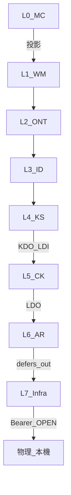

# L0–L7 交互 ultracode 呈核報告（全棧接縫對抗）

**日期**: 2026-07-23  
**觸發**: Steward「做 L0 到 L7 交互 ultracode」  
**計畫**: [`reports/augur_l0_l7_interaction_ultracode_plan_20260723.md`](../reports/augur_l0_l7_interaction_ultracode_plan_20260723.md)  
**方法 SSOT**: [`LAYER-SEALING-SCHEDULE.md`](../LAYER-SEALING-SCHEDULE.md) 第三階段；先例＝概念層 3a（RULING-2026-022）  
**性質**: 只讀對抗；**不改 [N]**；major 存活 → 另案呈 Steward 開 RULING  
**lint 基線**（本輪只讀、未改規格）: `constitution_lint report` → **PASS 7／error 0／warning 0**；`wm44_uncited_L1`–`L7` 皆 **0**  
**git**: HEAD `9a3ac19`（工作區另有未提交變更時 report 標 dirty——以當次 stdout 為準）

---

## 0. 範圍與結論（一句）

全棧交互主審 **L0 投影／L4↔L5／L5↔L6／L6↔L7／L7→物理**＋橫貫 X1–X4；**存活 2 項 cross-layer major**（皆簿記／編號地圖族，非幽靈義務空殼）、**4 項 medium**、物理縫 **誠實缺位確認**；3a 四 major 回歸 **仍立**。lint 綠 ≠ 交互合憲。

| 區塊 | 結果 |
|---|---|
| 3a L1–4 回歸（RULING-2026-022 M1–M4） | ✅ 抽查仍立（P5.W4→WM.28＋L6.15；D 表／D19 處置正確） |
| 3b L5–7 交互 | ✅ 已執行（本報告） |
| L0 投影抽樣 | ✅ 無 §0.6(b) 概念層以執行構件作定義之命中；P5.W4 落 L6.15 |
| L7→物理 | ⚠ 本機 `operability_probe` **1/7 就緒**；與 L7 OPEN-00…05 自陳一致（非謊稱可運作） |

---

## 1. 接縫矩陣（攻擊面）

| 接縫 | 方法 | 摘要 |
|---|---|---|
| L0→各層 | 抽樣 P5.W1–W5／P4.E2／§0.6(b)；親讀落點 | P5.W4 於 L6.15 真承載；概念層無 PostgreSQL/Qdrant/Ollama 作 [N] 定義 |
| L4→L5 | KS Annex DO ↔ L5 LDI／FM；KDI.18／D22 | **KDO.1/3/4/6 有 L5 承接**；**KDI.18↔FM 三向破**（major） |
| L5→L6 | L5 LDO.2/6 ↔ L6 LDI.1–2；風險／門檻／否決 | 正文 L6.10–L6.18／L6.15 非幽靈；LDO.3 之 L6 面向簿記弱（medium） |
| L6→L7 | L6 LDO.1–6 ↔ L7 LDI.33–38；OPEN | 六列皆有 LDI＋正文落點代號；數值／載體多 OPEN |
| L7→物理 | `ops/phase2/operability_probe.py` | ollama/qdrant/PG/GPU **ABSENT**；與 OPEN 一致 |

---

## 2. 橫貫維度

| 碼 | 維度 | 結果 |
|---|---|---|
| **X1** | §0.6(b) 概念層不得引執行層構件作定義 | 抽樣無命中。WM.38 `hooks` 標 L6 為**目標**（DEFER 體例），非以 L6 構件定義 WM 概念 → 不構成違規 |
| **X2** | DEFER 雙向可解析（FM ↔ Annex DI/DO ↔ CS.3） | **破口見 M-IX-1、F-IX-3**；L5↔L6 主鏈 LDO.2/6  intact |
| **X3** | 幽靈落點（TR「承接」vs 親讀正文） | L5.10／L6.11(D22 治理)／L6.15／L7.20–L7.45 抽樣**有義務句**；非 2026-07-18 之 L5.2 幽靈型 |
| **X4** | WM.44／覆蓋清單誠實界限 | L1–L6 覆蓋清單含「誠實界限」句；**L7 覆蓋清單缺該句**（medium）。lint `wm44_uncited_*=0`＝骨架字面，**≠** 語意完備／≠ 決策四完成 |

---

## 3. Findings（嚴重度 ↓）

### 存活 major（雙反駁後仍立）

#### M-IX-1｜KS `KDI.18`（WM §D22）與 front-matter `defers-in` 三向斷裂

- **接縫**: L4（內）／L1→L4 DEFER 簿記；連動 L4→L5／L4→L6 之 D22 切片敘事  
- **缺陷**: Annex DI 有 **KDI.18**（來源 `AUGUR-WM v1.0 §D22`）、正文 KS.80 增補款／KS.81(f) 真承接、CS.3(a) 亦列 `§D22`→KDI.18，但 Annex CS front-matter **`defers-in` 無 `WM.D22`**（僅 D7–D12/D18/D21/D26/D27）。違 **KDI.0**「本表每列與 Annex CS front-matter `defers-in` 欄雙向可解析」。  
- **證據**:
  - `specs/KNOWLEDGE-SYSTEM-SPECIFICATION.md` Annex DI：**KDI.18**｜來源 `§D22`
  - 同檔 front-matter（約 L985–986）: `defers-in: [WM.D7, … WM.D27, …]`——**無 D22**
  - 同檔 CS.3(a): `§D22`→KS.80／KS.81(f)（KDI.18）——與 FM 不一致  
- **雙反駁**:
  1. *「正文已承接，僅簿記」* → 出局失敗：KDI.0 之可判定判準即三向可解析；3a／RULING-2026-020 同族以 FM 缺列為 major。  
  2. *「D22 目標含 L4–L6，L6 FM 已列即可」* → 出局失敗：WM D0 要求**每一目標 Layer** 之 defers-in 含對應列；L4 為目標之一且已立 KDI.18，不得因 L6 有列而豁免 L4 FM。  
- **建議 remedy**（須 Steward／RULING；本輪不改）: KS front-matter `defers-in` 增 `WM.D22`；必要時同步 TOC／CS 索引句；屬 minor 簿記、不動義務句。  
- **狀態**: **存活 major**

#### M-IX-2｜L5.10 已准入 [N]，但編號地圖仍稱「L5.10–L5.89 保留空號」

- **接縫**: L4→L5（KDO.6→LDI.5→**L5.10**）；文件治理 ↔ 交互可發現性  
- **缺陷**: Steward 2026-07-19 准入 **L5.10**（as-of 推理消費／anti-leakage）為真 [N]，LDI.5／TR／CS.3 皆指此落點；惟 §0 編號穩定性、§0.1、文末總計仍寫「**L5.1–L5.9** 核心；**L5.10–L5.89** 為十位制**保留區塊**」，文末甚至只計「L5.1–L5.9＋L5.90–L5.92」。讀者／機器若依編號地圖會把 KDO.6 落點判為「保留未啟用」——**交互層假地圖**（與 2019 幽靈落點不同：義務句在場，地圖說它不在）。  
- **證據**:
  - `COGNITIVE-KERNEL-SPECIFICATION.md` L163–168：`**L5.10（as-of 推理消費…）[N…]`** 含 vintage／gate 可判定判準  
  - 同檔 L47、L68、L538：仍稱 L5.10–L5.89 保留／文末省略 L5.10  
- **雙反駁**:
  1. *「保留號啟用合法，僅 TOC 未改＝editorial」* → 部分成立但不足以出局：編號穩定性段與文末總計為 [N] 治理敘事；與已發布 L5.10 直接矛盾，屬交互可發現性 major（非純 typo）。  
  2. *「LDI.5 已指 L5.10，不會誤判」* → 出局失敗：LDI 與 TOC 衝突時，單層 G5／外人盤點依 TOC 會漏；正是交互檢查要抓的「單層綠、整合地圖錯」。  
- **建議 remedy**: 編號穩定性／§0.1／文末改為「L5.1–L5.10 已啟用；L5.11–L5.89 保留」；對齊【地位】RULING-2026-023。  
- **狀態**: **存活 major**

---

### Medium（雙反駁後降級或原級）

#### F-IX-3｜L6 front-matter 已列 `WM.D13/15/22/24/28`，Annex LDI 無對應列

- **接縫**: L1→L6／X2  
- **事實**: FM（RULING-2026-020）與 CS.3(a) 散文列 D13→L6.19 等；正文增補款存在；但 Annex LDI **僅**顯式含 D16（LDI.2–4）與 D17（LDI.7）。  
- **反駁成立**: LDI.0 文義為「**本表每列** ↔ FM／CS.3」單向約束，**未**要求 FM 每一碼必有 LDI 列；WM D0 只釘 defers-in。CS.3(a)「三向對表」宣稱偏強，但義務空殼不成立。  
- **嚴重度**: **medium**（簿記不對稱；建議補 LDI 列或改 CS.3 措辭）  
- **曾候選 major → 出局**

#### F-IX-4｜L5 `LDO.3` 目標「L6／L7」，L6 無 Explanation 呈現承接

- **接縫**: L5→L6  
- **事實**: L5 LDO.3＝Explanation 排版／UI → L6／L7；L7 LDI.30 承接「L7 面向」；L6 僅有 Gate／監督 UI（自有 LDO.3），TR 對 L5.6 標「不觸及＋理由：解釋內容屬 L5」。  
- **反駁**: L7 已承接呈現面；L6 共標可解讀為「得落 L6 或 L7」。非幽靈。  
- **嚴重度**: **medium**（目標欄多寫 L6；建議 L5 LDO.3 目標改「L7（L6 僅監督介面另列）」或 L6 明文不觸及 Explanation UI）

#### F-IX-5｜L7 `MC [N] 條款覆蓋清單` 缺「誠實界限」句

- **維度**: X4  
- **事實**: L1–L6 清單末有「誠實界限：…字面具名；語意承接仍以 Annex TR 為權威…」；L7 同型清單（約 L1071）**無**該句。  
- **嚴重度**: **medium**（與 P3 清單體例不一致；易被誤讀為決策四完成）

#### F-IX-6｜L5 `LDO.4` 目標「L5／L7」（同層再 DEFER）

- **接縫**: L5 內／L5→L7  
- **事實**: LDI.4 已落 L5.9，又「轉 LDO.4」且目標含 L5——同層循環氣味；L7 LDI.31 承接 L7 面向尚可。  
- **嚴重度**: **medium／minor**（建議目標改純 L7）

---

### Observation（物理／回歸）

| ID | 內容 |
|---|---|
| **O-IX-1** | 本機 `python ops/phase2/operability_probe.py`：**1/7 就緒**（僅 augur 應用碼）；ollama:11434、qdrant:6333、PG 5432/55432、GPU **ABSENT**。對照 L7 **OPEN-L7-00…05**（角色載體／Selection Registry 未登錄 → fail-closed／RT-4）——**規格誠實、實機缺位**，非「可運作」假兆。 |
| **O-IX-2** | 3a／RULING-2026-022：**M1** WM.28 已 hooks §P5.W4；**M2–M4** KS/ID Annex D 對 WM 權威表＋D19 承接／CS.2 揭露——抽查仍立。 |
| **O-IX-3** | L5↔L6 主鏈：L5 LDO.2→L6 LDI.2→L6.10–12；L5 LDO.6→L6 LDI.1→L6.1/5/7/19——親讀非幽靈。L6↔L7：L6 LDO.1–6→L7 LDI.33–38 代號鏈完整。 |
| **O-IX-4** | L5【地位】仍 **provisional**（§8.2 延後）；交互檢查**不**等同撤回 provisional 或完成實質違憲審查。 |

---

## 4. 雙反駁總表

| 候選 | 反駁 1 | 反駁 2 | 結果 |
|---|---|---|---|
| KS D22／KDI.18 vs FM | 正文已有→不足 | L6 有 FM→不足 | **major 存活** |
| L5.10 vs 保留地圖 | 僅 editorial→不足 | LDI 已指→不足 | **major 存活** |
| L6 FM vs LDI 缺列 | LDI.0 單向→成立 | D0 只要 FM→成立 | **降 medium** |
| L5 LDO.3 L6 空 | L7 已接→成立 | 目標「或」→成立 | **降 medium** |

---

## 5. 完整性批評（什麼還沒被檢查）

1. **未**重跑 3a 全量 41 findings——僅 M1–M4 與 P5.W4／D19 抽查。  
2. **未**對 L1–4 每一 [N] 做執行層構件名窮盡掃描（X1 為抽樣＋關鍵詞）。  
3. **未**對 L7 每一 OPEN 做部署期限／owner 程序稽核（僅確認與 probe 一致）。  
4. **未**跑 PORTABILITY.md 移機實測、advisor／審議引擎端到端（DB ABSENT）。  
5. **未**開新 RULING／改 [N]——依計畫呈核。  
6. L5 D22「計算面不另立新條、受 L5.10／L5.3 約束」之**語意充分性**未做獨立推論證明（僅確認非空殼幽靈）。  

---

## 6. 誠實界限

- 本報告＝**交互接縫**對抗，**不是**單層 ULTRACODE-SCHEDULE 6–8 維窮盡、**不是** §8.2 實質合憲人類審查完成宣告。  
- lint PASS／`wm44_uncited_*=0`／覆蓋清單具名＝**形式／骨架**信號；語意承接以親讀正文＋本 findings 為準。  
- 物理「1/7」為**當機當次** probe stdout；他機／他日須重跑。  
- 存活 major **不得**由執行層自行 patch [N]；須 Steward RULING。

---

## 7. 建議後續（決策層）

1. Steward 開 **交互 RULING**（建議編號候選 RULING-2026-027）：處置 **M-IX-1**（KS FM＋D22）、**M-IX-2**（L5.10 編號地圖）。
   **✅ 已施作（2026-07-23，RULING-2026-027／AL-2026-030）**：M-IX-1＝KS Annex CS front-matter `defers-in` 補列 `WM.D22`；M-IX-2＝L5 編號穩定性（§0.3、文末總計）改「L5.10 已啟用；L5.11–L5.89 保留」。lint 施作前後 PASS 7／error 0／warning 0 不變；未動任一 [N] 義務句本文；4 medium（F-IX-3…6）未處置。
2. 同案或另案 minor：F-IX-3…6。  
3. 更新 [`LAYER-SEALING-SCHEDULE.md`](../LAYER-SEALING-SCHEDULE.md) §3b 狀態＝本報告（執行完成；major 待 RULING）。  
4. 物理／OPEN：部署節奏屬運維，不在本次憲章交互範圍強制。

---

## 8. 產物索引

| 產物 | 路徑 |
|---|---|
| 計畫 | `reports/augur_l0_l7_interaction_ultracode_plan_20260723.md` |
| 本呈核 | `audits/L0-L7-INTERACTION-ULTRACODE-2026-07-23.md` |
| 排程 | `LAYER-SEALING-SCHEDULE.md` §3b |
| 先例 | `constitution/RULING-2026-022-CONCEPT-TIER-CROSS-LAYER.md` |
