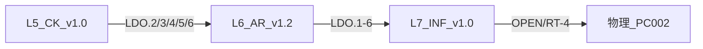

# L5–L7 執行層交互 ultracode 呈核報告（Phase 3b 專項覆核）

**日期**: 2026-07-23  
**觸發**: Phase 3b 後續清單——全棧交互（`audits/L0-L7-INTERACTION-ULTRACODE-2026-07-23.md`）已於同日執行且 M-IX-1／M-IX-2 經 RULING-2026-027 閉合；本輪為 **L5–L7 接縫／執行層專項覆核**（疊加 L5–L7 單層 ultracode 035／036／037 定案後狀態），**非**重跑全棧空轉。  
**方法 SSOT**: [`LAYER-SEALING-SCHEDULE.md`](../LAYER-SEALING-SCHEDULE.md) 第三階段 3b；先例＝[`audits/L0-L7-INTERACTION-ULTRACODE-2026-07-23.md`](L0-L7-INTERACTION-ULTRACODE-2026-07-23.md)  
**性質**: 只讀對抗；**不改 [N]**；本輪零新 major  
**lint 基線**（親跑）: `python3 -m tools.constitution_lint report` → **PASS 7／error 0／warning 0**；`wm44_uncited_L1`–`L7` 皆 **0**  
**git**: HEAD `bd48f3f`（本輪產出提交前）

---

## 0. 範圍與結論（一句）

**L5→L6→L7 主鏈（LDO／LDI／風險分級／F6 執法）非幽靈**；027 兩 major **仍閉**；3b 四 medium（F-IX-3…6）**仍存活、無新 major**；020 M2 產物 trigger **誠實 deferred**；025／029 **日曆義務僅留痕、本輪不假裝完成**；L7.21(f) 測試 **6/6 PASS**（PG 5432）。

| 區塊 | 結果 |
|---|---|
| 3b major 回歸（M-IX-1／M-IX-2） | ✅ 027 修補仍有效（KS `WM.D22` FM；L5.10 編號地圖） |
| L5→L6 主鏈 | ✅ LDO.2／6→LDI.1–2→L6.10–12／L6.1／5／7／19／21 親讀非幽靈 |
| L6→L7 主鏈 | ✅ LDO.1–6→LDI.33–38→L7.40–45 代號鏈完整 |
| 3b medium 殘留（F-IX-3…6） | ⚠ **4 項仍立**（簿記／體例，非義務空殼） |
| 020 M2 trigger | ⚠ **誠實 deferred**（L6.21↔L7 未虛假承接；037 F-L7-8） |
| 025 residual (iii)(iv)(vi) | 📅 **分階段①**→復審 **2026-10-14**（本輪不結清） |
| 029 附條件 | ✅ PRV／ASF **035 程序性閉合**；F-IX-4／6 **仍另案**；復審 **2026-10-14** |
| L7→物理 | ℹ probe **4/7**（ollama／qdrant／PG5432／augur 碼）；OPEN 仍部分 ABSENT |
| L7.21(f) 實跑 | ✅ `pytest tests/test_l7_knowledge_not_null.py` → **6 passed** |

---

## 1. 與全棧 3b 之分工

| 項目 | 全棧 3b（2026-07-23 早段） | 本專項（3b 覆核） |
|---|---|---|
| 範圍 | L0 投影＋L4↔L5＋L5↔L6＋L6↔L7＋L7→物理＋X1–X4 | **僅 L5–L7 執行層接縫**＋027 閉環驗證＋035–037 後狀態 |
| major | 2（已 027 閉） | **0 新 major** |
| 單層 ultracode | 尚未定案 | **已疊加 035／036／037**——F-L7-2 測試已落地 |
| 日曆義務 | 未詳列 025／029 | **025／029 現況表（§4）** |

---

## 2. 接縫矩陣（L5–L7）



| 接縫 | 方法 | 摘要 |
|---|---|---|
| **L5→L6** | LDO.2／6 ↔ LDI.1–2；L6.10–18／L6.21 親讀 | 風險分級／Gate／F6 **有義務句**；LDO.3 目標欄仍寫 L6／L7（F-IX-4） |
| **L6→L7** | L6 LDO.1–6 ↔ L7 LDI.33–38 | 六列 LDI＋正文 L7.40–45 **對齊**；020 M2 **未**下放 trigger |
| **L5→L7** | LDO.3／4／5 ↔ LDI.30–32 | Explanation→L7.43；量測→L7.26；as-of→L7.20（LDO.5） |
| **L7→物理** | `operability_probe.py` | **4/7** 就緒；GPU／55432 ABSENT；OPEN-L7-00…05 與 probe **一致** |

---

## 3. Findings

### 3.1 已閉 major 回歸（027，本輪確認仍有效）

| ID | 原缺陷 | 027 處置 | 本輪驗證 |
|---|---|---|---|
| **M-IX-1** | KS KDI.18／§D22 缺 FM `defers-in` | 補 `WM.D22` | `KNOWLEDGE-SYSTEM-SPECIFICATION.md` FM L1000：`WM.D22` **在列** |
| **M-IX-2** | L5.10 已准入但編號地圖稱保留 | §0.3／文末改「L5.10 已啟用；L5.11–L5.89 保留」 | `COGNITIVE-KERNEL-SPECIFICATION.md` L49、L70、L547 **一致** |

### 3.2 存活 medium（3b 殘留，本輪覆核仍立）

#### F-IX-3｜L6 FM 已列 WM.D13/15/22/24/28，Annex LDI 無對應列

- **接縫**: L1→L6／X2  
- **現況**: FM L456 七碼齊；正文 L6.9(d)／L6.11／L6.19／L6.20／L6.21 真承接；Annex LDI **僅** LDI.2–4／7 顯式含 D16 子面——**無** D13／D15／D22／D24／D28 專列  
- **嚴重度**: **medium**（簿記不對稱；LDI.0 單向約束未要求 FM 每碼必有 LDI 列）  
- **036 影響**: 未處置；蓋章不動搖  

#### F-IX-4｜L5 LDO.3 目標「L6／L7」，L6 無 Explanation 呈現承接

- **接縫**: L5→L6／L5→L7  
- **現況**: L5 LDO.3 L215 目標仍 **L6／L7**；L7 LDI.30→L7.43 **已接**；L6 TR 對 L5.6 標「不觸及＋理由：解釋內容屬 L5」  
- **嚴重度**: **medium**（029 (v)／027 明示另案 minor）  
- **035 影響**: 未改 LDO.3 目標欄  

#### F-IX-5｜L7 MC 覆蓋清單缺「誠實界限」句

- **接縫**: X4／WM.44 體例  
- **現況**: L6 L514 有「**誠實界限**：…字面具名；語意承接仍以 Annex TR 為權威…」；L7 L1071 同型清單**無**該句  
- **嚴重度**: **medium**（易被誤讀為決策四完成）  
- **037 影響**: 未處置 F-IX-5  

#### F-IX-6｜L5 LDO.4 目標「L5／L7」（同層再 DEFER）

- **接縫**: L5 內／L5→L7  
- **現況**: LDI.4 落 L5.9，LDO.4 L216 目標含 **L5**；L7 LDI.31→L7.26 承接 L7 面向  
- **嚴重度**: **medium／minor**（029 另案）  

### 3.3 Cross-layer 追蹤（非新 finding）

#### F-L7-8／020 M2｜L6.21 產物表 trigger 級 DB 強制——L7 誠實未承接

- **依據**: RULING-2026-020 M2 甲案；L6 `:211`；L7 CS.4 `:1073` cross-layer 追蹤句（037）  
- **本輪判定**: **deferred 狀態誠實**——L7 不虛假宣稱已下放；L6 介面 fail-closed 義務仍為單一執法點  
- **嚴重度**: **minor 追蹤**（執行層待辦，非規格 defect）  

### 3.4 Observation

| ID | 內容 |
|---|---|
| **O-L57-1** | 物理 probe 自 3b 報告之 **1/7** 升至 **4/7**（ollama／qdrant／PG5432 就緒）——**當機當次**，非「全系統可運作」宣稱 |
| **O-L57-2** | L5 front-matter `defers-in` 已含 `WM.D12/D13/D22/D28`（029／035 後）——與 3b 前 L5 零 WM.D 碼狀態 **已改善** |
| **O-L57-3** | lint PASS 7／`wm44_uncited_*=0`＝**骨架**信號；F-IX-5 證明語意完備≠字面綠燈 |

---

## 4. 日曆義務現況表（本輪僅留痕）

### 4.1 RULING-2026-025 residual（L7 §8.2）

| 項 | 裁定 | 現況 | 期限 | 本輪 |
|---|---|---|---|---|
| **(iii)** kill-switch 單節點 | 接受 residual，分階段① | 仍單節點；L7.40(e) 在卷 | 復審 **2026-10-14** | 📅 **未達②③** |
| **(iv)** 人類雙憑證 | 分階段①→②→③ | 單 Steward 持雙憑證；L7.42(e) | 同上 | 📅 **未達②③** |
| **(vi)** 單機無熱備援 | 接受 residual，分階段① | 備份已立、無熱備 | 同上 | 📅 **未達②③** |
| **(i)(ii)(v)** | 核定照收 | 數值在 L7.41／L7.45 | — | ✅ 維持 |
| **(vii)** | §8.1 已裁（024） | — | — | ✅ 維持 |

**誠實聲明**：025 residual **不得**由本交互報告宣告結清；至 2026-10-14 方為 Steward 復審日曆義務。

### 4.2 RULING-2026-029 附條件（L5 §8.2）

| 附條件 | 內容 | 現況 | 期限 | 本輪 |
|---|---|---|---|---|
| **PRV／ASF ultracode** | L5 單層 PRV／ASF 維度複核 | **035 程序性閉合**（零 major） | 原訂 2026-10-14 前 | ✅ **已執行**（2026-07-23） |
| **F-IX-4／F-IX-6** | LDO.3／4 簿記 | **仍 open**（見 §3.2） | 另案 minor | ⚠ 未處置 |
| **L5 §8.2 複核至 2026-10-14** | 029 §二項 1 字面条 | 035 已跑 PRV／ASF；**日曆復審日仍 2026-10-14**（與 L7 併結） | **2026-10-14** | 📅 **排程留痕、不假裝結案** |

---

## 5. L7.21(f) 可執行測試（037 F-L7-2）

**命令**（repo 根、venv）:

```bash
venv/bin/python -m pytest tests/test_l7_knowledge_not_null.py -q
```

**結果**（2026-07-23，PC002，PG **5432** 可用）:

```
6 passed in 0.47s
```

**覆蓋**: Source／Identity／Evidence／instance-type 四欄 NOT NULL 引擎拒絕（parametrize 4＋正向 1＋schema 盤點 1）——對齊 `INFRASTRUCTURE-SPECIFICATION.md` L253–254 掛點。

**備註**: 系統 `python3` 無 pytest 模組；須 **venv** 或 `pip install -e .` 環境。DB 不可用時測試 **skip**（非假 pass）——本機本次 **未 skip**。

---

## 6. 雙反駁總表（本輪新候選）

| 候選 | 反駁 | 結果 |
|---|---|---|
| 「F-IX-3 應升 major（FM 缺 LDI）」 | LDI.0 單向＋正文非幽靈 | **維持 medium** |
| 「020 M2 已幽靈下放 L7」 | L6／L7 雙向誠實句在卷 | **出局（追蹤項）** |
| 「probe 4/7＝L7 可運作」 | OPEN 仍 fail-closed 部分角色 | **出局（觀察）** |

**本輪新 major：零。**

---

## 7. 蓋章影響

| 層 | 動搖程度 |
|---|---|
| **L5** v1.0 | **不動搖**——零 major；F-IX-4／6 為 minor 簿記 |
| **L6** v1.2 | **不動搖**——F-IX-3 簿記不對稱 |
| **L7** v1.0 | **不動搖**——F-IX-5 體例；025 residual 已在卷；L7.21(f) 測試 **PASS** |

---

## 8. 完整性批評（什麼還沒被檢查）

1. **未**重跑 L4↔L5 全量（全棧 3b 已覆蓋；本輪刻意收窄）。  
2. **未**對 L7 每一 OPEN 做 owner／期限程序稽核。  
3. **未**跑 advisor／審議引擎端到端（超出交互接縫範圍）。  
4. **未**實施 020 M2 trigger（屬執行層待 Steward 拍板之設計，非本輪 patch）。  
5. **未**到 2026-10-14——025／029 日曆復審**刻意留待**。

---

## 9. 誠實界限

- 本報告＝**L5–L7 執行層接縫專項覆核**，疊加 035–037 後狀態；**不是** §8.2 實質合憲完成宣告。  
- 025 (iii)(iv)(vi)／029 復審 **2026-10-14**＝**日曆義務**——本輪僅登錄現況。  
- lint PASS／probe 4/7＝**形式／當機**信號；OPEN 與 residual 仍以規格正文為準。  
- 存活 medium **不得**由執行層自行 patch [N]；須 Steward RULING 或授權 editorial。

---

## 10. 建議 Steward 拍板句

1. **接受本 Phase 3b 專項覆核**（零新 major；027 閉環有效；F-IX-3…6 四 medium 仍 open；020 M2 維持 honest deferred）。  
2. **另案 minor RULING（建議候選 038）**：一攬子處置 F-IX-3（L6 LDI 補列或 CS.3 措辭）、F-IX-4（L5 LDO.3 目標改「L7（L6 僅監督 UI）」）、F-IX-5（L7 覆蓋清單補誠實界限句）、F-IX-6（L5 LDO.4 目標改純 L7）。  
3. **020 M2**：維持 deferred；待 L7 正式設計或 Steward 另裁收窄／承接時再開案——**不**虛假下放。  
4. **日曆**：025 residual ②③ 與 029／L5 §8.2 併結復審 **排程 2026-10-14**——到期前不宣稱結清。

---

## 11. 產物索引

| 產物 | 路徑 |
|---|---|
| 全棧 3b 先例 | `audits/L0-L7-INTERACTION-ULTRACODE-2026-07-23.md` |
| 本專項呈核 | `audits/L5-L7-INTERACTION-ULTRACODE-20260723.md` |
| L5–L7 單層 ultracode | `audits/L5-CK-ULTRACODE-20260723.md`、`audits/L6-AR-ULTRACODE-20260723.md`、`audits/L7-INF-ULTRACODE-20260723.md` |
| 排程 | `LAYER-SEALING-SCHEDULE.md` §3b；`ULTRACODE-SCHEDULE.md` |
| L7.21(f) 測試 | `tests/test_l7_knowledge_not_null.py` |
| RULING-038／AL | `constitution/RULING-2026-038-L5-L7-INTERACTION-3B-DISPOSITION.md`；AL-2026-042 |

---

## 12. Steward 定案（2026-07-23）

**Steward 接受本 Phase 3b 專項覆核、同案 RULING-2026-038／AL-2026-042**——F-IX-3…6 一攬子閉合（CS.3 措辭；LDO.3→`L7（L6 僅監督 UI）`；L7 誠實界限；LDO.4→純 L7）；020 M2 **維持 honest deferred**；025／029 復審日 **仍 2026-10-14**；L5–L7 蓋章不動搖。獨立對抗核驗＝待非施作者（RULING-038 §九）。

*本報告為 [I] 審查素材；3b 呈核＋038 處置閉環（2026-07-23）。*
