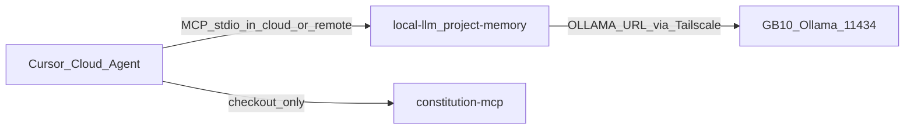

# Cloud Agent × 本地 MCP — 前置 Runbook

* **性質**：[I] 操作手冊；不創設 [N] 義務。
* **範圍**：讓 Cursor **雲端** agent 有機會打到 GB10 上的 Ollama／（可選）遠端可達的 MCP 算力。
* **不做**：Cloudflare Tunnel 實作、公網裸開 11434、宣稱「雲端實地採用已完成」（實地勾選屬你側 session）。

與本機 SSH 進 GB10 的 Cursor（MCP 跑在 GB10、`127.0.0.1:11434`）**無關**——那條路徑不需本 runbook。

---

## 〇、硬限制

| 元件 | 雲端 agent 上 | 含義 |
|---|---|---|
| Cursor 思考模型 | 仍綁定 Cursor | **換不成本地** qwen |
| `constitution-mcp` | 隨 repo checkout 可跑 | 不需 Ollama |
| `local-llm-mcp` | 需可達的 `OLLAMA_URL` | 雲端 VM 的 `127.0.0.1` ≠ GB10 → 必須通道 |
| `project-memory` | 需索引 DB（gitignore）+ embed | 雲端無 `.project_memory/index.db` → `recall`／`local_research` **fail-loud**；可雲端 `index`（增量）或本波只驗錯誤發聲 |

工具隨 repo 走、算力隨 `OLLAMA_URL` 走（見 `reports/LOCAL-LLM-MCP-OPTIMIZATION-PLAN.md` §六）。



---

## 一、通道定案：Tailscale

**採用 Tailscale**（較安全）。Cloudflare Tunnel 僅附錄，本波不實作。

### 1.1 GB10

```bash
# 安裝（官方腳本；需你核准網路／帳號）
curl -fsSL https://tailscale.com/install.sh | sh
sudo tailscale up          # 瀏覽器登入；完成後：
tailscale ip -4            # 記下來，下稱 <gb10-ts-ip>
```

Ollama **維持** `OLLAMA_HOST=127.0.0.1:11434`（user unit）。若要讓 tailnet 直連 11434，二選一：

- **建議**：在 GB10 上用 Tailscale **serve／proxy** 或僅對 tailnet IP bind（勿對公網 `0.0.0.0` 裸開）。
- 或暫時：`OLLAMA_HOST=<gb10-ts-ip>:11434` 且 Tailscale ACL 僅允許受信 tag（仍禁止公網）。

### 1.2 對端（模擬雲端／跳板）

同一 tailnet 入網後：

```bash
export OLLAMA_URL="http://<gb10-ts-ip>:11434"
bash ops/phase2/cloud_mcp_preflight.sh
```

### 1.3 Cursor Cloud／遠端 MCP env 範例

勿把密鑰寫進 git。在 Cloud secrets 或本機 MCP UI 設：

```text
OLLAMA_URL=http://<gb10-ts-ip>:11434
OLLAMA_MODEL=qwen3-coder-next
OLLAMA_NUM_CTX=32768
EMBED_MODEL=nomic-embed-text
```

`cwd` 須為雲端 checkout 的 monorepo 根（不要寫死 `/home/giga/augur` 除非 Cloud 恰在該機）。

---

## 二、project-memory 索引策略

| 策略 | 作法 |
|---|---|
| A. 雲端重建 | checkout 後 `python3 -m tools.project_memory_mcp index`（增量；需可達 embed） |
| B. 本波最小驗收 | 不建索引；確認 `recall`／`local_research` **isError 發聲**，改走讀檔／`local_summarize` |

索引 DB 不進 git；不能假設 Cloud 自動有 GB10 的 `.project_memory/`。

---

## 三、資安底線

- **禁止**公網裸露 `0.0.0.0:11434`。
- Tailscale：開 MagicDNS；ACL 僅允許需要的 device／tag 訪 Ollama。
- 日誌／證據勿貼 API key；本 repo 設定包不收密鑰。

---

## 四、驗收清單（你側勾選）

前置本機：

- [ ] `bash ops/phase2/cloud_mcp_preflight.sh`（GB10 loopback）綠
- [ ] （待）裝置入 Tailscale 後，對端 `OLLAMA_URL=http://<gb10-ts-ip>:11434` 再跑同腳本綠

Cursor Cloud／新 agent session：

- [ ] 通道：`curl $OLLAMA_URL/api/tags` 含 `qwen3-coder-next`、`nomic-embed-text`
- [ ] `local_ask` 來源標記含 **coder-next**
- [ ] 跨檔問句是否**自然**呼叫 `local_research`（對照 `.cursor/rules/local-mcp-routing.mdc`）
- [ ] 治理問句走 `constitution`，非 local-llm 濃縮生效規格
- [ ] 無索引時 `recall`／`local_research` **isError**（不靜默空答）

---

## 五、建議順序

1. GB10 loopback 預檢綠（見證據檔）
2. Tailscale 入網 → 對端預檢
3. 開 Cloud session，依 §四人工觀察工具呼叫

---

## 附錄：Cloudflare Tunnel（備選，不實作）

若不能用 Tailscale：可用 Cloudflare Tunnel 把 `localhost:11434` 暴露為需 Access 鑑權的 URL，再設 `OLLAMA_URL`。本波**不**提供腳本；資安面須 Access／Service Token，禁止匿名公網。
