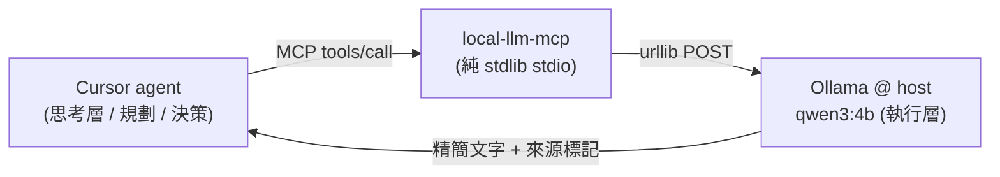

# 本地 LLM 當 Cursor 濃縮型工具 — 最佳化計畫 [I]

* **性質**：[I] 資訊性計畫（不創設義務；權威悉依憲章與各層生效規格之 [N] 條款）。實作選型須依 AUGUR-L7 L7.30（Selection Registry）登錄，並通過 §8.3 機器稽核。
* **報告日**：2026-07-21
* **提出脈絡**：使用者欲以「執行層用本地 AI（`10.10.130.46` 之 Ollama）、思考層用 Cursor 雲端 agent」的方式降低 token 使用。本計畫界定此構想**哪部分可行、哪部分不可行**，並給出可落地的最小實作。
* **與既有文件關係**：承接 [MCP-SERVER-OPTIMIZATION-REPORT.md](MCP-SERVER-OPTIMIZATION-REPORT.md)（constitution-mcp 已建置）與 [mcp_design_overview.md](mcp_design_overview.md)（augur_proxy 多通道代理設計）。本計畫是第三支 MCP 的規劃——把 `augur_proxy` 已有的本地 LLM 能力，經一層薄協定外殼暴露給 Cursor agent。

---

## 〇、一句話結論

**Cursor agent 的「思考」是 Cursor 模型、換不掉；本地 AI 能省 token 的唯一正確角色是「濃縮型工具」——把「輸入大、輸出小」的粗重子任務丟給本地 qwen3，只把短結果回給 Cursor agent。** 只在「輸出遠小於輸入」時才真的省；輸出一樣長就毫無節省。實作為一支**純 stdlib 的 stdio MCP server**，重用 `augur_proxy.local_llm`（本就只依賴 `urllib`），不污染唯讀的 `constitution-mcp`。

---

## 一、先釐清一個硬限制（避免期待落空）

| 構想 | 可行性 | 理由 |
|---|---|---|
| 讓 Cursor agent 的推理迴圈改用本地 qwen3 | ❌ 不可行 | Cursor agent（本地或雲端）的模型由 Cursor 綁定，非使用者可替換之後端 |
| 「思考層用 Cursor、執行層用本地 AI」以省 Cursor 的思考 token | ⚠️ 部分成立 | 思考本身省不掉；能省的是「被丟去本地、且結果被濃縮」的那部分 context |
| 本地 AI 當 Cursor 的**濃縮型工具** | ✅ 可行且推薦 | 大輸入在本地消化，Cursor agent 只吃小輸出 → context 下降 |

**關鍵不等式**：一次工具呼叫對 Cursor context 的淨影響 ≈ `工具結果長度`（外加約數十 token 的呼叫框架）。因此

> **省 token 的充要條件：`本地工具輸出` ≪ `該任務原本會進入 Cursor context 的輸入`。**

這與 `constitution-mcp` 的成功原理同源（實測省 97.2%）——差別只在 constitution-mcp 靠**確定性檢索**濃縮，本計畫的工具靠**本地 LLM 理解**濃縮。

---

## 二、token 帳：何時省、何時不省

| 子任務型態 | 輸入量級 | 輸出量級 | 淨效果 | 判定 |
|---|---|---|---|---|
| 摘要一批檔案／長貼文 → 幾句結論 | 大 | 小 | 大幅下降 | ✅ 適合 |
| 在長文中檢索、只回相關片段 | 大 | 小 | 下降 | ✅ 適合 |
| 抽取欄位／分類／格式化（機械性） | 中–大 | 小 | 下降 | ✅ 適合 |
| 需要頂尖推理的規劃／設計決策 | 小 | 中 | 品質風險 > token 收益 | ❌ 留給 Cursor |
| 輸出與輸入一樣長（翻譯、逐行改寫） | 大 | 大 | 幾乎不省，且多一趟往返 | ❌ 不划算 |

**結論**：本地工具只接「大進小出」且「機械性/邊界清楚」的活。這同時規避了小模型能力不足的品質風險。

---

## 三、能力與環境約束（2026-07-21 實測 `/proc`）

> **重要更正**：`infrastructure/ENVIRONMENT-SPEC.md`（載體 WSL2 / GTX 1650 4GB / 15 GiB）**已過時，非本機**。本節以本機 `aitopatom-b96e` 實測為準，該環境檔待另案更新。

實測（`/proc/cpuinfo`、`/proc/meminfo`、`/proc/driver/nvidia/version`）：

* **平台**：NVIDIA **GB10 Grace-Blackwell**（DGX Spark 級），kernel `6.17.0-1026-nvidia`。
* **CPU**：ARM **aarch64**，20 核（10× Cortex-X925 `0xd85` ＋ 10× Cortex-A725 `0xd87`；含 SVE2/bf16/i8mm）。
* **記憶體**：**~121 GiB 統一記憶體**（Grace-Blackwell unified；CPU/GPU 共用）＋ 16 GiB swap。
* **GPU**：NVIDIA 開源核心模組 `580.159.03`（aarch64），Blackwell；共用上述統一記憶體。
* **推論本質**：**記憶體大、頻寬中等**（LPDDR5X 統一記憶體，約數百 GB/s 級）。故 token/s 隨模型變大而降，但**巨大記憶體可載入 30B–120B 級模型**——與舊 4GB VRAM 之「只能跑 4B」完全不同。
* **對本工具的意涵**：濃縮型任務**輸出短**，生成成本低；可負擔**明顯更大、更高品質的模型**。深度推理與最終判斷仍回 Cursor，但本地模型品質天花板已大幅提高（見 §七模型選型）。
* `augur_proxy.local_llm` 之呼叫路徑**只依賴 `urllib`（純 stdlib）** —— 本 MCP 沿用同一 `OLLAMA_URL`/`OLLAMA_MODEL` 慣例，無新依賴。

---

## 四、設計：第三支 MCP —— `local-llm-mcp`

### 4.1 為何另開一支，而非塞進現有元件

| 選項 | 評估 | 結論 |
|---|---|---|
| 塞進 `constitution-mcp` | 該 server 有「唯讀、純 stdlib、**不呼叫外部/LLM**」之治理紀律（selftest 突變鎖）。加 LLM 工具即破戒 | ❌ 不可 |
| 直接暴露 `augur_proxy` 的 HTTP `/invoke` 給 Cursor | Cursor 不原生呼叫任意 HTTP prompt 路由器；且 FastAPI 需 `uvicorn`/`fastapi` 外部依賴 | ❌ 非 MCP、且增依賴 |
| **新 stdio MCP server（純 stdlib，重用 `local_llm`）** | 與 `constitution-mcp` 同體例；`local_llm` 已純 stdlib，零新依賴；stdio 即 line-delimited JSON-RPC 2.0 | ✅ **採用** |

### 4.2 工具集（皆為「大進小出」濃縮器）

| 工具 | 輸入 → 輸出 | 濃縮點 |
|---|---|---|
| `local_summarize` | `{text 或 repo 內相對路徑, max_sentences}` → N 句摘要 | 大文 → 幾句 |
| `local_extract` | `{text/path, instruction}` → 依指示抽取之精簡結果（清單/欄位） | 大文 → 結構化小輸出 |
| `local_ask` | `{prompt, max_words}` → 受長度上限約束的本地小模型回答 | 一般本地問答，強制短輸出 |

三支都對 Ollama 送一趟、回精簡文字。**不提供任何寫入工具**（沿用 constitution-mcp 之唯讀紀律；本 server 的「副作用」僅為對 Ollama 的唯讀推論呼叫）。

### 4.3 治理護欄（承接既有教訓，硬編入輸出）

1. **來源標記強制**：每筆回傳前置 `(local model: qwen3:4b @ <host>)` 標記，且附一行警告：**「本輸出為本地小模型生成，屬 [I] 輔助，不得原文貼入任何 [N] 治理文書」**。呼應 [MCP-SERVER-OPTIMIZATION-REPORT.md](MCP-SERVER-OPTIMIZATION-REPORT.md) §五「風險二」與 WM.44-LABEL「禁轉述冒充原文」之病灶防堵。
2. **失敗發聲**：Ollama 不可用時回明確 `isError`（協定層帶 `isError: true`），不靜默把 stub 當正常答案（承接 B9「靜默降級」教訓）。註：這與 `augur_proxy.local_llm` 目前「靜默回 stub」不同——MCP 層要把 stub 情形升級為顯式錯誤。
3. **路徑封閉**：`*_summarize`/`*_extract` 若收檔案路徑，僅允許 **repo 根以內**之相對路徑（防目錄穿越讀到 `.env` 等）。
4. **不快取**：本 server 不做結果快取（避免既有專案「陳舊綠燈/陳舊答案」教訓的新入口）；快取若需要，屬 `augur_proxy` 層之既有機制，非本 server。

### 4.4 架構位置



* **本機 / 同區網 Cursor**：`OLLAMA_URL` 指 `127.0.0.1:11434` 或 `10.10.130.46:11434`，直接可用。
* **Cursor 雲端 agent**：私網不可達 → 需先前規劃之通道（Tailscale VPN 較安全／Cloudflare Tunnel 較簡便）。屆時把 `OLLAMA_URL` 設為通道端點即可，本 server 程式碼不變。

---

## 五、附帶修正：`augur_proxy/__main__.py` 舊名 bug

改名 `mcp/ → augur_proxy/`（2026-07-21）後，`__main__.py` 仍寫 `uvicorn.run("mcp.router:app", ...)`。現 `mcp` 模組已不存在，`python -m augur_proxy --port 8000` 會 `ImportError`。本計畫順修為 `augur_proxy.router:app`（一行）。此為既有回歸，非本計畫新增功能，但同批處理避免遺漏。

---

## 六、跨機同步與雲端可達性（回應原始目標）

| 要素 | 機制 | 換電腦 | Cursor 雲端 agent |
|---|---|---|---|
| MCP 程式碼與設定（`tools/local_llm_mcp/`、`.cursor/mcp.json`） | GitHub（已推送 `origin/main`） | ✅ clone 即得 | ✅ checkout 即得 |
| 本地推論算力（Ollama） | 網路端點 `OLLAMA_URL` | 同區網直連 | 需 Tunnel/VPN（私網不可達） |

即：**工具「隨 repo 走」、算力「隨端點走」**。換電腦時工具定義自動同步；要不要共用同一顆 GPU，取決於 `OLLAMA_URL` 指向何處。

---

## 七、實作計畫與驗收

| # | 動作 | 產物 | 驗收 |
|---|---|---|---|
| 1 | 建 `tools/local_llm_mcp/`（`server.py` 協定層 + `tools.py` 三工具 + `__main__.py`） | 純 stdlib stdio MCP | `initialize`/`tools/list`/`tools/call` 端到端通 |
| 2 | 治理護欄硬編（來源標記、失敗發聲、路徑封閉、不快取） | 同上 | selftest 逐項斷言 |
| 3 | `selftest.py`（含 stub 模式，無 Ollama 亦可跑；比照 constitution-mcp 之「凡宣稱皆有斷言」） | 自測 | `python3 -m tools.local_llm_mcp selftest` 綠 |
| 4 | 修 `augur_proxy/__main__.py`（`mcp.router` → `augur_proxy.router`） | 一行修正 | `python -m augur_proxy` 不再 ImportError |
| 5 | 註冊進 `.cursor/mcp.json`（與 `constitution` 並列） | 設定 | Cursor 載入後可見工具 |
| 6 | （待使用者）新 session / 雲端 agent 實地驗證工具被自然採用 | — | 觀察 |

**工時估**：server + 三工具約 1 小時；selftest 約 0.5 小時；bug 修 + 註冊約 0.2 小時。合計 ~1.7 小時。

**已知限制（不因計畫漂亮而略去）**：

1. 模型品質仍有天花板——即便 GB10 可載大模型，濃縮結果仍可能失真；故硬性標記「不得入治理文書」且僅供 [I] 輔助，深度推理與最終判斷回 Cursor。
2. 只有「大進小出」才省 token；把本工具用在「小進大出」反而增加往返成本。
3. 雲端可達性依賴外部通道（Tunnel/VPN），且把 LLM 對外開放有資安面（需鑑權），屬另案，本計畫不含通道建置。

---

## 八、模型選型（依 §三之 GB10 實測；選型須依 L7.30 登錄）

GB10 的 **~128GB 統一記憶體** 讓「載體可得性」不再是約束（舊 4GB VRAM 時代限制作廢）；瓶頸轉為**記憶體頻寬（~273 GB/s）**——token/s 被頻寬綁住，故**小活躍參數的 MoE** 在此特別划算。因濃縮型任務**輸出短**，可用高品質模型而不顯著增加生成成本。

> **現況記憶體**：`nvidia-smi` 實測已有一 `./venv/bin/python`（PID 168785）佔用 **~53GB**，故當前可用 ~67GB；選型須在此餘量內（若釋出該行程則可上探 122B 級）。

模型建議（依 2026-07 GB10/DGX Spark 公開實測 [I]；名稱/可得性以 `ollama pull` 實查為準）：

| 定位 | 建議模型 | 理由（實測依據） |
|---|---|---|
| **綜合最佳（推薦）** | **`qwen3-coder-next`（Q4_K_M，~20GB）** | GB10 上以 Ollama 實測最佳主力：47 tok/s、工具呼叫可靠、q4≈q8；~20GB 與現有 53GB 並存無虞 |
| 最高吞吐（短輸出濃縮最快） | `qwen3.6-35b-a3b`（MoE，~3B 活躍） | 100+ tok/s、能力/硬體比全場最佳；最貼合本工具「大進小出」 |
| 最高能力（單機上限） | `qwen3.5-122b-a10b`（NVFP4 ~75GB） | 單節點最強，但須先釋出 53GB 行程，且宜用 vLLM+NVFP4 |
| ❌ 避免 | `gpt-oss:120b`、`qwen3.6-27b`（dense GDN） | 前者 GB10 實測工具呼叫吐壞 JSON；後者 SM121 GDN kernel 缺口→僅 14–21 tok/s |

**量化與參數**：Ollama 用 GGUF `Q4_K_M`（此硬體 q4≈q8）；若改用 vLLM，優先 Blackwell 原生 `NVFP4`（較 MXFP4 快 ~10–15%）。硬體原生支援 `bf16`。摘要大檔時調高 `num_ctx`（統一記憶體可容大 KV cache）；全層駐 GPU（統一記憶體，無需部分卸載）。

**落地步驟**（於本機執行）：

```bash
curl -fsSL https://ollama.com/install.sh | sh   # 本機尚未安裝 ollama（2026-07-21 實測）
ollama pull qwen3-coder-next                     # 拉建議主力（或 qwen3.6-35b-a3b）
# 快速實測 token/s 與品質後，更新 .cursor/mcp.json 之 OLLAMA_MODEL
```

選定後把 `.cursor/mcp.json` 的 `OLLAMA_MODEL` 由 `qwen3:4b` 改為選定模型；`local_llm_mcp` 之來源標記會自動反映新模型名。

---

*本文件存於* `reports/LOCAL-LLM-MCP-OPTIMIZATION-PLAN.md`*，為 [I] 資訊性計畫，不具規範力；實作選型須依 L7.30 登錄，token 數字除標「實測」者外均為估算。*
