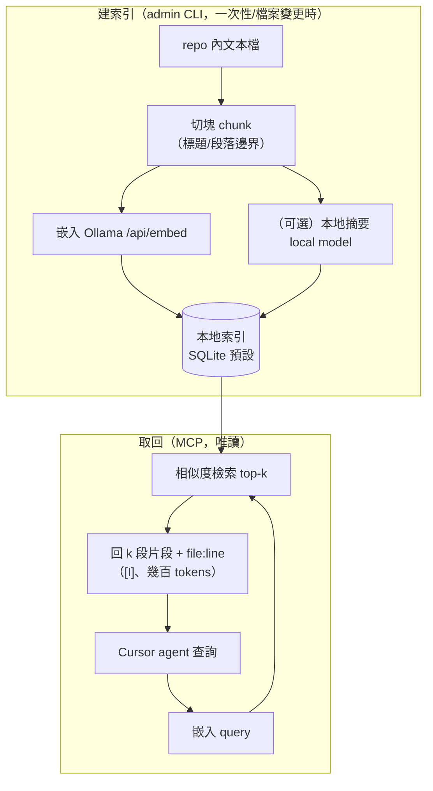

# 專案記憶層 MCP（project-memory-mcp）— 規劃 [I]

* **性質**：[I] 資訊性計畫（不創設義務；權威悉依憲章與各層生效規格之 [N] 條款）。實作選型須依 AUGUR-L7 L7.30（Selection Registry）登錄，並通過 §8.3 機器稽核。
* **報告日**：2026-07-21
* **提出脈絡**：使用者欲「讀取全專案並記住，之後幾乎不花 token 就能用」。本計畫界定「記住」在工程上的正確意義（持久化索引 + 選擇性取回），並規劃一支**唯讀語意檢索 MCP**，作為 `constitution-mcp`（精確條款檢索）之外、涵蓋**非治理輔助語料**（reports/audits/ops/infrastructure/程式/草案…）的語意記憶層。
* **適用範圍界線（硬邊界）**：本層**僅索引非治理輔助語料**；**治理權威語料**（`constitution/`、生效 `specs/*-SPECIFICATION.md`、`RULING-*`、`AMENDMENT-LOG.md`）**一律排除於語意索引之外**，其查詢改走 `constitution-mcp`。理由同 `local-llm-mcp` §二之二：該語料已由 `constitution-mcp` 確定性檢索完整覆蓋，疊語意近似只增幻覺風險、零邊際價值，且正中 WM.44-LABEL「以轉述冒充原文」病灶（`LAYER-SEALING-SCHEDULE.md` 鐵律 12/12）。
* **與既有文件關係**：承接 [MCP-SERVER-OPTIMIZATION-REPORT.md](MCP-SERVER-OPTIMIZATION-REPORT.md)、[LOCAL-LLM-MCP-OPTIMIZATION-PLAN.md](LOCAL-LLM-MCP-OPTIMIZATION-PLAN.md)。為第四支 MCP 之規劃。

---

## 〇、一句話結論

**「記住」= 把**非治理輔助語料**的濃縮片段 + 向量持久化到本地索引，之後每次查詢只取回 top-k 相關片段（幾百 tokens）——不是把全部塞回 context。** 索引預設存**純 stdlib 的 SQLite**（零外部相依），嵌入向量經本機 Ollama 產生；檢索為唯讀、附 `file:line` 出處；LLM 濃縮一律 [I]、禁入治理文書；**治理權威語料一律排除於索引外**，需精確原文時導回 `constitution-mcp`。

---

## 一、目標與非目標

**目標**

1. 一次性建索引：對 repo 內所有文本檔切塊、產濃縮摘要與嵌入向量，持久化存本地。
2. 唯讀取回：給一個查詢，回最相關的少量片段（含出處），供 Cursor agent 以低 token 取用。
3. 跨 session、跨機可重建：索引為 repo 內容之衍生物，可由 `index` 指令在任一機器重建。

**非目標（明確排除，避免範圍蔓延）**

1. **不做**「把全專案摘要每次灌回 context」——那只是把大帳單改小，非正解。
2. **不取代** `constitution-mcp`：治理條款之**精確原文**仍走該 server（零幻覺）；本層回的是**語意相關片段（[I]）**。
3. **不經 MCP 寫入**：建索引是 admin CLI 動作，不暴露為 agent 可呼叫的寫入工具（沿用唯讀紀律）。
4. **不索引治理權威語料**：`constitution/`、生效 `specs/*-SPECIFICATION.md`、`RULING-*`、`AMENDMENT-LOG.md` **不進語意索引**（見適用範圍界線）；此為設計上界，非缺陷。

---

## 二、與現有元件分工

| 元件 | 角色 | 回傳性質 |
|---|---|---|
| `constitution-mcp` | 憲章/生效規格之**精確條款檢索** | 原文（權威可引） |
| **`project-memory-mcp`（本案）** | **全 repo 語意記憶**：跨檔找相關片段 | 濃縮片段 + 出處（[I] 輔助） |
| `local-llm-mcp` | 即時「大進小出」濃縮單一輸入 | [I] 摘要 |
| `augur_proxy` | 提示詞路由（cache/local/claude） | 視後端 |

**判準**：要「某條款原文」→ `constitution-mcp`；要「跨所有文件找跟 X 有關的段落」→ `project-memory-mcp`；要「濃縮我手上這份特定檔案」→ `local-llm-mcp`。

---

## 三、架構

---

## 四、儲存與嵌入選型（最佳化優先；須依 L7.30 登錄）

### 4.1 規模量測（2026-07-21 實測）

* Repo markdown 檔 **98 個**；估算語料 ~3–5MB、切塊後約 **2,000–5,000 個 chunk**。

### 4.2 瓶頸分析（決定選型的關鍵）

| 環節 | 量級 | 是否瓶頸 |
|---|---|---|
| query 嵌入（呼叫 Ollama `/api/embed`） | ~20–80ms | **是（主要）** |
| 向量相似度（2–5k 向量、暴力餘弦） | ~1–5ms | 否（近乎免費） |

**向量搜尋不是瓶頸**。ANN 索引（qdrant/pgvector HNSW）之效益要到 **~10 萬–百萬向量**才顯現；本專案低於該門檻 20–500 倍。

### 4.3 選型決策（最佳化 = 貼合規模，非用最強 DB）

| 方案 | 最佳適用規模 | 成本 | 本專案判定 |
|---|---|---|---|
| **SQLite（stdlib `sqlite3`）+ Python 暴力餘弦** | < ~5–10 萬向量 | 零服務、零外部套件 | ✅ **採用** |
| pgvector / qdrant | ~10 萬–千萬向量 | 需常駐服務 + 外部套件 + 換機重建 DB | ❌ 過度設計，不採用 |
| PostgreSQL 17（augur 生產庫） | 生產知識系統（L4，55GB/250 表） | 屬 **code repo/生產**範疇 | ❌ 跨範疇耦合，不採用 |

**不採用 qdrant/pgvector/PostgreSQL 之理由**：(1) 此規模向量搜尋非瓶頸，加 ANN 服務換來感受不到的速度差；(2) 破壞本 repo「純 stdlib、無外部相依」之治理工具紀律；(3) 增加常駐服務維運與換機重建成本；(4) 生產 PostgreSQL 屬 code repo，耦合即破壞 repo 分離。

### 4.4 必要軟體/套件（最小足跡）

| 項目 | 狀態 |
|---|---|
| Python 3 / `sqlite3` / `urllib` | ✅ 已具（stdlib） |
| Ollama | ✅ 已具 |
| **嵌入模型 `nomic-embed-text`（~274MB）** | ⬇️ 唯一需 `ollama pull` |
| PostgreSQL / qdrant / pgvector / 任何 pip 套件 | ❌ 不需要 |

### 4.5 升級門檻（預留而不預作）

`store.py` 以抽象介面隔離儲存後端；**唯有**當 (a) chunk 數逼近 ~10 萬、或 (b) 需與 code repo 之 L4 Knowledge System 共用單一知識庫時，才評估遷移至 pgvector/qdrant（屆時經 L7.30 重新登錄）。在此之前，遷移即為反最佳化。

> **刪名測試**：SQLite/Ollama/nomic 等皆為狀態登錄 [I]；移除產品名後「切塊→嵌入→相似度取回→附出處」之規範內涵不變，故為登錄非依賴（對齊 L7.30）。

---

## 五、工具集（MCP 唯讀；建索引走 CLI）

| 介面 | 型態 | 說明 |
|---|---|---|
| `recall` | **MCP 工具（唯讀）** | 輸入 `{query, k=5, scope?}` → 回 top-k 片段（含 `path:line`、相似度、可選 [I] 摘要） |
| `memory_status` | **MCP 工具（唯讀）** | 回索引現況：檔數、chunk 數、嵌入模型、建立時間、**過時檔清單**（mtime/hash 與現檔不符者） |
| `python -m tools.project_memory_mcp index` | **CLI（非 MCP）** | 建/重建索引。刻意不暴露為 MCP 工具——寫入是 admin 動作，不給 agent 經 MCP 之寫入旁路 |
| `python -m tools.project_memory_mcp selftest` | CLI | 自測（stub 嵌入，無 Ollama 亦可跑） |

---

## 六、治理護欄（承接本專案教訓，硬編）

1. **回傳皆 [I]、附出處**：每片段附 `path:line`；標示「語意檢索結果為 [I] 輔助，精確原文請經 `constitution-mcp`／讀原檔，不得原文貼入 [N] 治理文書」。
2. **唯讀（MCP 層）**：`recall`/`memory_status` 不寫入；建索引僅 CLI。以 **AST 掃描**鎖 MCP 實作層無檔案系統寫入（比照 `local-llm-mcp` selftest）。索引 DB 寫入僅發生於 `index` 子模組，且該模組不被 server 匯入。
3. **失敗發聲**：索引不存在 / 嵌入服務不可達 → 顯式 `isError`，不靜默回空或近似（承接 B9「靜默降級」教訓）。
4. **陳舊發聲**：`memory_status` 與 `recall` 偵測到來源檔 mtime/hash 已變 → 於回傳**標記「索引可能過時，建議重建」**，不假裝新鮮（呼應本專案「陳舊綠燈」三度教訓）。
5. **路徑封閉**：索引與檢索僅涵蓋 repo 內；`.env`、`logs/`、`.git/`、`*.zip` 等一律排除（沿用 `.gitignore` 精神 + 明確 denylist，防敏感內容入索引）。
6. **治理權威語料排除**（見適用範圍界線）：`index` 走訪時以路徑前綴排除 `constitution/`、生效 `specs/*-SPECIFICATION.md`（無 `-draft`）、`RULING-*`、`AMENDMENT-LOG.md`；`recall` 亦於回傳前過濾任何落入治理語料之片段，改附一行「治理條款請經 `constitution-mcp`」。selftest 以正/反例斷言：治理路徑零 chunk 入庫、`recall` 不回治理片段。

---

## 七、Token 帳

| 作法 | 進入 Cursor context |
|---|---|
| 讀全 repo | 數百萬 tokens（且模型不會跨 session 記住） |
| 「全摘要」每次灌回 | 數萬 tokens（帳單變小、問題仍在） |
| **`recall` 選擇性取回 top-5** | **~數百–1k tokens** |

省 token 的來源是**選擇性取回**：索引一次建好持久化（= 使用者要的「記住」），之後每次只撈相關片段。

---

## 八、實作計畫與驗收

| # | 動作 | 產物 | 驗收 |
|---|---|---|---|
| 1 | `tools/project_memory_mcp/`：`chunk.py`（切塊）+ `store.py`（SQLite 抽象）+ `embed.py`（Ollama `urllib`） | 純 stdlib 索引層 | 對 3 檔建索引、查詢回 top-k |
| 2 | `index` CLI：走訪 repo（含 denylist **＋治理權威語料排除**）→ 切塊 → 嵌入 → 寫 SQLite（存 path/line/hash/vector/[可選]摘要） | 可重建索引 | `index` 後 `memory_status` 回正確計數；治理路徑零 chunk |
| 3 | `server.py`：stdio JSON-RPC，暴露 `recall`／`memory_status`（唯讀） | MCP server | `tools/list`＝2 工具；`recall` 端到端回片段 |
| 4 | 治理護欄硬編（[I]/出處、唯讀 AST 鎖、失敗發聲、陳舊發聲、路徑封閉、**治理語料排除**） | 同上 | selftest 逐項斷言（含治理路徑正/反例） |
| 5 | `selftest.py`（stub 嵌入，無 Ollama 亦可跑；凡宣稱皆有斷言） | 自測 | `... selftest` 綠 |
| 6 | 註冊 `.cursor/mcp.json`（`project-memory`），並將索引 DB 加入 `.gitignore` | 設定 | Cursor 載入後見工具 |

**嵌入模型前置**：`ollama pull nomic-embed-text`（或等效）。

**工時估**：切塊/儲存/嵌入 ~1.5 小時；server + 護欄 ~1 小時；selftest ~0.7 小時。合計 ~3.2 小時。

---

## 九、跨機同步考量

* **索引 DB 是衍生物，不入 git**（加入 `.gitignore`）：避免二進位 churn 與跨機陳舊；改在各機以 `index` 由 repo 內容重建（內容本身已由 GitHub 同步）。
* 因此換機流程：`git clone` → `ollama pull nomic-embed-text` → `python -m tools.project_memory_mcp index` → 即得同一份可查記憶。
* 若日後有多機共享需求，再評估把索引移至 qdrant/pgvector（經 L7.30 登錄），本設計之 `store.py` 抽象即為此預留。

---

## 十、已知限制與風險（不因計畫漂亮而略去）

1. **嵌入/摘要品質天花板**：語意檢索可能漏抓或誤抓；故回傳一律 [I]、附出處，精確判定回 `constitution-mcp` 或讀原檔。
2. **索引陳舊**：檔案改動後未重建則過時；以 mtime/hash 偵測並「陳舊發聲」，但**不自動重建**（重建是 admin 決定）。
3. **切塊邊界**：粗切可能切斷條款語義；初版以標題/段落邊界切，日後可依 `mc_clauses` 之條款邊界對齊（與 `constitution-mcp` 共用切法）。
4. **不是精確來源**：本層永不作為 [N] 依據；此為設計上界，非缺陷。

---

## 十一、元憲章對齊（依 constitution-mcp 實查 2026-07-21；AUGUR-MC v1.4，附 `file:line`）

本記憶層為 [I] 語意輔助、不創設 [N] 義務、永不作為 [N] 依據；其設計逐項對映元憲章：

| 本工具設計決策 | 元憲章依據（出處） |
|---|---|
| `recall` 回傳皆 [I]、精確原文導回 `constitution-mcp` | **P2.E2**：Model/檢索產物不得未經 Evidence 通道成為權威 Knowledge（`META-CONSTITUTION.md:221`）；**P2.E4**：Representation 不得被視為 Reality 本身（`:223`） |
| **治理權威語料排除於索引外**（僅索引非治理輔助語料） | **P2.E2**（`:221`）＋**P2.E4**（`:223`）：語意向量/摘要皆 Representation，不得覆蓋或代替生效治理原文；治理查詢改走 `constitution-mcp` 之確定性檢索 |
| 每片段附 `path:line` 出處 | **P4.E1** Knowledge 五元組含 **Source**（`:293`）；**P3.E1** 引用與解析義務（`:265`） |
| **陳舊發聲**（mtime/hash 偵測） | **P4.E1** 五元組含 **Timestamp**（`:293`）；**P2.E5（Fail-safe）**：來源變更/撤回須連動（`:224`） |
| 唯讀（MCP）、建索引走 CLI、不經 MCP 寫入 | **§8.1**：Steward 持修憲裁決權、Agent 不得參與（`:477`） |
| 語意檢索非權威、不得建立永久 Knowledge | **P2.E1**：禁 AI 直接從 raw data 建立永久 Knowledge（`:215`）；**P2.Y**：防「對錯誤世界產生合理智慧」（`:205`） |
| 路徑封閉、排除 `.env`/`logs`/`.git` | 承 §8 治理與證據紀律之保守預設（防敏感內容誤入索引） |
| 全案定位（五大原則） | **§9 終極宣言**：Evidence Before Conclusion／Identity Before Knowledge 等（`:535`） |

> **與 `constitution-mcp` 之權威分工**：本層依 **P2.W2 權威順序**（`:201`）居於「輔助檢索」位；凡涉 [N] 條款之精確性判定，一律以 `constitution-mcp` 原文或讀原檔為準，本層不得替代。

---

*本文件存於* `reports/PROJECT-MEMORY-MCP-PLAN.md`*，為 [I] 資訊性計畫，不具規範力；實作選型須依 L7.30 登錄，token 數字除標「實測」者外均為估算。*
