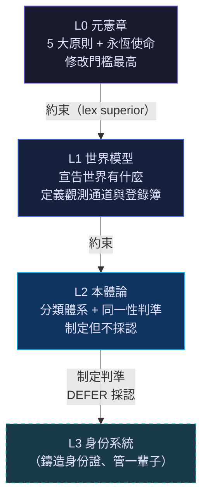

# Augur 憲章 L0 / L1 / L2 — 用人話講

> **文件用途**：這份報告把 Augur 憲章體系最上面三層的規矩，翻譯成日常語言。不用背條號、不用懂法律用語，讀完就能理解「這套系統到底在管什麼、為什麼要這樣管」。

---

## 一眼看懂三層關係

```
┌─────────────────────────────────────────────────┐
│  L0  元憲章（Meta-Constitution）                  │
│  ＝ 最高法。定規矩、定原則、定修改規矩的規矩。     │
│  所有人（包含 AI）都不能違反。                     │
└─────────────────────┬───────────────────────────┘
                      │ 約束（上層管下層）
┌─────────────────────▼───────────────────────────┐
│  L1  世界模型規格（World Model Specification）     │
│  ＝ 世界地圖。宣告「世界上有什麼東西」。            │
│  不管怎麼分類、也不管資料庫怎麼存。                │
└─────────────────────┬───────────────────────────┘
                      │ 約束
┌─────────────────────▼───────────────────────────┐
│  L2  本體論規格（Ontology Specification）          │
│  ＝ 分類手冊。宣告「這些東西是什麼類、怎麼分」。    │
│  制定判準，但不動手鑄造身份證（那是 L3 的事）。     │
└─────────────────────────────────────────────────┘
```

**一句話版本**：L0 說「原則不能破」，L1 說「世界長這樣」，L2 說「這些東西這樣分」。

---

## L0 — 元憲章：系統的「憲法」

### 它是什麼？

L0 就是 Augur 整個系統的最高法律。它不寫程式、不設計資料庫、不選技術——**它只做一件事：定規矩**。所有下面七層的規格，都不能跟它抵觸；抵觸的部分自動作廢。

### 核心內容

#### 🏛 最高使命（Prime Axiom）——永遠不能改的那句話

> Augur 活著就是為了「用持續一致的身份和可追溯的證據，忠實描述真實世界，並在此基礎上產生可信的智慧。」

這句話是**永恆條款**：不管誰來、不管什麼程序，都不能修改它。

#### 📜 五大原則

| # | 原則 | 人話 |
|---|------|------|
| **P1** | 真實世界優先 | 先搞清楚世界長怎樣，再談資料和模型。資料只是觀測結果，不是世界本身。不能拿 ERP 表結構當世界結構。 |
| **P2** | 先描述再推理 | AI 不能跳過「把世界描述清楚」直接去做預測。先畫好地圖，再規劃路線。AI 的產出只能先當「候選」，經過證據通道確認後，才算數。 |
| **P3** | 先辨認身份再建知識 | 任何一筆知識都必須先回答「這是在說**哪個**東西？」——同一台機器在不同系統裡叫不同名字，必須有辦法對齊。 |
| **P4** | 先有證據再下結論 | 每個結論都要能追問「你憑什麼這樣說？」——證據鏈要一路追到底，AI 生成的內容要永久標記為「合成的」，信任不能被洗白。 |
| **P5** | 先問責再行動 | 要改變真實世界的動作，必須回答「誰發起？誰授權？依據什麼知識？」——最終得有人類拍板，AI 不能自己做主。 |

#### 🔒 五條對稱禁令

配合五大原則，有五條「沒有 X 就不准做 Y」的禁令：

1. 沒有真實世界對應的東西 → 不准表徵
2. 沒有可靠表徵 → 不准產生智慧
3. 沒有身份 → 不准建立知識
4. 沒有證據 → 不准下結論
5. 沒有可追溯到人類權威的授權 → 不准行動

#### 🔄 世界演化模型（標準鏈）

L0 定義了世界如何演化的唯一官方流程（12 步）：

```
真實世界 → 觀測 → 表徵 → 辨認身份 → 引用為證據 → 建立知識
         → 推理 → 規劃 → 【人類授權關卡】 → 行動 → 回饋 → 學習
```

重點在那個**人類授權關卡**：AI 想做任何改變真實世界的事，都要先過這關。而且行動的結果必須以「觀測」的方式回到系統裡，不能自說自話。

#### 👤 治理：誰來當裁判？

- 有一個「**憲章管家**」（Constitution Steward）角色，是**真人**
- 有三個權力：解釋條文、審查是否違憲、裁決修憲
- **AI 不能參與修憲和解釋**——鐵律
- 修憲門檻極高：要有書面證據、要證明新版更好
- 最高使命那條**永遠不能動**

#### ✅ L0 品質保證

L0 已經通過了嚴格的五道關卡審查：

| 關卡 | 做了什麼 |
|------|---------|
| G1 首審 | 三面鏡子對抗審查（一致性、嚴謹度、現實性） |
| G2 處置 | 所有重大問題都由管家正式裁決 |
| G3 窮舉 | 機械式地逐條檢查，不是用嘴巴說「沒問題」 |
| G4 補列 | 窮舉查出的缺口全部補齊 |
| G5 複驗 | **獨立的人**來確認「乾淨了」→ 蓋章 |

> [!IMPORTANT]
> 關鍵教訓：整個審查過程中，**建造者自查的攔截率是零**——所有問題都是獨立審查抓出來的。這就是為什麼要堅持獨立複驗。

---

## L1 — 世界模型規格：系統的「世界地圖」

### 它是什麼？

如果 L0 是憲法，L1 就是「世界地圖」——它宣告**世界上有什麼東西**，但不管怎麼分類（那是 L2 的事），也不管資料庫怎麼存（那是 L4/L7 的事）。

### L1 的核心信條

#### 🌍 世界模型至上

> 世界模型是系統內最高抽象，比任何資料來源都高。

人話：不管你的資料是從 ERP、MES、感測器、金融 API 還是官方統計來的——**這些都只是「觀測窗口」，不是世界本身**。系統要先定義「世界長什麼樣」，然後讓資料來映射到這個世界模型上，而不是反過來讓資料表結構決定世界結構。

> [!TIP]
> 想像一下：如果你先看了 ERP 的表格才定義「什麼是一台機器」，那你理解的世界就被 ERP 的欄位綁死了。L1 要求的是：先想清楚「機器在真實世界是什麼」，再讓 ERP 的資料來對號入座。

#### 🗂 三種「權威」不能混

L1 把系統裡常被搞混的「權威」、「真相」、「事實」拆成三個精確位置：

| 權威類型 | 人話 | 舉例 |
|---------|------|------|
| **(a) 形權威**（觀測層） | 外部資料來源對它自己交出來的資料有發言權，但僅此而已 | FinMind API 對它回傳的 JSON 內容有權威，但不代表這些就是「世界真相」 |
| **(b) 結構權威**（世界結構層） | 世界裡存在哪些東西、彼此什麼關係，由 L1 和 L2 說了算 | 「台灣證券市場有上市股票、有指數、有期貨」——這種宣告由 L1/L2 定義 |
| **(c) 系統記錄**（表徵層） | 系統裡的「唯一系統記錄」——注意，不叫「唯一真相來源」 | PostgreSQL 裡存的那份權威表徵 |

#### 📡 觀測儲存（Observation Store）

外部來源回傳的原始資料，系統會忠實鏡像保存，這叫 Observation Store。它的規矩：

- **每個值都要能追溯到某次來源回應**
- **要跟來源做對帳驗證**
- 共同表徵層建在 Observation Store 之上，**不能取代它**

#### 🏷 所有東西都要有身份

L1 明定：**世界模型的基本單位是 Identity（身份），不是資料表的 row、不是檔案、不是 embedding**。

#### ⏰ 雙時間性

每筆觀測和知識都必須記兩個時間：

| 時間 | 意思 |
|------|------|
| **valid time** | 這件事**什麼時候為真**（例：這個月營收是 6 月的） |
| **transaction time** | 系統**什麼時候知道的**（例：7 月 10 日從公開資訊觀測站抓到的） |

不能把這兩個混在一起。這是為了防止「事後諸葛」——你必須能重建「在某個時點，系統知道什麼、不知道什麼」。

#### 🏷 永久標記體系

有些標記一旦貼上去就不能拿掉，包括：

| 標記 | 意思 |
|------|------|
| `self-reported` | 這是 AI 自己說的，不是別人觀測到的 |
| `synthetic` | 這是 AI 生成的內容 |
| `modal` | 這是假設/預測，不是事實 |
| `superseded` | 這筆資料已被更新的取代了 |
| `provisional` | 這個身份還沒確認 |
| `non-final` | 這筆觀測值還沒定案 |
| `conflict` | 不同來源的說法互相矛盾 |

#### 🗺 世界概念登錄簿（World Concept Registry）

系統必須維護一個登錄簿，記錄：

1. 世界概念是什麼（例：「上市股票」）
2. 它屬於什麼類別（實體/事件/狀態/關係/量）
3. 從哪些來源觀測到它
4. 誰是權威表徵
5. 時間屬性
6. 來源追溯
7. 定案性述語

**消費世界模型的模組，必須用「世界概念」當鍵來查，不能直接用來源的表名、欄名來綁。**

> [!WARNING]
> 白話翻譯：你不能在程式裡寫 `SELECT * FROM finmind_twse_daily WHERE stock_id = '2330'`，然後說這就是「台積電的股價」。你必須透過世界概念登錄簿，用「台積電這個 Identity 的收盤價這個世界量」去查。

#### 🌐 領域 Profile：台灣證券市場

L1 的 Annex A 是第一個領域 Profile，宣告了台灣證券市場中的所有世界概念——上市股票、指數、期貨、選擇權、權證、可轉債、外國證券、經濟指標、公司治理事件……總共幾十個。

這些宣告只說「世界上有這些東西」、「從這些通道可以觀測到」——**不管怎麼分類**（那是 L2 的事），**不管怎麼存**（L4/L7 的事）。

---

## L2 — 本體論規格：系統的「分類手冊」

### 它是什麼？

L1 說了「世界上有什麼東西」，L2 接著說**「這些東西是什麼類、怎麼分、怎麼判斷兩個東西是不是同一個」**。

打個比方：L1 像是探險家說「我看到了一群動物」，L2 則是生物學家說「這個是哺乳類、那個是鳥類，判斷是不是同一隻要看 DNA」。

### 三層不僭越

L2 有一條非常重要的自我約束：

| 層 | 職責 | 人話 |
|----|------|------|
| **L1** 存在層 | 宣告世界有什麼 | 「市場上有股票這種東西」 |
| **L2** 型別層 | 定義類型和判準 | 「股票是一種金融工具，判斷同一要看發行人＋工具類別＋發行序」 |
| **L3** 個體層 | 鑄造身份證、管一輩子 | 「這張身份證號碼是 SEC-00001，給台積電普通股用的」 |

**L2 不能做 L3 的事**——L2 只能「制定」判準（寫下來怎麼判），不能「採認」判準（讓它真的生效用於辨認），更不能自己去「鑄造」身份證。

### L2 的核心結構

#### 🌳 頂層分類：五大範疇

L2 把世界上所有東西分成五大類：

```
世界上的一切
├── Entity（實體）
│   ├── PhysicalEntity（實體物件：工廠、機器、材料）
│   ├── AbstractEntity（抽象實體：金融工具、概念）
│   ├── DynamicEntity（動態實體：有生命週期的東西，如期貨契約）
│   └── AgentiveEntity（行為主體：AI Agent、公司、作為決策者的人）
├── Event（事件：除權息、財報公告）
├── State（狀態：漲停、暫停交易）
├── Relation（關係：發行關係、標的關係）
└── Quantity（量：收盤價、成交量、月營收）
```

#### 🔍 每個類型必須有三要件

L2 規定，每定義一個類型，**必須同時說清楚三件事**：

| 要件 | 人話 | 舉例（以「上市股票」為例） |
|------|------|--------------------------|
| **(a) 上位範疇** | 它歸在哪一類底下 | AbstractEntity / FinancialInstrument |
| **(b) 同一性判準** | 怎麼判斷兩個東西是不是同一個 | 同一個發行人 × 同一種工具類別 × 同一個發行序＝同一支股票 |
| **(c) instance/type 區分** | 哪些是「個體」、哪些是「類別」 | 台積電（2330）是**個體**；「半導體股」是**類別**，不能混 |

#### 🏦 台股型別階層（具體例子）

以下是 L2 在台灣證券市場領域定義的一些重要類型：

| 型別 | 上位 | 同一性判準（人話） | 個體 vs 類別 |
|------|------|-------------------|-------------|
| **Security（上市櫃證券）** | 抽象實體/金融工具 | 同一家公司＋同一種工具＋同一個發行序＝同一支股票。代碼被借殼用了就不是同一個。 | 台積電＝個體；上市/上櫃/ETF＝類別 |
| **Index（指數）** | 抽象實體 | 編製方法論相同＝同一指數。代碼相同不代表同一。 | 加權指數＝個體；報酬指數/價格指數＝類別 |
| **DerivativeContract（期貨/選擇權）** | 動態實體 | 標的族 × 月份 × 買賣權 × 履約價 四要素相同。有生命週期（上市→交易→結算消滅）。 | 具體契約＝個體 |
| **Issuer（發行人/公司）** | 行為主體 | 法律實體相同。統一編號只是「指涉資訊」，不是身份證。借殼/更名不改公司身份，但可能改其股票身份。 | 具體公司＝個體 |
| **EconomicIndicator（經濟指標）** | 量 | 量種 × 維度值。消費者物價指數跟失業率是不同的量。 | 各指標＝個體 |

#### 🚫 關鍵禁令

L2 有幾條重要的禁令：

1. **外部識別碼不是身份證**
   - 供應商的證券代碼（如 FinMind 的 `stock_id`）只是「指涉資訊」，不是系統鑄造的 identifier
   - 跨體系說「這兩個是同一個東西」，要用 identity claim（受證據約束的知識），不能直接 join

2. **消費端不能自己判斷類型**
   - 不能在程式裡寫 regex 來猜「這串代碼是股票還是指數」
   - 類型由 L2 宣告，不由消費端臨場判定

3. **個體命名空間必須隔離**
   - 股票代碼跟指數代碼就算長得一樣，也不能混在一起
   - 產業分類（「半導體」）是 **type**，不能混入個股（台積電）的命名空間

#### 🔒 效力封印

L2 制定的同一性判準，在 L3「採認」之前，**都只是定義文本，不能真的拿來用**。在被採認之前：

- 涉及該類型的身份引用，一律視為「未確認」（provisional）
- 要貼上 provisional 標記
- 不能升級為知識

> [!NOTE]
> 這就像是一個城市規劃師畫好了道路圖（L2），但在工程局蓋好路（L3）之前，這些路還不能通車。

---

## 三層之間的「約束鏈」整理



| 面向 | L0 管什麼 | L1 管什麼 | L2 管什麼 |
|------|----------|----------|----------|
| **核心問題** | 原則不能破 | 世界有什麼 | 怎麼分類 |
| **產出物** | 五原則 + 標準鏈 + 治理規則 | 世界概念清單 + 登錄簿 + 觀測通道 | 型別階層 + 同一性判準 |
| **不管的事** | 技術細節 | 怎麼分類、怎麼存 | 怎麼鑄造身份證、怎麼存 |
| **修改門檻** | 極高（最高使命不能改） | 高 | 中高 |
| **蓋章狀態** | ✅ 已蓋章 | ✅ 已蓋章 | ✅ 已蓋章 |

---

## 為什麼要搞得這麼複雜？

> [!IMPORTANT]
> **一句話答案**：因為 AI 最大的風險不是不夠聰明，而是**對錯誤的世界產生高度合理的智慧**。

如果你讓 AI 直接從 ERP 表格學習，它學到的不是「世界」，而是「某個軟體的資料結構」。換一套軟體，它就什麼都不認識了。

這三層的設計就是在防止這件事：

1. **L0** 確保「描述世界」永遠排在「產生智慧」前面
2. **L1** 確保「世界模型」不被資料來源的結構綁架
3. **L2** 確保「分類和辨認身份」有明確的判準，不是各模組各自為政

最終目標：**讓 Augur 能長期忠實地理解世界，而不是短期生產一個看起來聰明的系統**。

---

> *本報告產生於 2026-07-20，依據 AUGUR-MC v1.4、AUGUR-WM v1.0、AUGUR-ONT v1.0 正式生效版本撰寫。*
