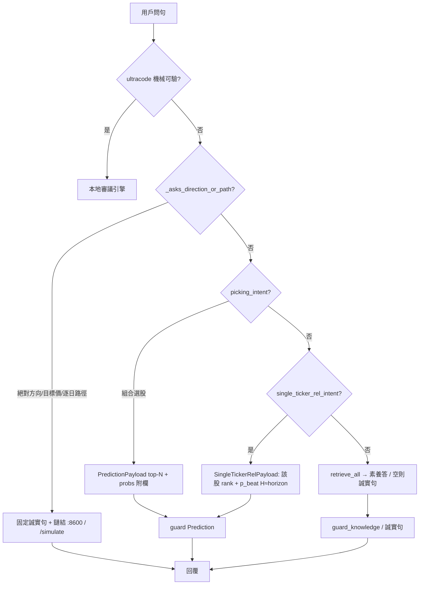

# 顧問「預測亦知識面」整合計畫（plan-first｜2026-08-05）

> **性質**：[I] 計畫書（憲章第六部／CLAUDE #20）。**未拍板不實作**。  
> **觸發**：用戶問「2330 未來 30 天走勢」→ ultracode 退回一般管線 → 哲學／KH 檢索空 →「知識庫中無此內容」；同時庫內已有 `prediction_probability`／MC cone／（未 GATE 之）DirStack。用戶定錨「預測也是知識庫的一部份」並裁 **先只交計畫**（AskQuestion `plan_only`）。  
> **self-reported（#32a）**。

---

## 0. 進度（本日）

| 步 | 狀態 |
|---|---|
| AskQuestion 範圍＝plan_only | ✅ |
| 現況碼盤點（advise／payload／relevance／prompt） | ✅ |
| 本計畫書落地 `reports/` | ✅ **本檔** |
| Steward 拍板 GO | ✅ `go_b2` + `auto_rel_topn` |
| 實作／重啟服務／回歸 | ✅ Phase1+TopK；帳 `audits/ADVISOR-PRED-KH-AUTOREL-TOPN-EXECUTED-20260805.md` |

---

## 1. 一句話

**「預測是顧問答案面的真兆通道之一」，不是把 ranking／機率列灌進 `knowledge_item` 嵌入庫；缺口是單股前瞻題的意圖路由，不是缺表。**

---

## 2. 現況（真碼，非臆測）

顧問已有**三條互不合併的「知識／真兆」通道**：

| 通道 | 載體 | 何時生效 | 失敗長相 |
|---|---|---|---|
| **A. 素養檢索** | `retrieve_all` → works∪items；空→`知識庫中無此內容` | 預設主路 | 2330 走勢題落此 |
| **B. 選股預測** | `picking_intent`→`build_prediction_payload`（`prediction_values`＋附欄 `prediction_probability`） | 「該買什麼／前 N 檔」類 | **單股＋未來 N 天／走勢**通常 **False** |
| **C. 方向／路徑短路** | `_asks_direction_or_path`→`build_direction_refusal`（讀 `direction_gate`） | 「未來N天」∧方向詞｜目標價／逐日等 | 固定誠實句＋指相對機率頁／MC 頁；**不**附庫內數字 |

**本案病灶（2330 例）**：題型常同時觸 C 的「走勢／未來天」語義；即便短路未命中，B 也不觸發 → A 空庫 decline。  
用戶體感＝「預測明明有，卻說知識庫沒有」——語意衝突出在 **「知識庫」三字被綁死在 A**，而產品期望的「知識」含 **B（＋可選唯讀 MC）**。

已存在、可複用（勿重建）：

- `PredictionPayload.probs`／`prob_note`（P6 相對機率附欄＋`econ_verdict` 硬綁）
- `guard`：數字須 ∈ `payload.numbers()`
- `:8600` 相對機率頁／`/simulate`（MC 四鎖；**模擬數字不進 chat** 為既定四鎖①–③）

---

## 3. 概念邊界（必守，對齊靈魂↔raw）

| 是 | 不是 |
|---|---|
| 顧問 **multi-channel 真兆**：A∪B（＋導引 C／MC 頁） | 把 `prediction_*`／MC 路徑 **嵌入** `knowledge_item`／當哲學原文 |
| 「知識」＝**可溯源、可閘的回答素材** | raw／整庫 panel 升格靈魂（`soul-vs-raw`） |
| 相對機率＝P(勝過同儕中位｜as-of,H) | 絕對漲跌明牌；方向 GATE pass=0 時仍禁確立宣稱 |
| MC＝模擬情境頁／disclaimer | 把 `ret_p50`／cone **寫進顧問 payload 白名單當預測**（違四鎖） |

> **憲政切片／未來修憲目標（2026-08-05）**：絕對方向題＝誠實拒答 **或** 改寫相對＋GATE 未過——見 `reports/augur_advisor_absolute_direction_honesty_constitutional_slice_20260805.md`（未動 MC [N]）。

---

## 4. 建議架構（拍板後實作目標）

**新增意圖（建議名）**：`single_ticker_rel_intent(query) → (stock_id, horizon_td|None)`

- 觸發例：`2330`／`台積電` +（`相對`｜`機率`｜`強弱`｜`排名`｜**不含絕對漲跌強制詞時之**「未來 N 天／約 30 日」）  
- **與 C 的優先序（提案預設）**：
  - **甲案（偏誠實既有）**：C 仍優先於 B2——「走勢／會漲跌」類維持固定誠實句，但**改版固定句**須「若庫內有相對機率／排序，附一段確定性渲染的相對數字」（數字出 payload／SQL，非整句 LLM 編）。  
  - **乙案（偏產品）**：若問句可解析為單股＋horizon、且**未**要求目標價／逐日路徑，則 **B2 優於 C**；僅目标價／逐日／準確率排行仍走 C。  
- **推薦拍板採乙案**（否則 2330「約 30 日」永遠進 C，整合無感）；甲案作備選若 Steward 要更保守。

**B2 payload（不新表）**：

| 欄 | 來源 |
|---|---|
| `as_of` | `prediction_probability` 該股 `max(panel_date)` 或產品釘錨（與 P6 C/D 對齊；現況常 2026-05-31） |
| `horizon` | 問句映射：≈30 日曆日 → **H20**（`calendar_days≈29`）；未寫清 → 主產品 H60 |
| `p_beat_median`／`rank_pctile`／`econ_verdict` | `prediction_probability` |
| `rank`／`score`（可選） | 同 as-of／近 as-of 之 `prediction_values`∩`model_registry` |
| `prob_note` | 沿用四誠實標記；`econ=dead|thin_*` 必須同屏 |

**不作**：自動 promote、SIM-apply、把 MC `ret_p50` 列入顧問數字白名單。

---

## 5. (a) Schema／(b) 程式規畫

### (a) 表（無新 DDL）

| 表 | 角色 |
|---|---|
| `prediction_probability` | B2 主讀 |
| `prediction_values`＋`model_registry` | 排序輔助 |
| `direction_gate` | C 路狀態句 |
| `mc_simulation_run` | **僅 URL／文案導引**；不入 chat 數字 |
| `knowledge_*` | A 路不變；**禁止** INSERT 預測列當 item |

### (b) Python（拍板後）

| 檔 | 角色 |
|---|---|
| `src/augur/advisor/relevance.py` | 新增 `single_ticker_rel_intent`＋`--selftest` 紅綠（2330 未來30天→命中；純哲學→否；目標價→否） |
| `src/augur/advisor/payload.py` | `build_single_ticker_rel_payload(stock_id, horizon)`；擴 `numbers()` |
| `src/augur/advisor/oai_compat.py` | 分派：picking → 既有；else single_ticker → B2；else empty |
| `src/augur/advisor/advise.py`／`prompt.py` | 乙案優先序；B2 確定性區塊（對偶 `_render_picks_table`）；C 固定句可選附加「相對機率條」若乙案未搶先 |
| `scripts/verify_advisor_regression.py` | 新案：單股相對問 → 非「知識庫中無此內容」∧ 數字 ∈ DB ∧ 含相對口徑 disclaimer |
| `scripts/serve_chat_ui.py`（文案） | tierhint 一句：個股相對機率／選股走預測通道，非僅 KH 文本 |

零新常駐服務；改碼後 **重啟 `augur-advisor`／`augur-chat`**（#7）。

---

## 6. 分階段與 Gate

| 階段 | 交付 | Gate | 另授權？ |
|---|---|---|---|
| **Phase 0** | 本計畫拍板（甲／乙優先序＋是否動 C 固定句） | Steward GO 句 | 本檔 |
| **Phase 1** | `single_ticker_rel_intent`＋B2 payload＋分派＋selftest／回歸 | 綠燈；2330×H20 手測 | Phase 0 GO |
| **Phase 2**（可選） | C 固定句嵌入「有則顯示」相對條；UI 文案 | 回歸＋不泄漏絕對漲跌 | 另裁 |
| **Phase 3**（不做於本整合） | 預測→KH embed／ontology 合一 | — | **否決預設** |

硬邊界：FZ 取數無關；skip-sync；no-SIM-apply；方向 GATE 未過不升格絕對宣稱。

---

## 7. 驗收

1. 問「2330 未來約 30 天走勢」：  
   - **乙案**：回覆含庫內 `p_beat_median`／rank（as-of 標明）＋「相對非絕對」＋`econ_verdict`；**不得**僅「知識庫中無此內容」。  
   - 仍**不得**輸出目標價／必漲跌幅。  
2. 問「什麼是知行合一」：行為與今相同（A 路），不誤觸 B2。  
3. 問「該買什麼股票」：仍走 B1 picks。  
4. `guard`：捏造機率 → fail；通過數字 ⊆ payload。  
5. MC：chat **無** `ret_p50`；僅可有頁面連結。

---

## 8. 請 Steward 裁示

1. **优先序**：`priority_B2_over_C`（乙案・推薦）／`priority_C_then_enrich`（甲案）  
2. **GO 句模板**（乙案例）：  
   `ADVISOR-PRED-KH-INTEGRATE-P1-go | priority_B2_over_C | FZ/GATE-keep | skip-sync | no-SIM-apply`  
3. 是否納入 Phase 2（C 句enrich）同案或另開。

---

*定版草稿 2026-08-05；等候拍板後實作。*
