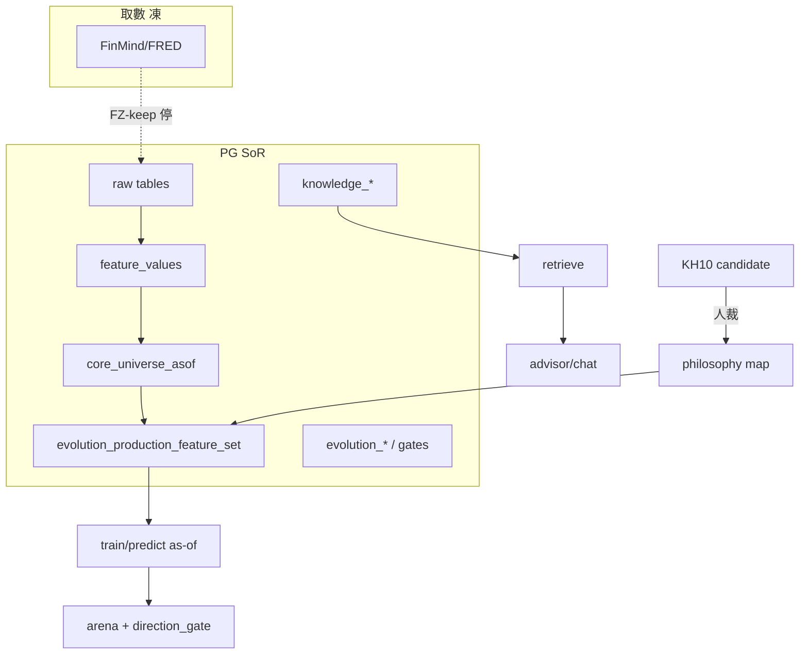

# Augur 深化理解報告——優化地基（2026-07-30 晚）

> **位階**：[I] 理解／接續記憶（非 [N]；不創設治權判準）  
> **觸發**：Steward「深化理解此專案所有檔案內容後詳細理解並記住，並做出深化理解的專案報告，以做為後續優化此一專案的基礎」  
> **誠實界限**：不可能也不應在單次對話「字面讀完」全 repo（含治權原文、295＋表、~295 scripts、339 重讀事實）。本檔＝**合成理解 SSOT**——把既有重讀／說人話／未來發展／HANDOFF／本日 EVO 執行**壓成可優化的心智模型**；細節數字一律標來源，過期先 `psql`／`ls docs/` 親驗（#15）。  
> **「記住」落點**：本報告＋`HANDOFF.md` 指針；跨 session 不靠模型權重，靠 repo 檔。

---

## 〇、三十秒：這世界在做什麼

Augur 是一個**先立法、再長智慧**的世界建構專案：以持續身分與可追溯證據忠實表徵現實，使可信智慧成為後果而非起點（AUGUR-MC Prime Axiom／P1–P5）。

具象上它同時是：

| 半 | 是什麼 | 不是什麼 |
|---|---|---|
| **半-1 預測** | 台股**相對強弱**排序＋經濟價值終審（IC≠成功） | 絕對漲跌占卜；live API 硬前提 |
| **半-2 素養／顧問** | know-how→句→嵌→檢索→本地 LLM 作答（KH 漸進） | 自動下單；入庫＝進化核准 |
| **第三塊 審議** | 本地 oracle 裁「開發宣稱」真偽 | 取代 Steward 人裁 |

**一條合法成長路**（說人話報告核心）：候選 → 可證偽／樣本外／實效終審 → **人類授權門** → 晉升或判死留檔 → 後果回流。八種行走者無特權通道；域（台股／ERP／太陽能探針）只是足跡。

---

## 一、理解地圖：先讀誰（優化前路由）

| 優先 | 檔 | 用途 |
|---|---|---|
| 1 | 本檔 | 2026-07-30 晚合成心智模型＋優化槓桿 |
| 2 | [`HANDOFF.md`](../HANDOFF.md) | 跨機接續／近程 STATE／紅線（取代式，引用前實查） |
| 3 | [`ARCHITECTURE-OVERVIEW.md`](../ARCHITECTURE-OVERVIEW.md) | L0–L7 × 概念／實作 2 層透鏡 [I] |
| 4 | [`reports/augur_plain_language_full_report_20260730.md`](augur_plain_language_full_report_20260730.md) | 世界建構白話＋已證實／願望標註 |
| 5 | [`reports/augur_construction_understanding_20260713.md`](augur_construction_understanding_20260713.md) | v4 code-verified 建構深讀（半-1／半-2／審議；**治權版號已舊**） |
| 6 | [`reports/augur_full_reread_facts_20260730.md`](augur_full_reread_facts_20260730.md) | 339 事實／153 踩雷／117 廢棄（針刺級） |
| 7 | [`reports/augur_future_development_plan_20260730.md`](augur_future_development_plan_20260730.md) | 實作對接規格（表／CLI／行走者統一） |
| 8 | [`reports/augur_open_problems_schedule_20260730.md`](augur_open_problems_schedule_20260730.md) | 開放問題×三批制 |
| 9 | [`reports/augur_self_evolution_execution_plan_20260730.md`](augur_self_evolution_execution_plan_20260730.md) | EVO 波次＋車道 |
| 10 | `docs/系統核心思想_v1.9.0.md` · `原則精華_v1.12.0.md` · `系統架構大憲章_v1.52.0.md` · `CLAUDE.md` v1.32 | 治權五檔（**版號以 `ls docs/` 為準**） |
| 11 | `constitution/`＋`specs/` | [N]；精確原文走 **constitution-mcp**，勿整檔灌入 |

**治理精確原文**：`get_clause`／`get_spec_clause`／`layer_status`（本日實查 L0–L7 規格皆生效，MC **v1.6**）。

---

## 二、治權脊椎（優化時不可撞的牆）

### 2.1 分層

```
L0 Meta-Constitution (v1.6)  lex superior
L1 WM · L2 ONT · L3 ID · L4 KS(v1.1)     概念層（不得用 L5–7 產品定義概念）
L5 Cognitive · L6 Agent Runtime(v1.2)   規格＝概念；引擎＝實作（雙面）
L7 Infrastructure                       PG＝System of Record；Qdrant＝Semantic Memory
```

領域治權（靈魂／原則／大憲章／CLAUDE／README）受 MC 約束；CLAUDE＝L6 Agent Runtime 工具規則。

### 2.2 三敵人與北極星（優化判準）

1. **假資料**（#1 source-pure）  
2. **偷看未來**（#8 anti-leakage／as-of）  
3. **自我欺騙**（#15 真兆；機械閘＋人裁）

北極星三問：真來源？決策當下可見？OOS／經濟撐住？

### 2.3 操作紅線（2026-07-30 仍有效）

| 紅線 | 含義 |
|---|---|
| **FZ-keep** | FinMind／FRED **取數凍**（有界 arena 日更白名單除外）；**預測⊥API**——庫內 as-of 可訓／推 |
| **GATE-keep** | 不降閘；升嚴唯明示 |
| **HUMAN 門** | 促升／governance／approve 類人裁；AI fail-closed |
| **soul ≠ raw** | raw 是觀測；靈魂進的是概念／可證偽關係 |
| **clean-room** | 不讀 stock_backend code／數字回流 |

### 2.4 機械閘文化

判準下沉：DB trigger／CHECK／GRANT／AST／指令矩陣／honesty GUC／FV-GUARD。  
「以為寫了」不夠——要能被機器拒寫或自測紅。

---

## 三、實作層心智模型（16 package × 兩半）

### 3.1 Package 地圖

| Package | 半 | 一句 |
|---|---|---|
| `core` | 共 | DB／config／generic_schema／heavy_slot／prodset_contract |
| `ingestion`／`catalog`／`audit` | 1 | 取數通道（凍）／名冊／對帳 |
| `features`／`universe`／`models`／`evaluation` | 1 | panel→宇宙→排序模型→IC／econ |
| `arena` | 1 | 多隊方向預測賽局＋門 |
| `philosophy` | 橋 | PME 假說／map／檢索解讀 |
| `knowledge` | 2 | 入庫→KH1–10→向量 |
| `advisor` | 2 | 檢索＋guard＋作答（預測 payload 唯讀） |
| `deliberation` | 3 | 本地審議 |
| `evolution` | LAI | 行為評測尺／教材 |
| `identity`／`execution` | 橫 | 世界實體身分／行動留痕（自動下單仍禁） |

**隔離鐵律**：預測 7 pkg **零 import** knowledge／advisor／philosophy（AST）；顧問吃預測只經 frozen payload。

### 3.2 資料流（簡圖）



### 3.3 服務與車道（當家機 PC002）

| 服務 | 埠 |
|---|---|
| chat／advisor／admin／probability | 8090／8399／8500／8600 |
| ollama／qdrant | 11434／6333（Qdrant 載體可能非 augur unit——實查） |

**車道**：`/tmp/augur_llm.lock`＝1；sklearn 長跑建議 1；DB 重寫避 dump／DDL。  
**硬體**：當家機 **無 GPU**；LoRA／重 embed → `DESKTOP-8MQPFS8`。**GB10 不存在**。

---

## 四、現況錨點（2026-07-30 晚 live／本日執行）

> 下列數字：本輪 `psql` 親驗，或本日 session audit。

| 錨 | 值 | 含義 |
|---|---|---|
| public 表 | **298** | SoR 體量 |
| prodset active | **2** | SUNSET (b) 未達（差成長） |
| core_universe_asof | **102** panel → 2026-06-30 | 預測／四關尺 |
| feature_values 特徵數 | **38** | 生產特徵池 |
| INTERACT staging | **7×102** panel（孤兒已清） | wave-2 四關長跑中 |
| knowledge_item | **~270.7k** | 素養體量 |
| auto_admit_state | depth **7＝145952**／**3＝396** | 396＝誠實卡 non-semantic；自動天花板≠KH10 治理 |
| KH10 candidate | approved **4**／pending **34**／rejected+killed **5** | S1 人裁已開；≠prodset |
| arena | pred_date **5**／settled 列 **4128** | cluster 相對門檻 **250** → (a) 物理不可達 |
| LAIEVO 能力尺 | `set_id=4e15a143ff4b` | S4-go＝採此集；舊集不可證能力 |
| API | **仍凍** | INV2 解凍句缺 |

**本日 EVO 執行摘要**：`EVO-EXEC`＋W0／W1；W3 暫緩；INTERACT 對齊＋孤兒清；S4／KH10-S1 CLOSED；顧問 KH9-first＋KH0／CJK。細節＝`audits/EVO-EXEC-20260730-PROGRESS.md`。

---

## 五、優化槓桿矩陣（後續開工用）

> 原則：**先堵自我欺騙與尺不一致，再加能力**；FZ-keep 下優化＝庫內／本地，不解凍幻想。

### 5.1 P0——高槓桿／已開或應續

| ID | 槓桿 | 為何 | 下一步 | 風險 |
|---|---|---|---|---|
| **O1** | SUNSET (b) prodset 成長 | 唯一尚可能達標之 SUNSET 條 | 四關收槍→存活人裁促升→active≥3 | 自動促升禁；econ 網格須釘死 |
| **O2** | 一條路收斂（多門／多 ledger） | 未來發展計畫核心痛點：預註冊門骨架重複×3 | 讀 future plan §三；統一介面另案拍板 | 大 refactor；勿 silently merge 判準 |
| **O3** | 顧問可答閉環 | 入庫≠可答；CJK／KH0／KH9-first 已補 | Steward 登入 UI 驗 ERP；RBAC session | 誤把 deny 當無知識 |
| **O4** | KH10 人裁佇列品質 | 已有 4 approved；pending 多 smoke／重複 | 清 pending；approved→人撰 principle／map（另拍） | 把 KH9 replay 當假說 |
| **O5** | A′ 真實可判 | v2 集在；A13 仍 N/A | 受測臂 ≥2 有效 run＠`4e15a143ff4b` | 引用舊集 robot=1.0 |

### 5.2 P1——結構債（優化報酬高、需計畫）

| ID | 債 | 出處 |
|---|---|---|
| **D1** | 候選建值／四關／econ **結果少落帳**（trial_ledger 偏 revalidation） | future plan／open problems |
| **D2** | `lending_fee_rate_mean_20d` 等生產特徵 **缺 repo 產生器** | future plan gap |
| **D3** | coverage_snapshot 與 principle_factor_map **不同步** | 同 |
| **D4** | 治權「≥60 clusters」vs 凍結 **250** | 呈裁；AI 不擅改 |
| **D5** | L5／L6「引擎未建」vs deliberate／agent 部分到位 | ARCHITECTURE 誠實揭露 |
| **D6** | Qdrant 服務載體／unit 不一致 | ARCHITECTURE 註 |

### 5.3 P2——明確不做（優化禁區）

- 解凍 FinMind／FRED／Dividend 放量（無明示句）  
- 以顧問 cite 率當 G-PROM 通過  
- 孫子↔ERP dump 自動 map  
- PME-XDOM-SOLAR／S4 自動開  
- 當家機假裝 GPU／LoRA  
- 可交易／確立級宣稱（門未 evaluated_pass）  
- SUNSET (a) 賭 cluster→250  

### 5.4 建議優化序（給下一輪計畫書）

```text
1) 收槍 INTERACT 四關 → 人裁促升（O1）
2) 清 KH10 pending＋為 4 approved 開「人撰 map」微計畫（O4）
3) A′ 臂跑完結（O5）
4) 另開「一條路／門表收斂」計畫書（O2）——plan-first，勿邊想邊合表
5) 結構債 D1–D3 隨促升鏈順手或獨立小案
```

---

## 六、踩雷速記（優化時必備）

摘自全專案重讀＋本日實證（詳見 `augur_full_reread_facts`）：

1. **`psql -d augur` 預設 role 錯**——須 `DB_USER=augur`／`.env`；勿用 hugo／stock。  
2. **系統 python 無 numpy**——一律 `venv/bin/python`。  
3. **predict role** 禁碰 knowledge／evolution 帳本。  
4. **prodset 空 → 硬錯**，禁 fallback 全 canonical。  
5. **同尺四查**（覆蓋／panel hash／重名／falsy 空集）——econ／A-B 前置。  
6. **chat 重啟＝session 失效** → RBAC deny 像「無知識」。  
7. **`--approve ID` 的 ID 是數字**，不是字面 `ID`。  
8. **DB ≠ git**：DESKTOP 輪次可能不在本機庫。  
9. **治權版號小時變**——引用前 `ls docs/`。  
10. **自動 admit 天花板 ≤9**；KH10＝治理人裁層，不是再抬 depth 一鍵。

---

## 七、與既有報告之關係

| 檔 | 關係 |
|---|---|
| construction understanding v4 | **建構 how** 深讀；本檔補 07-24～30 正交／凍結／V2／KH 進化 |
| full_reread_facts | **針刺事實庫**；本檔不重複 339 條，作索引＋優化視角 |
| plain_language_full_report | **世界觀**；本檔對接「一條路」到可執行槓桿 |
| future_development_plan | **實作規格草案**；本檔指出優先吃哪幾節 |
| self_evolution_execution_plan | **本週執行**；本檔把其放進全域優化序 |
| open_problems_schedule | **問題清單**；P5 等已部分被 EVO-EXEC 推進——引用前對帳 |

---

## 八、驗收：本報告算「理解完成」的條件

| # | 條件 |
|---|---|
| V1 | 能用自己的話說清：兩半＋第三塊、預測⊥API、FZ-keep、一條路 |
| V2 | 知道 SUNSET 三條哪條死、哪條活、現在卡在哪 |
| V3 | 優化時先查本檔 §五／§六，再開計畫書（#20） |
| V4 | 不把本檔數字當永久真理——改狀態後更新本檔或 HANDOFF |

---

## 九、修訂

| 日 | 說明 |
|---|---|
| 2026-07-30 晚 | 初版：合成 ARCHITECTURE／HANDOFF／v4／full_reread／plain／future／open／EVO 執行＋live 錨；優化槓桿 O1–O5／D1–D6 |
