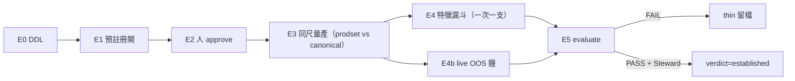

# 往「證明能賺錢」——經濟確立路徑計畫書（2026-08-17）

> **一句**：照實寫 dead／thin 是揭露；預測公式仍是橫斷面相對強弱。本檔只回答：**怎樣才算「已經證明能賺錢」**、現在差哪幾塊、差多少時間、以及每一步准做／不准做。  
> **位階**：[I]；不創 [N]；**不**把任何窗塗成 `established`；**不**放寬 DSR 95%；**不**復活 H20；**不**假 B3；**不** promote／sim-apply。  
> **本檔＝計畫**。**已採納**（`ECON-PROVE-EDGE-PLAN-R17-ADOPTED-20260817.md`）。採納 ≠ 開工。開工另貼分階 GO。  
> **導讀（約 30 分）**：§0（2）→ §1（5）→ §2（5）→ §3（4）→ §5（6）→ §8（8）。§6／§7＝開工時查表。§4／§9＝防自欺。

---

## §0 三十秒

**「能賺錢」在 augur 不是 IC、不是 hit-rate、不是某一天的相對名單、也不是 `p_beat_median`。**  
它是：凍結好的一格（家族 × 窗 × 構建 × 成本 × 宇宙 × 特徵來源），在**扣台股來回成本之後**，淨報酬仍優於**同樣扣成本的等權基準**，且這份優勢在**機械計數的多重比較（DSR）**下達到 95% 統計確立，再由 Steward **親核**才准把 `econ_verdict_rule` 改成 `established`。

LIVE（親查 2026-08-17）：

| 尺 | 現況 |
|---|---|
| 價頂 | PriceAdj TAIEX **2026-08-14** |
| 日常出門 | RankRidge **H20＋H60**＠08-14；core N=**286** |
| H20 | `dead`（短窗成本吃掉邊際；seed＝`short_horizon`） |
| H60 | `thin_unestablished`（in-sample 曾有正邊際，**未確立**） |
| 其餘 H_TRACK | `thin_unestablished`（多數從未做完整 #14 死／立裁決） |
| 試驗帳本 | `trial_ledger` **32 列**、SOP-strict N=**16**、最後一筆 **2026-07-13** |
| 凍結再驗證 | `ridge_H60_LO`／asof_incumbent：net Sharpe **1.197**、DSR **0.756**、T=**25**（2026-07-09） |
| 廣宇宙同格 | net **1.002**、DSR **0.577**（更誠實、更沒過） |
| 現役特徵 | prodset **active＝3**（emit 熱路徑）；`feature_values`＠08-14＝**37** 欄 |
| 確立閘表 | **尚不存在**（本計畫要建；未建＝不可 evaluate） |

**結論**：現在兩窗都還不夠格被當成「已經證明能賺錢」。往證明走，靠的是**先凍賭注 → 同一把尺量現役路徑 → 停付無效 N → 用特徵與時間抬真實 T／SR**——不是換標籤、不是換模型族、不是把日常出門改成八窗。

---

## §1 「能賺錢」的定義（本計畫唯一合法口徑）

靈魂／#14 已寫死。本節把它收成**可證偽的一格**，避免「賺錢」四個字滑向別的尺。

### 1.1 是什麼

給定 as-of 日 t、持有 H 個**交易日**，用 RankRidge 對核心宇宙做**橫斷面相對排序**，組 **long-only** 投組（預設 top 10% 等權），持有至 t＋H，扣**台股來回成本**（手續費雙邊＋證交稅；地板 **0.585%**，未計折讓、未計衝擊），對比**同一宇宙、同一再平衡、同樣扣成本的等權基準**。

通過＝同時成立：

1. **經濟**：投組淨 Sharpe **>** 基準淨 Sharpe，且淨超額 > 0（gross 好看不算）。  
2. **統計**：Deflated Sharpe Ratio **≥ 0.95**；計算住 `augur.evaluation.deflation`／`metrics.deflated_sharpe`；**per-period**（禁年化配 √(T−1) 的舊 bug）；N 由 `trial_ledger` **機械 DISTINCT**，禁人手填。  
3. **壓力**：成本改 **1.5×（0.8775%）** 後，淨仍優於基準（平坦 0.585% 是樂觀上界）。  
4. **雙宇宙**：`asof_incumbent`（在位核心）與 `pit_broad`（當時可算廣宇宙）**都過**——只過在位宇宙＝incumbency，不是用戶可交易宇宙。  
5. **現役路徑**：`feature_source=prodset`（現在 active∩覆蓋＝**3 欄**）必須過。canonical 研究尺只能當對照，**不能**單獨把 live 產品塗綠。  
6. **活樣本外**：閘凍結日之後，至少 K 個**非重疊**已實現持有期，淨仍優於基準（K 見 §5；日曆時間不可用重疊日頻灌 T）。  
7. **人裁**：AI／腳本 **不得** `UPDATE econ_verdict_rule … established`。只准 `evaluate` 出 `evaluated_pass` 快照，Steward TTY 才改規則表。

### 1.2 不是什麼（滑尺即自欺）

| 常被誤當成「賺錢」的東西 | 為什麼不夠 |
|---|---|
| RankRidge 分數／八窗相對強弱名單 | 排序單位，**不是**報酬％ |
| `p_beat_median` | P(勝過同儕中位數)；與賺賠無關 |
| `p_mkt`／`p_up`／DailyLogit hit | 另一軸；方向 GATE ≠ #14 |
| IC／HAC Eff-t | 排序預測力；#14 前一關，不是終關 |
| 某一 as-of 的 top 10 後來漲了 | 單期軼事；可被成本與基準吃掉 |
| in-sample 淨 Sharpe ~1.20 | 已證明 **point estimate 曾為正**；DSR 未過＝未確立 |
| sim `--apply` 帳面 | 禁；不是證據 |
| 把 standing 改成八窗 | 產品殼，不是經濟證明 |
| 把 thin 改寫成 established | 塗綠；敵③ |

### 1.3 與 dead／thin／established 三態

`econ_verdict_rule.verdict` 閉集只有三個字。語意：

| 態 | 意思 | 現況 |
|---|---|---|
| **dead** | 已做 #14，這格在成本後站不住；**預設不再花 N 救它** | **H20** |
| **thin_unestablished** | 尚未確立——或 evidential 不足、或曾有正邊際但 DSR／宇宙／現役路徑未過 | H5／10／40／**60**／90／120／240 |
| **established** | §1.1 全過 **且** Steward 親核改表 | **零窗** |

H60＝thin **不是**「沒 edge」。07-08 裁決原文：edge 的點估計為正，**顯著性未達確立**（promising-not-proven）。本計畫的工作是把這句話變成可過／可再判死的賭注，不是把它講成已經能交易。

---

## §2 現況誠實帳（為何現在證明不了）

### 2.1 已經知道的終關

| 來源 | 格子 | 數字 | 裁決 |
|---|---|---|---|
| `augur_prediction_stageCD_economic_verdict_20260706.md` | Ridge H20 LO | 扣 0.585% 後扛不住 vs EW | **dead**（短窗換手） |
| 同系列 H60 LO | 當時像唯一扛得住的 cell | 後被 deflation／survivorship 拉回 | 不能當 tradable |
| `augur_prediction_deflation_verdict_20260708.md` | Ridge H60 LO since2014 | 年化淨 Sharpe ~**1.20**；DSR **75.6%**（N=16）～**89.5%**（N=8）；皆 **<95%** | 未確立 |
| `augur_prediction_survivorship_economic_verdict_20260708.md` | 同格 pit_broad | 淨 Sharpe **1.00**（−16.5% vs 在位） | 真實可交易宇宙更弱 |
| `revalidation_baseline`（凍 2026-07-09） | `ridge_H60_LO` asof_incumbent | DSR **0.756**／T=25／超額 Sharpe 0.435 | 機器可查的地板 |
| 同上 H120 LO | DSR **0.936**／T=14 | 更接近、仍沒過；樣本更小 | 次格，不搶主格 |

帳本與後來口頭錨的分家（已知、不在本計畫偷修）：`trial_ledger` 仍停在 07-13 的 **1.1972**；P2 換手口徑曾把 headline 改到 **1.1302**；治權簽過 **1.1321**。三個數字**並記**。本路徑 **不以「挑一個好看的 Sharpe」當確立**；確立只認 §5 凍結格＋當次 `econ_eval_run` 快照。

### 2.2 現役產品 ≠ 當年研究尺

| 層 | 研究 headline（2026-07） | LIVE emit（2026-08-14） |
|---|---|---|
| 模型 | Ridge ≡ RankRidge ≡ `B2_ridge`（同組態） | RankRidge seed42 |
| 特徵 | canonical ~34 | **prodset 3** |
| 窗 | 研究掃 20／40／60／120 | 日常只出 **20、60** |
| 經濟標籤 | 報告／baseline 表 | `prediction_probability.econ_verdict` 硬綁 |

因此：**就算 34 欄研究尺的 H60 將來 DSR 過了，3 欄現役路徑沒過，仍不得對用戶說「這套名單已證明能賺錢」。**  
P1 的第一槍就是把這句話量出來——不是猜 3 欄「應該也差不多」。

### 2.3 時間與檢定力（這才是真正的瓶頸）

H60 非重疊理論上限 `NONOVERLAP_N[60]=71`（全史尺度）。實際用過的 headline T=**25**（since2014 非重疊再平衡）。√(T−1)=√24 主導 DSR——樣本小，**過 95% 天生難**。

LIVE 出門＠**2026-08-14** 的第一筆 H60 **實現報酬**，要等價格蓋過 tip＋**60 個交易日**（約 2026-11 中旬，視交易曆）。那只是 **T_live＝1**。  
用重疊的每日名單灌成 T=71／213＝自欺。M23 已寫：tip＋N 未蓋滿前，不做「已實現賺錢」研究。

**誠實時間線**：本計畫在 2026-08 能做的，是把賭注與尺子裝好、停止無效搜尋、讓現役路徑被量到。  
**「established」若會發生，是季～年的事，不是本週的事。** 本檔不承諾日期。

### 2.4 方向閘不是本路徑

`dgate_H_*` 賭的是**絕對走向機率**（hit / Brier / ECE）。H20／40／120 已 `evaluated_fail`；H5／10／60／90／240 是 **preregistered draft**。  
**禁**把 dgate 評過／沒過當成 #14 能賺錢。本路徑另立 `econ_establishment_gate`（`egate_*`），兩表禁止互改。

---

## §3 期望值：哪裡才有機會抬「真能過」

沿用已認可的三軸排序（`taiwan_alpha_improvement_plan_20260717`）：**資料 > 投組構建 > 模型方法**。

| 軸 | 對確立的作用 | 本路徑怎麼用 | 禁 |
|---|---|---|---|
| **資料／特徵** | 唯一能同時抬 SR_obs、且不靠挑 config 的正路 | 三鏡頭漏斗，一次一支，死即停；抵 #14 才准付 N | 候選直寫 `feature_values`；一次多支混進 prodset |
| **構建** | 換手／進出場帶／成本時點，常被低估 | **最多一記預註冊變體**（付 1 次 N） | 掃 top 10/20/30 × equal/pred 再挑最大 |
| **方法** | RankRidge 已是冠軍家族 | **凍結 RankRidge**；挑戰者保持 no-promote | 重掃 0812 六族、換 GBDT 當 headline |
| **時間** | 唯一乾淨的 √T | 從 08-14 出門開始記 live OOS 鐘 | 重疊窗、未實現就報「已賺」 |
| **搜尋次數 N** | N 越大 SR_0 越高、DSR 越難過 | **停付** H20／新模型族／未過漏斗的經濟掃 | 為了「看看」把 grid 寫進 `trial_ledger` |

關鍵算術（方向，非現編新閾）：每多搜一個 config，DSR 的門檻往上走。07-08 在 N=8 已 89.5%、N=16 只 75.6%。**再開八窗經濟 grid、再開挑戰者，是在把確立推遠。**

H20：已 dead。本路徑 **零預算救短窗**。日常出門可繼續掛 dead 揭露（產品預設 20,60 ≠ 兩窗都過 #14）。

H5／H10：比 H20 更短，成本更兇；**不排入確立主路徑**。保持 thin，直到有**另句** GO 立它們自己的閘（預設不立）。

H40／H90／H120／H240：次格。H120 曾較接近（DSR 0.936）但 T=14。主路徑鎖 **H60**；次格要立閘必須另 `egate_H_<h>_…`，禁止「H60 過了就順便塗」。

---

## §4 硬門（寫進計畫就不准用執行偷渡）

```text
FZ/GATE-keep | no-fake-B3@08-15/16/17 | no-promote | no-SIM-apply | no-relax-DSR-95
| no-paint-established | no-revive-H20 | no-8H-standing-as-proof
| no-evaluate-dgate-draft | prodset-must-pass | dual-universe
| freeze-criteria-before-eval | N-mechanical | per-period-DSR
| score／p_beat／p_mkt／p_up ≠ 報酬％
| AI 不得 UPDATE econ_verdict_rule → established
```

Steward 若要改 §5 任一門檻：**必須在該閘仍是 `preregistered` 時改**。一經 `approved`，criteria 變更＝挪門柱，trigger 拒；只能另立新閘、舊列 `superseded`。

---

## §5 確立閘判準草案（採納後仍可改；一經 approve 凍結）

建議第一閘（主格）：

`egate_H_60_ridge_LO_prodset_r17`

### 5.1 凍結細胞

| 鍵 | 值 | 為什麼鎖死 |
|---|---|---|
| `family` | RankRidge ≡ `B2_ridge` ≡ ledger `ridge` | 與 live／研究同組態（`models/ranker.py`） |
| `horizon` | 60 | 唯一有完整 #14＋DSR 史的主格 |
| `side` | long-only | 空方已因借券成本淘汰；ledger `LS` 不得當 headline |
| `top_frac` | 0.10 | 與 `trial_ledger`／deflate 預設同 |
| `weight` | equal（ledger 記 `LO`） | 不掃 pred 加權來抬分 |
| `cost` | 0.00585（壓力 0.008775） | `COST_TW`；禁 `run_backtest` 預設 0 |
| `sample_since` | 2014-01-01（主）＋ 2021-01-01（穩健，**兩段都要過**） | 禁止只報較好的那段 |
| `universe` | `asof_incumbent` **且** `pit_broad` | 07-08 已證明只報在位會偏高 |
| `feature_source` | **prodset**（現役） | live 證明；canonical 只對照、不入本閘 AND |
| `until` | 閘 approve 當日可得之最後**已實現** panel（label 必須已可算） | 禁用未實現的 08-14 之後 H60 |
| `nonoverlap` | 與 `run_economic_eval._nonoverlap` 同公式 | #12 |
| `seed` | 42（Ridge 確定性；不開多 seed 假 T） | 多 seed 是 GBDT 的事 |
| `dsr_min` | **0.95** | 不放寬 |
| `n_source` | `trial_ledger` SOP-strict DISTINCT `(model,horizon,top_frac,weight,feats_hash,cost)` | 禁手填；本閘每次付 N 的寫入必須可追溯 |
| `live_oos_k` | **4** 個非重疊已實現持有（自閘 freeze 後的**出門 as-of** 起算） | 約一年量級；不到 K 即使歷史 DSR 碰巧過也**暫緩**改表 |
| `fail_path` | `evaluated_fail` 留檔；verdict **保持 thin**；禁刪列 | 與 direction_gate 同精神 |

`live_oos_k=4` 是**額外必要條件**，不是拿 4 期去替代歷史 T=25。歷史 DSR 仍要過。4 期 live 本身幾乎不可能單獨把 DSR 從 0.76 抬到 0.95——所以主升力仍是 **SR_obs（特徵）＋停止無效 N＋時間**。

### 5.2 AND 機械式（evaluate 腳本寫死）

```text
PASS 僅當：
  net_sharpe(prodset, since2014, incumbent) > bench_sharpe(...)
  AND 同上 pit_broad
  AND 同上 since2021 兩宇宙
  AND dsr(per-period, N=ledger) >= 0.95   -- 主格 since2014 incumbent；broad 另報不得藏
  AND 1.5x cost 後 incumbent since2014 仍 net>bench
  AND live_oos 已實現非重疊期數 >= 4 且該子集 net>bench
  AND criteria_sha 未變
否則 FAIL → evaluated_fail，econ_verdict_rule 不動。
```

`evaluated_pass` **仍不改** `econ_verdict_rule`。改表另一步：

```text
E5-verdict-go | horizon=60 | established | approved-by=<Steward>
```

無這句，最高只停在閘列 `evaluated_pass`。

### 5.3 Steward 可在 preregister 階段改的拍板點（本檔不代裁）

1. `top_frac` 要不要改 0.20（改了＝與 07-13 ledger 主格不同，**另算一記 N**）。  
2. `live_oos_k` 要 4 還是更嚴（更嚴＝更晚才能改表；更鬆＝本計畫反對，須明示）。  
3. 是否要求 canonical **同時**過（雙路徑）。預設**只要 prodset**（產品誠實）；canonical 當對照。  
4. 是否允許 H120 立第二閘（另 GO；不自動）。  
5. 成本壓力要用 1.5× 還是再加「T+1 開盤成交」口徑（後者屬 P7，須另 plan）。

---

## §6 表 schema（尚未建；E0 才 DDL）

原則：鏡射 `direction_gate`（先凍→人准→evaluate；挪門柱 trigger；終態留檔）。**不**復用 `direction_gate` 列——那是另一軸。

### 6.1 `econ_establishment_gate`（新）

```sql
CREATE TABLE econ_establishment_gate (
  gate_id          text PRIMARY KEY,           -- egate_H_60_ridge_LO_prodset_r17
  horizon          integer NOT NULL,
  family           text NOT NULL,              -- RankRidge
  purpose          text NOT NULL,
  criteria         jsonb NOT NULL,
  criteria_sha     text NOT NULL,
  status           text NOT NULL DEFAULT 'preregistered'
                   CHECK (status IN ('preregistered','approved','evaluated_pass',
                                     'evaluated_fail','superseded')),
  preregistered_at timestamptz NOT NULL DEFAULT now(),
  approved_by      text, approved_at timestamptz,
  evaluated_at     timestamptz,
  result_snapshot  jsonb,
  evaluation_ref   text,                       -- reports/ 路徑
  git_sha          text NOT NULL,
  note             text,
  CONSTRAINT chk_eg_horizon CHECK (horizon = ANY (ARRAY[5,10,20,40,60,90,120,240])),
  CONSTRAINT chk_eg_approved_signed CHECK
    (status NOT IN ('approved','evaluated_pass','evaluated_fail')
     OR (approved_by IS NOT NULL AND approved_at IS NOT NULL))
);
-- trigger：非 preregistered 禁改 criteria；狀態白名單同 direction_gate；
-- evaluated_* 禁改 result_snapshot；禁刪非 preregistered。
COMMENT ON TABLE econ_establishment_gate IS
  '#14 經濟確立賭注載體：判準先凍→人 approve→evaluate；'
  'evaluated_pass ≠ 已改 econ_verdict_rule；AI 禁寫 established；唯記錄面、不進預測管線';
```

### 6.2 `econ_eval_run`（新，只追加）

```sql
CREATE TABLE econ_eval_run (
  run_id           bigserial PRIMARY KEY,
  run_at           timestamptz NOT NULL DEFAULT now(),
  run_kind         text NOT NULL CHECK (run_kind IN ('research','establishment')),
  gate_id          text,                       -- research 可空；establishment 必填
  feature_source   text NOT NULL CHECK (feature_source IN ('prodset','canonical')),
  model            text NOT NULL,
  horizon          integer NOT NULL,
  top_frac         double precision NOT NULL,
  weight           text NOT NULL,
  cost             double precision NOT NULL,
  sample_since     date NOT NULL,
  universe         text NOT NULL,              -- asof_incumbent / pit_broad
  n_periods        integer,
  periods_per_year double precision,
  net_sharpe       double precision,
  bench_sharpe     double precision,
  net_excess       double precision,
  avg_turnover     double precision,
  dsr              double precision,
  n_trials         integer,                    -- 當時 ledger DISTINCT
  panel_hash       text,                       -- 與 run_economic_eval 同尺自證
  paid_n           boolean NOT NULL DEFAULT false,
  git_sha          text,
  note             text
);
-- 無 UPDATE 業務路徑；research 預設 paid_n=false（不寫 trial_ledger）。
```

### 6.3 既有表（不改欄義；本路徑只讀或受控寫）

| 表 | 本路徑角色 |
|---|---|
| `econ_verdict_rule` | **唯 Steward E5** 可把 H60 thin→established；日常 emit 讀此硬綁機率列 |
| `trial_ledger` | DSR 的 N；僅 `run_kind=establishment` 或明示 `--pay-n` 才 INSERT |
| `revalidation_baseline` | 07-09 地板；不覆寫；新快照進 `econ_eval_run` |
| `evolution_production_feature_set` | prodset 現役清單；晉升另走特徵漏斗，**不是**本閘 evaluate |
| `feature_candidate_values` | 候選隔離；禁直寫 `feature_values` |
| `prediction_values`／`prediction_probability` | 出門產品；確立閘**零回寫** |
| `direction_gate` | 禁止本路徑 evaluate／approve |

H20 的 `dead` **不**經本閘翻面。若未來要復活短窗，必須另 `egate_H_20_revival_*`，且門檻**不得低於** H60 主閘（已判死的格子更嚴，不是更鬆）。預設不立。

---

## §7 Python／腳本對映（尚未寫；E0 起才落地）

### 7.1 既有（本路徑重用，不平行重寫 DSR）

| 路徑 | 職責 |
|---|---|
| `src/augur/evaluation/portfolio.py` | 選股＋回測＋成本；`run_backtest` 與 live 選股同位 |
| `src/augur/evaluation/deflation.py` | per-period DSR 編排 |
| `src/augur/evaluation/metrics.py` | `deflated_sharpe` 公式 SSOT |
| `src/augur/evaluation/baseline.py` | canonical／prodset 特徵解析 |
| `src/augur/models/ranker.py` | RankRidge ≡ B2_ridge |
| `src/augur/core/prodset_contract.py` | active∩覆蓋；空集 fail-closed |
| `src/augur/core/closed_horizons.py` | H_TRACK、NONOVERLAP_N、CAL_DAYS |
| `scripts/run_economic_eval.py` | 研究掃格（stdout）；**預設不寫 ledger** |
| `scripts/deflate_headline_verdict.py` | 既有 DSR 裁決器；確立評估應呼叫同一庫 |
| `scripts/verify_candidate_promotion.py` | 特徵漏斗 as-of／HAC／多 seed 增量 |
| `scripts/preregister_direction_gate.py` | **樣板**（approve TTY／sha）；不拿來評 dgate 草稿 |

### 7.2 計劃新增（採納＋E0 GO 後才建）

| 路徑 | 職責 | 指令矩陣（計劃） |
|---|---|---|
| `scripts/migrate_econ_establishment_ddl.py` | 冪等建表＋trigger | 無參＝唯讀現況；`--run`；`--verify` |
| `scripts/preregister_econ_establishment_gate.py` | 寫入 §5 criteria＋sha | 無參＝清單；`--preregister`；`--approve GATE --approved-by …`（TTY）；`--check` |
| `scripts/run_econ_establishment_eval.py` | 只跑**凍結細胞**；寫 `econ_eval_run`；establishment 才 `--pay-n` | `--kind research` 預設；`--kind establishment --gate …` 須已 approved |
| `scripts/evaluate_econ_establishment.py` | AND §5.2；改閘 status；**不改** verdict 表 | `--check GATE`；`--evaluate GATE` |
| `scripts/report_live_oos_clock.py` | 從指定 as-of 起數「已實現非重疊 H 期」 | 唯讀；未蓋滿 → 印 WAIT，不編報酬 |

端點：**無 HTTP**。本路徑是本地 DB＋CLI。顧問層只**讀**既有 `econ_verdict`，不因本計畫新開 API。

組件邊界：PIPELINE／B3 **不** import 確立閘。確立是記錄面。出單繼續 standing 20,60，H20 繼續死標籤。

---

## §8 五階段工作包（逐步；每包一張 GO）



### Phase E0｜DDL（可先；須 GO；零經濟數字）

**可先**：不等 08-17 價、不碰 B3。  
**做**：`migrate_econ_establishment_ddl.py --run`＋`--verify`。  
**不做**：preregister 以外的 evaluate；不改 `econ_verdict_rule`。  
**驗收**：兩表存在；trigger 拒「改已核准 criteria」的突變測試；`direction_gate` 列數不變。  
**狀態（2026-08-17）**：🟢 EXECUTED — `audits/ECON-EGATE-DDL-EXECUTED-20260817.md`（閘表空；E1 才預註冊）。

```text
WHEN: Steward 貼 E0-ddl-go
DO:   python3 scripts/migrate_econ_establishment_ddl.py --run && --verify
DONT: evaluate; UPDATE econ_verdict_rule; 動 dgate
DONE: audits/ECON-EGATE-DDL-EXECUTED-*.md
```

### Phase E1｜預註冊主閘（須 GO）

把 §5 JSON 寫入 `egate_H_60_ridge_LO_prodset_r17`，status=`preregistered`。  
Steward 若改拍板點，改 JSON **之後**再算 sha。  
**驗收**：`--check` sha 覆算一致；H20／其他窗 **零列**。  
**狀態（2026-08-17）**：🟢 EXECUTED — `audits/ECON-EGATE-E1-EXECUTED-20260817.md`（sha=`1ed91ef5d57c700f`；status＝preregistered）。

```text
WHEN: E0 閉 + E1-preregister-go
DO:   python3 scripts/preregister_econ_establishment_gate.py --preregister
DONT: --approve（人核另句）; 順便立 H20/H5/H10
```

### Phase E2｜人核准（TTY；AI fail-closed）

```text
WHEN: Steward 貼 E2-approve-go | gate=egate_H_60_ridge_LO_prodset_r17 | approved-by=<名>
DO:   python3 scripts/preregister_econ_establishment_gate.py --approve … --approved-by …
DONT: AI 代簽; 核准後改 criteria
```

核准後才准跑 `run_kind=establishment`。核准前只准 `research` 且 **paid_n=false**。  
**狀態（2026-08-17）**：🟢 EXECUTED — `audits/ECON-EGATE-E2-EXECUTED-20260817.md`（hugo TTY＠08:57:49+08；sha=`1ed91ef5d57c700f`）。

### Phase E3｜同尺誠實量產（須 GO；**不改 verdict**）

目的：量「現役 3 欄 prodset × RankRidge × H60 LO」相對 canonical 對照，寫 `econ_eval_run`。  
**預設不付 N**（`--kind research`）。若 Steward 明示這次要算進 DSR 的 N，才 `--pay-n`（建議：**等閘已 approved 的 establishment 那一次才付**，避免研究掃污染 N）。

對照矩陣（固定細胞，不是 grid）：

| 跑 | feature_source | since | universe |
|---|---|---|---|
| A | prodset | 2014 | incumbent |
| B | prodset | 2014 | pit_broad |
| C | prodset | 2021 | incumbent |
| D | prodset | 2021 | pit_broad |
| E–H | canonical | 同上四格 | 對照，不入 AND |

`--until` 釘在**最後已實現 H60 label** 的 panel（08-14 的 H60 label 要到約 11 月才存在——**E3 歷史段用已可算的 until，不得把 08-14 未實現段算進淨值**）。

**驗收**：八跑 `panel_hash` 可重現；報告只准寫「prodset 現役路徑淨值／DSR＝…」；**禁止**「因此改為 established」。  
**狀態（2026-08-17）**：🟢 EXECUTED research — `audits/ECON-EGATE-E3-EXECUTED-20260817.md`；讀數 `reports/augur_econ_e3_measure_r17_20260817.md`。until＝2026-04-30。現役 2021 在位淨≤基準；DSR≈0.57。**未** evaluate。  
若 prodset 淨 ≤ 基準：這就是 live 產品的誠實答案——後面特徵漏斗變成**必要**，不是可選。

```text
WHEN: E3-measure-go | kind=research | no-pay-n | no-verdict
DO:   python3 scripts/run_econ_establishment_eval.py --kind research --h 60 --top-frac 0.1 …
DONT: grid top/weight; 寫 trial_ledger; 塗綠; 用未實現 until
```

### Phase E4｜特徵漏斗（資料軸；與 E4b 並行；須逐支 GO）

方法論 SSOT：`reports/augur_feature_discovery_methodology_20260626.md`。  
漏斗（與 07-17 Phase 1 同尺，**判準零改動**）：

0. 預診：max |median ρ| < 0.6 vs 現役／canonical；過不了＝放棄、留墓碑、**不付 N**。  
1. 建值：只寫 `feature_candidate_values`。  
2. as-of rank IC vs H60 label；顯著性＝**HAC Eff-t** |t|≥2（禁 iid）。  
3. 去相關。  
4. 加入後 vs 不加的 RankRidge IC 增量，方向穩。  
5. **才**准 #14：同 §5 細胞、有／無該特徵兩跑；Δ 淨 Sharpe 預註冊閾沿用既有「有感」精神（`verify_economic_reexam` 之 +0.05 為舊 print 級——本路徑升格為 **預註冊明文**，值不變、**非新值**）。不過＝死、staging 清、不入 prodset。

一次一支。D2／D3 名維度已多死，新候選必須「角度新」條款（計畫書 C-M3），否則期望值低、仍可做但優先級低。

**E4 短名單（2026-08-17 EXECUTED）**：canonical∖prodset＝31；就緒 5；第一支 **`range_mean_20d`**。  
**E4-feat `range_mean_20d`（2026-08-17 EXECUTED）**：**死於 (0) 預診**，vs `volatility_60d` ρ=0.901。  
**E4-feat `dividend_yield`（2026-08-17 EXECUTED）**：**死於 (0)**，vs `pe_ratio` ρ=0.616（不放寬）。  
**E4-feat `sbl_short_balance_log`（2026-08-17 EXECUTED）**：**死於 (0)**，vs `turnover_mean_20d` ρ=0.758。就緒 5 **耗盡**（三死、pe／margin 勿送）。3＋1 canonical 路徑停。讀 `reports/augur_econ_e4_feat_sbl_short_balance_log_r17_20260817.md`。下一槍須新角度或 E4b，另句。仍 no-promote、no-pay-n、不放寬 0.6。

過 #14 的候選 **另句** `PROMOTE-feat-go` 才進 `evolution_production_feature_set` active——這與模型 no-promote 是不同門；預設仍 no-promote，避免「特徵晉升」被做成默默換產品。

### Phase E4b｜live OOS 鐘（從 08-14 出門起算；不可加速）

**狀態（2026-08-17 EXECUTED）**：clock＝**WAIT**；already_realized_nonoverlap＝**0**；next_due_date＝**2026-11-13**。讀 `reports/augur_econ_e4b_clock_r17_20260817.md`。未編報酬。H20 第一筆出場投影 2026-09-14，只披露。交易日曆只到 2026-12-31，第 2 期起出場無法精算。K=4 ≈ 2027 年中。

```text
WHEN: 任意（可先、唯讀；可重讀）
DO:   python scripts/report_live_oos_clock.py --origin 2026-08-14 --h 60
DONT: 價未蓋滿卻算實現報酬; 把每日重疊當獨立 T; 用 08-15/16/17 當 as-of
DONE: 印 already_realized_nonoverlap / next_due_date / WAIT
```

### Phase E4c｜構建（可選、低優先、另 GO）

最多一記：例如 hysteresis `exit_frac`（已有 `build_long_portfolio` 參數）。  
必須在跑前寫進**新閘**或同一閘仍 `preregistered` 的 criteria。已 approve 的主閘**不准**事後塞構建維度（那是挪門柱＋偷加 N）。預設：**主閘不含構建搜尋**。

### Phase E5｜evaluate ＋（可選）改 verdict

```text
WHEN: E2 已准 + E3 有 establishment 快照 + live_oos_k 達標
      + Steward 貼 E5-evaluate-go
DO:   python3 scripts/evaluate_econ_establishment.py --evaluate egate_H_60_ridge_LO_prodset_r17
DONT: 沒達 K 硬評; FAIL 卻改 verdict; PASS 自動 UPDATE econ_verdict_rule
```

PASS 之後若要改表：

```text
E5-verdict-go | horizon=60 | from=thin_unestablished | to=established | approved-by=<Steward>
```

FAIL：閘＝`evaluated_fail`，H60 **維持 thin**，寫墓碑報告。可另立 r18 閘（新 sha），舊列 superseded——**禁止**在舊閘上改門檻重跑。

---

## §9 時間與「現在可先」

視點 2026-08-17 上午：市場主軸仍是 **M1b WAIT**（PriceAdj≥08-17 才 B3）。本路徑**不是**取代心跳。

| 現在（無 08-17 價也可） | 不要現在做 |
|---|---|
| 採納本計畫 | 跑 `run_economic_eval` grid 並寫 ledger |
| E0 DDL（有 GO） | evaluate 主閘（表都還沒建、也還沒 freeze） |
| 文件：prodset 3 vs canonical 37 的落差說明 | 把 H60 塗 established |
| live OOS 鐘的規格（E4b 腳本） | 用 08-15／16／17 當 as-of |
| | 救 H20、立 H5／H10 確立閘 |
| | 評 dgate 草稿、promote、sim-apply |

**與 M23 的關係**：M23＝「tip＋N 實現報酬研究」。E4b 是它的機械鐘。價未蓋滿 → 研究禁開，鐘可以先掛上。

---

## §10 與既有計畫的邊界

| 檔 | 關係 |
|---|---|
| r17 執行板 | 本檔＝其 **M28**；開工順序仍以執行板為準；本檔管 #14 確立 |
| r16 心跳 | 契約仍有效；B3 仍 20,60；確立閘**不**改 standing |
| `taiwan_alpha_improvement_plan_20260717.md` | 抬 edge 的 D/P/M 總計畫；本檔是其中 **#14 證明門** 的可執行化。不重做已全滅的 D2/D3 七支 |
| 特徵方法論 20260626 | E4 漏斗的思想 SSOT |
| deflation／survivorship 20260708 | 地板數字；本檔不重寫公式、不放寬 95% |
| `direction_gate` | 不同軸；本檔零 evaluate |

衝突時：**確立數字以本檔 §1／§5 為準**；日常出單與可先／可同步以 r17 執行板為準。

---

## §11 採納與分階口令

**已採納**（2026-08-17 08:48+08）：`audits/ECON-PROVE-EDGE-PLAN-R17-ADOPTED-20260817.md`。  
本 adopt **不含** DDL／量產／evaluate／改 verdict。

採納原文（已貼）：

```text
ECON-PROVE-EDGE-R17-adopt | freeze-criteria-first | H60-primary
| no-paint-established | no-revive-H20 | no-relax-DSR | no-fake-B3 | no-promote
```

之後逐步（每張另貼，不預設連發）：

```text
E0-ddl-go
E1-preregister-go
E2-approve-go | gate=egate_H_60_ridge_LO_prodset_r17 | approved-by=<名>
E3-measure-go | kind=research | no-pay-n | no-verdict
E4-feat-go | candidate=<name> | isolation-table
E5-evaluate-go | gate=egate_H_60_ridge_LO_prodset_r17
E5-verdict-go | horizon=60 | established | approved-by=<名>
```

`range_mean_20d`、`dividend_yield`、`sbl_short_balance_log` 已死於 (0)。就緒 5 耗盡。勿送 pe／margin／波動族。勿放寬 0.6。

---

## §12 驗收（本計畫書本身）

- [x] 「能賺錢」有可證偽定義，且明示不是 dead／thin 兩個字  
- [x] LIVE 帳：H20 dead、H60 thin、ledger N=16／停 07-13、prodset＝3、確立表不存在  
- [x] 主格凍結；DSR 95% 不放寬；prodset 必過；雙宇宙；AI 禁改 verdict  
- [x] 表 schema ＋既有／新增 Python 對映  
- [x] 五階段工作包＋GO 文案＋驗收  
- [x] 時間誠實：established 以季～年計；11 月才可能有第一筆 live H60 實現  
- [x] 未執行經濟重算、未改 standing、未評 dgate、未 commit  
- [x] Steward 已採納；開工仍待分階 GO  

*完。[I] · adopted · 未開工 · 2026-08-17。*
