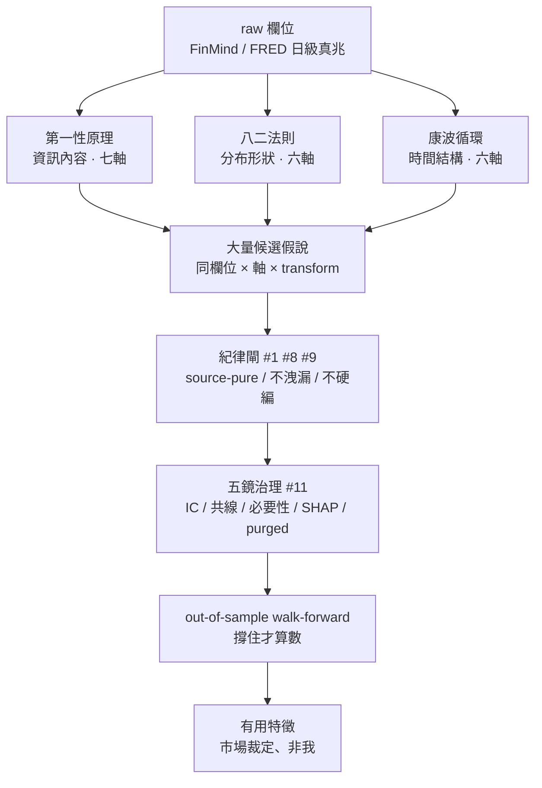

# augur 特徵發現方法論 — 三鏡頭 × 紀律漏斗（feature 作法 SSOT）

**性質**：方法論 SSOT。回答「**如何找出有用的特徵值**」——augur 後續一切特徵值產生之**唯一權威方法依據**。
**位階**：精神承靈魂（`docs/系統核心思想_v1.2.0.md`）、法律承原則精華（`#1`/`#8`/`#9`/`#11`/`#15`）、架構承憲章（`docs/系統架構大憲章` 第三部 feature 層**入憲承載 v1.10.0** 引用本檔）。本檔承載「特徵發現方法」之操作框架；憲章承載框架、本檔承載詳法（守憲章第六部 SSOT + 30 分鐘可讀）。
**前提**：核心股已選定、其資料**完整且精準**（PHASE 8 過 gate）。
**誠實鐵則（#15）**：本檔為**方法 / 計畫，非成果**——任何特徵之預測力，未經 walk-forward + 五鏡驗證前**皆為假說**。
**素材來源**：三份原始設計報告（第一性 `augur_feature_design_first_principles_20260612` ／ 八二 `augur_feature_design_pareto_thought_20260612` ／ 康波 `augur_feature_design_cycle_thought_20260612`）+ 執行藍圖（`augur_feature_execution_plan_20260626`）+ 評估實證（`augur_evaluation_M1_baseline_20260626`）之**收斂萃取**。

---

## 一、核心命題：一個方法、三種旋轉、一道漏斗

> **三鏡頭不是三套特徵，而是「同一批 raw 欄位」的三種旋轉視角；而「有用」不是設計出來的、是驗證活下來的。**

兩個對映的洞察：
1. **生成是發散的**（三鏡頭 × 軸 × transform 庫 → 海量候選假說）；**篩選是收斂的**（三道漏斗逐層淘汰）。發現有用特徵＝這兩股力量的接力。
2. 三鏡頭**吃同一批 raw 欄位、共用同一個 builder transform 庫**，差別只在「問哪個問題」——因此三者正交互補、不重複、工程合一。

---

## 二、母方法（四條母原則，凌駕三鏡頭之上）

任何鏡頭、任何特徵，都先服從這四條：

### 母原則 1 — 從預測目標逆推（一切的起點）
靈魂定義目標：給定 as-of 日 t，排序「誰未來 H 日**相對**強」（週/月/季/年多尺度）、**非預測絕對漲跌**。第一性分解：

> 未來相對報酬 ≈ f( ①價格慣性/反轉 ＋ ②真金白銀供需壓力 ＋ ③企業價值引擎變化 ＋ ④價格-價值缺口 ＋ ⑤公司行為訊號 ＋ ⑥環境制約 ＋ ⑦橫斷面結構位置 ) ＋ 不可知噪音

**特徵的存在理由＝佔據這個分解的某一項**。脫離分解的特徵是無源之水。

### 母原則 2 — 北極星三問當「生成前的入場券」
每個候選在生成前先過三問（任一「否」→ 連假說都不算、直接丟棄）：
- **有真實 API 源嗎？**（#1，否則假兆①假資料）
- **t 日當下真看得到嗎？**（#8，否則假兆②偷看未來——估值無 P-lag／財報需法定 lag／FRED Tier B 走 vintage／事件以公告日為錨）
- **對「相對強弱」有區分力假說嗎？**（否則是噪音、浪費特徵預算）

### 母原則 3 — 目標相對 → 特徵必相對化
目標是「相對強弱」，故原始絕對值**只是中間量**。真正入模的是：同日**橫斷面 rank / z**、**產業內 demean**、**自身歷史 percentile**。這是把「絕對訊息」翻成「相對座標」的強制步驟。

### 母原則 4 — 思想 ≠ 特定值（#9，萃取不變量、剝掉數字）
受 Pareto／康波等**思想**啟發，但**剝除一切特定值**——把每個思想的「數字」拿掉，只留可量化的「不變量」，數字交給樹自學分界。八二剝掉 `0.80/0.20`、康波剝掉 `40-60 年`；公式中**禁任何預測性閾值**（PER<15、ROE>15%、top-20%、N 年循環…）。

> **總綱（#15）**：母原則 1-4 管「生成」；但**有用＝驗證活下來**（第四節漏斗）。**是市場、不是我，決定哪個特徵有用**——設計階段一律以假說自居。

---

## 三、三鏡頭詳解

每個鏡頭做兩件事：**萃取思想不變量** → 翻譯成一個 #9 合規的 transform 家族。

### 3.1 第一性原理 — 問「**有什麼訊息**」（資訊內容 · 七軸）

把未來報酬分解的七項，逐項對映實證欄位 → 特徵族：

| 軸 | 內容 | 代表欄位 → 特徵族 | 類別 |
|---|---|---|---|
| ① 價格行為 | 市場已聚合的信念 | 還原價 close → log 報酬/動能/長短動能差（反轉）；高低開收 → 真實波幅/區間位置；量金額迴轉 → 量能 z/量價背離/Amihud；十年線 → 超長期均值回歸位置 | P |
| ② 資金流籌碼 | 真金白銀供需壓力 | 法人 buy/sell → 淨買超/流向 rolling/外資 vs 投信分歧；融資券 → 使用率/券資比/軋空壓力；借券 → 賣壓存量增量/費率；外資持股 → 變化/距上限；持股級距 → 大戶比/散戶人數；官股 → 護盤訊號 | P / E |
| ③ 企業價值引擎 | 基本面（P-lag、發布日 gate 鐵則）| 月營收 → YoY/MoM/3m 動能/創新高；財報三表科目 → margin/ROE/ROA/應計品質/capex 強度（比率＝會計恆等式、思想非預測值；禁「ROE>15% 才好」硬閾值）| P-lag |
| ④ 價格-價值缺口 | 估值水位 | PER/PBR/殖利率 → 三層相對化（vs 自身 252d percentile + 同日橫斷面 rank + 產業內 rank）；市值 → log size 因子；股利政策變化 | P |
| ⑤ 公司行為訊號 | 事件（真零語意、#7 PASS 前提）| 股利公告日（API 自帶公告時點！）/填息速度/鉅額折溢/處置股/停牌停券/新聞密度（**只用 count、禁文字情緒字典**）/減資分割 days-since | E |
| ⑥ 環境制約 | 全市場共同（context） | 大盤動能→beta/相對強弱；景氣領先指標；匯率/利率/期限利差；FRED（利差/政策/恐慌/美元/油，vintage 警語）；市場法人/融資情緒；恐懼貪婪 | X→context_values |
| ⑦ 橫斷面結構 | 相對化座標系 | 產業內 demean/rank（同業比較才是「相對強弱」正確座標）；上市櫃分群 normalize；下市股＝survivorship 宇宙基礎（非特徵）| R |

**transform 家族**：水位 / 動能 / 比率（log·diff·ratio·rolling）。

### 3.2 八二法則 — 問「**分布形狀本身是不是訊息**」（分布形狀 · 六軸）

**先剝掉 0.8/0.2，留下四個思想不變量**：
1. **不均是常態**——分布天然偏斜/重尾，少數單位貢獻多數結果。
2. **少數關鍵 vs 多數平庸**——資本/成交/報酬集中在少數。
3. **支配有慣性（馬太效應）**——強者恆強，領先者的 rank 有持續性。
4. **集中度本身會變**——集中⇄分散的「變化方向」是資訊（籌碼收斂＝有人收貨；市場寬度收窄＝少數股撐盤）。

**方法論轉譯**：不問「前 20% 是誰」（要切點、禁），改測「**分布有多不均、往哪變**」（連續泛函、合法）。

**#9 合規工具箱（全 cutoff-free）**：Gini / HHI(Σshare²) / Shannon entropy / max-share / CV·skew·kurtosis / rank·Δrank·rank 自相關 / breadth（高於自身 rolling mean 之比例）。

**六軸**：P1 持股集中（持股級距 Gini/HHI/Δ集中度）· P2 資金流集中（法人別 HHI/主導者更替）· P3 量能時間集中（窗內日量分布 Gini/max-share）· P4 報酬集中（\|日報酬\| Gini/skew/kurt：跳躍型 vs 漂移型動能）· P5 生意支配（營收佔產業 share 及動能、產業 HHI、P-lag）· P6 市場結構 regime（橫斷面 Gini/breadth/rank 自相關 → context + 馬太慣性）。

### 3.3 康波循環 — 問「**在循環哪裡、往哪走、各尺度是否同向**」（時間結構 · 六軸）

**先剝掉 40-60 年，留下五個思想不變量**：
1. **循環是常態且多尺度嵌套**——景氣/資金/盈餘/情緒以擴張⇄收縮往復，庫存/資本支出/信用/情緒循環同時疊加。
2. **位置（相位）比水位重要**——同一資訊在循環不同相位意義不同。
3. **領先-同時-落後結構**——指標對循環有時序角色；領先者轉向＝轉折前兆。
4. **轉折有前兆**——減速先於下降（二階導）、背離先於反轉（領先 vs 同時分歧）。
5. **多尺度共振**——週/月/季/年同向則放大、互斥則震盪。

**方法論轉譯**：不假設「循環多長」（禁），改測「**現在在自身循環的哪裡**」——相位/歷時/共振/背離全由**資料自身的 rolling 極值定義**、零固定週期。

**#9 合規工具箱（全 data-driven）**：range-position（x−rollmin)/(rollmax−rollmin) / time-since-extreme / drawdown·runup / momentum-of-momentum（減速度）/ 多尺度同向計分 / 背離量 / vol 期限結構（短窗 vol/長窗 vol）。視窗 5/20/60/120/252＝**觀察尺度**、非「循環長度」宣稱。

**六軸**：C1 景氣循環位置（領先指標多尺度動能/背離、`*_notrend` 純循環成分、context）· C2 個股價格相位（多尺度 range-position 向量/drawdown/動能減速度）· C3 基本面循環（Kitchin 庫存/Juglar 資本支出/margin 均值回歸相位，P-lag）· C4 資金流循環（累計淨流位置/吸籌派發相位）· **C5 跨尺度共振與跨域相位差（模型主菜：價×法人×營收同相分數、個股−產業−大盤相位差）** · C6 轉折偵測電池（二階導/背離/距極值歷時/breadth 惡化速度）。

### 3.4 三鏡頭＝同欄位三旋轉（統一性的證明）

| 同一 raw 欄位 | 第一性（訊息） | 八二（形狀） | 康波（時間） |
|---|---|---|---|
| **法人買賣 buy/sell** | 三大法人淨買比 | 各法人別淨買 HHI / 主導者更替 | 累計淨流 range-position（吸籌/派發相位）|
| **持股級距 HoldingSharesPer** | 大戶比 level | 級距 percent Gini / Δ集中度 | 集中度序列的循環位置 |
| **還原價 close** | 動能 momentum | 窗內\|日報酬\| Gini / max-share | 多尺度動能同向計分（共振）|
| **月營收 revenue** | YoY / MoM 動能 | 佔產業 share 及其動能（馬太）| YoY 的加速/減速（營收循環轉折）|

> 三族 transform 皆併入同一 builder transform 庫、吃共用 raw 欄位；落地順序依執行藍圖、存廢以五鏡裁決。

---

## 四、發現漏斗：從「候選假說」到「有用特徵」

生成只是開始。**「有用」要穿過四道漏斗**（逐層淘汰；第 4 道為入生產前強制提拔關卡）：

1. **紀律閘（過不了連測都不測）**：`#1` source-pure（算不出即缺列、不補值/不 zero-fill）→ `#8` anti-leakage（t 當下真可得）→ `#9` 不硬編（一律相對化、樹自學分界）。
2. **五鏡治理（#11，存廢唯一裁判）**：① 有號 IC + sign 穩定 ② 共線群 ③ leave-one-out 必要性 ④ ensemble SHAP ⑤ purged-CV——**不得單一指標（尤不得單看 gain）判生死**；「不顯影（SHAP≈0）且 ablation-safe」必移。
3. **out-of-sample walk-forward**：purged + embargo 切分；rank IC 撐住、半年重跑一致才算數（#15 可重現＝靈魂的成功定義）。
4. **提拔關卡（漏斗 4、入生產前強制；2026-06-27 入憲）**：候選通過五鏡寬篩**仍不得逕入生產**——須過完整提拔複核（`scripts/verify_candidate_promotion.py`），三項全過才提拔：
   - **(a) as-of 口徑**：用 `core_universe_asof`（point-in-time、消完整度 look-ahead）算 IC,**非** pan-historical（pan-hist 會高估,實證 inst_govbank_divergence pan-hist Eff-t 2.53 → as-of 1.67）。
   - **(b) 去相關 Eff-t（強制）**：IC 顯著性一律用 **Newey-West/HAC 去相關 t-stat**（`metrics.effective_t_hac`）、**禁裸用 iid `effective_t`**（重疊 label 窗致 IC 自相關、iid 高估顯著,#15/審查 G8）;`|HAC-t|≥2` 方算顯著。
   - **(c) 多因子增量 + 多 seed**：候選加入現有生產特徵集,run_ladder（≥3 seed、stochastic #15）之 Ridge/GBDT mean IC **須穩定為正增量**;Δ≤0 即冗餘（已被既有特徵涵蓋）、依 #11「ablation-safe 必移」**不提拔**。
   > **紀律精神（#15）**：寬鬆口徑（pan-hist / 單因子 / iid Eff-t）看似有潛力者,過此關卡常雙雙淘汰（實證 2026-06-27：pb_self_pctile_252d 單獨顯著但冗餘、inst_govbank_divergence as-of 不顯著 → 皆淘汰）。**撒更多網 = 多重檢定假陽性升（#11/審查 S5）;此關卡才是真價值,不是無限探索。** 淘汰結論一律 source-traceable 記錄（為何淘汰、#15）。

---

## 五、操作程序（可重複執行的步驟）

給任何一個 raw 欄位（或欄組），執行：

- **步驟 0 — 過北極星三問**（母原則 2）：真實 API 源？t 當下可得（含 lag/vintage/公告日判準）？對相對強弱有假說？任一否 → 丟棄。
- **步驟 1 — 三鏡頭各旋轉一次**（生成候選）：問「有什麼訊息（水位/動能/比率）」「分布形狀是不是訊息（Gini/HHI/entropy/max-share/rank 慣性）」「在循環哪裡、是否共振（相位/歷時/共振/背離）」。
- **步驟 2 — 相對化**（母原則 3）：橫斷面 rank/z、產業內 demean、自身歷史 percentile。
- **步驟 3 — 紀律 disqualify**（漏斗 1）：算不出即缺列（#1）、不洩漏（#8）、不硬編閾值（#9）。
- **步驟 4 — 五鏡 + walk-forward 淘汰**（漏斗 2/3）：留下的才叫「有用」。

**一個欄位走完全程的實例（法人買賣 buy/sell）**：
三鏡頭旋轉 → 淨買比（訊息）/ 各法人別 HHI（形狀）/ 累計淨流 range-position（時間）→ 相對化＝同日橫斷面 rank → 紀律＝算不出（<20 日/gross=0）即缺列 → 進五鏡看有號 IC 與 leave-one-out 必要性 → 撐住才留。

---

## 六、實證已知：哪些鏡頭已 paid off（#15，source＝`augur_evaluation_M1_baseline_20260626`）

PHASE 9 五鏡單因子 rank IC（H=60，已實作 27 特徵）：

| 特徵 | 鏡頭/軸 | rank IC | 裁定 |
|---|---|---|---|
| `cycle_position_252d` | 康波 C2 | **+0.088** | ✅ 有效 |
| `price_to_252d_high` | 康波 C2 | **+0.088** | ✅ 有效 |
| `pe_ratio` | 第一性 ④ | **−0.081** | ✅ alpha 主源 |
| `dividend_yield` | 第一性 ④ | **+0.079** | ✅ alpha 主源 |
| `monthly_revenue_yoy` | 第一性 ③ | +0.047 | ◯ 弱有效 |
| `volatility_20d` | 第一性 ① | −0.046 | ◯ 低波異象 |
| `pb_ratio` | 第一性 ④ | −0.045 | ◯ 弱有效 |
| `momentum_*`（全系列） | 第一性 ① | **<0.02** | ❌ 精英核心失效 |

**三條實證結論**：① **估值缺口（第一性④）＋循環位置（康波 C2）是目前 alpha 主源**；② **動能在精英核心失效**（同是第一性①，但此母體無區分力）；③ 共線嚴重（volume~turnover 0.96）→ 解釋 Ridge≈GBDT、非線性無增量。最強口徑 **as-of Ridge H60 rank IC +0.132 / 勝率 0.96**（4 組 as-of 全 > pan-hist → alpha 真實、非 survivorship 假象）。

> 這正印證母原則 4 的下半句：**設計再漂亮都是假說**——估值/循環鏡頭驗證有用、動能鏡頭在此母體驗證無用，由市場裁定。

---

## 七、紅線重申（特徵層的三敵人防線）

- **#1 Source-Pure**：算不出（歷史不足/除零/NaN/inf/虧損）→ **缺列**，不存 fake/不 zero-fill；E 類稀疏事件用**真零語意**（前提：該表 sync 完整至 as-of，「無列＝真無事件」才成立）。
- **#8 Anti-Leakage**：所有特徵純後向（≤t）；估值無 P-lag、財報需法定 lag、FRED Tier B 走 vintage、事件以公告日為錨；`build_universe_asof` 逐 t≤t 消 survivorship。
- **#9 思想≠特定值**：純 log/ratio/std/泛函；視窗用 calendar 慣例（5/20/60/120/252）；估值 raw 值入特徵不設硬閾值；流動性/集中度用**動態分位/連續泛函**非寫死值。**禁**：News 文字情緒字典、固定切點（decile/top-N%/大戶=N 張）、固定循環長度。

---

## 八、與既有治權/報告之銜接 + 入憲

- **本檔＝方法 SSOT**（如何**找**有用特徵）；**操作 SOP＝`augur_feature_implementation_sop_20260626`**（如何**實作**——每批特徵從假說到入庫/淘汰之可重複生命週期 8 步 + 基建前置 + gate 判準）；**三份原始設計報告（20260612）＝本方法論之原始素材與逐欄位細目**；**執行藍圖（`augur_feature_execution_plan_20260626`）＝落地順序與階段交付**；**五鏡＝`audit` 層 #11**；**評估實證＝`augur_evaluation_M1_baseline_20260626`**。
- **入憲（憲章 v1.10.0）**：憲章第三部 feature 層**承載本方法框架**並引用本檔為「特徵發現方法」之 SSOT（守第六部：憲章承載框架、本檔承載詳法、維持 30 分鐘可讀）；屬**架構/方法承載變更、非新增原則**（方法論為 #1/#8/#9/#11 之操作化收斂），故僅憲章升版、原則精華維持 v1.7.1。
- **後續一切特徵值產生作法，一律以本檔為方法依據**；偏離本方法（漏過漏斗、硬編特定值、洩漏時點）即治權違規。
