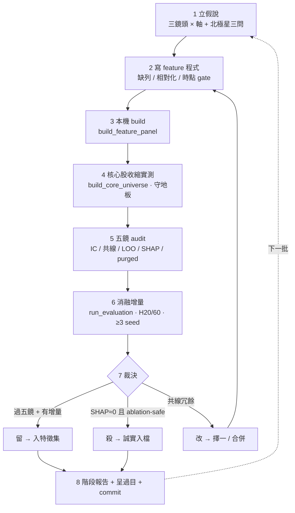

# augur 特徵值實作流程 SOP — 從假說到入庫/淘汰（每批可重複生命週期）

**性質**：實作流程 SOP（操作層 runbook）。把**方法論**（`augur_feature_discovery_methodology_20260626`，憲章 v1.10.0 入憲）＋**執行藍圖**（`augur_feature_execution_plan_20260626`，8 階段順序）**操作化**為「每一批特徵的可重複工程生命週期」。
**回答**：當我們決定實作某一批特徵（如 Pareto 集中度 P1-P4），**具體一步一步該怎麼做**，才能從假說走到「入庫／淘汰」且全程守紀律。
**位階**：承方法論 SSOT（如何找有用特徵）＋執行藍圖（落地順序）＋憲章 PHASE 7/8/9。本檔不立新法律、不立新判準——純執行層 SOP（守憲章第六部反膨脹、不另升治權版本）。
**護欄定位**：raw 已 84/84 完整 → 全程 **feature 層（算＋寫 DB）、零 API 放量、可逆**＝ #20/#26 護欄內自驅動；唯排序/地板數值/發布日 lag/commit 須決策層拍板（Part D）。
**地基實證（#20、2026-06-26 本機實查）**：feature compute code 已備（panel 15＋chip 7＋valuation 5＝27 feat）；驗證機器已備（baseline/label/walkforward/metrics）；**三大基建缺口**＝全鏈 build CLI 全無、五鏡 audit 未成模組、`context_values` 表不存在（Part A 補）。

---

## Part A — 一次性基建前置（做任何特徵批次前必須先有的工具）

無這三件，每批生命週期無法可重跑、口徑無法一致（#12）。屬里程碑 **M-feat-0** 交付。

| # | 基建 | 內容 | 守 | 現況 |
|---|---|---|---|---|
| A1 | **全鏈 build CLI**（`scripts/`，動詞片語命名 #18、冪等可重跑） | `build_feature_panel.py`（呼叫 `features.panel.build_panel`，全 panel）· `build_core_universe.py`（呼叫 `core_gate.build_universe` ＋ `build_universe_asof`）· `run_evaluation.py`（呼叫 `evaluation.baseline.run_ladder` → 基準階梯 IC） | #12 口徑一致、#18 命名 | ❌ 待建（靠 /tmp 臨時腳本）|
| A2 | **五鏡 audit 模組**（`src/augur/audit/feature_diagnostics.py`，領域名詞 #18） | 把 /tmp 臨時五鏡正式化：① 單因子有號 IC＋sign 穩定 ② 共線群（feature_values 相關矩陣）③ leave-one-out 必要性（`run_ladder` feats 去一）④ ensemble SHAP（GBDT）⑤ purged-CV（walkforward 已備） | #11 五鏡、#12 | ❌ 待建（audit/ 只有 reconcile）|
| A3 | **`core_universe_asof` 表本機補建** | `build_universe_asof` 寫入（逐 t≤t、消 survivorship #8）→ 評估 as-of 口徑可重現 | #8 | ⚠️ 本機缺（M-2 在另機建）|
| A4 | **`context_values` 表**（`context_values(panel_date, feature, value)` ＋ panel 有效性檢查） | X 類 context 落地容器（缺=panel 無效、非排除股）| 架構 | ⏳ 階段 6 才需、屆時建 |

> A1-A3 為起跑前置（階段 0-1 前完成）；A4 延後至階段 6。建完即**驗收可重跑**（重現 M-1 as-of Ridge H60 rank IC ≈ +0.13）。

---

## Part B0 — 三鏡頭的生成驅動（規劃核心邏輯，凌駕階段排序）

> 本節是 SOP 的靈魂。三鏡頭**不是「三個階段的名字」**，而是**每個 raw 欄位的生成驅動**；漏掉本節，SOP 退化成 lens-agnostic 的通用工程流程。

### B0.1 認識論遞進（為何是第一性 → 八二 → 康波 → 綜合）
四層，每層是前一層「**同一份資料**」的元提問（meta-question）：
1. **第一性（資訊內容）**：這欄位**有什麼訊息**？——地基，先確立訊息存在（七軸）。
2. **八二法則（分布形狀）**：這訊息的**分布形狀本身**是不是訊息？（多不均、誰支配、集中度往哪變）——同一份資料的第一個元層（四不變量）。
3. **康波循環（時間結構）**：這訊息**在自身循環的哪裡、往哪走、各尺度是否共振**？——第二個元層（五不變量）。
4. **跨鏡頭綜合**：三層的**交互**（吸籌＝低位相位 × 籌碼收斂；價值陷阱＝估值缺口 × 營收 share 衰退）——遞進的**收斂頂點、非平行階段**。
> 順序不可顛倒之理：未先確立訊息（L1），談其形狀（L2）/相位（L3）即無所附麗；綜合（L4）須三層素材齊備。

### B0.2 生成 vs 驗證分離（調和「同欄位三旋轉」與「階段分鏡頭」的關鍵）
兩件事不同、不可混為一談：
- **生成（design-time、全旋轉）**：拿到**任一 raw 欄位族**，**一次旋轉三鏡頭**——同時長出它的第一性候選、八二候選、康波候選。**同一欄位三看是生成的預設動作**。
- **驗證（validation-time、分鏡頭）**：階段排序（Part E）只是**消融驗證的優先序**——族層級分開測「每個鏡頭有無增量」（F3 命題、防共線稀釋）。**不是把欄位分給不同鏡頭**。
> 例：`持股 HoldingSharesPer` 一個欄位，生成時三旋轉 → 大戶比（訊息）/ Gini·Δ集中度（形狀）/ 集中度循環位置（時間）**一起產**；驗證時，「形狀」類歸 Pareto 階段消融、「時間」類歸康波階段消融。

### B0.3 三鏡頭生成提示卡（嵌入步驟 1，拿到欄位即逐卡問）
| 鏡頭 | 拿到一個欄位就問 | #9 合規工具 |
|---|---|---|
| 第一性 | 它的水位/動能/比率帶什麼訊息？（七軸定位）| log·diff·ratio·rolling |
| 八二 | 它的分布多不均、誰支配、集中度往哪變？（四不變量）| Gini·HHI·entropy·max-share·rank 慣性·breadth |
| 康波 | 它在自身循環哪裡、往哪走、各尺度同向否？（五不變量）| range-position·time-since-extreme·drawdown·二階導·同向計分·背離量·vol 期限結構 |
| 綜合 | 它與別鏡頭/別欄位的相位 × 形狀 × 缺口如何交互？| 連續交互（無切點）|
> 每格產出皆過**北極星三問**（步驟 1）＋**相對化**（母原則 3）＋**紀律閘**（步驟 3 漏斗）。

---

## Part B — 每批特徵的標準生命週期（8 步，可重複套用於每一批）

一「批」＝方法論的一個 **鏡頭 × 軸** 群（如康波 C2 個股價格相位、Pareto P1 持股集中）。每批走完整 8 步。



**步驟 1 — 立假說**（方法論母原則 1-2 + 三鏡頭全旋轉）
- 選 raw 欄位/欄組 → 過**北極星三問**（真實 API 源？t 當下真可得？對相對強弱有區分力？任一否 → 丟棄）。
- **對該欄位族逐卡旋轉三鏡頭**（Part B0.3 提示卡）→ **一次生成第一性/八二/康波三類候選**（生成全旋轉、B0.2）——不在此階段把欄位分給單一鏡頭。
- 寫下每候選：`鏡頭/軸 · 公式 · 預期 sign · 缺列規則 · 時點 gate（T+1/lag/vintage/公告日）`。

**步驟 2 — 寫 feature 程式**（clean-room #16、命名 #18、source-pure #1）
- 領域名詞模組（`features/concentration.py`、`features/cycle_phase.py`、`features/interaction.py`…；禁 util/helper）；CLI 入口才用動詞片語。
- **算不出即缺列**（#1，不補值/不 zero-fill）；E 類稀疏事件用真零（前提：該表 sync 完整至 as-of）。
- **相對化在 transform**（母原則 3：橫斷面 rank/z、產業內 demean、自身 percentile）。
- **無硬編特定值**（#9：純 log/ratio/泛函；視窗 calendar 慣例）。
- **時點 gate 落地**（#8）：籌碼/法人盤後 → 保守 `shift(1)` T+1；財報 → 法定 lag；FRED Tier B → vintage；事件 → 公告日錨。
- 整合進 `panel.build_panel`（個股特徵）或 `context_values`（X 類）。

**步驟 3 — 本機 build 寫入**（A1 CLI、冪等）
- `python scripts/build_feature_panel.py`（全 panel；`ON CONFLICT DO UPDATE`）→ feature_values 加該批特徵。

**步驟 4 — 核心股收縮實測**（#10 質>量、§5 收縮管理）
- `python scripts/build_core_universe.py` → **實測核心股數**（不估計）；歸因跌幅（歷史長度 vs 語意收縮）。
- **守地板**（~200-300、實驗中）：跌破 → 該特徵改 **conditional**（如月營收豁免金融）／走 **as-of**（早期用大池）／降 **optional**（不入完整度 gate，但缺值股不得進該特徵訓練、仍守 #1）。

**步驟 5 — 五鏡 audit**（A2 模組、#11；存廢唯一裁判）
- 五鏡合判：① 有號 IC＋sign 穩定 ② 共線群 ③ leave-one-out 必要性 ④ SHAP ⑤ purged-CV。**不得單一指標（尤不得單看 gain）判生死**。

**步驟 6 — 消融增量**（A1 `run_evaluation`、F3 命題）
- `run_ladder(asof=True)`：該批 vs 既有 baseline 之 Δ（mean_ic / effective_t）。
- **族層級先消融**（防共線稀釋誤判）；**共同樣本窗鐵則**（各表歷史深度不齊、消融須同期間）；**H=20/60 主戰場**、H=5 探索、H=252 不入主表；GBDT **≥3 seed** 取統計（#15）。

**步驟 7 — 裁決（留／改／殺）**
- **留**：五鏡過 ∧ 消融有增量（Δ>0）。
- **殺**：SHAP≈0 ∧ ablation-safe（去掉 IC 不降）→ 必移。
- **改**：共線冗餘 → 群內擇一或合併 → 回步驟 2。
- **誠實（#15）**：無增量誠實入檔、負結果同樣記錄；不為「特徵變多」留死重。

**步驟 8 — 階段報告 + 呈過目 + commit**（四交付、#19）
- 四交付：① feature 程式 ② build 寫入 ③ 五鏡 audit 結果 ④ 階段報告（含**核心股數量實測** + 五鏡/消融數字、全 source-traceable #15）。
- **做完呈過目再進下一批**（#19）；commit 須用戶明示授權（#14）。

---

## Part C — 每步 gate 與通過/失敗判準（concrete）

| Gate | 步驟 | 量 | 通過判準 | source |
|---|---|---|---|---|
| Source-pure | 2-3 | feature_values 內容 | 無 fake/zero-fill；算不出即缺列（code review + 缺列抽驗）| a 程式 |
| Anti-leakage | 2 / 5 | 時點規則 | 規則明確落地；**階段 5 雙口徑 IC**（gate vs 無 gate）證無洩漏 | a/b |
| 完整度地板 | 4 | 核心股數 | ≥ 地板（~200-300、實驗中、#9 不寫死、實證定）| b DB |
| 五鏡-顯影 | 5 | SHAP + ablation | **SHAP≈0 ∧ ablation-safe → 必移** | a |
| 五鏡-必要 | 5 | leave-one-out | 去該特徵 IC 顯著下降＝必要 | a |
| 消融增量 | 6 | Δmean_ic / Δeff-t（族層級）| Δ>0（有增量才留；無則誠實入檔）| a |
| 可重現 | 6-8 | 固定 seed | 半年重跑一致（pipeline 確定性、#15＝靈魂成功定義）| a |

> 判準中的數值（地板 ~200-300、seed 數）為 **operational 參數、實驗中、非治權硬值**（#9/#19）；五鏡為合判、非單閾值卡關。

---

## Part D — 護欄與決策邊界（碰護欄即停 #20）

| 層 | 內容 | 誰拍板 |
|---|---|---|
| **執行層（AI 自駕）** | transform 選擇、公式、模組切分、自我糾錯、試錯逼近（#19） | AI 主導、做完呈過目 |
| **決策層（停下問）** | 階段排序變更 · **核心股地板數值** · **發布日 lag 參數**（階段 5、probe 後呈報）· 新增治權判準 · commit-push（#14）· API 放量（#17）| 用戶拍板 |

**已決（用戶 2026-06-26）**：① 階段排序（0 估值→1 第一性→2 Pareto→3 康波→4 跨鏡頭→5 基本面→6 context→7 事件/衍生）② 地板策略（設地板＋超限改 conditional）。
**待決**：地板數值、發布日 lag（屆時呈報）。

---

## Part E — 雙軌落地：生成全旋轉 × 驗證分鏡頭（對映 8 階段）

承 **B0.2**，落地嚴分兩軌、勿混：

**① 生成軌（全旋轉、design-time）**：每個 raw 欄位族進入 scope 即**一次旋轉三鏡頭**生成三類候選（B0.3）。早期族（價量/籌碼/估值）已在 scope；後段族（基本面/context/事件/衍生）於各自階段進來時全旋轉。

**② 驗證軌（分鏡頭、validation-time ＝消融優先序）**：8 階段是**消融驗證的優先序**（族層級分開測每鏡頭增量、F3 命題），**非把欄位分給不同鏡頭**：
- **階段 1-3**：對**已在 scope 的早期族**逐鏡頭消融（第一性 → Pareto → 康波）。
- **階段 5-7**：後段族進來、生成其三旋轉，並**回補**對應鏡頭族消融——此即全旋轉在後段族的落實。
- **階段 4**：跨鏡頭綜合（遞進頂點、B0.1 L4）。

| 階段 | 驗證焦點（分鏡頭消融）| 生成（全旋轉觸及之欄位族）| 新模組 | 里程碑 |
|---|---|---|---|---|
| 0 | —（重現 M-1 基線）| 估值族補齊 → 27 feat | — | **M-feat-0**：CLI＋五鏡模組上線 |
| 1 | 第一性增量 | 價量/籌碼族全旋轉（補完軸①②⑦）| 擴 `panel.py` | — |
| 2 | Pareto 增量 | 同族之**集中度旋轉**（P1-P4）| `concentration.py` | — |
| 3 | 康波增量 | 同族之**相位旋轉**（C2/C4/C5/C6）| `cycle_phase.py` | **M-feat-1**：三鏡頭全落地、消融入檔 |
| 4 | 跨鏡頭綜合增量 | 三鏡頭**交互**（吸籌/價值陷阱…）| `interaction.py` | — |
| 5 | 基本面（雙口徑 anti-leakage）| 財報三表族**全旋轉** → 回補 Pareto P5 / 康波 C3 | `fundamental.py` | **M-feat-2** |
| 6 | context | 總經族**全旋轉** → 回補 Pareto P6 / 康波 C1 | `context.py` ＋ A4 | **M-feat-3** |
| 7 | 事件真零＋衍生 | 事件/衍生族**全旋轉** | `event.py` 等 | **M-feat-final**：五鏡全表、守地板、交 F3 M-3 |

> 一句話：**欄位族全旋轉產生候選（生成）；鏡頭族分開消融驗增量（驗證）；「回補」確保後段族也三旋轉**。起跑＝階段 0（quick win）；living document，排序/地板依五鏡/消融/收縮動態調整（#19）。

---

## Part F — 誠實與可重現控制（#15 貫穿全程）

- **每數字 source-traceable**：(a) 程式 stdout/JSON ／ (b) DB query ／ (c) API；報告兩邊都要真實來源。
- **stochastic ≥3 seed**：GBDT 等含隨機性指標取統計（min/median/max/mean）、單次極值註明。
- **可重現**：固定 `random_state`、pipeline 確定性 → 半年重跑一致（靈魂的成功定義）。
- **設計＝假說**：任何特徵未過五鏡+walk-forward 前皆假說；**有用＝市場驗證活下來、非設計出來**。
- **living document**：每階段實證結果回寫本 SOP 與執行藍圖；偏離方法論（漏漏斗/硬編/洩漏）即治權違規。

---

## 附：一批特徵的完整指令骨架（範例 — Pareto P1 持股集中）

```text
# 1 立假說：HoldingSharesPer 級距 → Gini/HHI/Δ集中度（Pareto P1）；缺列=無級距資料；T+1 gate
# 2 寫程式：src/augur/features/concentration.py（領域名詞、缺列、cutoff-free 泛函 #9）
#           整合進 panel.build_panel
# 3 build： python scripts/build_feature_panel.py            # 冪等、全 panel
# 4 核心股：python scripts/build_core_universe.py            # 實測數量、守地板
# 5 五鏡：  python scripts/run_feature_audit.py --batch concentration   # IC/共線/LOO/SHAP/purged
# 6 消融：  python scripts/run_evaluation.py --feats <batch> --h 20,60 --asof --seeds 3
# 7 裁決：  留/改/殺（五鏡+消融合判、SHAP≈0且ablation-safe必移）
# 8 報告：  reports/augur_feature_stage2_pareto_<date>.md（四交付、source-traceable）→ 呈過目 → commit（授權後）
```
