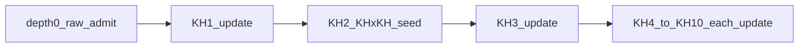

# KH10-AUTO-ADMIT：一律准入＋逐層 KH update 精準計畫 [I]

> **日期**：2026-07-29  
> **位階**：[I] 計畫書；**入憲已履行**＝領域憲章 **v1.48.0**「來源治理／知識准入不變式」  
> **Steward 定錨**：没有需要人核可之限制；**所有資料一律准入**；只有資料 **update 更精準**（原文先入庫 → 再逐層 KH update）  
> **母架構用語**：[`augur_ten_layer_knowhow_architecture_plan_20260728.md`](augur_ten_layer_knowhow_architecture_plan_20260728.md) KH1…KH10  
> **憲章 SSOT**：[`docs/系統架構大憲章_v1.48.0.md`](../docs/系統架構大憲章_v1.48.0.md)  
> **拍板／入憲登錄**：[`audits/KH10-AUTO-ADMIT-CONSTITUTED-20260729.md`](../audits/KH10-AUTO-ADMIT-CONSTITUTED-20260729.md)  
> **S0／S0.1／S1**：[`audits/KH10-AUTO-ADMIT-S0-CLOSED-20260729.md`](../audits/KH10-AUTO-ADMIT-S0-CLOSED-20260729.md) · [`audits/KH10-AUTO-ADMIT-S1-CLOSED-20260729.md`](../audits/KH10-AUTO-ADMIT-S1-CLOSED-20260729.md)（漸進編排已落地）

---

## 0. 一句結論

| 順序 | 動作 | 十層架構用語 |
|---|---|---|
| 0 | **原文先入庫**（一律准入；硬閘過即寫） | RAW（非「等人裁」） |
| 1 | **KH1 update** | Qualification |
| 2 | **KH2／KH×KH 種子 update** | Admission Assist＋二元交互候選起步 |
| 3…10 | **KHn update** | Terminal → … → Evolution & Governance |

每過一層 **UPDATE** 水印與帳本，使檢索／交互／對抗／合成**更精準**；深層未優化 **不**擋原文、**不**回滾較淺層。  
**無人核可限制**：`approve`／`activate` 得由機械 `system:kh10_auto_admit` 執行（憲章 v1.48.0；`curation.HUMAN_ONLY=∅`）。

---

## 1. What／Why／Non-goals

### 1.1 What

1. 知識資料（全專案，不限三通道）**一律准入**（硬閘通過即入庫＋來源可機械升 active）。  
2. 入庫後依 **KH1→KH10** 逐層機械 update（`admit_depth` 單調遞增）。  
3. 帳本：`knowhow_auto_admit_run`／`knowhow_auto_admit_state`；來源狀態機仍寫 review_log。  
4. 人仍可 suspend／負面清單／緊急停；**不是**准入前置核可。

### 1.2 Why

- Steward：准入不等人；精準靠逐層 update。  
- 對齊母架構十層名稱，避免「雙層 raw／full」語義漂移。  
- v1.41.0「唯人 approve」與積壓／庫空矛盾 → **v1.48.0 廢止**。

### 1.3 Non-goals

| 不做 | 理由 |
|---|---|
| 繞過 license／owned_local／AI 禁令／負面清單 | 硬閘仍守 |
| 原文入庫＝一般作答 eligible | 進庫≠可答；KH4 update 後才 eligible |
| 自動灌 PME／可交易 | PME-GATE |
| 解凍 FinMind／FRED | FZ-keep |
| 專題答案樹 | NHC-keep |

### 1.4 碼（現行）

| 碼 | 狀態 |
|---|---|
| **AUTO-ADMIT-PROGRESSIVE** | ✅ 入憲 |
| **AUTO-ADMIT-RAW-FLOOR** | ✅ 入憲（depth 0） |
| **AUTO-ADMIT-OPEN** | ✅ 入憲（無人核可限制；一律准入） |
| **AUTO-ADMIT-C** | ✅ 機械可 activate（已含於 OPEN） |
| ~~AUTO-ADMIT-X 擋 activate~~ | **廢止**（改為：未 LAND 之層 skip／不抬假 depth，不擋准入） |
| ~~HUMAN-APPROVE-keep~~ | **廢止**（v1.48.0） |

---

## 2. 十層對照（架構用語＝update 名）

| `admit_depth` | 架構層 | update 寫入（精準化） |
|---|---|---|
| 0 | RAW 原文 | `item`／`item_text`；來源機械 active |
| 1 | KH1 Qualification | qual 帳 |
| 2 | KH2 Admission Assist（口語 KH×KH 起步） | assist；二元 probe 種子 |
| 3 | KH3 Terminal Readiness | 終態／切句 |
| 4 | KH4 Retrieval-Answer Baseline | eligible（一般作答） |
| 5 | KH5 Axis Expansion | 擴軸 |
| 6 | KH6 Interaction Projection | 交互投影完備（含 KH×KH／n 元） |
| 7 | KH7 Adversarial Eligibility | 對抗可答性 |
| 8 | KH8 Evidence Weighting | 證據權重 |
| 9 | KH9 Synthesis & Replay | 合成回放 |
| 10 | KH10 Evolution & Governance | 進化候選帳（≠自動 PME APPLY） |

---

## 3. Schema／程式（承 S0；續）

- S0 已建 run／gate；**S0.1**：`knowhow_auto_admit_state`、`admit_depth_*`、`progressive_enabled`、`max_auto_depth`（精準層上限；**不**擋 depth 0 准入）。  
- `gate.enabled`：入憲後預設 **true**（允許機械 activate）；kill-switch 可關。  
- `src/augur/knowledge/auto_admit.py`＋`run_knowhow_auto_admit.py --apply-raw`／`--apply-up-to N`。  
- `curation.transition(..., system=True)` 已放行升級（v1.48.0）。

---

## 4. 驗收

| 項 | 判準 |
|---|---|
| 入憲 | 憲章 v1.48.0 條文 ACTIVE；CS 換發 |
| code | `HUMAN_ONLY==set()`；`--selftest` 綠 |
| 行為 | 新原文可入庫無需人 TTY；depth 遞增可觀測 |
| 硬閘 | 負面清單／非法 license 仍拒 |

---

## 5. 回報摘要

| 問 | 答 |
|---|---|
| 要人核可嗎？ | **不要**（v1.48.0） |
| 資料怎麼進？ | 一律准入（硬閘）→ 原文 → 逐層 KH update 更精準 |
| 入憲了嗎？ | **是**（領域憲章 v1.48.0） |
