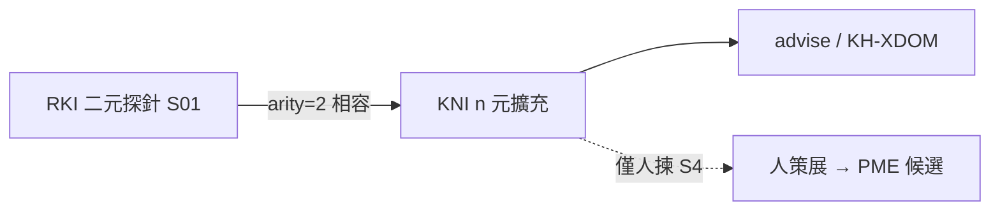

# Know-how n 元交互探針計畫 [I]（2026-07-28）

* **性質**：[I] plan-first 計畫書（CLAUDE #16／#20；憲章第六部計畫完整性 v1.39.0）— **不創設 [N]**；**本輪只出計畫＋可選一例 advise，不大規模新實作**（S0 極小盤點可選）
* **授權觸發**：Steward——主題例「依第一性原理如何使用 AI 模型來強化太陽能材料研發技術核心」；並要求**其他 know-how × know-how × know-how**亦以計畫逐步實現
* **上位／相容**：既有 **RKI**＝方法論上所有 **KH×KH**（二元為主）；**S01 CLOSED**（`knowhow_interaction_probe` **active≥14**）。本計畫＝**相容擴充為 n 元**（至少三元；可推廣 n≥3），**不推翻** S01／`RKI-keep`
* **治權錨**：`.cursor/rules/soul-vs-raw-correlation.mdc`；`predict-vs-market-api`／`finmind-fred-api-freeze`（**`FZ-keep`**）；原則精華 source-pure／anti-leakage；CLAUDE #29b（策展住 DB；**`NHC-keep`**）
* **姊妹互鏈（正交，不取代）**：
  - `reports/augur_raw_knowhow_interaction_probe_plan_20260728.md`（**RKI**；二元探針層；S01 CLOSED）
  - `reports/augur_knowhow_cross_domain_advisor_plan_20260728.md`（**KH-XDOM**；跨域讀答）
  - `reports/augur_pme_cross_domain_evolution_enable_plan_20260728.md`／`reports/augur_pme_xdom_ai_predict_plan_20260728.md`（**PME-XDOM**／**PME-XDOM-AI-PREDICT**；寫進假說鏈——**≠**本層自動灌）
  - `reports/augur_no_hardcode_db_ssot_constitution_plan_20260728.md`（**NHC**；禁領域 hardcode）
* **實證時點**：2026-07-28 live——表 active=14；`RKI-FP-AI-SOLAR`／`RKI-AI-SOLAR-RD` 列齊；原題 `advise` 一例（附錄 A）

### Steward 拍板欄

| 欄 | 內容 |
|---|---|
| **日期** | 2026-07-28 |
| **狀態** | ⏳ 待拍 |
| **建議拍板碼** | `KNI-PLAN`＋`KNI-S01`＋`RKI-keep`＋`NHC-keep`＋`FZ-keep` |
| **效力** | 採納 n 元交互藍圖；開工 **S0 schema 擴 arity**（＋可選種子列設計）；**不解凍** API；**不**推翻 RKI S01；**不**暗開 `PME-XDOM-SOLAR`；禁三元專支／寫死答案樹 |
| **本輪不做** | 入憲；放量 harvest；大規模 runner 新實作（除非拍板後依 S0／S1 逐步） |
| **留痕** | 本檔；拍板後另開 `audits/KNI-PLAN-APPROVED-YYYYMMDD.md` |

---

## 0. 一句結論

把 RKI 的 **二元**探針帳本**相容升級**為 **n 元**（`arity≥3`／`axes[]`）：顧問組答仍走統一 `advise`；新三元＝**INSERT**（哲學×研發×製程、Pareto×AI×預測、…）；種子三元＝用戶原句對齊之 **第一性原理 × AI 模型進化 × 太陽能材料研發技術核心**。成功＝任意 n 元議題入帳**零改碼**；研發作答 **≠** 自動灌台股因子。

---

## 1. What／Why／非目標

### 1.1 What

1. **n 元 know-how 交互探針**：在既有 `knowhow_interaction_probe`（或等價新表）支援 **`arity`＋`axes[]`（JSONB）**，使探針不再硬綁「軸 A × 軸 B」二元欄。  
2. **顧問組答**：runner／探針展開之多軸 query → 既有 **KH-XDOM／NHC** 管線（`advise`＋glossary＋guard）；**禁** hardcode 三元答案樹。  
3. **（可選）餵 PME 候選**：探針／假說帳本僅產出**人策展候選**；灌 `principle_factor_map`／prodset **另拍**（`PME-XDOM-SOLAR` 等），本層不自動 APPLY。  
4. **逐步路線**：S0→S1→S2→S3→S4→U（見 §4）；本輪＝計畫＋可選 advise 一例。

### 1.2 Why

* Steward 原題本質是 **三軸**（第一性 × AI × 太陽能研發），不是單一「原則×技術」二元；現行 RKI 已用 `template_params` 三槽＋`raw_axis` 文字「塞」三元語意——**能跑種子，但 schema 未一等公民化 arity**，後續 n≥4／評測／多軸檢索會歪。  
* 「其他 KH×KH×KH 也要做」→ 正確槓桿＝**INSERT 列＋通用 runner**，不是每題一支專案。  
* 與 RKI 相容：二元列 `arity=2` 繼續有效；S01 種子**不刪、不重標為失敗**。

### 1.3 非目標（硬紅線）

| 不做 | 理由 |
|---|---|
| ≠ 推翻 RKI S01／刪既有 14 探針 | **`RKI-keep`** |
| ≠ hardcode 三元專支／寫死答案樹／`if 太陽能∧AI∧第一性` | **`NHC-keep`** |
| ≠ 自動開 `PME-XDOM-SOLAR`／把研發 know-how 灌台股因子 | 研發作答 ≠ 預測因子；另拍 |
| ≠ 因本計畫再開／重跑 `PME-XDOM-AI-PREDICT` 當憑據 | 正交；探針綠 ≠ 過閘 |
| ≠ 解凍 FinMind／FRED／放量 harvest | **`FZ-keep`**；本輪不放量 |
| ≠ 整庫 raw 進靈魂／原則文書 | soul-vs-raw |
| ≠ 預測熱路徑 import probe／advise 當權重 | `import_isolation` |
| ≠ 本輪入憲／改 [N] | 另開案 |
| ≠ 本輪大規模新實作（無 `KNI-S01`） | plan-first；僅計畫＋可選 advise |

---

## 2. 與二元 RKI 的關係（相容擴充）

| | **RKI（既有）** | **KNI（本計畫）** |
|---|---|---|
| **方法論範圍** | 所有 KH×KH（二元為主） | 同一宇宙；**加** KHⁿ（n≥3） |
| **表** | `knowhow_interaction_probe` active≥14 | **擴**同表（建議）或旁表＋視圖；**不**另造答案 SSOT |
| **S01** | ✅ CLOSED | **保留**；二元列 `arity=2` 預設／回填 |
| **產生** | template → `advise` | 同；多軸展開／多查詢 RRF |
| **PME** | 僅人候選；≠自動灌 | 同；S4 可選 |



**相容不變式**：

1. 既有 `probe_id`（含 `RKI-FP-AI-SOLAR`／`RKI-AI-SOLAR-RD`）**繼續 active**。  
2. 擴 schema 須 **冪等 migrate**；舊 runner（若尚未寫）讀二元欄仍可工作，或經 view 投影。  
3. 新三元種子用 **`KNI-*` id 前綴**（建議）或升級既有 optional 交叉臂之 `arity`／`axes`——**禁止**為同一語意複製第二套 hardcode 答案。

---

## 3. 種子三元與「其他三元＝INSERT」

### 3.1 種子三元（對齊用戶原句）

| 建議 probe_id | 三軸（有序） | 對齊既有 |
|---|---|---|
| **`KNI-FP-AI-SOLAR`**（或升級既有 `RKI-FP-AI-SOLAR` 之 `arity=3`／`axes`） | ①第一性原理 ②AI 模型（進化／方法） ③太陽能材料研發技術核心 | 與 `RKI-FP-AI-SOLAR` **語意同一種子**；見 §6 |
| （對照臂，仍二元）`RKI-AI-SOLAR-RD` | AI 模型進化 × 太陽能材料研發 | 缺「第一性」軸；作 **二元子集**／消融對照 |
| （對照臂）`RKI-FP-SOLAR-*` | 第一性 × 太陽能（無 AI 軸） | 消融：無 AI 方法論軸時的命中／缺口 |

**展開 prompt（種子）**＝用戶原句精神：

> 依「第一性原理」如何使用「AI 模型」來強化「太陽能材料研發技術核心」？（可溯源概念橋；缺料誠實；禁寫死清單；≠PME-XDOM-SOLAR）

（與現行 `RKI-FP-AI-SOLAR.prompt_template` 實例化結果一致——見 §6。）

### 3.2 其他三元如何新增＝INSERT（零改碼）

| 例 probe_id（建議） | axes[] | 備註 |
|---|---|---|
| `KNI-PHILO-RD-PROC` | 哲學／原則 × 研發技術 × 製程／工藝 | 通用研發三角 |
| `KNI-PARETO-AI-PREDICT` | Pareto／八二 × AI 模型進化 × 投資預測進化 | 與 `RKI-AI-PREDICT-*`／Pareto 臂成套；≠自動 PME |
| `KNI-SUNZI-MGMT-AI` | 孫子 × 企管 × AI 決策支援 | 對照 PME-XDOM-SUNZI；仍≠灌 ERP dump |
| `KNI-FP-AI-PREDICT` | 第一性 × AI 迭代 × 預測閉環 | 可升級既有 `RKI-FP-AI-PREDICT` 之 arity 表達 |
| … | … | **admin／migrate INSERT**；`prompt_template` 用 `{{axis_0}}`…或具名槽；**禁**新 `.py` 分支 |

**模板槽慣例（建議）**：

* `axes` JSONB 陣列：`[{"role":"principle","label":"第一性原理"},{"role":"method","label":"AI 模型進化"},{"role":"domain","label":"太陽能材料研發技術核心"}]`  
* 或扁平 `template_params` 繼續用具名鍵（與 RKI 相容）；**`arity = len(axes)`** 機械一致（CHECK）。

---

## 4. 分階（S0→S4＋U）

| 階段 | 名稱 | 內容 | 依賴 | 驗收摘要 |
|---|---|---|---|---|
| **S0** | schema 擴 arity | migrate：加 `arity INT NOT NULL DEFAULT 2`、`axes JSONB`（或等價）；既有列回填 `arity=2`、`axes` 自 `knowhow_axis`／`raw_axis`／`template_params` 推導；可選放寬／增 `interaction_kind`（如 `kh_x_kh_x_kh`） | `KNI-PLAN` | `\d`；舊 14 列仍 active；selftest 綠；**零**領域 hardcode |
| **S1** | 種子三元 | INSERT／升級種子：`KNI-FP-AI-SOLAR`（或升級 `RKI-FP-AI-SOLAR`）；文件對齊 §6；`--show` 可見 arity=3 | S0；`KNI-S01` | 種子列齊；原句 template 可展開 |
| **S2** | runner 多軸檢索／組答 | `run_knowhow_interaction_probes`（或擴 RKI runner）：讀 `axes[]`→多查詢／RRF→缺口旗標→可選呼叫 `advise`；`--probe-id`／`--arity`／`--dry-run`；零市場 API | S1 | 種子三元可跑；數字出自 DB／stdout；禁幻造對齊 |
| **S3** | 評測集 | 固定 n 元題組（含消融：缺一軸）；記錄 cite 厚度／誠實 decline／guard；可餵 KH-XDOM EVAL | S2 | 評測列追溯 `probe_id`；無專支答案 |
| **S4** | 可選餵 map 策展（人） | 自假說帳本**人揀**候選 → 清單交 PME（仍受已拍範圍；solar **只列不灌**除非 `PME-XDOM-SOLAR`） | S3 | 無自動 map APPLY |
| **U** | 回歸 | isolation 綠；FZ-keep；NHC-keep；RKI-keep（二元列回歸）；INSERT 新三元演練 | S2+ | 見 §8 |

**建議近程一次開**：`KNI-S01`＝**S0＋S1**（schema＋種子）。S2／S3／S4 另碼或同句加碼。

---

## 5. Schema／Python 規畫（憲章計畫完整性）

### 5.1 建議：擴充既有表（優先於新表）

```sql
-- S0 冪等增量（示意；實作以 migrate 為準）
ALTER TABLE knowhow_interaction_probe
  ADD COLUMN IF NOT EXISTS arity INT NOT NULL DEFAULT 2
    CHECK (arity >= 2 AND arity <= 8);
ALTER TABLE knowhow_interaction_probe
  ADD COLUMN IF NOT EXISTS axes JSONB NOT NULL DEFAULT '[]'::jsonb;
-- 建議：CHECK (jsonb_typeof(axes)='array' AND jsonb_array_length(axes)=arity)
-- 二元相容：既有 knowhow_axis / raw_axis 保留為投影／顯示；新 runner 優先讀 axes
COMMENT ON COLUMN knowhow_interaction_probe.arity IS
  'KNI: 交互元數；2=RKI 二元；≥3=n 元';
COMMENT ON COLUMN knowhow_interaction_probe.axes IS
  'KNI: 有序軸 [{role,label,...}]；擴題=INSERT；非答案 SSOT';
```

**可選**：

| 產物 | 角色 |
|---|---|
| 新表 `knowhow_nary_interaction_probe` | 僅當擴表風險高時之旁路；須 view 統一讀側——**預設不採** |
| `knowhow_interaction_probe_run`／`_result` | 沿 RKI §5.1；結果加 `arity`、`axis_hit_json` |

**讀側（不新建亦可）**：`philosophy_*`／`knowledge_*`／embed／（概念橋用）既有 bridge 表——S0 只做 schema，不放量 harvest。

### 5.2 Python／腳本

| 檔 | 角色 | 階段 |
|---|---|---|
| 擴 `scripts/migrate_knowhow_interaction_probe_ddl.py` | 冪等加欄＋回填＋三元種子；`--check`／`--apply`／`--show`／`--selftest` | S0／S1 |
| **新或擴** `scripts/run_knowhow_interaction_probes.py` | 多軸展開→檢索／advise→報告 | S2 |
| 既有 `advise`／`retrieve_glossary` | 組答消費端 | S2 |
| 既有 isolation | probe／advise 不進 predict | U |
| **不**新建 `advise_solar_ai_fp.py` 之類專支 | 硬紅線 | — |

---

## 6. 既有探針對齊說明（必讀）

### 6.1 `RKI-FP-AI-SOLAR`（三元種子的現行承載）

| 項 | live（2026-07-28） |
|---|---|
| **probe_id** | `RKI-FP-AI-SOLAR` |
| **interaction_kind** | `principle_x_rd`（audit 短記曾寫 `kh_x_kh`——**以 DB／migrate 種子為準**） |
| **顯示軸** | `knowhow_axis`＝第一性原理；`raw_axis`＝「AI 模型 × 太陽能材料研發技術核心」（文字已含第二、三軸） |
| **template_params** | `{principle, ai_axis, tech_domain}`——**語意三元、schema 仍二元欄** |
| **expanded** | 依「第一性原理」如何使用「AI 模型」來強化「太陽能材料研發技術核心」？… |
| **與用戶原句** | **對齊**（措辭極近；探針多「可溯源／禁專答／≠PME-SOLAR」約束句） |
| **KNI 處置** | S1：**升級**本列 `arity=3`＋`axes[3]`，**或**新增 `KNI-FP-AI-SOLAR` 並將本列標 `note` 為 binary-projection／superseded-by——二選一寫進 migrate；**禁止**兩列各寫死不同答案樹 |

### 6.2 `RKI-AI-SOLAR-RD`（二元子集／消融臂）

| 項 | live |
|---|---|
| **probe_id** | `RKI-AI-SOLAR-RD` |
| **kind** | `kh_x_kh` |
| **軸** | AI／ML 模型進化 × 太陽能材料研發技術（**無**第一性軸） |
| **與種子三元** | **子集／對照**：測「去掉第一性軸」時檢索與組答差；**不是**三元的完整替代 |
| **≠** | `PME-XDOM-SOLAR`；`PME-XDOM-AI-PREDICT`（彼＝AI×**投資預測**） |

### 6.3 成套關係（一句）

> **三元完整式** ≈ `RKI-FP-AI-SOLAR`／未來 `KNI-FP-AI-SOLAR`；**缺第一性**＝`RKI-AI-SOLAR-RD`；**缺 AI**＝`RKI-FP-SOLAR-*`——評測用消融，不靠 hardcode 三份答案。

---

## 7. 與 PME／soul-vs-raw／預測正交

| 宣稱 | 本計畫 |
|---|---|
| 顧問能答三元題 | ✅ 目標（語料夠則 cite；不夠則誠實缺料） |
| ＝可灌台股因子 | ❌ 須 `PME-XDOM-SOLAR`（或等價）＋可證偽對映＋閘 |
| ＝`PME-XDOM-AI-PREDICT` 過閘 | ❌ 正交域（投資預測 vs 材料研發） |
| raw 有太陽能列 → 升格靈魂 | ❌ soul-vs-raw；升格＝交互**概念** |
| 缺最新 FinMind | 無關；探針／advise 吃庫內 knowledge／philosophy |

---

## 8. 驗收

| ID | 條件 | 否證 |
|---|---|---|
| **V-RKI** | 既有 active≥14 仍在；二元回歸可 `--show` | 刪／廢 S01 種子當「升級」 |
| **V-ARITY** | `arity`／`axes` 落地；`len(axes)=arity`；二元預設 2 | 僅文件寫 n 元、表仍死二元且無法表達第三軸 |
| **V-SEED3** | 種子三元與用戶原句／`RKI-FP-AI-SOLAR` 對齊說明在案 | 另寫死太陽能專答模組 |
| **V-INSERT** | 新三元（如 Pareto×AI×預測）INSERT 即被 runner／`--show` 看見 | 須改 code 分支 |
| **V-NHC** | repo 無三元專支 Q&A／if-domain | 為原題加專用 prompt 檔當 SSOT |
| **V-FZ** | 零 FinMind／FRED；本輪不放量 harvest | sync／harvest 當前置 |
| **V-PME** | 不暗開 `PME-XDOM-SOLAR` | 探針綠＝因子已驗證 |
| **V-ISO** | predict isolation 綠 | advise 結果進熱路徑 |
| **V-TRACE** | 報告／評測數字出自 stdout／JSON／DB | 記憶估算 cite 率 |

---

## 9. 風險

| 風險 | 緩解 |
|---|---|
| 把「升級 n 元」做成第二套平行宇宙表 | 優先擴同表；`RKI-keep` |
| `raw_axis` 文字塞「A × B」與真 `axes[]` 不一致 | S0 回填腳本＋CHECK；`--show` 印 arity |
| 三元檢索爆炸／離題共現 | 分軸查＋RRF；`spurious_risk`；相關度閘；誠實 decline |
| 語料缺（本輪 advise 已見） | 標 `no_corpus`；**不**放量 harvest 本輪；FT-COV／ATA 另線 |
| 與 PME-SOLAR 範圍膨脹 | S4 只列候選；明示另拍 |

---

## 10. Steward 拍板碼

| 碼 | 含義 | 建議 |
|---|---|---|
| **`KNI-PLAN`** | 採納本 n 元藍圖／分階／非目標／與 RKI 相容句 | ✅ 必拍 |
| **`KNI-S01`** | 開工 S0＋S1（schema arity＋種子三元） | ✅ 近程建議 |
| **`RKI-keep`** | 不推翻 S01；二元列繼續有效 | ✅ 必拍 |
| **`NHC-keep`** | 禁三元專支／寫死答案樹；產生走 advise＋DB | ✅ 必拍 |
| **`FZ-keep`** | 不解凍市場 API；本輪不放量 harvest | ✅ 必拍 |
| **`KNI-S2`** | runner 多軸（可另拍） | 可選 |
| **`KNI-S3`**／**`KNI-S4`** | 評測／人策展 PME 候選 | 次拍 |

### 建議拍板句（可直接貼回）

```text
KNI-PLAN + KNI-S01 + RKI-keep + NHC-keep + FZ-keep
```

含義：採納 know-how **n 元**交互探針藍圖；開工 schema `arity`／`axes`＋種子三元（第一性×AI×太陽能研發）；保留 RKI 二元 S01；禁 hardcode；維持 API 凍結；**不**自動 `PME-XDOM-SOLAR`。

若連 runner：

```text
KNI-PLAN + KNI-S01 + KNI-S2 + RKI-keep + NHC-keep + FZ-keep
```

---

## 11. 回報摘要（給拍板頁）

| 項 | 內容 |
|---|---|
| **路徑** | `reports/augur_knowhow_nary_interaction_plan_20260728.md` |
| **三元範圍一句** | 方法論＝所有 KHⁿ（n≥3，種子起自第一性×AI×太陽能研發技術核心）；實作＝擴探針表 `arity`／`axes[]`＋INSERT，相容 RKI 二元 |
| **建議拍板** | `KNI-PLAN`＋`KNI-S01`＋`RKI-keep`＋`NHC-keep`＋`FZ-keep` |
| **探針對齊** | `RKI-FP-AI-SOLAR`＝三元語意承載（待升 arity）；`RKI-AI-SOLAR-RD`＝缺第一性之二元對照 |
| **本輪** | ✅ 計畫已寫；✅ 原題 advise 一例（附錄 A）；❌ 未入憲；❌ 未放量 harvest；❌ 未開 PME-SOLAR |

---

## 附錄 A — 原題 `advise` 誠實摘要（2026-07-28）

| 項 | 結果（live） |
|---|---|
| **Query** | 依第一性原理如何使用AI模型來強化太陽能材料研發技術核心 |
| **路徑** | `advise(query, empty_payload(), ollama.make_llm_fn…)`；預設 `retrieve_all`（KH-XDOM） |
| **耗時** | ≈144 s（含首次載入嵌入權重） |
| **引文厚度** | **`n_citations = 0`**；`lex_entries = []` |
| **回應** | 固定誠實句：**「知識庫中無此內容」**（空／無關檢索短路，不經幻造組答） |
| **guard** | `pass=True`，`issues=[]` |
| **解讀** | 對種子三元題，現行庫內**可引用終態不足以支撐跨三軸組答**——屬 **缺料**，非「已有硬編碼技術核心清單」。後續靠：S2 多軸檢索診斷缺口桶、FT-COV／harvest（**另線、本輪不放量**）、glossary 策展（NHC）——**仍禁止**為本題寫死答案樹。 |
| **工件** | `/tmp/augur_logs/kni_advise_fp_ai_solar.json`（本機；非 [N]） |

---

## 12. 修訂

| 日期 | 說明 |
|---|---|
| 2026-07-28 | 初版：n 元（≥3）相容擴充 RKI；種子三元＝第一性×AI×太陽能；拍板碼 KNI-*；附錄 A advise 缺料 |
