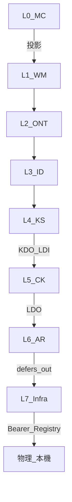

# L0–L7 交互 ultracode 計畫（全棧接縫對抗）

**日期**: 2026-07-23 ｜ **性質**: plan-first（#20）｜ **觸發**: Steward「做 L0 到 L7 交互 ultracode」  
**方法 SSOT**: [`LAYER-SEALING-SCHEDULE.md`](../LAYER-SEALING-SCHEDULE.md) 第三階段；先例＝概念層 3a（wf_7d822c3c／RULING-2026-022）  
**與單層 ultracode 之別**: 查**接縫與橫貫**，非重跑 [`ULTRACODE-SCHEDULE.md`](../ULTRACODE-SCHEDULE.md) 八層各自攻擊

---

## 0. 範圍定案（預設＝全棧交互）

用戶明示「L0 到 L7」→ 採 **全棧交互**（非僅 Phase 3b）：

| 區塊 | 內容 | 本輪 |
|---|---|---|
| **3a 概念層 L1–4** | 已於 2026-07-19 執行並經 RULING-2026-022 處置 | **回歸抽查**（P1–P3／KDI.18 後封印是否仍立） |
| **3b 執行層 L5–7** | 排程已解鎖（前置 3/3 齊） | **主審** |
| **L0 投影縫** | MC [N] → 各層落點／幽靈投影 | **主審** |
| **概念↔執行帶** | L4→L5（KDO／LDI） | **主審**（屬 3b 首縫＋全棧必審） |

**不做本輪**: 改 [N] 判準；升 WM.44 severity；單層 6–8 維窮盡攻擊（屬 ULTRACODE-SCHEDULE 另線）；自動 commit。

---

## 1. 接縫矩陣（攻擊面）



### 主審接縫（本輪必跑）

1. **L0→各層**: 抽樣 MC 關鍵 [N]（P3.E1／P4.E8／P5.W1–W5／§8.3）親讀下層是否真承載（非 TR 自陳）。
2. **L4→L5**: KS Annex DO `KDO.*` ↔ L5 Annex LDI；KDI.18／D22 計算面 DEFER 是否雙向可解析。
3. **L5→L6**: L5 LDO ↔ L6 defers-in；風險分級／Confidence 門檻／監督否決。
4. **L6→L7**: L6 defers-out ↔ L7 LDI；M2 收窄後物理強制歸屬是否幽靈。
5. **L7→物理**: Bearer Registry／ENVIRONMENT-SPEC／本機 probe（可運作≠自陳）。

### 橫貫維度

| 碼 | 維度 |
|---|---|
| X1 | §0.6(b) 概念層不得引執行層構件作定義；反向執行層物理名是否洩入 [N] |
| X2 | DEFER 雙向可解析（WM.34／WM.43；front-matter ↔ Annex DI/DO） |
| X3 | 幽靈落點（TR「承接」vs 親讀下層條文） |
| X4 | WM.44／覆蓋清單誠實界限（骨架字面 ≠ 語意完備；P3 後不得謊稱決策四完成） |

---

## 2. 方法（比照 3a）

```
Find      每接縫／維度獨立對抗（只讀、附行號＋逐字引文）
   ↓
Verify    存活候選 × 雙鏡反駁（文本體系／形式邏輯）；≥2 反駁且有原文→出局
   ↓
Critic    「什麼還沒被檢查」；抽查推翻理由（防 L2 CS.10 假出局）
   ↓
Synthesize → audits/ 呈核報告（含誠實界限節）
```

鐵律：不改檔一字；不採信自陳；不以 lint 綠＝合憲；幽靈落點必親讀。

---

## 3. 交付物

| 產物 | 路徑 |
|---|---|
| 本計畫 | `reports/augur_l0_l7_interaction_ultracode_plan_20260723.md` |
| 呈核報告（findings） | `audits/L0-L7-INTERACTION-ULTRACODE-2026-07-23.md` |
| 排程狀態 | 更新 `LAYER-SEALING-SCHEDULE.md` §3b（執行中→完成／部分） |

Major 存活 → 另案呈 Steward 開 RULING（本輪不擅改 [N]）。

---

## 4. 驗收

- 呈核報告含：接縫表、findings（severity／行號／引文）、雙反駁結果、誠實界限
- `constitution_lint report` 仍 PASS 7／error 0（本輪只讀不改規格則數字不變；若後續 patch 另驗）
- 計畫書與 audits 留痕

---

## 5. schema／程式（憲章計畫完整性）

| 產物 | 角色 |
|---|---|
| 表 | **無新 DB 表** |
| Python | 無新模組；可選本地 `constitution_lint`／grep／probe 作證據（零 API 放量） |
| 規格 | 本輪預設只讀；patch 須 Steward 拍板後另開 |
