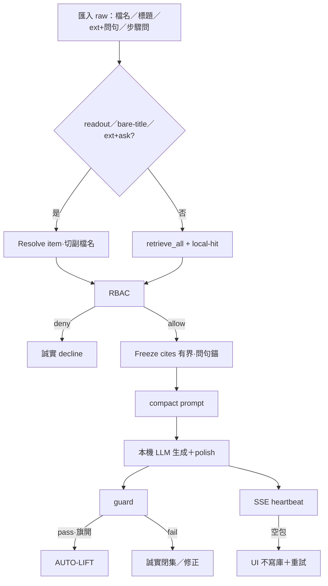

# 本地 AI·KH 閉環自我進化——優化計畫書（readout＋compact · 2026-08-06）

> **一句**：在**深化理解 r8＋選刀** 與**雙底線／AUTO-LIFT／T2／local-hit** 之上，本地匯入 raw 的標準作答為：  
> **Resolve／命中 → 凍結有界引文 → compact 短答 prompt → 本機 LLM 生成（宜逐步條列）→ guard／抛光**；  
> 以 `國碩-ERP-GP_DR說明(20211007-4-rman)1：請讀出具體內容` 為 **canonical**，**所有同類匯入 raw**（純貼檔名、標題：讀出、**檔名.ext＋後綴問句**、步驟問）皆依此。  
> **瓶頸定位（Steward 已核）**：檢索／入庫能命中；**逾時／想題／假「無此內容」／UI「(無回覆)」**來自問句解析漏判、引文錨偏、本機 LLM 體積與空 SSE——**不是** KH 語料缺件（禁整庫回填當進化）。  
> **分軌（2026-08-12）**：KH＝獨立專案軌；**選刀**＝`reports/augur_kh_opt_stepwise_best_next_plan_20260812.md`；**不**候 tip、**不**「讓 B3」才開工、**不**掛在 r14 市場主軸下。  
> **性質**：[I] 優化總冊；不創 [N]；每波仍須各別 GO。  
> **SSOT**：`rev=readout-compact-raw-v3+ext-ask+no-empty`；衝突以**本檔＋KH 選刀專檔**為準。

---

## §0 標準場景與全 raw 通則

### 0.1 使用者問法（家族 · 以此類推所有匯入 raw）

| 形態 | 例 | 必須走 |
|---|---|---|
| **標題／檔名＋讀出** | `國碩-ERP-GP_DR說明(20211007-4-rman)1：請讀出具體內容` | readout＋compact |
| **純貼檔名／標題**（UI 常見） | `國碩-ERP-GP_DR說明(20211007-4-rman)1` | 同上（bare-title＝readout 意圖） |
| **檔名.ext＋後綴問句**（無冒號） | `Genero….ppt中，詳細說明XML…`／`….ppt提到啟動 server…` | 同左：切副檔名 resolve＋問句錨引文＋compact |
| **標題＋問步驟** | `…：請依引文逐條步驟列出` | readout／命中＋compact＋**逐步條列口吻** |
| **專詞＋作業** | `tiptop2／topprod r-man 還原怎麼做？` | retrieve_all＋命中修＋（可）compact |

**成功定義（誠實）**：

| 是 | 不是 |
|---|---|
| Resolve／ANN 命中正確 `item_id`（錨 **277948** 族；Genero 族例 **1818820**） | 誤撈無關 works／雜訊當「有答」 |
| **本機 LLM 依引文生成**摘要／步驟（可條列）；cite 可核（問步驟→錨 API／操作段，非文首同名詞） | **僅粘貼庫內原文重整**當產品答案；或參數記憶幻造 |
| 引文凍結有界（防 900s 逾時）；freeze 可依問句詞密排序 | 全量 inline＋想題長文把 guard 打爆 |
| 無授權／無材料 → 誠實 decline | 已入庫卻回「知識庫中無此內容」（假拒絕） |
| 有正文才寫對話歷史 | SSE 空包／`(無回覆)` 當成功落庫 |
| 答對（R-hybrid）→ 可 AUTO-LIFT（旗開） | 無核可抬層；對話裸 approve 來源 |

### 0.2 標準處理鏈（Readout⊕Compact Path · **全匯入 raw 正式**）

```text
① Intent：讀出／具體內容／「標題：問句」／**純檔名・長標題**（bare-title）／**檔名.ext＋後綴問句**（無冒號）
② Resolve：標題／檔名（切到副檔名）→ item_id（優先於純 ANN）；失敗 → retrieve_all（exact 半額＋ANN）
③ Auth：scope=(is_super|allowed∋domain, user_id)；local 須登入授權
④ Cite：有界原文；問句尾關鍵詞密度錨（加權操作／API 段，忌文首同名詞）
⑤ Freeze：prefer 命中 item＋問句詞密；AUGUR_COMPACT_CITE_CHARS／_N 裁引文（寧少勿破閘）
⑥ Compact prompt：禁想題、禁複述問句、禁引號；技術題宜條列
⑦ LLM：本機 qwen（think=False）；保留 serve 端 model（wrap 不重建汰換）
⑧ Polish＋guard：剥想題頭／指令回聲；逐字／數字閘
⑨ Stream：全檔位 SSE heartbeat（長答勿空線）
⑩ UI：空正文／`(無回覆*` → err＋重試、**不寫庫**
⑪ Evolve（可選）：AUGUR_KH0_ANSWER_AUTO_LIFT=1 → R-hybrid → ≤KH2（T2 機械源）
```

**逐步條列（產品口吻 · 同一 compact 路徑）**：

```text
問句加：「請依引文逐條步驟列出…；用 1. 2. 3.；每行一步；不要一段摘要」
→ 仍走 ①–⑩；**不另開第二條管線**；模型弱時須問句顯式編號約束（實證：僅「逐條」易壓成段）
```



### 0.3 LIVE 錨與已閉缺陷

| 現象 | 證據／處置 |
|---|---|
| 件就緒仍問不到 | LOCAL-KH-HIT-FIX：丟 CJK 單字、`exact_cap=k//2`、補拉丁 |
| 全量 inline＋4b → ~900s 逾時 | 凍引文＋compact；命中可 ~數分內 guard 過 |
| 想題／複述問句 → guard「引文非逐字」 | compact prompt＋`polish_compact_response` |
| UI 貼純標題 →「知識庫中無此內容」 | bare-title→readout；重啟 advisor／chat；帳 `KH-BARE-TITLE-READOUT-UI-FIX` |
| **`….ppt中／提到…` → 0 cite／(無回覆)** | 切副檔名＋問句錨＋SSE 心跳＋空包不落庫；帳 `READOUT-EXT-THEN-ASK`／`NO-REPLY-FILENAME-ASK-HARDENING` |
| 問法閉集回歸 | `python scripts/kh_query_form_matrix.py`（`--offline` 零 IO）；帳 `KH-QUERY-FORM-MATRIX-EXECUTED` |
| 引文錨文首「Server」漏 API 段 | 問句密度＋`fgl_ws` 加權；freeze `prefer_terms` |
| wrap 重建 Ollama 丟 `--model` | wrap **只抛光**呼叫端 `llm_fn` |
| AUTO-LIFT／T2／wire | ✅；碼預設 off；ops 常駐可開 |
| 殘債 | KH8 鑑別未開；**禁**為無回覆族整庫回填 KH |

錨件：`item_id=277948` · `國碩-ERP-GP_DR說明(20211007-4-rman)1.docx` · domain=`local` · depth≥7 · `answer_status=eligible`。  
同型例：`1818820`／`1818830` · `Genero Web Services 教育訓練(程式).ppt`。

---

## §0.5 雙底線（繼承；補 D-Compact）

| 底線 | 義務 | LIVE |
|---|---|---|
| **D-Data** | 可理解 item ≥KH0 | ✅ `kh0_breach=0` |
| **D-Answer** | 有材料→可修正答；答對可抬 | ✅ 碼有；wire 預設 off |
| **D-Readout** | 讀出／純標題／**ext+ask** → Resolve＋原文引文 | ✅ |
| **D-Compact**（本修訂） | 匯入 raw／讀出自動凍結引文＋短答；瓶頸＝LLM 體積 | ✅ auto |
| **D-NoEmpty**（2026-08-12） | 空 SSE／`(無回覆)` 不落庫；stream heartbeat | ✅ |
| **D-FillAuto**（2026-08-12） | 設定／wsj 題**直接問**即錨填寫範例＋`欄位=值`；不需使用者先問檔名 | ✅ `KH-D-FILLAUTO-ADOPTED` |

來源：**機械 system 可**（T2）；**web／對話不可**（T0）。

---

## §1 深化理解 → 本修訂命題

### 1.1 獨立專案軌（已退出市場主軸編排）

本檔＋`augur_kh_opt_stepwise_best_next_plan_20260812.md`＝KH 全線；**不**讀 tip／PriceAdj／hold-#1 決定開工。  
`augur_llm.lock`＝共用互斥（基礎設施），**≠**市場指揮。  
C1 EXPAND 若碰 predict 權重 → **另 GO** 且標隔離（K10）。

| 階 | 內容 | 狀態（2026-08-12） |
|---|---|---|
| **A** | 導航解耦 | ✅ → 升級為 **SPLIT**（`KH-SPLIT-FROM-MARKET-AXIS-ADOPTED`） |
| **B** | ingest-driven 觸發（S0–S9） | ✅ |
| **C** | 碼／hook／可選輪詢 | ✅ |
| **選刀外置** | 退出 r14 市場板 | ✅ `kh_opt_stepwise_20260812` |
### 1.2 KH 命題板

| ID | 命題 | 狀態 | 優化方向 |
|---|---|---|---|
| **K-01** | D-Data 破口 | ✅ 0 | 守 |
| **K-02** | A.1／title KH0 | ✅ | 守 |
| **K-02b** | D-Answer 地板 | ✅ stub 抽測帳 | 守；可續 live 抽樣 |
| **K-02c** | 答對 AUTO-LIFT | ✅ 碼＋wire | ops 開旗 |
| **K-02d** | 讀出／pure-title／**ext+ask** resolve | ✅ | 守；切副檔名 |
| **K-02e** | local／混語檢索 | ✅ hit-fix＋local conc＋**items 游標追上** | 守 |
| **K-02f** | 緊湊作答（凍引文） | ✅ | 運維 `AUGUR_COMPACT_*`；`prefer_terms` |
| **K-02g** | **逐步條列／全 raw 通則** | ✅ compact 預設 1.2.3.（`AUGUR_COMPACT_STEPWISE`） | 守；`=0` 可退摘要 |
| **K-02h** | 問句錨引文＋空包不進化 | ✅ | 守；**禁**整庫回填當修 |
| **K-02i** | 問法回歸矩陣 | ✅ `scripts/kh_query_form_matrix.py` | 守；修問法必跑 |
| **K-02j** | **D-FillAuto** 設定填值自動告知 | ✅ 範例包＋alias＋compact `欄位=值` | 守；同類高頻設定可擴包 |
| **K-03** | depth≈7／KH8 | 🔴 | 鑑別力 |
| **K-04** | 他域 FT | 🔴 | domain 分隊 |
| **K-05** | 治權／assist | 🟡 | 禁對話 approve |
| **K-07** | 錯料可見 | ✅ 程序釘（未強制寫庫） | 人實改另回合 |
| **K-08** | C1 | 🔴 | 另 GO；**隔離**市場日更／禁默加權 |
| **K-10** | KH10 | 禁 | — |

---

## §2 閉環自我進化定義（8 節）

1. **製造／准入** — local_files／harvest／QUAL（所有匯入 raw 入口）  
2. **普遍理解（D-Data）** — ≥KH0  
3. **可命中（D-Hit）** — RBAC＋exact／ANN  
4. **可讀出（D-Readout）** — resolve／bare-title  
5. **可緊湊答（D-Compact）** — 凍引文＋compact＋本機 LLM 生成（宜逐步條列）  
6. **答對抬層** — R-hybrid → ≤KH2；T2 可選  
7. **加深** — KH3–KH9（有鑑別力才宣佈）  
8. **回饋** — 人改料→回 2；禁對話裸放行來源  

---

## §3 優化軌

| 軌 | 名稱 | 對應 |
|---|---|---|
| **K-A** | 底線穩態 | K-01／K-02 |
| **K-B** | 讀出／命中／緊湊 | **K-02d–g** ← **現主刀（運維＋殘債）** |
| **K-C** | 抬層閉環 | K-02c |
| **K-D** | 終態／KH8 | K-03／K-04 |
| **K-E** | 治權 | K-05；T0／T2 |
| **K-F** | 文件地盤 | 本檔＋EXECUTED |

```text
FZ/GATE-keep(知識) | no-web-dialog-approve | T2-system-ok | no-SIM-apply | no-KH10
| KH-SPLIT-from-market-axis | S0-S9 | apply=opt-in | no-default-timer
```

---

## §4 逐步最佳下一步（可先／∥）· 現況 2026-08-12（階 A 後）

| # | 問題 | 最佳下一步 | 可先／∥？ | 狀態 |
|---|---|---|---|---|
| **1** | D-Data 破口 | 守；勿回退 | — | ✅ |
| **1c** | AUTO-LIFT 熱路徑 | CLI 試點 ✅；熱路徑旗仍 **off**（勿默開 systemd） | **KH∥** | 🟢 試點 `…-PILOT-EXECUTED-20260812`；🟡 常駐旗 |
| **1d** | 讀出／bare-title | — | — | ✅ |
| **1f** | 緊湊＋UI 假拒絕 | 運維調 `AUGUR_COMPACT_*`；改碼重啟 | ∥運維 | ✅ |
| **1g** | 逐步條列預設 | — | — | ✅ |
| **1e** | local concordance | — | — | ✅ |
| **1i** | items 主游標落後 | —（zh／en pending=0） | — | ✅ `CONCORDANCE-ITEMS-CURSOR-CATCHUP` |
| **1h** | 錨題回歸／逐步口吻 | stub ✅；live：8b 逐步達標、4b 仍弱 | ∥ | 🟢 8b `KH-K7-STEPWISE-TONE-EXECUTED`；🟡 4b |
| **1b** | D-Answer 地板 | 可續 live 抽測 | ∥1c／1h | ✅ stub |
| **2** | 錯料可修正可見 | 人實改一句→再問（程序已釘） | ∥隨時 | ✅ 程序；人實改另回 |
| **3** | 治權誤用（K-05） | 守 T0；抽樣無 web／對話 approve | ∥隨時 | 🟡 守 |
| **4** | 他域 FT（K-04） | domain 分隊＋另 GO | 閒時；不擋抬層試點 | 🔴 |
| **5** | KH8／depth≈7（K-03） | **plan-first** 鑑別力 | 阻塞加深；勿假綠抬層 | 🔴 **加深前必做** |
| **8** | C1（K-08） | EXPAND 另 GO；隔離市場日更 | 延後 | 🔴 |
| **9** | KH10 | — | **禁** | 禁 |
| **10** | 入版控 | 隨 ARCHIVE／commit 授 | ∥文件 | 📄 |
| **11** | 觸發／選刀 | A✅ B✅ C✅；選刀＝`kh_opt_stepwise_20260812` | 階梯 | 🟢 |
| **PDF-C** | 弱／掃描 PDF 字層 | P0 ✅；ASR **不**進 PDF-C | ∥ | ✅ P0 |

> **選刀**：一律先開 `reports/augur_kh_opt_stepwise_best_next_plan_20260812.md`。  
> **加深**必先 **#5 KH8 plan-first**。  
> **禁**：因 tip／B3 停 KH；默裝日曆進化；未 GO 上 timer。

---

## §5 波次

### Wave Ρ0｜命中＋讀出＋緊湊（主波 · 近完）

| 步 | 內容 | 狀態 |
|---|---|---|
| Ρ0.0 | local-hit | ✅ |
| Ρ0.1 | Readout resolve | ✅ |
| Ρ0.2 | 有界全文入引文 | ✅ |
| Ρ0.3 | 錨題讀出＋RMAN | 🟡 讀出✓；路徑另抽 |
| Ρ0.3b | compact 凍引文＋抛光 | ✅ |
| Ρ0.3c | bare-title／UI 假拒絕 | ✅ |
| Ρ0.3d | 逐步條列預設口吻 | ✅ `KH-COMPACT-STEPWISE-DEFAULT-EXECUTED` |
| Ρ0.4 | local×eligible concordance 補建 | ✅ `LOCAL-KH-CONCORDANCE-1e-EXECUTED` |

**Ρ0 驗收（授權 scope、已登入）**：

1. `…：請讀出具體內容` → cite **277948**；非「知識庫中無此內容」  
2. 純標題同檔名 → 同上  
3. `請依引文…1.2.3. 逐步條列` → 本機 LLM **生成**步驟條列（非空白閉集）  
4. 未登入／無 local → 誠實空  

### Wave Ρ1｜抬層運維

- 試點 `AUGUR_KH0_ANSWER_AUTO_LIFT=1`  

### Wave Ρ2｜加深 · Ρ3｜C1

- 繼承；KH8 前不宣佈深層進化成功；C1／EXPAND 另 GO（不綁 tip）  

---

## §6 度量

| 度量 | 綠燈 | 假綠禁 |
|---|---|---|
| D-Data | 破口 0% | 只量有全文 |
| D-Hit／D-Readout | 命中目標 item | 有答 cite 他件 |
| D-Compact | prompt／cite 有界；guard 過；UI 非假「無」 | 全量 inline「跑完了」卻 900s 殺 |
| 逐步條列 | 編號步驟且可核引文 | 無 cite 長文；或原文整篇 dump 當唯一答案 |
| AUTO-LIFT／來源 | 旗＋尺／僅 system | 對話裸 approve |

```bash
# 運維旋鈕
# AUGUR_ANSWER_MODE=auto|compact|full
# AUGUR_COMPACT_CITE_CHARS=2000   # CPU 友善預設；逐步可升
# AUGUR_COMPACT_CITE_N=3
# AUGUR_COMPACT_NUM_PREDICT=480   # wrap bind 鎖死（對症逾時）
# AUGUR_COMPACT_STEPWISE=1
# AUGUR_SERVE_NUM_PREDICT=900     # 非 compact 主路徑
# AUGUR_KH0_ANSWER_AUTO_LIFT=1    # 預設勿開直至抽測
```

錨題：

```text
Q1 國碩-ERP-GP_DR說明(20211007-4-rman)1：請讀出具體內容
Q2 國碩-ERP-GP_DR說明(20211007-4-rman)1
Q3 …：請依引文用 1. 2. 3. 逐步條列；每行一步；涵蓋 AIX／FS／NBU／r-man／驗證
Q4 國碩 ERP-GP DR：r-man 備份路徑從哪改到哪？
```

---

## §7 位階

| 檔 | 位階 |
|---|---|
| 大憲章 | [N] |
| r8／r10 | 全專案導航 |
| dual-kh0-floor 舊 evolve | 譜系 |
| **本檔** | **KH 閉環優化執行 SSOT（現）** |
| compact／bare-title／hit-fix／lift audits | 已落地帳 |

---

## §8 Paste-ready

```text
LOCAL-AI-KH-LOOP-EVOLVE-OPT | rev=readout+split-market
| FZ/GATE-keep(知識) | KH-SPLIT | S0-S9 | apply=opt-in | no-default-timer
# select-knife: reports/augur_kh_opt_stepwise_best_next_plan_20260812.md
# trigger: reports/augur_kh_ingest_driven_trigger_plan_b_20260812.md
# cli: scripts/kh_ingest_trigger.py · scripts/kh_private_smoke.py
```

逐步條列（同路徑加口吻）：

```text
<檔名或標題>：請依引文用編號 1. 2. 3. 逐步條列完整操作步驟；每一行一步；不要寫成一段摘要。
```

AUTO-LIFT（ops）：

```text
export AUGUR_KH0_ANSWER_AUTO_LIFT=1
```

改碼後：**必須** `systemctl --user restart augur-advisor augur-chat`（見 handoff `restart-systemd-after-edit`）。

---

## §9 驗收（本計畫書）

1. 能復述：**雙底線＋讀出／bare-title＋compact 凍引文＋本機 LLM 生成（逐步條列）＋抬層／T2**。  
2. **所有匯入 raw** 共用 §0.2；不以「整庫 dump」或「僅原文重整」當產品成功定義。  
3. 瓶頸＝本機 LLM／prompt，**不是**入庫缺件時的假敘事。  
4. 已 EXECUTED 與殘債（concordance／條列預設 GO／錨帳）分列清楚。  
5. 市場正交／凍結／KH10 禁仍在。  

---

## §10 讀序

1. `reports/augur_deep_understanding_r8_20260806.md`  
2. `reports/augur_opt_stepwise_best_next_plan_r10_20260806.md`  
3. `archive/slim-t2/augur_local_ai_kh_loop_evolve_opt_plan_20260806.md`（譜系）  
4. **`reports/augur_local_ai_kh_loop_evolve_opt_plan_20260806_readout.md`（本檔）**  
5. audits：LOCAL-KH-HIT-FIX · KH-READOUT-RESOLVE · KH-COMPACT-ANSWER · KH-BARE-TITLE-READOUT-UI-FIX · AUTO-LIFT／T2  

*完。[I] self-reported（#32a）。rev=readout-compact-raw-v2。*
