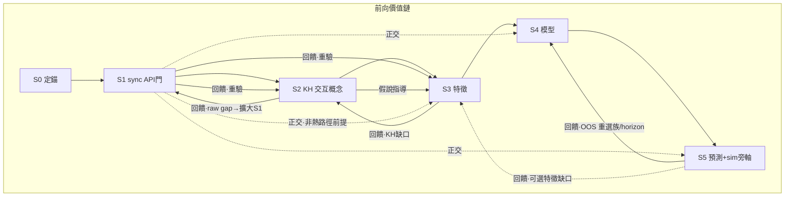
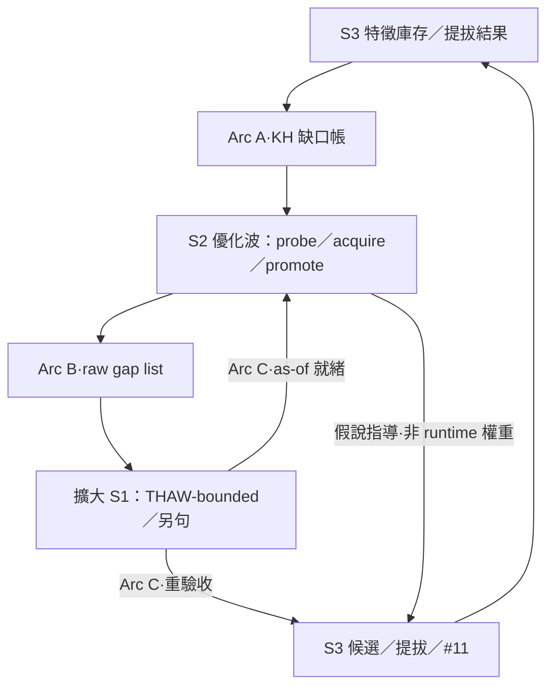
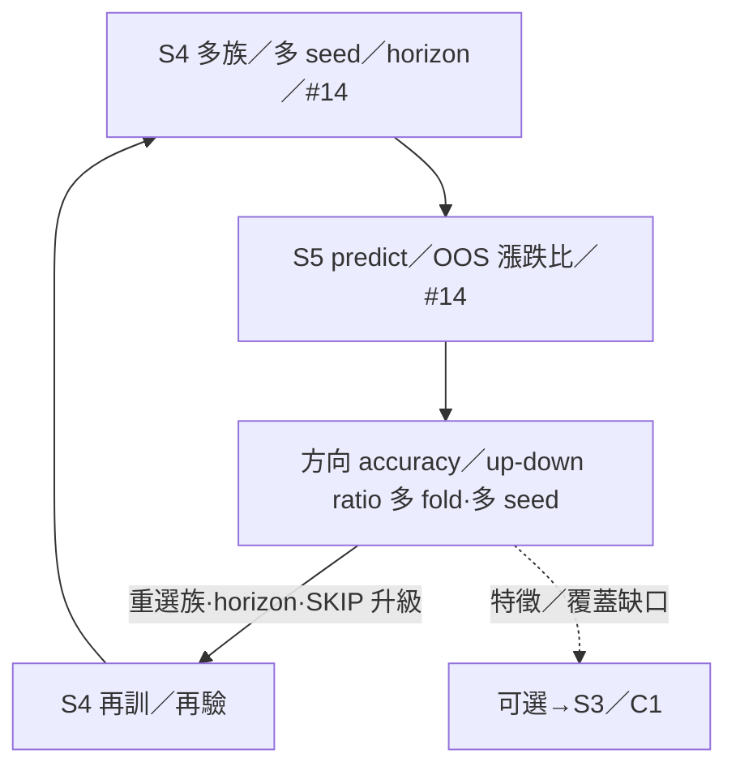
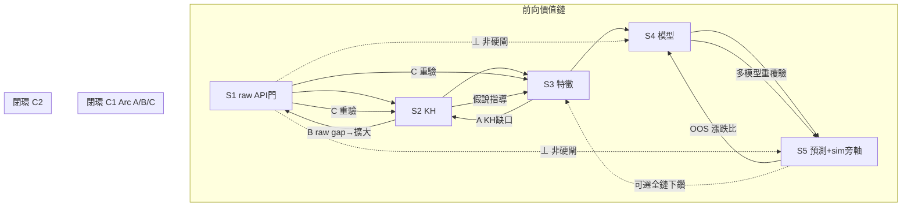
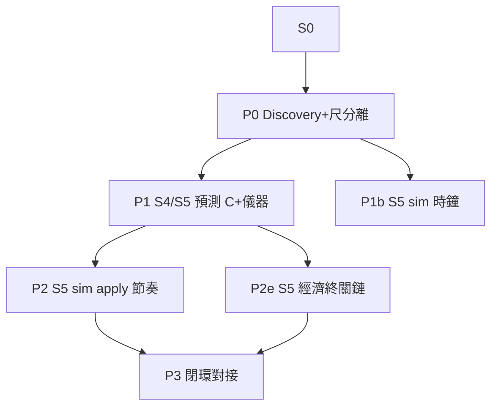

# 本地 AI 股市預測模擬——S1→S5 閉環自我進化計畫書（2026-08-04）

> **本質一句**：本檔＝**S1→S5 自我進化閉環計畫書**（非線性一次做完的 checklist）。  
> **性質**：[I] 計畫書（CLAUDE #16／#20）。**不創設治權判準**；不改 [N]；不代簽；Sole Steward（**無公示要件**）。  
> **觸發**：Steward 委託——「本地 AI 股市預測模擬自進化」；**主敘事＝連續閉環**（前向 S1…S5＋回饋弧）；C0／C1／C2 僅為同一閉環之可指稱弧段，**非**三份並列 checklist。  
> **本輪硬紀律**：plan／docs only——**零業務碼**、**零 Registry 寫**、**零 FinMind／FRED 放量**、**零 train／predict 寫**、**零 sim `--apply`**。  
> **self-reported（#32a）**：優先序與缺口判讀為 AI 呈案；live 數字引既有 audit／報告時點，**本檔撰寫窗未重跑 DB 全表**。  
> **本地 LLM／MCP**：`local_research` 逾時；`recall` 片段＝[I] 輔助，**不得**貼入 [N]。  
> **本質留痕**：`audits/SIM-SELF-EVOLVE-ESSENCE-S1S5-LOOP-20260804.md`。

| 角色 | 路徑 | 效力 |
|---|---|---|
| 決策導覽（地基） | `reports/augur_project_optimization_plan_20260804.md` | 全專案優化整合 |
| 一般優化 step／runbook | `reports/augur_optimization_step_plan_r3_20260804.md` | Registry／A 取數車道 |
| sim 校準專項（已拍） | `reports/augur_local_ai_sim_evolution_plan_20260804.md`（`OPT-SIM-EVO-20260804-go`） | **complement**；S5 旁軸繼承 |
| **本檔（閉環 SSOT）** | `reports/augur_local_ai_predict_sim_self_evolve_opt_plan_20260804.md` | **S1→S5 閉環自我進化**（Steward-approved 2026-08-04） |
| S3 特徵類別矩陣 | `reports/augur_s3_features_for_market_model_families_20260804.md` | 市場族→特徵組（**Steward-approved**／`S3-FEATURES-PLAN-go`；build 待 `S3-WAVE-*-go`） |
| S4 市場族詳細 | `reports/augur_s4_market_model_families_opt_plan_20260804.md` | taxonomy 波次矩陣（**Steward-approved**；`S4-FAMILIES-PLAN-go`；`S4-WAVE-A` in-flight／train-matrix DONE 2026-08-04——方向臂另帳） |
| 回饋弧·S2-after-S3（KH） | `reports/augur_s2_kh_optimize_after_s3_plan_20260804.md` | S3→KH 缺口→S2（≡ `S2-KH-OPT-AFTER-S3-go`／C1 Arc A） |
| 回饋弧·S1–S2–S3 全弧 | `reports/augur_s1_s2_s3_closed_loop_plan_20260804.md` | S3→S2→擴大 S1→再進 S2／S3（C1 Arc A／B／C；待 loop GO） |
| 回饋弧·S4↔S5 | `reports/augur_s4_s5_closed_loop_plan_20260804.md` | 多模型↔漲跌比 OOS（C2；**已授** `LOOP-S4-TO-S5-go`／`LOOP-S5-TO-S4-OPT-go`／`LOOP-FULL-CHAIN-go`＝`audits/LOOP-S4-S5-FULL-GO-20260804.md`；≠一鍵全鏈重建） |
| audit 指針 | `audits/SIM-SELF-EVOLVE-OPT-PLAN-20260804.md` | 本計畫登錄 |
| 本質／閉環釘 | `audits/SIM-SELF-EVOLVE-ESSENCE-S1S5-LOOP-20260804.md` | Steward「本質＝閉環」留痕 |
| S4 族計畫登錄 | `audits/S4-MARKET-FAMILIES-PLAN-20260804.md` | 市場族擴張指針（**已拍**） |
| S2-after-S3 迴路登錄 | `audits/S2-KH-AFTER-S3-LOOP-20260804.md` | PME 式 S3→S2 KH 子弧 |
| S1–S2–S3 迴路登錄 | `audits/SIM-S1-S2-S3-CLOSED-LOOP-20260804.md` | C1 全弧指針（若已落地） |
| S4↔S5 迴路登錄 | `audits/SIM-S4-S5-CLOSED-LOOP-20260804.md` | C2 指針（若已落地） |

---

## 0. Steward 主軸＝S1→S5 自我進化閉環

### 0.0 本質（主敘事；一句定錨）

**本檔＝S1→S5 自我進化閉環計畫書**——不是把 S1…S5 當線性 checklist 一次做完，而是**連續運轉**的閉環：前向價值鏈（S1→S2→S3→S4→S5）與回饋弧（特徵↔KH↔raw；模型↔預測尺）反覆改善。  
代號 **C0／C1／C2**＝同一閉環上的可指稱弧段（便於 GO／詳細檔），**不得**讀成三套互搶主軸的平行計畫。

### 0.1 Steward 原文（管線＋本質＝閉環）

**本質定錨（Steward 2026-08-04 · 要旨／逐字）**：

```
本地AI股市預測模擬自進化計畫
→抓取finmind及fred(資料完整)
→raw交互KH
→特徵(最佳化完整＋多種重覆驗證)
→模型(多種重覆驗證)
→預測股價(漲跌比率準確率重覆驗證)

此計畫的本質就是S1到S5的自我進化的閉環計畫書
```

初拍管線（GO 當日；史料）：

```
本地AI股市預測模擬自進化計畫
  → 抓取 FinMind 及 FRED 資料
  → raw data 交互產生 KH
  → 產生股票特徵值
  → 產生模型
  → 產生預測股價
```

**驗收括號補強（latest）**（Steward 2026-08-04；**不撤** `SIM-SELF-EVOLVE-OPT-PLAN-20260804-go`；**supersede** 先前括號細節更豐富處）——全文見 §0.5：

```
本地AI股市預測模擬自進化計畫
→抓取finmind及fred資料(資料完整)
→raw data交互產生KH
→產生股票特徵值(最佳化特徵完整，最佳化多種特徵值重覆驗証)
→產生模型(最佳化多種模型重覆驗証)
→產生預測股價(最佳化準確率的漲跌比率重覆驗証)
```

### 0.2 閉環地圖（前向＋回饋＝一體）

| 階段 | Steward 句 | 一句做什麼 | 階段驗收（括號對映） |
|---|---|---|---|
| **S0** | （計畫本體） | 定錨／拍板／讀序／護欄——本檔與 audit；**零寫庫零 API** | GO 仍生效＋§2.7 Discovery **DONE** |
| **S1** | 抓取 FinMind 及 FRED 資料（**資料完整**） | 取數落地 raw／macro；**API 門**；與預測熱路徑**分離** | **THAW-bounded as-of 完整**（非「全 339 表」）——見 §0.5／S1 驗收 |
| **S2** | raw 交互 KH | raw↔know-how **交互**→概念／關係（KH／RKI／PME map）；**非整庫 raw 入靈魂** | 交互概念可引用；V-SOUL／非整庫 raw（doctrine 不變） |
| **S3** | 特徵（**最佳化完整＋多種重覆驗證**） | 庫內 raw→`feature_values`／panel（as-of；anti-leakage） | 多特徵＋提拔閘＋**≥3／多 seed 重覆驗**＋誠實覆蓋——見 §0.5／S3 |
| **S4** | 模型（**多種重覆驗證**｜taxonomy 波次） | 庫內 as-of train／TWEVO·PME 晉升→prodset／artifact；**≈12 大類／≈35 變體族**入計畫 | 市場族 Wave A–G＋多 seed／horizon／#14／誠實 SKIP＋八閘＋人 APPLY——見 §0.5／S4／`augur_s4_market_model_families_opt_plan_20260804.md`（**已拍**） |
| **S5** | 預測股價（**漲跌比率準確率重覆驗證**；＋sim） | predict／經濟終關／arena；**並行** sim 風險形狀校準回路（禁混尺） | 方向／漲跌比 **OOS／多 seed 重覆驗**＋#14；**禁假確立級**——見 §0.5／S5 |



**讀法（單一閉環）**：

| 弧 | 舊代號（別名） | 路徑 | 詳細 |
|---|---|---|---|
| **前向** | （價值鏈） | S1→S2→S3→S4→S5 | 本節；S3＝`augur_s3_features_for_market_model_families_20260804.md`；S4＝`augur_s4_market_model_families_opt_plan_20260804.md`（**已拍**） |
| **特徵↔概念↔raw** | C1（Arc A／B／C） | S3→S2→擴大 S1→重驗 S2／S3 | `augur_s1_s2_s3_closed_loop_plan_20260804.md`；Arc A＝`augur_s2_kh_optimize_after_s3_plan_20260804.md`；§0.6 |
| **模型↔預測尺** | C2 | S4↔S5（可選下鑽 S3） | `augur_s4_s5_closed_loop_plan_20260804.md`；§0.7 |
| **全鏈** | C0 | 前向 ∪ 上兩回饋弧 | §0.8＝**同一敘事的總圖**，非第三份 checklist |

虛線正交＝S1 **不得**當 S3–S5 硬閘——缺最新增量時用 **DB as-of** 續跑（見 §1）。

### 0.3 一句定位

在本機把 Steward 管線跑成**可觀測、可節奏、可驗收的自我進化閉環**：前向 S1（取數地基）→S2（KH 概念）→S3（特徵）→S4（多模型）→S5（漲跌比重覆驗＋sim 旁軸）；回饋弧讓特徵結果重估 KH／擴大 S1、讓預測尺重選模型族／horizon——成功定義仍對齊靈魂：**經濟價值**（原則精華 #14），**不是**裸 IC、**不是** mapped↑、**不是** sim 校準綠、**不是**假關確立級。

### 0.4 位階與讀序

| 是 | 不是 |
|---|---|
| [I] 執行藍圖／後續優化 SSOT | 憲章／規格／RULING [N] |
| Steward 管線＝**唯一主軸＝S1→S5 閉環** | 第三份打架 master 覆蓋 r3；C0／C1／C2≠三套平行 SSOT |
| 吸納地基 P3＋r3 車道＋sim 專項＋P1-DRIFT＋RKI | AI 代簽 APPLY／解凍放量 |
| 預測 ⊥ live API（庫內 as-of） | 「解凍＝可假關確立級」 |

```
HANDOFF → 地基優化計畫 → step r3 → 本檔（S1→S5 閉環主敘事）
                ↘ next-best（便利條）
                ↘ OPT-SIM-EVO（S5 sim 子軸細節）
                ↘ P1-DRIFT／RKI（S4／S2 專項）
Steward 明示碼 > 本檔 > 便利條
```

**與 sim 專項**：`OPT-SIM-EVO-20260804-go`＝S5 **sim 校準**子軸法源；本檔不重開第二套；繼承禁 auto-promoted／首格人工節奏。  
**與 r3**：Registry／解直綁／有界取數仍走 r3；本檔消費其產物，不吃 WM.36 寫庫弧。

### 0.5 Steward 2026-08-04 管線驗收補強

> **效力**：本節＝approved SSOT 之**驗收 enrichment**——**不撤銷** §7.1 GO、不改正交／KH／anti-leakage／禁假確立級硬邊界、不默授放量／sim `--apply`／C-go／Registry。  
> **觸發**：Steward 精煉意圖（括號＝各階段可測終態）。  
> **latest supersede**：凡括號細節更豐富處，以本節 **latest** 原文為準；先前括號（無「多種／重覆驗証」）僅作史料，**不**另開第二套驗收尺。

**Steward 原文（latest · 2026-08-04 · 逐字）**：

```
本地AI股市預測模擬自進化計畫
→抓取finmind及fred資料(資料完整)
→raw data交互產生KH
→產生股票特徵值(最佳化特徵完整，最佳化多種特徵值重覆驗証)
→產生模型(最佳化多種模型重覆驗証)
→產生預測股價(最佳化準確率的漲跌比率重覆驗証)
```

**史料（先前括號；已被 latest supersede where richer）**：

```
…特徵值(最佳化特徵完整) → 模型(最佳化模型) → 預測股價(最佳化準確率的漲跌比率)
```

#### 階段驗收一覽（括號 → 可測判準）

| 階段 | Steward 括號（latest） | 可測驗收（一語） | 誠實邊界（非驗收） |
|---|---|---|---|
| **S0** | （計畫） | GO 仍生效；§2.7 Discovery **DONE**（`audits/SIM-SELF-EVOLVE-S0-DISCOVERY-20260804.md`）；零寫庫零 API | 不含後續開工碼 |
| **S1** | **資料完整**（doctrine **不變**） | **THAW-bounded as-of 完整**：白名單日頻路徑（`daily_maintenance --end <日>` audit+heal；`sync_macro --no-catalog`）之**熱路徑 raw／FRED** 達呼叫端 as-of（或庫內最大可見交易日），且對帳／audit 無該窗**未結致命洞**（403→停並記缺席，不硬衝偽完整） | **≠「全 FinMind 339 表齊」**；≠ Dividend rebuild／寬窗／`--with-dim-sync`／G-DIV·G-CAT·G-ATTEST 另帳已清；≠預測硬閘 |
| **S2** | （無括號；doctrine **不變**） | raw↔KH **交互**產出可核概念／關係（RKI／map／license 終態可引用）；文件與探針可溯 | 非整庫 raw 入靈魂；不擅開異域灌因子；knowledge **不當**預測特徵 |
| **S3** | **最佳化特徵完整，最佳化多種特徵值重覆驗証** | **多特徵＋提拔過閘＋重覆驗＋panel 誠實**：(0) Steward mandate＝為 taxonomy **≈10–12 大類／30–40 變體族**列出所需特徵類別並納入 S3（SSOT＝`reports/augur_s3_features_for_market_model_families_20260804.md`；與 S4 波次對齊）；(1) **多種**特徵候選／**組**入漏斗，非整單特徵一次過；(2) 提拔閘＝方法論漏斗 4（`verify_candidate_promotion`：as-of 口徑＋`effective_t_hac`｜禁裸 iid t＋多因子增量）；(3) **重覆驗証**＝含隨機性 metric 依 CLAUDE #11 **≥3 次**（或多 seed）取 min／median／max／mean，單次極值須註明；(4) prodset 契約欄在目標 as-of panel **有列則真算、缺列不 zero-/median-fill 偽 100%**；(5) 特徵集仍須對齊後續 #14（完整≠已可交易）；LOB／NLP／LLM＝gated／N/A 誠實 | ≠ 單次 seed／單特徵宣稱完整；≠ verify_* 中位數補滿覆蓋假象；≠未過提拔逕入生產；≠臆造 FinMind 欄／假覆蓋另類資料 |
| **S4** | **最佳化多種模型重覆驗証** | **市場分類學全覆蓋（波次）＋重覆驗＋八閘／prodset 可溯**：(0) Steward mandate＝taxonomy **≈10–12 大類／30–40 常見變體族**均入 S4 計畫並做**最佳化重覆驗証**（SSOT＝`reports/augur_s4_market_model_families_opt_plan_20260804.md`；**≠**僅 RankRidge+GBDT）；(1) 按 **Wave A→G** 驗證（tabular／ranker→classical→sequence DL→…）；每族：**多 seed（#11 ≥3 where stochastic）＋適用 horizon 臂**＋#14 經濟終關可溯；缺資料／infra→**誠實 SKIP**（非假 pass）；(2) 庫內 as-of train→artifact（`--skip-sync`）；(3) 進化側**八閘**→queue→**人** APPLY→prodset＋`model_registry`／artifact；(4) `verify_prodset_hotpath`（或等價）綠；(5) **IC 綠≠最佳化完成**；全普查＝**多週**、非單次 session | ≠ 停在 2 族基線當「多種完成」；≠ 單模型單 seed；≠ adapter 缺時假綠；≠ auto-promoted／未授 `--allow-apply`；≠必須 live API 才准 train；≠本 enrichment 默授全 40 族開訓 |
| **S5** | **最佳化準確率的漲跌比率重覆驗証** | **方向／漲跌比重覆可度量＋尺分離**：(1) OOS **direction accuracy**（或 up／down hit ratio）出自 `run_economic_eval`／direction 評估 stdout／表，可溯 (a)(b)(c)；(2) **重覆驗証**＝**OOS folds** 及／或多 seed 重跑，陳報分布（非單 fold 極值當終局）；(3) **確立級**唯 `direction_gate.status='evaluated_pass'`（現況 pass＝0 則誠實呈報，**禁**以 SIGN／sim／mapped／predict dry 假關）；(4) #14 經濟終關與方向尺並陳、**禁混** sim 校準綠；(5) arena／predict 走 `--skip-sync`／庫內 as-of | ≠ 單次準確率好看＝確立級／可交易；≠改門柱搶 pass；≠ sim 校準＝漲跌比優化完成 |

**對映專案機械（S3–S5「重覆驗証」）**

| 階段 | Steward enrichment | 機械落點（既有；本檔不新開碼） |
|---|---|---|
| **S3** | 多種特徵值＋重覆驗証（**市場族所需特徵組**） | 特徵類別矩陣（`augur_s3_features_for_market_model_families_20260804.md`）；`verify_candidate_promotion`（as-of＋HAC-t＋多 seed／增量）；CLAUDE #11 ≥3 stochastic；`build_feature_panel`／candidates→prodset 誠實覆蓋；缺類＝記帳／SKIP 不假綠 |
| **S4** | 多種模型＋重覆驗証（**市場族波次**） | taxonomy 波次矩陣（`augur_s4_market_model_families_opt_plan_20260804.md`）；多 seed train；horizon 臂；#14；誠實 SKIP；TWEVO／PME **八閘**→人 APPLY；`verify_prodset_hotpath` |
| **S5** | 漲跌比率＋重覆驗証 | OOS folds／多 seed direction accuracy；`run_economic_eval`（#14）；`direction_gate` 唯讀；**禁假確立級**；sim 分尺 |
| **S1／S2** | （無新括號） | doctrine **不變**——見上表與 §1 |

**S1「資料完整」操作定義（釘死；doctrine 不變）**

1. **範圍**＝`audits/API-THAW-20260804.md` 准許之有界日頻（＋Steward 逐次明示之窄窗），**不是** catalog 全表枚舉。  
2. **度量**＝對熱路徑表（至少 PriceAdj 族＋特徵／arena 實際消費之 raw；FRED＝`fred_series` 日更契約 series）記錄：`max(date)`／as-of、列數或 audit heal 結果、當日缺席原因（額度／403／非交易日）。  
3. **通過句**：上述 as-of ≥ 目標維運日（或明示豁免日）∧ 無未結致命 mismatch（對帳定義依既有 reconcile／audit）∧ **書面不宣稱**「339 表全完整」。  
4. **與 S3–S5**：S1 未達仍可用庫內較舊 as-of 跑預測——完整度缺口＝告警／記帳，**不是**拒訓硬閘。  
5. **核心股閘（Steward 2026-08-04 再釘）**：只取**資料完整**者進核心；**不完整一律排外**（`core_universe`／`core_universe_asof`；不評分、不排名、不設 top-N）。定錨＝`audits/S1-CORE-COMPLETE-ONLY-20260804.md`；重建＝`scripts/build_core_universe.py --asof …`。**禁止**以假填把不完整股塞進核心。

### 0.6 閉環 C1：S3→S2→S1→S3（PME 式｜Steward 2026-08-04）

> **mandate（要旨）**：S3 特徵產出後回看 **KH 需求** → 優化 **S2** → 再回頭看需要哪些 **raw data** → **擴大 S1** → 再進 forward＝**計畫閉環**。  
> **代號**：**C1**（與 §0.7 **C2**、§0.8 **C0** 對讀）＝Arc **A**（S3→S2）／**B**（S2→S1 expand）／**C**（擴大後重驗 S2／S3）。  
> **效力**：本節＝approved SSOT 之**閉環 enrichment**——**不撤** §7.1 GO；**不**默授 KH mass ingest／FinMind 放量／特徵 build／Dividend／kill A1。  
> **詳細 SSOT**＝`reports/augur_s1_s2_s3_closed_loop_plan_20260804.md`；Arc A 細節＝`reports/augur_s2_kh_optimize_after_s3_plan_20260804.md`；登錄＝`audits/SIM-S1-S2-S3-CLOSED-LOOP-20260804.md`。



| 弧 | 觸發（摘要） | 產出 artifacts | Steward GO | 硬禁 |
|---|---|---|---|---|
| **A** | S3 特徵組／波次收口／提拔結果可核 | KH backlog；probe 差 | `LOOP-S3-TO-S2-go`（≡ `S2-KH-OPT-AFTER-S3-go`） | raw dump＝KH；未觸發即灌庫 |
| **B** | Arc A 標 raw／corpus 缺；或 S3／S4 SKIP＝缺表 | raw gap list；S1 expand 切片 | `LOOP-S2-TO-S1-EXPAND-go` | Dividend／寬窗／放量默授；以 S1 洞拒預測 |
| **C** | Arc B thaw_daily（或另授窄窗）達標 | cycle N audit；S2／S3 重驗收 | `LOOP-CYCLE-N-go` | 無限自動輪；假完整／median-fill |

**Doctrine（C1 不鬆）**：predict ⊥ live API；S1 expand＝**THAW-bounded**（另帳另句）；KH≠dump raw≠runtime 權重；#8 anti-leakage。  
**對齊地板**：D-KH 可引用 ≠ C1 完成；RKI ≠ G-PROM；S1 擴大 ≠ 預測硬閘（§1.1）。

### 0.7 閉環 C2：S4↔S5（多模型 ↔ 漲跌比｜Steward 2026-08-04）

> **mandate（要旨）**：產生模型（最佳化多種模型重覆驗証）**S4** → 產生預測股價（最佳化準確率的漲跌比率重覆驗証）**S5**；同樣產生閉環——S5 OOS 方向／漲跌比結果回饋重選／重訓 S4（族／horizon／seed），可選缺口再餵 S3／C1。  
> **效力**：本節＝approved SSOT 之**閉環 enrichment**——**不撤** §7.1 GO；**不**默授 train／predict 寫庫／sim `--apply`／Wave 全開。詳細＝`reports/augur_s4_s5_closed_loop_plan_20260804.md`；登錄＝`audits/SIM-S4-S5-CLOSED-LOOP-20260804.md`。



| 步 | 輸入 | 輸出 | 硬禁 |
|---|---|---|---|
| **正向 S4→S5** | Wave 收口或可引用 artifact／prodset（`S4-FAMILIES`／`S4-WAVE-*`） | as-of predict；OOS folds／多 seed 方向／漲跌比 | 單臂裸 IC 當完成；假確立級；未授寫庫 |
| **尺** | OOS hit／up-down ratio＋#14 經濟終關；`direction_gate` 唯讀 | 可溯 (a)(b)(c) 分數表 | 混 sim 校準綠＝經濟綠／確立級 |
| **回饋 S5→S4** | 分數表＋失敗模式（horizon／族／regime） | 重排 Wave 優先、重訓、誠實 SKIP→adapter 債 | 自動 APPLY／偷降閘；為補洞解凍 API |
| **可選上游** | S5 暴露特徵覆蓋／label 契約洞 | 開 S3 波或觸發 C1 | 跳過提拔閘硬灌特徵 |

**對齊**：S4 家族 SSOT＝`augur_s4_market_model_families_opt_plan_20260804.md`（**已拍** `S4-FAMILIES-PLAN-go`）；S5 驗收＝§0.5／§2 S5；基線 tried＝2 族（`S4-MODELS-TRIED-LIST`）**≠** C2 完成。

### 0.8 全鏈＝同一閉環（C0＝總圖別名；非第三 checklist）

> **一句**：本檔主敘事即此——價值鏈 S1→…→S5 為**前向**；回饋弧（舊稱 **C1**／**C2**）關特徵↔概念↔raw 與模型↔預測尺；**C0**＝兩者合成之**同一閉環總圖**，不是另開第三套計畫。S5 缺口可下鑽到 S3／C1，但每段仍各自 GO、尺不混。



| 閉環 | 範圍 | 主 GO（採納地圖；≠默授執行） | 詳細 |
|---|---|---|---|
| **C1** | S3→S2→擴大 S1→重驗 S2／S3（Arc A／B／C） | `LOOP-S3-TO-S2-go`／`LOOP-S2-TO-S1-EXPAND-go`／`LOOP-CYCLE-N-go`（≡可連 `S2-KH-OPT-AFTER-S3-go`） | `augur_s1_s2_s3_closed_loop_plan_20260804.md`（Arc A＝`augur_s2_kh_optimize_after_s3_plan_20260804.md`） |
| **C2** | S4↔S5 | `LOOP-S4-TO-S5-go`／`LOOP-S5-TO-S4-OPT-go` | `augur_s4_s5_closed_loop_plan_20260804.md` |
| **C0**（全鏈別名） | 前向 ∪ C1 ∪ C2（可選下鑽）——**＝本檔本質** | `LOOP-FULL-CHAIN-go` | 本節＋上二檔；**仍**逐段授權、禁一次默授 train+predict 寫+ingest+sync |

**硬不變式（C0 不鬆）**：predict ⊥ API；KH≠raw dump≠runtime 權重；#8／#11／#14；禁假確立級；sim ≠ #14；no-SIM-apply until separate go。

---

## 1. 硬邊界（全階段強制散文）

### 1.1 預測／訓練／sim ⊥ live API

- **S3–S5 熱路徑**（含 train／predict／evaluation／arena 對局本體／sim 校準 runner）消費 **DB 已落地** raw／features／panel；切分＝**as-of**（庫內最大可見日或呼叫端明示）。  
- **缺最新增量**→告警＋用 DB as-of 續跑；**不得**因「資料距今 N 日／API 凍結」直接 `raise`／exit 拒預測。  
- **S1 分離**：`daily_maintenance`／`sync_macro`／FinMind fetch＝**API 門**；編排若並存須 `--skip-sync`（或等價）預測路徑。  
- **禁止**：預測熱路徑 `import`／呼叫 live `finmind.fetch`／`fred.fetch`；強制 `_quota_gate` 才允許 train；因 freeze flag 拒 predict。  
- **交叉**：API-THAW-bounded（2026-08-04）＝有界取數豁免；**≠**放量／≠ Dividend rebuild／≠「預測必須先 sync」。

### 1.2 KH＝raw **交互**概念／關係——非整庫 raw 入靈魂

- **raw**＝觀測呈現；**KH／靈魂可進**＝raw **交互**抽象出的概念與可證偽關係（相關係數／結構假說等作概念載體）。  
- S2（RKI／PME map／knowledge 管線）產出＝**概念橋與假說**；**禁**把整庫 raw／API 列貼進靈魂／原則精華／[N]。  
- 靈魂／原則**指導假說與判準**——**不加權**預測 runtime（不作特徵權重、不作交易信號權重）。

### 1.3 Anti-leakage · 經濟終關 · 禁假確立級

| 錨 | 含義 |
|---|---|
| **#8 anti-leakage** | 特徵／切分／as-of／sim 格點日曆＝已實現時點；禁偷看未來 label |
| **#1 source-pure** | 庫內列須曾是真來源落地；禁 placeholder／幻造 |
| **經濟終關（#14）** | 特徵集＋模型最終須過 `run_economic_eval`；**IC 撐住 ≠ 可交易** |
| **確立級** | 唯 `direction_gate.status='evaluated_pass'`；**現況 pass＝0（引既有親查）**——禁以 SIGN／sim／mapped／predict dry 綠假關 |
| **sim ≠ 預測** | sim＝風險形狀校準；`gain_basis∈{calibration_delta,none,incomparable}`；校準綠 ≠ #14 經濟綠 |
| **GATE／NHC／人門** | 禁偷 APPLY；禁降閘；promoted／親簽另句 |

---

## 2. 階段詳述：模組／腳本／表（#20）

### S0｜計畫（本檔）

| 項 | 內容 |
|---|---|
| **做什麼** | 採納本 SSOT；Discovery 收斂；尺分離文件；開後續階段授權碼 |
| **scripts** | （文件）本檔＋`audits/SIM-SELF-EVOLVE-OPT-PLAN-20260804.md`；Discovery 用 `check_sim_clock.py`／`heavy_slot` CLI／`pgrep`（唯讀） |
| **tables** | 不寫；唯讀觀測任意 |
| **驗收** | GO 仍生效（本 enrichment **不撤**）；§2.7 Discovery **DONE**（五項證據→`audits/SIM-SELF-EVOLVE-S0-DISCOVERY-20260804.md`） |
| **Steward** | 已拍 `SIM-SELF-EVOLVE-OPT-PLAN-20260804-go`；Discovery 已收斂（平行帳不重開） |

### S1｜抓取 FinMind 及 FRED（API 門｜**資料完整**）

| 項 | 內容 |
|---|---|
| **做什麼** | 增量／有界 sync 落地 raw 與 FRED series；限速；403／ban→停不硬衝 |
| **scripts** | `scripts/daily_maintenance.py`（日頻 audit+heal；THAW 白名單節奏）；`scripts/sync_macro.py --no-catalog`；底層 `src/augur/ingestion/finmind.py`／macro；對帳 `reconcile` 族 |
| **tables** | `"TaiwanStockPriceAdj"` 等 FinMind raw；`fred_series`／macro 相關；`data_audit_log` |
| **正交** | **不是** S3–S5 前提；預測路徑用 `--skip-sync`；放量／Dividend rebuild／寬窗 probe **仍另帳禁**（除非 Steward 明示） |
| **現況錨（≈08-04）** | A2 ✅；A1 🟡 partial（額度閘；不殺不疊）——引 r5／A1-WATCH；本檔不重查 |
| **驗收（資料完整）** | THAW-bounded 熱路徑 as-of 達標＋audit／對帳無未結致命洞；**書面禁稱「339 表全齊」**；缺席（403／額度）誠實記帳≠偽完整——細節 §0.5 |
| **Steward** | 既有 `A1A2-run-today-go`／THAW-bounded；**新放量另句** |

### S2｜raw 交互 → KH（概念／關係）

| 項 | 內容 |
|---|---|
| **做什麼** | 知識管線終態（license-gated）＋ raw↔know-how **交互探針**（RKI）＋ PME 假說 map；產出可核概念，**不**灌 raw 入靈魂 |
| **scripts** | `acquire_knowledge.py`／`promote_knowledge.py`／`harvest_knowledge.py`；RKI runner／`migrate_knowhow_interaction_probe_ddl.py`；`run_philosophy_evolution.py`（map／local-gates 側）；embed／sentences 鏈（既有 knowledge 管線） |
| **tables** | `knowledge_source`／`knowledge_staging`／`knowledge_item*`／`knowledge_item_text`；`knowhow_interaction_probe`（及 run 產物）；`principle`／`principle_factor_map`／philosophy 相關 |
| **硬禁** | AI 生成入庫；整庫 raw 貼原則；knowledge／embedding **當預測特徵**；假關可交易 |
| **對接** | RKI 已拍範圍＝方法論全 KH×KH、實作種子＋INSERT；PME-XDOM-AI-PREDICT 等異域灌因子**另需拍板**——本檔 S2 優化＝衛生＋交互證據，不擅開灌因子 |
| **C1 回饋** | S3 特徵組／提拔結果落地後，依 §0.6 開 **KH 缺口→S2 優化波**（可選 raw→S1 記帳）；詳細＝`augur_s2_kh_optimize_after_s3_plan_20260804.md`；地板 D-KH **可引用 ≠ 迴路完成** |
| **驗收** | 交互概念／關係可引用（表存在＋既有 audit）；V-SOUL／V-FZ；**非整庫 raw 入靈魂**（doctrine 不變）；迴路波另驗 backlog＋acquire／promote 路徑可核 |
| **Steward** | 既有 RKI／PME 碼；新種子／灌因子另句；C1＝`S2-KH-OPT-AFTER-S3-go`（觸發後） |

### S3｜產生股票特徵值（**最佳化特徵完整＋多種特徵重覆驗証**｜市場族特徵類別）

> **Steward mandate（exact · 2026-08-04）**：
> ```
> 實務約 10–12 大類／30–40 常見變體族，列出需要產生的特徵值有哪些，並納入S3
> ```
> 意義：S3 **不得**只維護現役 prodset／單一表格式集合；須依 taxonomy 各大類列出所需**特徵類別／組**並納入漏斗與驗收。詳細矩陣／master list／S3↔S4＝`reports/augur_s3_features_for_market_model_families_20260804.md`；登錄＝`audits/S3-FEATURES-MARKET-FAMILIES-20260804.md`。採納句＝`S3-FEATURES-PLAN-go`（**不**含放量 build）。

| 項 | 內容 |
|---|---|
| **做什麼** | 庫內 raw→**多種**特徵**組**計算→`feature_values`／旁路方向表／panel；as-of 冪等；提拔關卡（方法論 §四）＋#11 重覆驗；按 S3-A→E 波次補缺口（截面相對化／股級 macro／序列窗／圖邊等） |
| **scripts** | `build_feature_panel.py`；`build_*_features.py` 族（含 direction）；`build_interaction_candidates.py`；`verify_candidate_promotion.py`；消費 `augur.features.*`／`macro_vintage`／`field_correlation`（解直綁後 resolve） |
| **tables** | `feature_values`；`feature_candidate_values`；`daily_direction_feature_values`／`market_direction_feature`（旁路）；panel／universe as-of；（讀）raw＋prodset 契約欄 |
| **不變式** | anti-leakage；source-pure；**零 live API**；knowledge／embedding **不當**預測特徵；LOB L2／未授權 NLP＝N/A／gated；Registry concepts **消費** mapped 鍵（本檔不 COMMIT） |
| **現況錨** | 表格式／籌碼／估值等 **have**（記憶錨≈35）；prodset active **3**；序列窗契約＝**have**（S3-WAVE-D，2026-08-04）；圖邊＝**have**（`stock_graph_edge` 13,021 邊已寫入）；股級 macro／RL state＝**partial／missing**；詳特徵報告 §1–3 |
| **驗收（特徵完整＋重覆驗証）** | 見 §0.5 S3＋特徵報告 §5：12 大類可追溯狀態；多組入漏斗；提拔＋#11；誠實覆蓋；完整≠可交易；gated 不假綠 |
| **回饋義務** | 波次收口（或特徵庫存可引用）後 **必須**觸發 §0.6 **C1** 對映——產出 KH backlog／S2 優化波（可選 S1 記帳），**不得**只往 S4 單向前進；C2 可選下鑽特徵缺口時亦回本段 |
| **Steward** | 先 `S3-FEATURES-PLAN-go`（採納矩陣）→ 逐波 `S3-WAVE-A-go`… 才 rebuild／放量 build；收口後 `S2-KH-OPT-AFTER-S3-go`；預設可與 S1 錯峰、不互為硬閘 |

### S4｜產生模型（**最佳化多種模型重覆驗証**｜市場分類學波次）

> **Steward mandate（exact · 2026-08-04）**：
> ```
> 實務約 10–12 大類／30–40 常見變體族，均加入S4計畫並進行最佳化驗証
> ```
> 意義：S4 **不得**停在 RankRidge＋GBDT 二族基線（見 `audits/S4-MODELS-TRIED-LIST-20260804.md`）；須把 taxonomy（`reports/augur_market_stock_predict_model_taxonomy_20260804.md`）各大類／常見變體族納入計畫並做**最佳化重覆驗証**。詳細矩陣／指令／SKIP 條件＝`reports/augur_s4_market_model_families_opt_plan_20260804.md`；登錄＝`audits/S4-MARKET-FAMILIES-PLAN-20260804.md`。

| 項 | 內容 |
|---|---|
| **做什麼** | 庫內 as-of 訓練／驗證 **市場分類學全族**（波次授權）；既有 ranker／direction／econ 臂先閉合；缺 adapter／資料→**SKIP 記帳**後再開 scaffolding（plan-first）；多 seed／horizon；TWEVO／PME 八閘→queue→人 APPLY→prodset＋artifact |
| **scripts（既有）** | `train_ranker.py`；`train_daily_direction.py`／`train_direction_*`；`run_economic_eval.py`；`run_evolution_iteration.py`；`run_philosophy_evolution.py`；`apply_evolution_promotions.py`；`verify_prodset_hotpath.py`；P1-DRIFT 重訓路徑 |
| **scripts（待波次授權後才寫）** | 各 missing 族之薄 adapter／CLI——**本 enrichment 不開訓、不寫業務碼** |
| **tables** | `model_registry`／artifact 路徑；`evolution_run`／`promotion_queue`／`evolution_apply_log`／`evolution_kill_switch`；`evolution_production_feature_set`；`feature_sign_check`（SIGN） |
| **現況錨** | 已試 **2 族**（RankRidge／B2_ridge · M1_gbdt）；`RankGBDT` train／direction／H40·H120 等見 tried-list；taxonomy 覆蓋＝**計畫擴張、執行未開** |
| **驗收（多模型＋重覆驗証）** | 見 §0.5 S4＋下表波次；每族多 seed／#14／誠實 SKIP；八閘→人 APPLY；`verify_prodset_hotpath`；**全普查多週**；IC≠終局 |
| **C2 義務** | Wave／可引用模型收口後依 §0.7 進 S5 漲跌比 OOS；S5 分數回饋重選族／horizon——詳細＝`augur_s4_s5_closed_loop_plan_20260804.md`；**不得**只訓不測方向尺 |
| **Steward** | **`S4-FAMILIES-PLAN-go` 已拍**（2026-08-04）→ 下一刀 `S4-WAVE-A-go`…；C2 採納＝`LOOP-S4-TO-S5-go`／`LOOP-S5-TO-S4-OPT-go`；既有 `P1-DRIFT: C-go` 可與 Wave A 並行但**不**替代家族計畫；APPLY／`--allow-apply`／sim `--apply` **另句** |

#### S4 驗證波次（大類 → Wave｜摘要）

| Wave | 涵蓋大類（taxonomy #） | 驗收要旨 | 誠實 SKIP 例 |
|---|---|---|---|
| **A** tabular／ranker／direction | #3 樹集成／GBDT · #4 截面 LTR · #2 古典監督（表格式）· direction 臂 | 多 seed／horizon；#14；既有 CLI 優先 | —（adapter 多已存在；缺則記 missing 不假訓） |
| **B** classical TS／計量 | #1 ARIMA／GARCH／VAR／Kalman／協整 | 庫內價量 as-of；多窗重覆；#14 或明示「非截面任務尺」 | 缺單序列足夠歷史→SKIP |
| **C** sequence DL | #5 RNN／LSTM／GRU／TCN… | GPU／序列窗契約；≥3 seed；anti-leakage 窗 | 序列 builder **已解**（S3-WAVE-D，2026-08-04）；殘餘＝無 adapter→SKIP |
| **D** Attention／Transformer TS | #6 Transformer／Informer／PatchTST… | 同 C＋長窗記憶契約 | 同 C；殘餘＝無 adapter→SKIP |
| **E** 圖／關係 | #7 GCN／GAT／產業圖 | 需圖建構（產業／相關性）as-of | 圖邊資料**已落地**（S3-WAVE-D，13,021 邊）；殘餘＝無 GNN 套件／adapter→SKIP |
| **F** RL 交易 | #8 DQN／PPO／portfolio RL… | **≠純點預測**；須另尺；禁與 #14 混稱可交易 | 無 env／禁自動下單→SKIP 或 defer |
| **G** 混合＋另類＋LLM＋貝氏 | #9–#12 | stacking／NLP／LLM 輔／GP 等；license／資料門 | LOB L2／未授權全文／無新聞 raw→**SKIP not fake pass** |

**時程誠實**：Wave A 可日～週級；全 12 大類／≈35 變體族普查驗証＝**多週**（infra／adapter 債疊加）。**本輪只落計畫＋audit，不開全族訓練、不 sim `--apply`、不疊 A1。**

### S5｜產生預測股價（**最佳化準確率的漲跌比率重覆驗証**）＋ sim 自進化

| 項 | 內容 |
|---|---|
| **做什麼（預測）** | as-of predict；方向／漲跌比 **OOS folds／多 seed 重覆驗**；經濟終關 #14；arena `--skip-sync`；direction_gate **唯讀誠實**（pass=0） |
| **做什麼（sim）** | 候選→預凍閘→首格 cell→settle→五臂 evaluate→verdict；**零 auto-promoted**；與 #14／確立級**分尺** |
| **scripts（預測）** | `predict_asof.py`；`run_economic_eval.py`；`run_arena_daily_pipeline.py --skip-sync`；`verify_sign_consistency.py` |
| **scripts（sim）** | `run_sim_calibration_cell.py`；`settle_sim_outcomes.py`；`evaluate_sim_calibration.py`；`decide_sim_verdict.py`；`propose_sim_candidate.py`；`check_sim_clock.py`；`probe_sim_false_signal_lexicon.py`；待補 `report_slot_and_sim_dashboard.py` |
| **tables（預測）** | `prediction_values`（寫庫另授）；arena／direction 相關；`direction_gate`（唯讀） |
| **tables（sim）** | 八表＋ledger（DDL SSOT＝`migrate_sim_evolution_ddl.py`）：`simulation_method_registry`／`sim_evolution_candidate`／`sim_run_link`／`mc_simulation_run`／`sim_realized_outcome`／`sim_calibration_eval`／`sim_evolution_verdict`／`sim_llm_proposal`／`sim_evolution_iteration_ledger`；門 `evolution_prereg_gate` |
| **驗收（漲跌比率＋重覆驗証）** | OOS direction accuracy／up-down hit ratio **經 folds／多 seed 重覆**可溯 (a)(b)(c)；對齊 #14＋`direction_gate`；**禁假關確立級**；sim 尺分離——細節 §0.5 |
| **C2 義務** | OOS 分數表 **必須**回饋 §0.7→S4 重選／重訓帳（或書面 defer）；可選下鑽 S3／C1；**不得**單次 dry 綠假關「預測完成」 |
| **硬禁** | 假關確立級／可交易；混「校準綠＝經濟綠」；cron 自動首格；predict 寫庫未授；no-SIM-apply until separate go |
| **Steward** | C2＝`LOOP-S4-TO-S5-go`（正向）／`LOOP-S5-TO-S4-OPT-go`（回饋）；寫庫＝`predict-asof-write-go`；sim＝`SIM-FIRST-CELL-go`；儀表／FP-B 開工碼 |

### 2.6 Schema 總表（#20a）—預設不產新業務表

| 域 | 表 | 階段 | 本計畫讀／寫 |
|---|---|---|---|
| 取數 raw／FRED | PriceAdj 等；`fred_series`；`data_audit_log` | S1 | 增量＝A 車道；S3–S5 **as-of 讀** |
| KH／交互 | `knowledge_*`；`knowhow_interaction_probe`；principle／map | S2 | 觀測；新種子／灌因子另授 |
| 特徵 | `feature_values`／candidates／panel／universe | S3 | build 授權後寫；否則讀 |
| 模型／進化 | `evolution_*`；prodset；`model_registry`；SIGN | S4 | 觀測；train／APPLY 另授 |
| 預測／確立 | `prediction_values`；arena；`direction_gate` | S5 | predict 寫另授；dgate **唯讀** |
| sim | 八表＋ledger | S5 | 觀測→授權 runner 寫 |
| Registry | `world_concept*` | 橫切 | **本檔零寫**（交 r3） |

**若未來需新表**：僅當 P1 儀表證明進程態無法綴合 audit，沿用 sim 專項草案 `ops_runtime_heartbeat`——**另開 #20＋明示 `--apply`**；本檔不授權 migrate。

### 2.7 Discovery（S0 必須收斂；不臆造）

| ID | 問題 | 動作 | S0 狀態（2026-08-04） |
|---|---|---|---|
| **D-CELL** | sim 首格是否已落地？ | `check_sim_clock --check` | [x] **未落地**（`sim_run_link=0`；clock 因 `tw.daily_bar` Unmapped 阻斷週報行） |
| **D-ECON** | active3 最近 `run_economic_eval`？ | 重跑或查 stdout／表；無＝未實證 | [x] **有** H60 stdout；H20 進行中（本窗只查證） |
| **D-DGATE** | live `min_clusters`／status 計數 | 唯讀 SQL；不改門柱 | [x] **pass=0**（fail=12／approved=11／superseded=6） |
| **D-SLOT** | `heavy_slot`／活進程 | CLI＋`pgrep`；與 A1 錯峰 | [x] 鎖空；A1 雙進程＋econ H20 在跑 |
| **D-KH** | RKI／PME 種子與交互證據是否可引用 | 表存在性＋既有 audit；不灌 raw | [x] **可引用**（probe active=15；run_id=7） |

**Discovery 帳**：`audits/SIM-SELF-EVOLVE-S0-DISCOVERY-20260804.md`

---

## 3. Python 規畫摘要（#20b）

### 3.1 既有入口（代表）

| 檔 | 階段 | 職責 | 主要旗標 | I/O |
|---|---|---|---|---|
| `daily_maintenance.py` | S1 | 日頻 audit+heal | `--end`；禁默認 `--with-dim-sync` | → raw／audit_log |
| `sync_macro.py` | S1 | FRED 日更 | `--no-catalog` | → `fred_series` |
| `harvest_knowledge.py`／`acquire_knowledge.py` | S2 | 知識管線 | 見標頭；license-gated | → staging／items |
| RKI／PME scripts | S2 | 交互探針／假說 | `--selftest`／local-gates | → probe／map／queue |
| `build_feature_panel.py` | S3 | panel 特徵 | as-of／panels | → `feature_values` |
| `train_ranker.py` | S4 | as-of 重訓 | `--run --asof` | → artifact |
| `run_evolution_iteration.py` | S4 | TWEVO | `--dry-run`；`--allow-apply` 禁默認 | → `evolution_*` |
| `predict_asof.py` | S5 | as-of 出單 | `--dry-run`；寫庫另授 | dry stdout／`prediction_values` |
| `run_economic_eval.py` | S5 | #14 終關 | CLI 見標頭 | stdout／eval 落點 |
| `run_arena_daily_pipeline.py` | S5 | 擂台 | **`--skip-sync`** | 特徵＋arena |
| `run_sim_calibration_cell.py` 等 | S5 | sim 回路 | `--dry-run`／`--apply`／`--selftest` | sim 八表 |
| `probe_sim_false_signal_lexicon.py` | S5 | 假兆詞 | `--check` | rc＝裸「可交易／確立級」 |

### 3.2 預期新增（須開工碼；#29＋#35 先驗紅）

| 檔 | 階段 | 角色 |
|---|---|---|
| `scripts/report_slot_and_sim_dashboard.py` | S5 | 共槽儀表；PG 拒連→`UNREACHABLE`；永不 `acquire` |
| `scripts/probe_sim_ruler_mix.py`（或擴 FP-A） | S5 | 混尺探針（經濟綠≠校準綠） |

---

## 4. 執行波次（掛在主軸上；非第二套階段號）

> 下列 **P\***＝開工波次；**S\***＝Steward 主軸。波次可 ‖，但不得打亂正交邊界。



| 波次 | 掛主軸 | 做什麼 | Steward | 驗收 |
|---|---|---|---|---|
| **P0** | S0（＋窺 S1–S5 狀態） | §2.7 Discovery；尺分離卡；確認 C 未 EXECUTED | ack 或併主裁 | 五項有證據；零寫庫 |
| **P1-C** | S4→S5 | 多 horizon as-of 重訓＋經濟終關路徑；`--skip-sync` | **`P1-DRIFT: C-go`** | dry 契約；數字可溯；**≠可交易** |
| **P1-W** | S5 | 寫 `prediction_values` | **`predict-asof-write-go`** | 可對帳；禁 hand-patch |
| **P1-I*** | S5 | dashboard／FP-B | 開工碼 | #35 先驗紅 |
| **P1b** | S5 sim | 首格三擇一盤點；dry-run 包 | 否（盤點） | 時鐘可引用 |
| **P2** | S5 sim | cell→settle→eval→verdict | **`SIM-FIRST-CELL-go`** 等 | 0 自動 promoted |
| **P2e** | S5 | 歸檔 `run_economic_eval`；可選 arena 對照 | 可併 C-go | (a)(b)(c)；不宣稱確立級 |
| **P3** | S2↔S5 | sim 劣化→TWEVO hint（人審）；dgate **呈案**不擅改；探針升嚴 | 各另句 | 非整庫 raw 入靈魂 |
| **S1 平行** | S1 | A1 收尾記帳；不疊第二支 | 既有 THAW | 403→停 |
| **S2 衛生** | S2 | RKI／知識終態可引用；不開新灌因子 | 既有／另授 | V-SOUL／V-FZ |
| **S2-KH-OPT** | S2←S3 | S3 特徵組／提拔結果→KH 缺口帳→probe／acquire／promote 優化波 | **`S2-KH-OPT-AFTER-S3-go`**（觸發後） | backlog 可核；非整庫 raw；不偷灌因子；V-SOUL |
| **S3-FEAT** | S3 | 市場族特徵類別矩陣＋A…E 波次（提拔／#11） | `S3-FEATURES-PLAN-go`／`S3-WAVE-*-go` | 見 S3 特徵報告；收口觸發 S2-KH-OPT |
| **r3 ‖** | 橫切 | STRUCT 80／97／G13-106——**不擋** P1-C | REGISTRY-GO 等 | 錯峰 |

**可同步**：P1-C ‖ A1 監看 ‖ STRUCT 出口呈裁 ‖ S2 文件衛生；S3 波次與 S2-KH-OPT **可交錯**（先對映帳、後授權 ingest）。  
**互斥**：P1-C 重訓 vs TWEVO I3／sim `--apply`（`heavy_slot`）；KH 放量 ingest vs 未授 `S2-KH-OPT-AFTER-S3-go`。

---

## 5. 與現況 TODO 對接（掛主軸）

| 現況 TODO | 主軸 | 本檔是否當預測車道 #1 |
|---|---|---|
| **P1-DRIFT C** | S4→S5 | **是** |
| P1-DRIFT A／SIGN active3 | S4／S5 儀器 | 否（已 DONE） |
| A1／A2 | S1 | 否（正交監看） |
| STRUCT 80／97／U0-37 | Registry 橫切 | 否 |
| 經濟終關未重跑 | S5 | 隨 C |
| sim `--apply` | S5 | 否（另句） |
| predict 寫庫 | S5 | 否（另句） |
| RKI／KH 衛生 | S2 | 文件／引用；不開灌因子 |
| S3 特徵類別矩陣 | S3 | 計畫落地；build 另授；收口→S2-KH-OPT |
| S3→S2 KH 迴路 | S2←S3 | 待觸發＋`S2-KH-OPT-AFTER-S3-go`；本輪僅計畫 |
| 確立級 pass=0 | S5 | 禁假關 |
| API 放量／Dividend | S1 禁擴 | 禁 |

---

## 6. 風險／護欄

| 風險 | 護欄 |
|---|---|
| 把 S1 當預測閘 | `--skip-sync`；predict-orthogonal rule |
| raw→靈魂 | S2 只升概念／關係；FP／文件掃 |
| anti-leakage | as-of／已實現日曆 |
| 假確立級／可交易 | dgate 定義；FP-A／B；報告禁混尺 |
| OCV／人閘 | APPLY／promoted／REGISTRY／放量皆人 |
| usage／#33 | 本地 script；背景通知；禁阻塞輪詢 |
| #35 | 新探針先驗紅 |
| 共槽 | M-T5；不與夜窗搶；A1 不疊 |
| NoLaundering | 本 [I] 不貼入憲章 |

---

## 7. Steward 拍板句模板（GO phrases）

### 7.1 採納本計畫為 SSOT（建議主裁）

```text
SIM-SELF-EVOLVE-OPT-PLAN-20260804-go + GATE-keep + NHC-keep + API-THAW-bounded
```

- 採納本檔；**主軸＝S0–S5 Steward 管線**；不取代 step r3；繼承 `OPT-SIM-EVO` 禁 auto-promoted。  
- **不含**：Registry COMMIT、sim `--apply`、predict 寫庫、放量 sync。

### 7.2 預測主刀（S4→S5）

```text
P1-DRIFT: C-go | FZ/GATE-keep | no-SIM-apply | skip-sync
```

### 7.2b S4 市場模型族計畫＋波次（taxonomy 擴張）

> **狀態**：**Steward-approved 2026-08-04**——採納句已消費。  
> **留痕**：`audits/S4-FAMILIES-PLAN-GO-20260804.md`  
> **效力**：families 計畫＝S4 波次 SSOT；**≠** Wave 開訓（另需下句）。

採納家族計畫（**已拍**；**不**默授開訓）：

```text
S4-FAMILIES-PLAN-go + GATE-keep + NHC-keep + API-THAW-bounded + no-SIM-apply
```

Wave-A（tabular／ranker／direction；**已消費** 2026-08-04）：

```text
S4-WAVE-A-go | FZ/GATE-keep | no-SIM-apply | skip-sync
```

→ EXECUTED＝`audits/S4-WAVE-A-EXECUTED-20260804.md`。

Wave-B（classical TS／計量；**已消費** 2026-08-04）：

```text
S4-WAVE-B-go | FZ/GATE-keep | no-SIM-apply | skip-sync
```

→ GO＝`audits/S4-WAVE-B-GO-20260804.md`；EXECUTED＝`audits/S4-WAVE-B-EXECUTED-20260804.md`（B-1a…e **誠實 SKIP**／GARCH＝n/a-sim；≠假訓）。

Wave-C（sequence DL；**已消費** 2026-08-04）：

```text
S4-WAVE-C-go | FZ/GATE-keep | no-SIM-apply | skip-sync
```

→ GO＝`audits/S4-WAVE-C-GO-20260804.md`；EXECUTED＝`audits/S4-WAVE-C-EXECUTED-20260804.md`（C-5a…e **誠實 SKIP**；缺 sequence panel）。

Wave-D（Attention／Transformer TS；**已消費** 2026-08-04）：

```text
S4-WAVE-D-go | FZ/GATE-keep | no-SIM-apply | skip-sync
```

→ GO＝`audits/S4-WAVE-D-GO-20260804.md`；EXECUTED＝`audits/S4-WAVE-D-EXECUTED-20260804.md`（D-6a…c **誠實 SKIP**；`transformers` 套件在≠adapter）。

Wave-E（圖／關係；**已消費** 2026-08-04）：

```text
S4-WAVE-E-go | FZ/GATE-keep | no-SIM-apply | skip-sync
```

→ GO＝`audits/S4-WAVE-E-GO-20260804.md`；EXECUTED＝`audits/S4-WAVE-E-EXECUTED-20260804.md`（E-7a／b **誠實 SKIP**；KH 知識圖≠股票圖邊）。

Wave-F（RL；**已消費** 2026-08-04；**另尺**）：

```text
S4-WAVE-F-go | FZ/GATE-keep | no-SIM-apply | skip-sync | RL-separate-ruler
```

→ GO＝`audits/S4-WAVE-F-GO-20260804.md`；EXECUTED＝`audits/S4-WAVE-F-EXECUTED-20260804.md`（F-8a…c **誠實 SKIP／defer**；碼庫確認無 RL 套件／自動下單路徑）。

Wave-G（混合／另類／NLP／LLM／貝氏；**已消費** 2026-08-04；**S4 A–G 收官波**）：

```text
S4-WAVE-G-go | FZ/GATE-keep | no-SIM-apply | skip-sync
```

→ GO＝`audits/S4-WAVE-G-GO-20260804.md`；EXECUTED＝`audits/S4-WAVE-G-EXECUTED-20260804.md`（2 partial 既有＋8 誠實 SKIP；advisor／LLM 明註非價預測器）。

**S4 taxonomy A–G 全波次收口**——生產熱路徑仍＝Wave A 三臂（RankRidge／RankGBDT／direction）；後續非「新 Wave」而是回饋（C2 消費 S5 OOS）或 adapter 訓練碼（S3-WAVE-D 已解契約缺口，2026-08-04；殘餘＝各族 adapter 本體）。

- 詳細矩陣＝`reports/augur_s4_market_model_families_opt_plan_20260804.md`（**approved SSOT**）  
- **不含**：全 40 族一次開訓、sim `--apply`、放量 API、假確立級、未授 APPLY

### 7.2c S3 市場族特徵類別計畫＋波次

> **狀態**：**Steward-approved 2026-08-04**——採納句已消費（`audits/S3-FEATURES-PLAN-GO-20260804.md`）。**≠** Wave build。

採納特徵類別矩陣（**不**默授放量 build）——已消費：

```text
S3-FEATURES-PLAN-go + GATE-keep + NHC-keep + API-THAW-bounded + no-SIM-apply
```

Wave-A（既有表格式／價量／籌碼／估值／基本面誠實覆蓋＋提拔／#11；**已消費** 2026-08-04）：

```text
S3-WAVE-A-go | FZ/GATE-keep | skip-sync | no-SIM-apply
```

→ GO＝`audits/S3-WAVE-A-GO-20260804.md`；EXECUTED＝`audits/S3-WAVE-A-EXECUTED-20260804.md`（scoped `--panels 2026-06-30 --asof`；全史重灌另窗）。

Wave-B（截面相對化＋股級 macro PIT；**已消費** 2026-08-04）：

```text
S3-WAVE-B-go | FZ/GATE-keep | skip-sync | no-SIM-apply
```

→ GO＝`audits/S3-WAVE-B-GO-20260804.md`；EXECUTED＝`audits/S3-WAVE-B-EXECUTED-20260804.md`（候選 85,050＋市場 PIT；股級 macro **SKIP**；≠ prodset 晉升）。

Wave-D（序列窗張量＋圖邊；**Phase 1+2a+2b+2c 全數已消費** 2026-08-04）：

```text
S3-WAVE-D-go | FZ/GATE-keep | skip-sync | no-SIM-apply
```

→ plan-first＝`reports/augur_s3_wave_d_sequence_graph_plan_20260804.md`；GO＝`audits/S3-WAVE-D-GO-20260804.md`；EXECUTED＝`audits/S3-WAVE-D-EXECUTED-20260804.md`（組 12 序列窗＝不建新表、`features/sequence.py` 複用既有 `build_stock_panel`，225/225 核心股足窗；組 13 圖邊＝新表 `stock_graph_edge` **已寫入 13,021 邊**＠2026-06-30，Phase 2c 經 `AskQuestion` 明示授權後執行）。S4 Wave C/D/E 之 SKIP 理由自此由「缺契約」轉「缺 adapter」。

其餘波次（各需另句；缺 infra→SKIP／gated）：

```text
S3-WAVE-C-go | …   # 方向表↔ranker 契約／meta
S3-WAVE-E-go | …   # alt／NLP／LLM／RL state／LOB（僅明示；否則 gated／N/A）
```

- 詳細矩陣＝`reports/augur_s3_features_for_market_model_families_20260804.md`  
- **不含**：FinMind 放量、臆造 LOB／NLP 欄、knowledge embedding 進因子、全模型訓練、sim `--apply`

S3 特徵組產生／波次收口後——**閉環 C1**（採納全弧地圖；**不**默授 ingest／sync／build）：

```text
LOOP-S3-TO-S2-go + GATE-keep + NHC-keep + API-THAW-bounded
```

（≡／可連書）

```text
S2-KH-OPT-AFTER-S3-go + GATE-keep + NHC-keep + API-THAW-bounded
```

Arc B——raw gap → **擴大 S1**（THAW-bounded；**不含** Dividend／寬窗／kill A1）：

```text
LOOP-S2-TO-S1-EXPAND-go + GATE-keep + NHC-keep + API-THAW-bounded
```

Arc C——第 N 輪重驗 S2／S3（可再進 A／B）：

```text
LOOP-CYCLE-1-go + GATE-keep + NHC-keep + API-THAW-bounded + no-SIM-apply
```

僅 ack C1 地圖：

```text
SIM-S1-S2-S3-CLOSED-LOOP-PLAN-ack + FZ-keep + NHC-keep
```

- 全弧詳細＝`reports/augur_s1_s2_s3_closed_loop_plan_20260804.md`  
- Arc A 詳細＝`reports/augur_s2_kh_optimize_after_s3_plan_20260804.md`  
- 登錄＝`audits/SIM-S1-S2-S3-CLOSED-LOOP-20260804.md` · Arc A＝`audits/S2-KH-AFTER-S3-LOOP-20260804.md`  
- **不含**：FinMind／FRED 放量、Dividend rebuild、整庫 raw 入靈魂、knowledge 當預測特徵、特徵放量 build、kill A1、sim `--apply`

### 7.2d 閉環 C2（S4↔S5）＋全鏈 C0

採納 **S4→S5** 正向閉環地圖（多模型重覆驗→漲跌比 OOS；**不**默授 train／predict 寫／Wave 全開）：

```text
LOOP-S4-TO-S5-go + GATE-keep + NHC-keep + API-THAW-bounded + no-SIM-apply + skip-sync
```

採納 **S5→S4** 回饋優化（OOS 分數→重選族／horizon／再訓帳；**不**默授 APPLY）：

```text
LOOP-S5-TO-S4-OPT-go + GATE-keep + NHC-keep + API-THAW-bounded + no-SIM-apply + skip-sync
```

採納 **全鏈 C0**（C1∪C2 地圖；**仍**逐段授權，不一次默授 ingest+build+train+predict 寫+sync）：

```text
LOOP-FULL-CHAIN-go + GATE-keep + NHC-keep + API-THAW-bounded + no-SIM-apply
```

僅 ack 地圖、不開工：

```text
LOOP-S4-S5-PLAN-ack + FZ-keep + NHC-keep + no-SIM-apply
```

- 詳細＝`reports/augur_s4_s5_closed_loop_plan_20260804.md`  
- 登錄＝`audits/SIM-S4-S5-CLOSED-LOOP-20260804.md`  
- 交叉：S4 families（**已拍**）· S3 features · C1 `LOOP-S3-TO-S2-go`／`LOOP-S2-TO-S1-EXPAND-go`／`LOOP-CYCLE-N-go`  
- **不含**：本輪 train、predict 寫庫、sim `--apply`、放量 API、假確立級、自動 APPLY

### 7.3 加料（可並書；非默認）

```text
predict-asof-write-go
SIM-DASHBOARD-impl-go
SIM-FP-B-go
Q-R8=jp-ok
U0-97: 不登
U0-80-SPLIT-BOUND: second_binding=<id> + role=price_limit_ref
```

**`SIM-FIRST-CELL-go`** ✅ **已執行**（2026-08-04；Steward 經 `AskQuestion` 選定）——格點 `2026-08-03`、候選 `simc_r1_iid_baseline`、52/52 檔已產（`mc_simulation_run`＋`sim_run_link`）、迭代帳本 `sim-20260803-r01` running；時鐘 `check_sim_clock.py --week-line`＝`K=1/3，下一格 未實現，待結算 52 列`；settle／evaluate／decide 三段誠實回報「未到」、**0 自動 promoted**；GO＝`audits/SIM-FIRST-CELL-GO-20260804.md`；執行＝`audits/SIM-FIRST-CELL-EXECUTED-20260804.md`。**勿重貼當開工**——下一動作＝等 label 日（≈21 個交易日後）才有列可 `settle`，或人工節奏補產格點 2／3。

**`predict-asof-write-go`** ✅ **已執行**（2026-08-04；Steward 經 `AskQuestion` 選定，dry-run 過目後 apply）——`predict_asof.py --run`（預設 RankRidge H60、asof=2026-06-30、top10% equal）寫入 `prediction_values` **225 列**（新 model_id＝registry 最新 `RankRidge_H60_2026-06-30_seed42_56d03625463b3eba`，今日訓練；不覆蓋既有 2373 列 D4 候選資料，純新增）；投組建議 22 檔（top10%）；feature_source=prodset（3 現行特徵）、零漂移警告。GO＝`audits/PREDICT-ASOF-WRITE-GO-20260804.md`。**S1→S5 主線 predict 出單口自此有真實落地資料**（S1→S5 全鏈：predict 側與 sim 側**皆已首次落地**）。

### 7.4 只 S0 Discovery

```text
SIM-SELF-EVOLVE-OPT-PLAN-20260804-ack + P0-DISCOVERY-go
```

### 7.5 已消費／勿重貼當開工

- `P1-DRIFT: A` · `SIGN-ACTIVE3-h20-record-go` · `OPT-SIM-EVO-20260804-go`  
- `RKI-PLAN`＋種子窗（已拍範圍內）· 已消費 REGISTRY-GO／honesty  
- `S4-FAMILIES-PLAN-go`（families SSOT 已拍；≠ `S4-WAVE-A-go`）  
- 「等 C」≠已授 `C-go`

---

## 8. 驗收總表（拍板後、執行前自檢）

1. 本刀落在 S0–S5 哪一段？寫庫／API 句齊全嗎？對齊 §0.5 該段括號驗收了嗎？  
2. S3–S5 是否誤把 S1 sync 當硬前提？有 `--skip-sync`／庫內 as-of 嗎？  
3. S2 產出是概念／關係，還是整庫 raw 灌靈魂？  
4. 數字 (a)(b)(c)？有無混尺（sim／#14／dgate）？  
5. 有無把 mapped／SIGN／sim／predict dry 寫成可交易／確立級？  
6. **S1**：宣稱「資料完整」時是否限 THAW-bounded 熱路徑 as-of、並明示**非** 339 表全齊？（doctrine 不變）  
7. **S3**：是否對齊 **市場族特徵類別矩陣**（`augur_s3_features_for_market_model_families_20260804.md`）＋**多種**特徵組＋提拔閘（as-of＋HAC-t）＋#11 **≥3／多 seed 重覆驗**＋誠實覆蓋（非單次／median-fill／臆造欄假象）？gated／N/A 有書面？  
8. **S4／S5**：S4 是否對齊 taxonomy **波次／家族矩陣**（非僅 2 族基線）且特徵側不略過 S3 缺口＋多 seed／horizon／#14／誠實 SKIP／八閘？S5 是否 **OOS folds／多 seed 漲跌比**＋#14，而非單臂裸 IC／假 pass？  
9. **C1（S3→S2→S1→S3）**：Arc A KH 帳／Arc B raw gap／Arc C 重驗是否各有 GO（§0.6）？S1 擴大是否誤升為預測硬閘或默授 Dividend／放量？KH 是否僅交互概念（非整庫 raw）？是否誤把 KH 當 runtime 權重？  

10. **C2（S4↔S5）**：S4 多模型／#11／#14 後是否進 S5 OOS 漲跌比重覆驗（§0.7）？分數是否回饋重選／重訓帳？有無假確立級／sim 混尺／未授 predict 寫？  
11. **C0**：若貼 `LOOP-FULL-CHAIN-go`，是否仍逐段 GO（C1／C2／Wave／write），未一次默授全鏈寫庫？

---

## 9. 對照：本檔 ↔ 地基／r3／sim／RKI

| 本檔 | 地基 | step r3 | OPT-SIM-EVO | RKI／KH |
|---|---|---|---|---|
| §0 主軸 S0–S5 | §3.3 管線心智 | §0／車道圖 | §1 四閉環（S5 子） | RKI 計畫主文 |
| §1 硬邊界 | §2／§8 | §8 | §1.2／§6 | V-SOUL／V-FZ |
| §2 階段 I/O | §7 | §7 | §7 | probe／knowledge 表 |
| §4 波次 | O-P3a/b/c | Wave P／S | P0–P3 | S0–S2 史料 |
| §7 GO | §9 | §9 | §9 | RKI 拍板碼 |

---

## 10. 未實證／刻意省略（誠實帳）

| 項 | 狀態 |
|---|---|
| 本窗 DB 全量重查 | **§2.7 Discovery 已跑**（五項；見 `audits/SIM-SELF-EVOLVE-S0-DISCOVERY-20260804.md`）—非全表普查 |
| local_research | **逾時**；未採結論 |
| HANDOFF mapped 數字 vs audit 21 | 接續以 audit 為準 |
| commit／push | **未做**（待授權） |

---

## 修訂

| 版 | 日 | 說明 |
|---|---|---|
| draft | 2026-08-04 | 初版（P0–Pn 優化敘事；主軸未釘 Steward 管線） |
| draft-r2 | 2026-08-04 | **INTERRUPT 改寫**：主軸＝Steward 管線 S0–S5；正交／KH／anti-leakage／經濟終關／禁假確立級入正文；schema＋python＋GO＋audit |
| approved | 2026-08-04 | Steward「親打計畫內 GO」→ §7.1 生效；留痕 `audits/SIM-SELF-EVOLVE-OPT-PLAN-GO-20260804.md` |
| approved+acc | 2026-08-04 | Steward 管線括號驗收補強（§0.5）：S1 資料完整／S3 特徵完整／S4 最佳化模型／S5 漲跌比率；**不撤 GO**；登錄指針更新 |
| approved+acc-r2 | 2026-08-04 | Steward **latest** 括號（§0.5 supersede）：S3 多種特徵＋重覆驗証／S4 多種模型＋重覆驗証／S5 漲跌比率＋重覆驗証；S1／S2 doctrine 不變；對映 #11／提拔閘／八閘／OOS folds；**不撤 GO**；零碼／零 API／零 sim-apply |
| approved+s4-fam | 2026-08-04 | Steward mandate：taxonomy **10–12 大類／30–40 變體族**入 S4 波次驗証；§0.5／§2 S4 擴張＋§7.2b GO；詳細＝`augur_s4_market_model_families_opt_plan_20260804.md`；**不撤** §7.1；**本輪零開訓／零 sim-apply／不疊 A1** |
| approved+s3-feat | 2026-08-04 | Steward mandate：為同 taxonomy 列出所需特徵類別並納入 S3；§0.5／§2 S3 擴張＋§7.2c GO；詳細＝`augur_s3_features_for_market_model_families_20260804.md`；**不撤** §7.1；**本輪零 build／零 FinMind 放量／零開訓** |
| approved+s3s2-loop | 2026-08-04 | Steward mandate：S3 特徵後**回頭**優化 S2（PME 式）；§0.6＋§2 S2／S3 回饋義務＋§7.2c `S2-KH-OPT-AFTER-S3-go`；詳細＝`augur_s2_kh_optimize_after_s3_plan_20260804.md`；登錄 `S2-KH-AFTER-S3-LOOP`；**不撤** §7.1；**本輪零 KH ingest／零 FinMind／零 feature build** |
| approved+s4-fam-go | 2026-08-04 | Steward `S4-FAMILIES-PLAN-go + GATE-keep + NHC-keep + API-THAW-bounded + no-SIM-apply` → §7.2b／families 計畫 **Steward-approved**；留痕 `audits/S4-FAMILIES-PLAN-GO-20260804.md`；**≠** Wave-A train／sim-apply／FinMind 放量／kill A1 |
| approved+s3-feat-go | 2026-08-04 | Steward `S3-FEATURES-PLAN-go + GATE-keep + NHC-keep + API-THAW-bounded + no-SIM-apply` → §7.2c／特徵類別矩陣 **Steward-approved**；留痕 `audits/S3-FEATURES-PLAN-GO-20260804.md`；**≠** `S3-WAVE-*-go` build／FinMind 放量／sim-apply |
| approved+c2-loop | 2026-08-04 | Steward mandate：S4→S5 同樣閉環；§0.6 升格 **C1**（含可選 S1）＋§0.7 **C2**＋§0.8 **C0**；§7.2d `LOOP-S4-TO-S5-go`／`LOOP-S5-TO-S4-OPT-go`／`LOOP-FULL-CHAIN-go`；詳細＝`augur_s4_s5_closed_loop_plan_20260804.md`；登錄 `SIM-S4-S5-CLOSED-LOOP`；**不撤** §7.1；**本輪零 train／零 predict 寫／零 sim-apply** |
| approved+c1-full | 2026-08-04 | Steward mandate：S3→S2→擴大 S1→計畫閉環；§0.6 **C1 Arc A／B／C**＋§7.2c `LOOP-S3-TO-S2-go`／`LOOP-S2-TO-S1-EXPAND-go`／`LOOP-CYCLE-N-go`；詳細＝`augur_s1_s2_s3_closed_loop_plan_20260804.md`；登錄 `SIM-S1-S2-S3-CLOSED-LOOP`；**不撤** §7.1；**本輪零 sync／零 build／不殺 A1** |
| approved+essence-loop | 2026-08-04 | Steward 定錨：本質＝**S1→S5 自我進化閉環計畫書**；§0 統一 C0／C1／C2 為單一連續閉環主敘事（前向＋回饋弧）；標題／subtitle／front matter；薄審計 `SIM-SELF-EVOLVE-ESSENCE-S1S5-LOOP`；交叉 S3／S4（已拍）／S2-after-S3／S1–S2–S3／S4–S5；**不撤** §7.1；**本輪零碼／零 API／零 train** |
| executed+sim-first-cell | 2026-08-04 | Steward `SIM-FIRST-CELL-go`（經 `AskQuestion` 選定）→ §7.3 生效並**已執行**：`run_sim_calibration_cell.py --apply` 產格點 `2026-08-03`（52/52 檔）＋開迭代帳本 `sim-20260803-r01`；`check_sim_clock` 時鐘＝K=1/3；settle／evaluate／decide 誠實回報未到、0 自動 promoted；GO＝`audits/SIM-FIRST-CELL-GO-20260804.md`；執行＝`audits/SIM-FIRST-CELL-EXECUTED-20260804.md`；**不撤** §7.1；**S5 sim 子閉環首次有真實回饋資料落地**（S1→S5 主線 predict 側仍待 `predict-asof-write-go`） |
| executed+predict-asof-write | 2026-08-04 | Steward `predict-asof-write-go`（經 `AskQuestion` 選定，dry-run 過目後 apply）→ §7.3 生效並**已執行**：`predict_asof.py --run` 寫 `prediction_values` 225 列（RankRidge H60、asof=2026-06-30、registry 最新模型、新 model_id 不覆蓋既有列）；GO＝`audits/PREDICT-ASOF-WRITE-GO-20260804.md`；**不撤** §7.1；**S1→S5 主線 predict 出單口首次落地**（與 SIM-FIRST-CELL 並列，S5 predict／sim 兩子線皆已有真實資料） |

---

*完。self-reported（#32a）。**本質**＝S1→S5 自我進化**閉環**（非線性 checklist）。**已拍** §7.1（GO 仍生效）＋§0.5 驗收 enrichment＋**S4-FAMILIES-PLAN-go**＋S3 特徵矩陣＋閉環地圖（C1／C2＝弧段別名；待各 loop／Wave GO）＋**SIM-FIRST-CELL 已執行**（sim 子閉環 K=1/3）。不含全族訓練／特徵放量 build／KH mass ingest／sync 放量／kill A1／predict 寫／sim apply（首格外）／Registry。*
