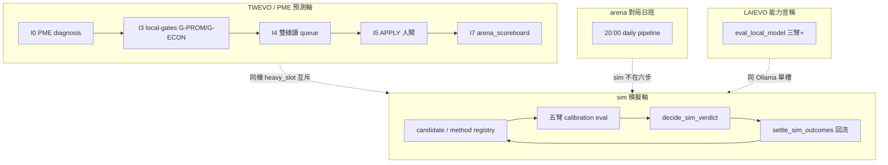

# 本地 AI 股市模擬自進化——優化專項計畫書（2026-08-04）

> **Steward 已拍板**（約 **2026-08-04 08:08+08**）  
> - **碼**：`OPT-SIM-EVO-20260804-go` ＋ `FZ-keep` ＋ `GATE-keep` ＋ `M-T5-watch`  
> - **定位**：**complement** step r2——本檔＝sim 自進化優化專項 SSOT；**不取代** `OPT-STEP-R2-20260804-go`（一般優化 step／runbook 執行序）  
> - **留痕**：`audits/OPT-SIM-EVO-20260804-GO.md`  
> - **預設伴隨裁**（用戶只說「拍板」、未另答 §10 Q2／Q3；下列＝建議預設落地，**可另改**）：  
>   1. **run22 期間開工**=僅 **觀測＋儀器設計＋零 DB selftest**（禁 Lane-SIM-APPLY／搶 `heavy_slot`／`--allow-apply`）  
>   2. **結輪後優先**=**先 Step1 65 triage**（已拍 `wait_done`／`OPT-STEP-R2-20260804-go`）；sim P0 **不搶 slot**，可後接或輕並行（不申請插隊為「夜班後第一刀」）

> **性質**：[I] 專項計畫——在已拍板之 **r5 理解／r2 master／step r2** 之上，把「本地 AI 股市模擬自進化」收成**可逐步優化**的執行藍圖。  
> **不取代** `OPT-STEP-R2-20260804-go`（一般優化 step／runbook SSOT）。  
> **不創設治權判準**；H-1～H-18／專章 v1.0 邊界不變。  
> **硬紀律（本寫作窗）**：FZ-keep；不搶 `heavy_slot`；不 `--allow-apply`；不改 evolution driver；不殺 run22；不 commit／push。  
> **#9／#32a**：live 數字僅 openly 可驗證者；本視點 **PostgreSQL :5432 Connection refused** → 進化帳數字引 **step r2 01:04+08 親查**＋今日進程／log；**不得**發明 DB 列數。本地 LLM 輔助＝[I]（本輪 MCP 逾時，未採用其結論）。

| 角色 | 路徑 | 效力 |
|---|---|---|
| 理解 SSOT | `reports/augur_deep_understanding_r5_20260803.md` | 讀 what 現況 |
| 執行註冊 | `reports/augur_optimization_master_plan_r2_20260803.md` | 總優先序／車道 |
| **一般優化 step** | `reports/augur_optimization_step_plan_r2_20260804.md`（`OPT-STEP-R2-20260804-go`） | **執行序 SSOT** |
| 法源／承載 | 專章 v1.0（`gp_86c8063fc688`）＋ `migrate_sim_evolution_ddl.py` | [N]／DDL SSOT |
| 07-31 地基計畫 | market_sim／impl 兩檔 | **史料＋硬邊界**（已部分落地） |
| **本檔** | `reports/augur_local_ai_sim_evolution_plan_20260804.md` | **專項 SSOT**（`OPT-SIM-EVO-20260804-go` · current） |

**一句定位**：一般 step＝「Registry／閘／夜班收口」總跑道；本檔＝「**sim 校準自進化＋與 TWEVO／PME／arena 互不搶槽**」的專跑道——吃 step 的觀測窗與資源互斥規則，**不**吃 65 triage／WM.36 寫庫弧。

---

## §0 一頁摘要

**what**：讓「用哪種方法模擬市場**風險形狀**」走上同一條普遍晉升路——候選 → 預凍閘 → 五臂證據 → 人門 → 判死／晉升留檔 → 後果回流；並與 PME／TWEVO／arena／LAIEVO **分軸閉環、共槽紀律**。

**why（相對 07-31）**：法源與載體已大半落地（八表／SIM-CAL-R1／W2–W5 腳本／M-M5 判決）；**母体優化槓桿在 W2-65**，但 **sim 軸若空轉或搶槽＝靜默拖垮三軸**。本檔把優化收斂為：**觀測儀器 → 首格／時鐘誠實落地 → 回路強化（仍禁 auto-promoted）→ 與預測經濟終關正交對接（不混尺）**。

**此刻總判（≈08:05+08）**

| 項 | 判 |
|---|---|
| run22 | **仍 running**（I3 `run_philosophy_evolution --local-gates`，`ps` elapsed≈9h00、CPU≈60%；父 cron `run_evolution_iteration --run --slot-wait 10800`） |
| DB | **`:5432` 拒連**（unix socket 亦不在）→ 不可複核 `evolution_run`／首格列數 |
| 第一刀 | **可開＝本檔文件／唯讀儀表設計／selftest 零 DB**；**不可開＝sim 重活／`--apply` 首格／接 heavy_slot 排程** |
| 與 Step1 | Step1＝`wait_done`；本專項 **Lane-DOC／儀表**可與「監看」並行；**不得**與 65 triage 搶「結輪後第一執行刀」敘事 |

---

## §1 what／why：閉環地圖與正交邊界

### 1.1 四條閉環（名稱勿混）



| 閉環 | 目標函數（合法） | Driver／入口 | 人閘 |
|---|---|---|---|
| **PME／philosophy→特徵** | G-PROM 三關＋G-ECON（#14）；雙綠才可能晉升 | `run_philosophy_evolution.py`；TWEVO I3 | PME-AUTO-B 僅閘內；**sim 不及** |
| **TWEVO 輪** | 假說→閘→（可選 APPLY）→prodset／arena 回饋／停損 | `run_evolution_iteration.py` I0–I9 | 預設 `apply_allowed=false`；`--allow-apply`＋gate_ref |
| **sim 自進化** | **僅**風險形狀**校準**（`gain_basis∈{calibration_delta,none,incomparable}`） | `run_sim_calibration_cell`／`evaluate_sim_calibration`／`decide_sim_verdict`／`settle_sim_outcomes` | **無 auto-promoted**；`promoted` 須親簽 |
| **arena 對局** | 方向／隊伍比分（確立級另走 `direction_gate`） | `run_arena_daily_pipeline` 等 | 白名單日頻≠解凍；**不含** sim 首格 |
| **LAIEVO**（輔） | 本地模型行為能力（須三臂） | `eval_local_model.py` | #32；舊 F@L1 多尺已作廢 |

### 1.2 為何「模擬」≠「預測」

- 治權：**逐日價格路徑／目標價無 GATE**（專章／大憲章邊界）→ sim 只能產**風險形狀**。  
- 實作：`tilt_free` CHECK、`is_synthetic`＋TR-C、verdict append-only。  
- **經濟終關（#14）**屬預測／特徵／組合軸；sim 終審＝**統計級校準**（覆蓋率／PIT 等）——**兩尺不得互相冒充**。

### 1.3 與 FinMind／預測熱路徑正交（FZ-keep）

| 層 | 本專項 | 不是 |
|---|---|---|
| 預測熱路徑 | 可消費庫內 panel／`feature_values` as-of（TWEVO I3 已是） | **不得**因缺最新 sync 拒跑預測 |
| FinMind／FRED | **凍結取數**（FZ-keep）；arena 日頻白名單另計 | **≠** 解凍；**≠** sim 許可開 API |
| sim | 讀庫內價量／既有 `mc_simulation_run` 契約 | 零 live fetch；禁路徑點位表徵 |

一句：**可以優化自進化回路 ≠ 可以再開市場 API；可以庫內預測 ≠ 可以把靈魂加權進 runtime。**

---

## §2 現況盤點（證據路徑＋時點）

### 2.1 TWEVO run22／heavy_slot／I5B

| 觀測 | 值 | 來源／時點 |
|---|---|---|
| `evolution_run` | run_id=**22**／`running`；`started_at=2026-08-03 23:00:29+08`；`finished_at=NULL`；`notes=S2 local_gates` | step r2 **DB 01:04+08** |
| heavy_slot | 持有中 `owner=tw_iteration`，`pid≈254497`，`since=2026-08-03 23:00:01+08` | step r2 01:04 |
| 活進程（今） | 父 `254493` `run_evolution_iteration.py --run --slot-wait 10800`；子 `254552` `run_philosophy_evolution.py --local-gates`；**ELAPSED≈09:00:37、%CPU≈60.3** | `ps` **08:00+08** |
| twevo.log | `✓ 開輪 tw-20260803-r01(…apply_allowed=false)`；之後無 flush 之步結 | `~/logs/twevo.log` 08:00 |
| 史料 timeout | 同 log 留有**舊輪** `TimeoutExpired … 7200 seconds`（07-28 軸）；現行碼預設 `STEP_TIMEOUT_SEC=43200`（註：I3 估 7–10h） | log＋`scripts/run_evolution_iteration.py` 標頭 |
| I5B | morning：**superseded=8**；pending `{21:9,22:9}`；apply 偷跑=0；`observe … --morning` rc=1 | step r2 01:04；prerun CSV 17 列属 run21 |
| HEAD | 寫作時 git **`6c8d235`**（step 拍板）；run22 開輪時 step 記 `code_sha=66b001e…` | git／step r2 |
| DB 今 | **Connection refused :5432**；`heavy_slot` CLI 亦無法讀鎖態（需 PG） | 本機 07:58–08:03 |

**run22 仍 running 的意涵（執行層）**

1. **Lane-S 獨佔**：任何 sim 大批／另開 TWEVO／`eval_local_model` 重活＝違 M-T5。  
2. **I5B 首驗未結案**：mechanism 已見 superseded>0，但世代收斂與 `succeeded` 終態未到 → Step0／P0-OBS 不可假綠。  
3. **I3 長跑屬預期量級**（文件寫 7–10h／feature 口徑變重後）；**不得**因「已超 2h」就殺進程或縮 `--since`／`--skip-multi-seed`（會假雙綠／換尺）。  
4. **DB 拒連**：進程可能仍握舊連線在算；**外部觀測／morning／heavy_slot 唯讀儀表暫時失靈**——優先恢復 PG，而非殺輪。

### 2.2 promotion_queue／prodset（引既有，非本晨重查）

| 項 | 值 | 時點 |
|---|---|---|
| prerun pending_auto | **17**／全 run21 | `audits/prerun22_pending_snapshot_20260803.csv` |
| morning pending | `{21:9, 22:9}`；superseded=**8** | 01:04+08 |
| prodset active | **3** | r5／r4（今夜／今晨未重查） |
| `evaluated_pass` | **0** | r5——確立級禁宣稱 |
| apply | `apply_allowed=false`；觀察窗無偷跑 | step r2 |

### 2.3 sim 鐘／verdict／腳本水位

| 項 | 狀態 | 證據 |
|---|---|---|
| 法源 | 專章 enact；axis registry 含 `sim` | impl／git `be09735` 鏈 |
| DDL 八表 | migrate 腳本為可執行 SSOT；本視點 **無法 `--check` 列數**（DB 拒連） | `migrate_sim_evolution_ddl.py` |
| 門 | SIM-CAL-R1 生效敘事 | git `e0195c7`；RUNBOOK |
| 工具鏈 | `propose_sim_candidate`／`run_sim_calibration_cell`／`evaluate_sim_calibration`／`decide_sim_verdict`／`settle_sim_outcomes`／`check_sim_clock` **皆在** | `scripts/*` |
| 首格 | 夜班 runbook 定義人工 `--apply`；**r5：本輪未確認是否已按**；今無法查 `mc_simulation_run`／`sim_run_link` 增量 | RUNBOOK；r5 §5.2 |
| arena | 20:00 **不**自動產首格（M-T7） | RUNBOOK／r5 |
| 判決 | M-M5：`--apply` 只寫 killed／undecidable；**拒寫 promoted** | `decide_sim_verdict.py` 標頭 |
| 時鐘 | asof≈08-03 → label≈+21 交易日；K=3 齊後才首判（runbook 估≈11 月） | RUNBOOK |

### 2.4 本地 LLM 分流

| 用途 | 模型 | 釘死處 |
|---|---|---|
| MCP 濃縮／檢索 | **qwen3:4b** | `.cursor/rules/local-mcp-routing.mdc`；勿把 8b 寫入 MCP `LLM_MODEL` |
| advisor／主 UI | **qwen3:8b** | HANDOFF／常駐服務 |
| sim LLM 候選（若開） | 計畫契約＝本機 4b＋日預算／鎖 | 07-31 H-11；**Ollama 單模型串行** |
| LAIEVO | `eval_local_model` 佔 heavy_slot 類資源 | 與 I3／sim 互斥 |

### 2.5 相對 07-31「軸空轉」的增量（優化起點）

已從「零腳本／零列」走到「**門＋候選＋評估器＋判決器＋夜班人工首格 SOP**」；優化問題從「建軸」轉為：

1. **時鐘是否真的上膛**（首格是否落地、可觀測）；  
2. **與 TWEVO 長 I3 共機不互相餓死**；  
3. **儀表／結案 audit 可在 DB 抖動下仍誠實**；  
4. **回路強化不偷升 promoted／不混 #14 尺**。

---

## §3 問題清單（分級）

### 阻斷（P0 前／並行必須誠實處理）

| ID | 問題 | 為何阻斷 |
|---|---|---|
| **B1** | run22 I3 佔槽未結 | 一切 sim／LAIEVO 重活禁發 |
| **B2** | PG :5432 拒連（08:05） | 無法驗收 run22／首格／queue；儀表失效 |
| **B3** | Step0 morning 五驗收未綠 | 假綠結案＝污染 I5B 敘事 |
| **B4** | 首格落地狀態**未知**（r5 未確認＋今無 DB） | 時鐘可能「紙上上膛」 |

### 槓桿（專項優化高 ROI）

| ID | 問題 | 槓桿 |
|---|---|---|
| **L1** | 缺「sim／TWEVO 共槽」一頁儀表（進程＋slot＋DB 水位＋禁搶哨） | 降人為撞車；服務 step Lane-R |
| **L2** | 首格→settle→evaluate→verdict 的**人工節奏 checklist**未綁進優化日曆 | 避免 09–11 月窗口空轉 |
| **L3** | sim 與 arena／TWEVO 產物敘事易混（可交易／確立級） | 文件＋探針防假兆 |
| **L4** | LLM 候選生成與 4b／8b 搶載 | 白名單時段＋flock；預設計數上限 |

### 可延後

| ID | 問題 | 註 |
|---|---|---|
| **D1** | sim 接 cron／heavy_slot 常駐輪（W6） | 必待車道 D-3；**本季預設不做** |
| **D2** | 權重級微調（LoRA 等） | 07-31 P7；環境 no-go |
| **D3** | 新 arena 參賽者由自進化推出 | 明示 out_of_scope |
| **D4** | 與 WM.36 65 triage 同一刀搶時間 | 本專項**退讓**一般 step |

---

## §4 分階段執行（逐步）

> 階段號 **P0–P3** 為**本專項**編號；對應 r2 master「P3｜預測／sim／進化」為**上游桶**——細節以本檔為準，優先序衝突時 **step r2 > 本檔**。

### P0｜觀測／閘（可與 run22 並行的部分）

| 子項 | 做什麼 | 驗收 | 依賴 | Steward 閘 |
|---|---|---|---|---|
| **P0-A 監看** | 唯讀：`ps`／`twevo.log`；DB 復通後 `observe_twevo_run22.py --morning` | 不殺輪；不搶 slot；異常只記帳 | 無（log／ps 不需 DB） | 否 |
| **P0-B PG 復通哨** | 偵測 :5432；復通後立刻 heavy_slot 狀態＋run22 列 | 記錄「拒連時段」；禁止在拒連時宣稱終態 | 運維 | PG 起停屬人／OS |
| **P0-C 結輪 OBS** | Step0／P0-OBS：五驗收＋I5B vs prerun CSV → audit | 與 step §1 五條一致；`finished_at` 有值或誠實 failed／timeout | run22 終態＋DB | 否（觀察） |
| **P0-D 首格盤點** | DB 復通：`mc_simulation_run`／`sim_run_link`／`check_sim_clock` 水位對 RUNBOOK | **寫明**「已落地／未落地／undecidable」三擇一＋指令 | DB；**不** `--apply` | 若未落地→是否補跑首格＝**必裁** |

**P0 綠燈**：run22 有誠實終態 audit；首格狀態非「未知」；全程零搶 slot。

### P1｜儀器（零寫庫或僅 audit md）

| 子項 | 做什麼 | 驗收 | 依賴 | Steward |
|---|---|---|---|---|
| **P1-1 共槽儀表** | 一頁／一支唯讀 script：slot 持有者、TWEVO／sim／arena／ollama 進程、禁忌提示 | `--selftest`；DB 掛則 graceful 降級印進程態（勿假綠鎖態） | #29 矩陣 | 否 |
| **P1-2 時鐘看板** | 包 `check_sim_clock`＋下一 settle／K 進度 | 數字出 stdout／DB | DB | 否 |
| **P1-3 假兆探針** | 斷言：sim 報告禁寫「可交易／確立級」；LLM 提案必 `is_synthetic` | 先驗紅（#35） | 無重訓 | 部分升嚴需裁 |
| **P1-4 模型檔位卡** | 文件釘死：MCP=4b、advisor=8b、sim 候選=4b＋鎖 | HANDOFF／本專項交叉引用一致 | 否 | 否 |

### P2｜自進化回路強化（仍禁 auto-promoted）

| 子項 | 做什麼 | 驗收 | 依賴 | Steward |
|---|---|---|---|---|
| **P2-1 補首格（若 P0-D=未落地）** | 依 RUNBOOK：`--dry-run`→防衛鏈→人工 `--apply` | +52 契約（或當日清單數）可對帳；`sim_run_link` arm=live | M-T1；**slot 空**；非夜窗與 I3 重疊 | **明示允許該次 `--apply`** |
| **P2-2 settle 節奏** | label 日到→`settle_sim_outcomes` dry→apply | insert-only 冪等 | 首格＋交易日曆 | apply 明示 |
| **P2-3 五臂 evaluate** | K 條件滿足後 `evaluate_sim_calibration` | 五臂齊；少臂必紅 | SIM-CAL-R1 | 否（評估）／門檻凍結已成立則不另裁 |
| **P2-4 判決** | `decide_sim_verdict --check`→`--apply`（killed／undecidable） | **0** 自動 promoted | M-M5 | promoted **另親簽** |
| **P2-5 LLM 提案（可選）** | 小樣本 `propose_sim_candidate`；TR-C／synthetic | 列可追溯；撞 Ollama 鎖則降級 grid | L4；**slot 空** | 是否開 LLM 候選窗 |

**禁止本階段**：接 cron 常駐、`--allow-apply` 於 TWEVO、改 I3 逾時換假快。

### P3｜經濟終關對接（正交，不混尺）

| 子項 | 做什麼 | 驗收 | Steward |
|---|---|---|---|
| **P3-1 尺分離卡** | 文件＋探針：sim 校準綠 ≠ #14 經濟綠 ≠ `evaluated_pass` | 週報／HANDOFF 無混寫 | 否 |
| **P3-2 消費邊界** | sim 產物只進風險畫像保守通道；**不**寫 `risk_policy`；不進方向確立宣稱 | 列數／policy 快照哨兵（既有精神） | 變更消費＝裁 |
| **P3-3 PME 迴流（可選）** | 校準劣化以 `evolution_hypothesis_hint` 等形式回 TWEVO 假說池 | hint 人審；非整庫 raw 入靈魂 | 批準 hint 窗 |

**P3 綠燈**：所有對外數字可溯源；無「sim 校準通過⇒可交易」宣稱。

---

## §5 可先做／可同步矩陣

> 規則承 step r2 §3：**重活同時間 ≤1**；**永不**與 `heavy_slot` 持有者搶；FZ 零放量。

| Lane | 內容 | ‖ run22？ | ‖ Step1 65 triage？ | 互斥 |
|---|---|---|---|---|
| **Lane-S** | TWEVO I3／sim cell `--apply`／LAIEVO eval／panel 全量 | **否** | **否**（結輪後亦錯峰） | 彼此 |
| **Lane-OBS** | ps／log／本計畫撰寫／結輪後 morning | **是** | **是**（文件級） | 禁寫庫 |
| **Lane-R-step** | 65 triage 唯讀報告 | 結輪後（`wait_done`） | 本檔**不搶**其「第一刀」 | 禁假 concept |
| **Lane-SIM-DOC** | 儀表設計、selftest（免 DB）、假兆探針草稿 | **是** | **是** | 勿滿載 CPU 干擾 I3 |
| **Lane-SIM-APPLY** | 首格／settle／evaluate 寫庫 | **否**（須 slot 空＋DB 通） | 錯峰於 triage 寫窗 | Steward 明示 |
| **Lane-FZ** | sync／Dividend／寬窗 | **禁** | **禁** | — |

### 並行條件（明示）

**不與 run22 搶 heavy_slot** —— 下列在 run22 `running` 期間**允許**：

- 寫／修本專項與 audit **敘事**；  
- `decide_sim_verdict --selftest`／`evaluate_sim_calibration --selftest` 等**零 DB 純函式**；  
- Step 計劃中的 Lane-D（N7／043 **起草**）——與本專項無關衝突。  

**可與 Step1 65 triage 並行的條件**（僅當 Step1 已開窗後）：

1. triage＝**唯讀 SQL／報告**；本專項＝**儀表／sim 文件／selftest**；  
2. **不同時**對同機施加重 CPU（I3 已重 → triage SQL 宜輕）；  
3. **皆不寫** `world_concept`／sim 生產列 unless 各有 honesty／apply 明示；  
4. 叙事上：**結輪後第一執行刀＝65 triage（step SSOT）**；sim 首格補跑＝**人工節奏第二曲**（日／週），不爭「第一刀」標題。

**run22 仍 running 時第一刀（本專項）**＝ **P0-A／P1 文件儀器設計／selftest** —— **不是** `--apply` 首格。

---

## §6 禁做

1. **假兆 metrics**：無 stdout／DB／API 來源的 IC／Sharpe／「可交易」；把校準綠寫成確立級。  
2. **未過 #32 三臂**（地板／上限／錯配）宣稱本地 AI「有能力」。  
3. **自動下單**／自改治權判準／AI 代簽 `decided_by`／寫 `promoted`。  
4. **解凍 API**／FZ 放量／把「可預測」讀成「可補抓」。  
5. **靈魂／原則加權進 runtime**（特徵權或交易權重）。  
6. **搶 heavy_slot**／殺 run22／改 driver 縮逾時換假快／TWEVO `--allow-apply`。  
7. **路徑點位／目標價**入表；tilt 抽樣；報酬／方向作 `gain_basis`。  
8. **另起打架 master** 覆蓋 step r2／r2／r5。

---

## §7 schema＋python 規畫（#20）

### 7.1 既有表（讀／寫角色）——**本專項預設無新表**

| 表 | 角色 | 結果落哪 |
|---|---|---|
| `evolution_run`／`evolution_iteration_ledger` | TWEVO 輪帳 | audit／OBS |
| `promotion_queue`／`evolution_apply_log`／`evolution_deferred_work` | I5B／積壓／禁偷跑 | OBS audit |
| `simulation_method_registry` | 方法人閘註冊 | 候選 FK 前提 |
| `sim_evolution_candidate` | 候選節點 | 評估／判決 |
| `sim_run_link` | 接 `mc_simulation_run` | 首格對帳 |
| `mc_simulation_run` | 模擬 run 史料／新格 | 校準輸入 |
| `sim_realized_outcome` | 後果回流 | settle 寫入 |
| `sim_calibration_eval` | 五臂讀數 | evaluate 寫入 |
| `sim_evolution_verdict` | 判死／（人簽）晉升 | decide 寫入 |
| `sim_llm_proposal` | LLM 產物標記 | 可選提案 |
| `sim_evolution_iteration_ledger` | sim 輪帳 | 迭代落帳 |
| `evolution_prereg_gate`（axis=sim） | 預凍門 | 已生效則只讀 |
| `evolution_kill_switch` | 緊急停 | 開跑前查 |
| `risk_policy` | **唯讀** | 禁自進化回寫 |
| `TaiwanStockPriceAdj` 等 | as-of 價量 | 經單一 reader（落日債插點） |

DDL 可執行 SSOT＝`scripts/migrate_sim_evolution_ddl.py`（已含八表）。**本優化波不新增 DDL**；若儀器需落地表，另開案＋`--apply` 明示。

### 7.2 既有／預期 script 角色

| Script | 角色 | P 階 |
|---|---|---|
| `run_evolution_iteration.py` | TWEVO driver（**不改**本波） | 觀察 |
| `run_philosophy_evolution.py` | I3 PME local-gates | 觀察 |
| `observe_twevo_run22.py` | 結輪五驗收 | P0-C |
| `check_sim_clock.py` | 時鐘唯讀 | P0-D／P1-2 |
| `run_sim_calibration_cell.py` | 首格 dry／apply | P2-1 |
| `evaluate_sim_calibration.py` | 五臂 | P2-3 |
| `decide_sim_verdict.py` | 判決（拒 promoted） | P2-4 |
| `settle_sim_outcomes.py` | 回流 | P2-2 |
| `propose_sim_candidate.py` | 候選 | P2-5 |
| `arena_scoreboard.py`／日班 pipeline | arena（**不接** sim 首格） | 正交 |
| **新（可選）** `scripts/report_slot_and_sim_dashboard.py` | 共槽儀表 | P1-1；須 #29＋`--selftest`＋先驗紅 |

### 7.3 若未來需新表（草案——**預設不建**）

僅當 P1 儀表證明「進程態無法綴合 audit」且 Steward 要持久化哨兵時：

```sql
-- DRAFT ONLY — 非本波義務；不得擅自 --apply
CREATE TABLE IF NOT EXISTS ops_runtime_heartbeat (
    observed_at   timestamptz PRIMARY KEY DEFAULT now(),
    channel       text NOT NULL CHECK (channel IN ('twevo','sim','arena','ollama','pg')),
    pid           int,
    detail_json   jsonb NOT NULL,
    source        text NOT NULL  -- 'ps'|'log'|'db'
);
-- append-only 精神：禁 UPDATE／TRUNCATE；結果落 reports／audit 亦可，表非必須
```

---

## §8 與 step plan r2／U1／W2 的接口

| 主題 | 本專項**吃** | 本專項**不吃** |
|---|---|---|
| Step0／run22／I5B OBS | **吃**——P0 與 step 共用驗收定義 | 不改 observe 判準 |
| Step1 65 triage | **不吃**內容；只遵守「不搶第一刀＋資源互斥」 | 不做通道分類／concept |
| Step3 86／35／70 dry | 不吃 | U1 形制延續屬 Registry 弧 |
| U1 honesty | 知悉「一証一批已作廢」 | 不消費、不延伸到 sim promoted |
| W2 source_column／解阻 | 僅防假兆敘事交叉污染 | 不跑 reconcile 母体 |
| r2 P3 sim／進化桶 | **本檔＝該桶之專項展开** | 不重寫 r2 總排序 |
| FZ／GATE／M-T5 | **全吃** | — |

**讀序建議**：HANDOFF → r5 → r2 master → **step r2** → **本檔** → RUNBOOK／NIGHT-GUARD → 07-31 專章／impl（邊界）。

---

## §9 Steward 裁示落地（2026-08-04 08:08+08）

| 問 | 裁 |
|---|---|
| **是否拍板本專項為 sim 自進化優化 SSOT（draft→current）？** | **是（go）**——碼＝`OPT-SIM-EVO-20260804-go`＋`FZ-keep`＋`GATE-keep`＋`M-T5-watch`；**complement** step r2，**不取代** `OPT-STEP-R2-20260804-go` |
| **第一刀是否可在 run22 仍 running 時開？** | **預設伴隨裁**＝**可以——僅限觀測＋儀器設計＋零 DB selftest**；**不可以**首格 `--apply`／接 slot／改 driver（用戶未另答，採 §9 建議預設；**可另改**） |
| **與 Step1** | **預設伴隨裁**＝維持 step：`wait_done`；結輪後**先 Step1 65 triage**；sim P0 不搶 slot，可後接或輕並行（用戶未另答，採建議預設；**可另改**） |
| **若 P0-D 發現首格未落地** | （仍待另裁）等 slot 空＋DB 通後單次 `--apply` 窗（日週人工），不排 23:00——**不**在本拍自動授權 |

---

## §10 AskQuestion（拍板後剩餘）

1. ~~拍板本計畫？~~ → **已拍**（`OPT-SIM-EVO-20260804-go`）。  
2. **預設伴隨裁可否確認／覆寫**（run22 期間僅觀測＋selftest；結輪後先 Step1）？  
3. **commit／push** 本計畫＋audit？  
4. **是否現在開**「觀測＋零 DB selftest」第一刀？

---

## §11 回報摘要（給當輪對話）

| 項 | 內容 |
|---|---|
| **路徑** | `reports/augur_local_ai_sim_evolution_plan_20260804.md` |
| **狀態** | `status: current` · `OPT-SIM-EVO-20260804-go` |
| **相對一般 step** | **專項／complement**——跑 sim 校準自進化＋共槽紀律；**不**取代 step 執行序、**不**吃 W2-65／U1 寫庫 |
| **拍板** | **是（go）**，附 FZ-keep／GATE-keep／M-T5-watch；數字窗綁 DB 復通後 P0-D |
| **預設伴隨裁** | run22＝觀測＋儀器＋零 DB selftest；結輪後＝先 Step1 65 triage；sim P0 不搶 slot |
| **本波未做** | 不搶 `heavy_slot`；不 `--apply`；不開 65 triage；不 commit／push |
| **audit** | `audits/OPT-SIM-EVO-20260804-GO.md` |

---

*完。self-reported（#32a）。拍板已落地；未 commit／未解凍／未觸 slot／未開 triage。*
