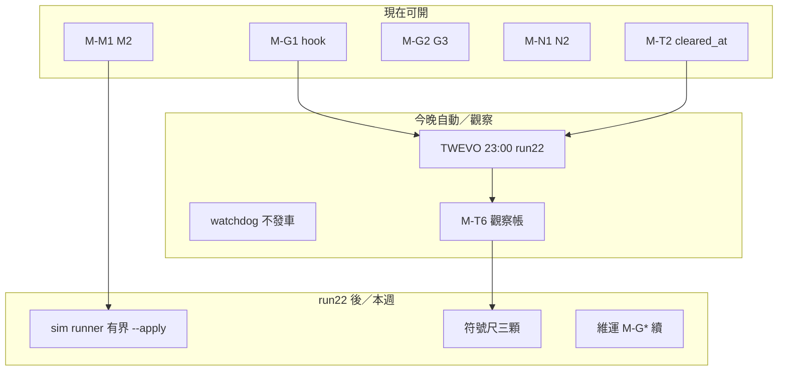

# Augur 優化——逐步執行計畫書（2026-08-03 午後）

> **性質**：[I] **後續優化之操作執行 SSOT**（CLAUDE #16/#20）。不解凍 API；不降閘；不代簽；未另句拍板前零重碼／零不可逆 APPLY。  
> **理解基座**：[`augur_optimization_foundation_unified_20260803.md`](augur_optimization_foundation_unified_20260803.md)（心智模型＋Q 總帳）。  
> **細項註冊表**：[`augur_optimization_master_plan_20260803.md`](augur_optimization_master_plan_20260803.md)（M-* 全表、55 可先做、車道互斥——**本檔不重抄 55 項**）。  
> **今晚現場**：[`ops/RUNBOOK-20260803-night.md`](../ops/RUNBOOK-20260803-night.md)。  
> **現況錨**【親驗／對照 13:39–13:47】：I5B **已落地**（CHECK 含 `superseded`；碼在 `run_philosophy_evolution.py`）；`pending_auto`=17（run 21）；prodset active=3；sim 候選=1、run_link/eval=0；direction_gate 無 pass；PriceAdj max=2026-07-31；TWEVO cron **仍** `0 23 * * 1-5`；attestation **watchdog 今晚不發車**（runbook 午後更正）。  
> **作廢**：今晨「必須先回 `I5B-diff-施作` 才開跑」——I5B 已於 `2b6350d` 完成（master X2）。舊 `OPT-EXEC`／統一總冊 §6 W0-1/2 之「催 I5B 授權」改讀本檔。

---

## §0 三問直答（午後校正）

### 問一｜最佳下一步？

**M-G1：修 worktree 雙失效**——`ops/githooks/pre-commit` 改 **fail-closed**（venv 缺失不得 `exit 0`）＋治權檔／CLAUDE 與 main 同步稽核（worktree 仍見 v1.31/1.32、缺 #33–#35）。

| | |
|---|---|
| 為何第一 | 之後每一項修復的驗證通道否則不可信（靜默略過閘＝假綠元問題） |
| 執行者 | AI：S1–S3【可先做】；hugo：S4 是否入 CLAUDE #13【不阻塞前三步】 |
| 車道 | PG-HOOK；零 DB／零 API／可逆 |
| 細節 | master §0.1／§1.3 M-G1 |

**若今晚就要按 sim `--apply`**：改以 **M-T1**（ledger／FK 前置）為第一——不可逆窗被你啟動（master 證偽條件）。

### 問二｜可先做？（無需裁決即可動）

摘自 master §0.2（開跑前現查 `free -m`／是否佔 slot）：

| 優先序 | 項 | 為何現在 | ‖？ |
|---|---|---|---|
| 1 | **M-G1** S1–S3 | 元閘 | 獨佔 hook 檔 |
| 2 | **M-T2** | 23:00 run 22 前清假告警謂詞 | ‖ 文件／他車道 |
| 3 | **M-G2／M-G3** | 空集合綠燈族／reconcile 接 library | ‖ 互不撞檔 |
| 4 | **M-N1＋M-N2** | 條文↔探針＋度量登錄（10-14 槓桿） | 建議同批 |
| 5 | **M-M1→M-M2** | sim 評估器驗收（runbook：`--selftest` 須綠） | ‖ PG-SIMEVAL |
| 6 | 唯讀：五埠、`crontab`、HANDOFF 硬編數字對照（M-N4） | 低成本 | 全 ‖ |

### 問三｜可同步做？

- **十一車道組間可 ‖**（master §0.3）；**重活同時間 ≤1～2**（視 Ollama 是否回駐 8b）。  
- **互斥**：pg_dump／I3 local-gates／sim 大批產 run／panel 全量——擇一。  
- **人裁窗**不可假多人：M-G1-S4、dgate、KH0、API 補抓、NAS 異地另湊。



---

## §1 今晚窗口（08-03）

| 時段 | 動作 | 層級 |
|---|---|---|
| 午後–22:30 | 做完 M-G1 S1–S3；M-T2；M-M1/M2 selftest 綠；**heavy slot 淨空**（M-T5） | AI【可先做】 |
| ~19:14–19:30 | 驗 `~/logs/audit_watchdog.log`：**不得**出現 relaunch；應見冷卻／不發車（runbook） | 觀察 |
| **23:00** | TWEVO `run_evolution_iteration.py --run --slot-wait 10800`【自動】——**會發車**（crontab 親驗）；I5B 於此輪生效（舊 pending→superseded） | 自動＋M-T6 監看 |
| 事後 | 唯讀：`pending_auto` 世代、`evolution_run`、無擅 APPLY；寫 `audits/OPT-RUN22-OBS-20260803.md` | AI |
| sim 首格 | **人工** `--apply`；前置 M-T1 已並（runbook）；**勿**排進 cron | Steward 節奏 |

**17 列 pending**：runbook／MT3＝不必再開人裁窗；交 run 22 自動 supersede（證據見 `reports/mt3_pending_disposition_evidence_20260803.md`）。若觀察結果與證相反→停並呈案。

---

## §2 問題總帳 → 執行項（午後對照）

| 基座 Q | 狀態 | 接棒 |
|---|---|---|
| Q01 I5B | **已關閉（X2）** | M-T6 觀察首次生效 |
| Q02 run22 | **開** | 今晚自動＋觀察帳 |
| Q03 sim runner | **開**（候選已 1） | M-T1→runner／settle／M-M* |
| Q04 dgate | Steward | W3／master 對應項 |
| Q05 LAIEVO S-4 | Steward | 同上 |
| Q06–Q08 維運 | 部分已有 cron（VE 日 07:10、dump 週六） | 補缺口＝master M-G*／attestation 真復線 |
| Q09 close | Steward→AI | master 進化車道 |
| Q10–Q11 KH | 裁／可先做正名 | M-K*／M-G14–15 |
| Q12 10-14 | 持續 | **M-N1** |
| Q13–Q17 | W4／閘外 | master 後段 |
| Q18 demote 人裁 | 今夜多半自動消化 | 觀察後再裁 |
| Q19 符號尺 | run22 後 slot 空 | active 三顆 `--record` |
| — | **元閘** | **M-G1（本檔第一）** |
| — | **假綠族** | M-G2 起主序 |

完整 55+ 項與 schema／程式規畫：**只引用** master §1／§3，不在此重複，避免雙寫漂移。

---

## §3 (a) 表＋(b) 程式——本波（W-ops）最小集

| 步 | 讀 | 寫／改 | 程式／檔 |
|---|---|---|---|
| M-G1 | worktree CLAUDE／venv | `ops/githooks/pre-commit`；新 `scripts/check_worktree_treaty_sync.py` | fail-closed；`--selftest` |
| M-T2 | deferred／driver | driver 謂詞 | `run_evolution_iteration.py` 等（master 標路徑） |
| M-T6 | run／queue／ledger | **無** | SQL＋audit md |
| M-T1 | sim_*／prereg | ledger 列＋FK | sim DDL／runner 前置（runbook） |
| M-M1/2 | — | — | `evaluate_sim_calibration.py --selftest` |
| 符號尺 | feature_values、prodset | feature_sign_check | `verify_sign_consistency.py --record --features cycle_position_252d,inst_cumflow_position_120d,lending_fee_rate_mean_30d` |

---

## §4 分階段驗收

| 階段 | 完成定義 |
|---|---|
| **今日午後** | M-G1 S1–S3 合入 main 路徑可驗；worktree 無 venv 時 hook **非**靜默綠 |
| **今晚** | watchdog 未 relaunch；run22 有終態；I5B supersede 有跡；無 `--allow-apply` 偷跑 |
| **本週** | sim 評估 selftest 綠；有界首格或明示延期；M-N1 骨架可查 10-14 項 |
| **决策窗** | dgate／S-4／KH0 有登錄或延期碼 |

---

## §5 拍板碼（後續依本檔＋master 開工）

```text
# 採納「午後逐步計畫」為操作 SSOT（細項仍以 master 註冊表為準）
OPT-STEP-20260803-go + FZ-keep + GATE-keep + NHC-keep

# 授權立刻做元閘（無需另裁 S1–S3）
+ M-G1-go

# 若今晚要人工 sim apply（啟動不可逆窗）
+ SIM-FIRST-CELL-go
```

僅回 `OPT-STEP-20260803-go + M-G1-go + FZ-keep + GATE-keep + NHC-keep` 即可開下午主線。

---

## §6 明確不做

- 再催 I5B 授權（已落地）  
- 解凍 FinMind／FRED；降閘；cron 加 `--allow-apply`  
- 把 UKStockPrice 紅燈改豁免關掉（runbook：屬 Steward）  
- 假關 10-14；AI 代簽  
- 與 master 雙寫全表（有衝突以 **本檔時間校正＋master 項 ID** 為準，改 master 加 addendum）

---

## §7 檔案效力

| 檔 | 效力 |
|---|---|
| **本檔** | **操作逐步／今晚／可先‖** 執行依據 |
| `optimization_master_plan_20260803.md` | M-* 全量註冊＋車道／schema 細節 |
| `optimization_foundation_unified_20260803.md` | 理解＋Q 總帳 |
| `ops/RUNBOOK-20260803-night.md` | 今晚現場 checklist |
| r4／OPT-EXEC／optimization_plan | 史料／素材 |

---

*唯一寫入＝本檔＋HANDOFF 指針。零 DB 突變。*
