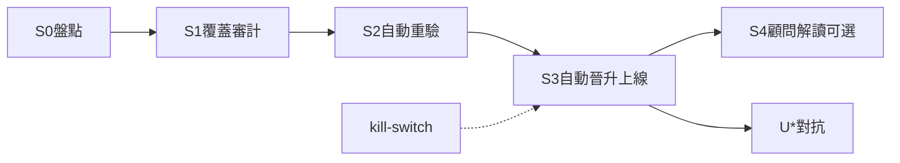

# 哲學↔市場進化閉環計畫 [I]（2026-07-24）

* **性質**：[I] plan-first 計畫書（CLAUDE #16／#20；領域大憲章第六部計畫完整性 v1.39.0）— **不創設 [N] 義務**；**計畫已拍板；執行已開近程**（Steward「**開 PME**」2026-07-24）
* **授權觸發**：Steward「開哲學↔市場進化閉環計畫」＝只寫本檔（✅）；「**開 PME**」＝實作（✅ 近程已開；見 `audits/PME-S012-STATUS-20260724.md`）
* **路線圖掛接**：**R7 候選／獨立產品計畫**（見 `reports/augur_constitution_to_implementation_roadmap_20260724.md` §3.8）— **不取代** R7 產品全貌；不併吞 R5／R6 已閉義務；**≠** 開 R7 S2
* **對齊先例**：理論框架＝`reports/augur_investment_philosophy_framework_plan_20260630.md`；漏斗／#14＝`reports/augur_feature_discovery_methodology_20260626.md` §四；計畫範式＝`reports/augur_roadmap_r5_plan_20260724.md`／`r6_plan`
* **前置／邊界**：近程 R5／R6＋U5／U6 DONE；FinMind／FRED **操作凍結**仍有效；G-DIV-1 **PAUSED**；`direction_gate.evaluated_pass`＝**0** → **禁確立級／可交易宣稱**
* **主路徑（已採納）**：**PME-AUTO-B**＝有界 AI 自主上線＋緊急停機（`PME-KILL`）

### Steward 已拍板（2026-07-24）

| 欄 | 內容 |
|---|---|
| **日期** | 2026-07-24 |
| **四碼** | `PME-P-yes` ＋ `PME-AUTO-B` ＋ `PME-KILL` ＋ `FZ-keep` |
| **效力** | **計畫採納**＋**執行已開**（「開 PME」→E12 骨架；**「開 PME-E123」**＋本地 G-PROM／G-ECON 2026-07-24） |
| **範圍** | 上線自治＝**B**；凍結＝**FZ-keep**；E123＝S2 本地真閘＋S3 APPLY（見 `audits/PME-E123-STATUS-20260724.md`） |
| **解凍／Dividend 邊界** | **FZ-keep＝凍結維持**：FinMind／FRED **操作凍結**至 **constitution-to-implementation 全部階段落地＋用戶明示解凍**（拍板 ≠ 解凍）；不續 Dividend；不改 [N] |
| **靈魂措辭** | 採 B → 與「系統建議，人決策／非自動駕駛」張力已知 → **另案 pending**（本輪不改靈魂 [N]；見 §2.2） |
| **留痕** | `audits/PME-PLAN-APPROVED-20260724.md`；E12 `audits/PME-S012-STATUS-20260724.md`；E123 `audits/PME-E123-STATUS-20260724.md`／`PME-E123-CLOSED-20260724.md`；Gap `reports/augur_pme_gap_ledger_20260724.md` |

**四碼展開（§10 原文對照）**：

| 碼 | 含義 |
|---|---|
| **PME-P-yes** | 採納本計畫為執行藍圖；實作另待「開 PME」／分階授權 |
| **PME-AUTO-B** | 有界 AI 自主上線（機械閘全綠才上線；人＝監控＋緊急停＋治權變更）— **已採納** |
| **PME-KILL** | 強調緊急停機／kill-switch 為 B 硬要件 — **已採納** |
| **FZ-keep** | 不解凍 FinMind／FRED；Dividend 維持 PAUSED — **已採納** |
| **PME-AUTO-A** | 對照：僅自動候選＋人一鍵確認 — **本輪未採** |
| **PME-AUTO-C** | 對照：完整自動駕駛 — **與現行治權不相容，未採** |

---

## 0. 一句結論

把「哲學定假說 → 市場（feature／#14）定生死 → 閉環自動重驗 → **有界 AI 自主晉升／降級／上線**」做成可機械驗的產品閉環：素養層永不 runtime import 進預測；AI 不生成原則入庫；經濟價值 #14 仍為裁決；人的角色＝**監控＋緊急停＋治權變更**（非每案準入簽名）。本檔＝R7 候選獨立計畫；**計畫已拍板；「開 PME」近程骨架已落地**（S0／S1／S2-SKIP／KILL；真綠 #14 另續）。

---

## 1. What／Why／非目標

### 1.1 What

| 面向 | 定義 |
|---|---|
| **哲學側** | `philosophy_*`／`principle_factor_map`：真實文獻策展之可證偽假說（direction＝文獻預期，非真兆） |
| **市場側** | `feature_values`＋evaluation（rank IC／HAC Eff-t／`verify_candidate_promotion`／`run_economic_eval`）＝生死裁決 |
| **閉環** | 覆蓋審計 → 自動重驗 → **引擎自動晉升／降級／上線**（B）→ 可選顧問單向解讀 |
| **人** | 監控儀表、kill-switch、治權／判準變更；**不做**每案上線簽名（除非改選 A） |

### 1.2 Why

* 靈魂：哲學＝假說／解讀骨架；「驗證活下來、非大師說了算」；成功＝經濟價值非 IC。
* 既有斷環：`verify_philosophy_factors.py` 可回填 `validated_ic`／`validated_econ`，但 `philosophy_principle.status` 曾長期卡在 `untested`；無 run 帳本、無自動晉升佇列、無 kill-switch 語意。
* 用戶要求閉環自動化重驗＋**AI 自主上線（有界）**——在隔離命門與 #14 不鬆動前提下，把「假說→市場→狀態機」收成可回歸產品面。

### 1.3 明確不做（硬非目標）

| 不做 | 理由 |
|---|---|
| **自動下單／券商執行／自動駕駛交易** | 靈魂「扣扳機的是人」之**交易執行**層仍禁；B 僅涵蓋**特徵／原則狀態上線**，不含下單 |
| **預測管線 runtime import 哲學／顧問／知識** | A.16／T.27／L7.33／`import_isolation.FORBIDDEN` |
| **AI 生成原則／學派入庫** | #1／#16；`source_type`／`work_type` CHECK 禁 `ai_generated` |
| **runtime 哲學加權改預測分數** | 哲學零量化證據價值；不得當特徵係數 |
| **改 [N] 於本輪** | 靈魂措辭另案 pending；本輪決策登錄不改治權原文 |
| **FinMind／FRED 放量** | 操作凍結至路線圖全落地＋明示解凍 |
| **PME-AUTO-C** | 與現行治權不相容（見 §2.2） |
| **假關 10-14／偽造 evaluated_pass** | #15；R2／R5 誠實邊界 |

---

## 2. 治權錨點與 AUTO 張力（誠實）

### 2.1 錨點（索引；原文走 constitution-mcp）

| 錨 | 用途 | 取法 |
|---|---|---|
| **P1.D** | Reality First：第一性對象＝真實世界事物／狀態／事件 | `get_clause P1.D` |
| **A.16** | KnowledgeCorpus：素養語料不進預測；量化零證據價值 | `get_spec_clause A.16` |
| **T.27** | 型別層隔離宣告 | `get_spec_clause T.27` |
| **L7.33** | 語料隔離機器強制；不入預測特徵 | `get_spec_clause L7.33` |
| **L6.15** | 授權受限資料不得路由入預測特徵／訓練 | `get_spec_clause L6.15` |
| 靈魂 v1.8.0 | 「系統建議，人決策」「有紀律的顧問，不是自動駕駛」；哲學＝假說非真兆；經濟價值 | `docs/系統核心思想_v1.8.0.md` |
| 方法論 §四 | 提拔關卡＋#14 | `reports/augur_feature_discovery_methodology_20260626.md` |
| 隔離 SSOT | `FORBIDDEN`＝`augur.philosophy`／`advisor`／`knowledge` | `src/augur/audit/import_isolation.py` |

### 2.2 與現行靈魂的張力（不得假裝無衝突）

| 現行 [N]／靈魂句 | AUTO 路徑 | 張力 |
|---|---|---|
| 「**系統建議，人決策**」「**不是自動駕駛**」 | **B**：特徵／原則**狀態**由引擎上線 | **決策層變更**：人不再每案準入簽名；須另案修靈魂／原則措辭（例如區分「交易扣扳機仍為人」vs「特徵狀態機可有界自動」） |
| 同上 | **A**：候選自動＋人一鍵 | **相容**現行句；但**否決**本輪用戶「AI 自主上線」意向 |
| 同上 | **C**：改判準／無緊急停 | **不相容**；預設不採 |

**採納 B 之治理後果（拍板後另案，非本輪）**：

1. 靈魂／原則精華措辭修訂計畫（區分交易執行 vs 特徵狀態自動）。  
2. 可選領域大憲章 philosophy 層補「有界自動晉升」操作段——**仍從屬三敵**。  
3. 本閉環 [I] 實作可先於措辭落地**僅當** Steward 明示「先碼後文」；**預設＝碼與文同批或文先於碼**。

### 2.3 AUTO 三選一（用戶已表態偏向 B）

| 碼 | 定義 | 人的角色 | 與治權 | 本輪 |
|---|---|---|---|---|
| **PME-AUTO-A** | 自動產出候選／重驗報告；**上線須人一鍵確認** | 每案準入簽名 | 相容靈魂「人決策」 | 對照；**否決**用戶本句「AI 自主上線」 |
| **PME-AUTO-B** | **有界自動上線**：機械閘全綠 → 引擎寫入晉升／降級／上線狀態；**kill-switch** 可即停 | **監控＋緊急停＋治權變更** | 張力已知；須另案修措辭 | **✅ 已採納（2026-07-24）** |
| **PME-AUTO-C** | 完整自動駕駛（可改判準／無緊急停） | 幾乎無 | **不相容** | **預設不採** |

---

## 3. 依賴、凍結與誠實邊界

### 3.1 現況依賴（#15）

| 項 | 現況（2026-07-24） | 對本計畫 |
|---|---|---|
| **G-DIV-1** | Dividend 重建 **PAUSED**（API 凍結；roster 未完） | 含 dividend 特徵之覆蓋／重驗／上線敘事 **不得**標完備；解凍後另續 |
| **evaluated_pass** | `direction_gate` **0** | **禁**確立級／可交易／「產品可交易閉環」行銷句 |
| **FinMind／FRED** | 操作凍結 | S2 全量重驗若需新 raw／新 panel → **等解凍**；既有 `feature_values` 本地重算可零 API |
| **philosophy status 不同步** | construction 曾確認 map 有 validated_*、principle 多為 `untested` | S0／S3 必須修狀態機一致性（B 自動翻 status） |
| **R5／R6** | 近程 DONE；隔離綠 | 閉環**消費**既有 isolation／predict role；不重開確立級 |

### 3.2 零 API 可做 vs 須解凍

| 階段 | 零 API？ | 說明 |
|---|---|---|
| **S0** 盤點 | ✅ | 讀 DB／code／schema；isolation 哨兵 |
| **S1** 覆蓋審計 | ✅（既有 feature） | 比對 map↔`feature_values`；缺口表；dividend 相關標 **blocked_by_G-DIV-1** |
| **S2** 自動重驗 | ⚠ 分級 | ✅ 對既有 panels／features 跑 verify＋promotion＋econ；❌ 新 raw sync／新 FinMind 欄／FRED |
| **S3** 自動晉升佇列＋上線 | ✅ 狀態寫入 | 不觸 API；上線＝DB 狀態／生產特徵集登錄，**非**下單 |
| **S4** 顧問解讀（可選） | ✅ | 單向讀預測產物＋哲學標籤；禁回流 |
| **U\*** 對抗 | ✅ | 只讀宣稱／閘 |

**判準句**：閉環**編排與狀態機**可全本地；**資料地基擴充**服從凍結。

---

## 4. 閉環階段（正文以 AUTO-B 為準）



### S0 — 盤點現況（只讀）

| | |
|---|---|
| **輸入** | `framework.py` DDL／SEED；`verify_philosophy_factors.py`；`verify_candidate_promotion.py`；`import_isolation`；live 表列數／status 分布；G-DIV-1／凍結規則 |
| **輸出** | 現況表：schools／principles／maps／validated 覆蓋率；status 不一致清單；FORBIDDEN 回歸綠 |
| **停手** | 需改 [N]；DB 不可達 → SKIP 不假 PASS |

### S1 — 假說↔特徵覆蓋審計

| | |
|---|---|
| **輸入** | `principle_factor_map` × `feature_values` distinct feature；方法論缺口（ROE 等） |
| **輸出** | 覆蓋報告（mapped／missing／retired／blocked_by_G-DIV-1）；可選寫 `evolution_coverage_snapshot` |
| **停手** | 把「文獻有、庫無」寫成已驗證 |

### S2 — 自動重驗管線（verify＋提拔＋#14）

| | |
|---|---|
| **輸入** | S1 可驗集合；既有 panels／universe；`--since`／`--h` |
| **輸出** | `evolution_run` 列；回填 `validated_ic`／`validated_econ`；提拔關卡結果；#14 經濟指標；寫入 `promotion_queue`（pending_auto） |
| **機械** | 串 `verify_philosophy_factors`（或拆 library）→ `verify_candidate_promotion` 口徑 → `run_economic_eval`／`portfolio.run_backtest`；HAC Eff-t、禁裸 iid |
| **停手** | 放量 FinMind；用單次極值自動上線；跳過 #14 |

### S3 — 晉升／降級佇列＋**自動上線**（PME-AUTO-B）

| | |
|---|---|
| **輸入** | `promotion_queue`；機械閘清單（§4.1）；kill-switch 狀態 |
| **輸出** | 閘全綠 ∧ kill-switch＝armed/clear → **引擎自動** `APPLY`：翻 `philosophy_principle.status`、登錄生產特徵集、寫 `evolution_apply_log`；閘紅或 kill → **不**上線／自動降級或凍結 |
| **人** | **不**每案簽名；可監控儀表；可打 kill-switch；可改治權判準（另案） |
| **停手** | kill-switch 未實作卻宣稱 B；閘未綠仍 APPLY；自動下單 |

### S4 — 顧問單向解讀（可選）

| | |
|---|---|
| **輸入** | 已上線原則／tag／預測產物（app role） |
| **輸出** | 解讀文案；**零**寫回 `feature_values`／訓練輸入 |
| **停手** | advisor→features 旁路；把文獻當真兆 |

### U* — 對抗點（建議 U-PME，對齊路線圖 U7 產品閘）

| 焦點 | 攻擊 |
|---|---|
| 假自動 | 閘文件有、code 無；或人簽名殘留卻稱 B |
| 隔離破口 | 預測 package import philosophy；哲學加權進 score |
| Goodhart | 為過閘改 criteria／手改 validated_* |
| 凍結謊言 | 未解凍卻宣稱資料地基完整／可交易 |
| 靈魂漂移 | B 落地卻未排措辭案、對外仍稱「非自動駕駛」而無區分說明 |

---

### 4.1 PME-AUTO-B 機械閘清單（全綠才可自動 APPLY）

| 閘 ID | 內容 | PASS 判準（草案） |
|---|---|---|
| **G-ISO** | `import_isolation.check_isolation()`＋`tests/test_philosophy_isolation.py` | 0 違規；pytest 綠 |
| **G-MAP** | 目標 feature ∈ `feature_values`（非待建／非淘汰 NULL 路徑） | 存在且非 blocked_by_G-DIV-1 |
| **G-PROM** | 提拔關卡（方法論 §四）：as-of IC、HAC Eff-t、多 seed 增量 | `verify_candidate_promotion` 三項全過（或等價 JSON 證據） |
| **G-ECON** | 經濟價值 #14 | `run_economic_eval`／portfolio 風險調整優於基準、MaxDD 可控（閾值釘死於 run config，禁事後挪） |
| **G-ATTEST** | attestation 或等價：run 可重現（seed／as-of／code SHA／panel 窗） | `evolution_run` 必填 provenance；缺一不可 APPLY |
| **G-KILL** | kill-switch | 全域旗標 `evolution_kill_switch=clear`；為 `halt` 時引擎拒絕一切 APPLY／僅允許降級凍結 |
| **G-NOEXEC** | 禁交易執行 | APPLY 路徑靜態保證不呼叫券商／下單 API（AST 或 allowlist） |

**人的角色（B）**：

1. **監控**：看 queue／run／閘紅原因。  
2. **緊急停**：置 `halt` → 停止自動上線；已上線項可另觸「緊急降級」策略（拍板後釘）。  
3. **治權變更**：改閘閾值／漏斗判準／靈魂措辭 → Steward 程序；**引擎不得自行改判準**（此即 B≠C）。

---

## 5. (a) Table schema

### 5.1 既有表（讀／回填；不綠地重寫）

| 表 | 角色 | 結果落哪 |
|---|---|---|
| `philosophy_school`／`philosophy_principle` | 學派／原則；`status`∈{untested,validated,rejected,…} | S3 自動翻 status |
| `principle_factor_map` | feature＋direction 假說；`validated_ic`／`validated_econ` | S2 回填 |
| `philosophy_source`／`philosophy_thinker`／`philosophy_work`／`school_thinker` | 文獻溯源；禁 ai_generated | S0 盤點；不進預測 |
| `stock_philosophy_tag`／`philosophy_build_meta` | context／build 出處 | S4 解讀；tag 自 feature_values as-of |
| `feature_values`／`core_universe*` | 市場真兆 | **只讀**於重驗；預測管線不讀 philosophy |
| `direction_gate` 等 | 確立級門柱 | 知情；pass＝0 禁確立宣稱 |

### 5.2 新表 DDL 草案（拍板後 migrate；冪等）

```sql
-- 進化 run 帳本（可重現 #15）
CREATE TABLE IF NOT EXISTS evolution_run (
    run_id          BIGSERIAL PRIMARY KEY,
    started_at      TIMESTAMPTZ NOT NULL DEFAULT now(),
    finished_at     TIMESTAMPTZ,
    since_date      DATE NOT NULL,
    horizon_h       INTEGER NOT NULL,
    code_sha        VARCHAR(64),           -- git HEAD 或腳本摘要
    config_json     JSONB NOT NULL,        -- 閘閾值釘死、禁事後改寫同 run
    status          VARCHAR(32) NOT NULL,  -- running|succeeded|failed|halted
    kill_switch_at_start VARCHAR(16) NOT NULL, -- clear|halt
    notes           TEXT
);

CREATE TABLE IF NOT EXISTS evolution_coverage_snapshot (
    snapshot_id     BIGSERIAL PRIMARY KEY,
    run_id          BIGINT REFERENCES evolution_run(run_id) ON DELETE CASCADE,
    as_of           TIMESTAMPTZ NOT NULL DEFAULT now(),
    feature         VARCHAR(255) NOT NULL,
    map_count       INTEGER NOT NULL,
    in_feature_values BOOLEAN NOT NULL,
    coverage_class  VARCHAR(32) NOT NULL,  -- mapped|missing|retired|blocked_div
    detail          JSONB
);

-- 晉升／降級佇列（B：引擎消費；非人簽核欄位）
CREATE TABLE IF NOT EXISTS promotion_queue (
    queue_id        BIGSERIAL PRIMARY KEY,
    run_id          BIGINT NOT NULL REFERENCES evolution_run(run_id) ON DELETE CASCADE,
    principle_id    INTEGER REFERENCES philosophy_principle(principle_id),
    feature         VARCHAR(255) NOT NULL,
    action          VARCHAR(16) NOT NULL,  -- promote|demote|freeze
    gate_json       JSONB NOT NULL,        -- 各閘 PASS/FAIL 證據
    queue_status    VARCHAR(32) NOT NULL,  -- pending_auto|applied|rejected_gate|halted
    decided_at      TIMESTAMPTZ,
    decided_by      VARCHAR(64) NOT NULL DEFAULT 'evolution_engine',  -- 非 steward_tty（B）
    apply_log_id    BIGINT
);

CREATE TABLE IF NOT EXISTS evolution_apply_log (
    apply_log_id    BIGSERIAL PRIMARY KEY,
    queue_id        BIGINT NOT NULL REFERENCES promotion_queue(queue_id),
    applied_at      TIMESTAMPTZ NOT NULL DEFAULT now(),
    before_status   VARCHAR(16),
    after_status    VARCHAR(16),
    production_set_delta JSONB,            -- 特徵集增刪
    evidence_json   JSONB NOT NULL
);

-- 全域緊急停（單列或 KV）
CREATE TABLE IF NOT EXISTS evolution_kill_switch (
    switch_id       SMALLINT PRIMARY KEY DEFAULT 1 CHECK (switch_id = 1),
    state           VARCHAR(16) NOT NULL DEFAULT 'clear',  -- clear|halt
    set_at          TIMESTAMPTZ NOT NULL DEFAULT now(),
    set_by          VARCHAR(128) NOT NULL,  -- steward / ops
    reason          TEXT
);
```

**結果落哪**：重驗數字 → `principle_factor_map`＋`evolution_run`；上線動作 → `promotion_queue`＋`evolution_apply_log`＋`philosophy_principle.status`；覆蓋 → snapshot；緊急停 → `evolution_kill_switch`。

### 5.3 禁止動作（仍有效）

* ~~不建上表於 production~~ → **已建**（`migrate_philosophy_evolution_ddl.py --run`；2026-07-24 開 PME）  
* 不手改 `validated_*`／伪造 gate_json  
* 不 DROP philosophy／feature 表  
* 不觸發 FinMind／FRED  

---

## 6. (b) Python 程式規畫

| 檔／入口 | 領域名／動詞 | 角色 | 階段 | 讀寫邊界 |
|---|---|---|---|---|
| `src/augur/philosophy/framework.py` | library：框架 DDL／SEED | 既有；status 枚舉對齊 S3 | S0 | 寫 philosophy_*（build）；**不**被 features import |
| `src/augur/philosophy/retrieval.py` | library：檢索 | 顧問解讀素材 | S4 | 素養層；禁進 PIPELINE |
| `src/augur/audit/import_isolation.py` | library：隔離 | G-ISO 哨兵；可擴「evolution 禁下單字面」 | 全程 | 預測 7 pkg FORBIDDEN philosophy |
| `src/augur/evaluation/metrics.py`／`portfolio.py` | library | HAC／#14 | S2 | 只讀 feature_values／價量 label |
| **新** `src/augur/philosophy/evolution.py` | library：`evolution`（領域：進化狀態機） | run 編排純函式、閘評估、kill-switch 讀取；`--selftest` 零 IO | S2–S3 | 可讀 map＋feature_values；**禁止**被 `features`／`models` import（若需共享閘評估 → 放 `evaluation/` 或 `audit/`，**不**反向） |
| **新** `scripts/audit_philosophy_feature_coverage.py` | 動詞：audit coverage | S1 覆蓋報告／可寫 snapshot | S1 | 讀 map＋feature_values |
| **既有** `scripts/verify_philosophy_factors.py` | verify | S2 回填 IC／econ；宜重構呼叫 library | S2 | 讀 feature；寫 map |
| **既有** `scripts/verify_candidate_promotion.py` | verify promotion | G-PROM | S2 | 讀 feature；不寫 philosophy |
| **既有** `scripts/run_economic_eval.py` | run econ | G-ECON | S2 | 讀 feature／預測路徑 |
| **新** `scripts/run_philosophy_evolution.py` | run evolution | 一鍵 S2→佇列；寫 `evolution_run` | S2 | 編排；零 API |
| **新** `scripts/apply_evolution_promotions.py` | apply promotions | **B 自動 APPLY**：消費 `pending_auto`、檢查閘＋kill-switch、寫 status／apply_log | S3 | **無人簽核參數**（可有 `--dry-run`）；`--force` 禁用於跳閘 |
| **新** `scripts/set_evolution_kill_switch.py` | set kill-switch | 人／ops 置 clear｜halt | 全程 | 只寫 kill_switch 表 |
| **可選** `scripts/verify_roadmap_pme_sentry.py` | verify sentry | 驗收 A* 機械鎖 | S3／U | 唯讀＋isolation |

**FORBIDDEN 維持法**：

* 預測 package（`features`／`models`／`universe`／`evaluation`／`ingestion`／`audit`／`catalog`）**不得** `import augur.philosophy`。  
* 進化編排若需 evaluation，方向＝`philosophy`／`scripts` → `evaluation`（單向），或閘評估邏輯放 `evaluation`／`audit` 供 scripts 呼叫。  
* `apply_evolution_promotions` **只**更新 philosophy 狀態＋生產特徵登錄表（既有 registry／allowlist），**不**在 predict 熱路徑讀 principle 文本加權。

**命名**：scripts＝動詞片語；library＝領域名詞（`evolution`／`framework`）；禁 `helper`／`manager`。

---

## 7. 驗收表（機械 PASS／FAIL）

| ID | 驗收項 | PASS | FAIL |
|---|---|---|---|
| A0 | 本計畫存在且含 schema＋python＋AUTO 三選一＋B 閘清單 | 檔在 `reports/` | 缺任一塊 |
| A1 | `check_isolation()`＝0；philosophy isolation tests 綠 | exit 0 | 任一 import 違規 |
| A2 | S1 覆蓋報告可重跑；dividend 缺口標 blocked 非 validated | 類別互斥正確 | missing 當已驗 |
| A3 | S2 run 寫入 `evolution_run`＋config_json 閾值釘死 | 列存在可追 | 無帳本卻稱重驗完 |
| A4 | G-PROM＋G-ECON 證據在 `gate_json` | 兩閘皆有 | 只 IC 無 #14 |
| A5 | B：kill-switch＝halt 時 APPLY 拒絕（exit≠0／queue=halted） | 可證 | 仍上線 |
| A6 | B：閘全綠∧clear → 自動 APPLY 且 `decided_by=evolution_engine` | 可證 | 仍要人簽才動（變成 A 卻稱 B） |
| A7 | `philosophy_principle.status` 與 map 實證一致（抽樣規則釘死） | 一致 | 長期全 untested 卻有 validated_ic |
| A8 | 無 FinMind／FRED 呼叫於本閉環近程 | 無網路放量 | 有 sync／probe |
| A9 | 對外無「確立級／可交易」句（pass＝0） | 零出現 | 出現 |
| A10 | 無自動下單／券商 API | G-NOEXEC | 有執行路徑 |
| A11 | U-PME 呈核含 Critic「未查項」 | 有 audits | 無對抗稱閉環 DONE |

**階段 DONE（建議）**：A0–A8＋A10；產品對外「進化閉環可用」另要 A9＋A11＋（若綁地基）G-DIV-1 條件。**≠** 可交易、≠ 解凍。

---

## 8. 風險與停手

| 風險 | 緩解 | 停手訊號 |
|---|---|---|
| 靈魂「非自動駕駛」對外誤讀為可自動下單 | 文件區分狀態上線≠交易；G-NOEXEC | 任何下單路徑 |
| B 無措辭案就永久漂移 | §10 要求採 B 必排靈魂修訂 follow-up | 拒絕排案仍宣稱治權一致 |
| 閘閾值 Goodhart | config 入 run 列；禁同 run 改 thresholds | 手改 gate_json |
| G-DIV-1 污染 | blocked 類；禁完備宣稱 | dividend 特徵當已閉 |
| API 凍結違規 | FZ-keep；S2 只吃本地 feature | 403／寬窗／Dividend 續跑 |
| 隔離被進化腳本帶破 | A1＋CI | features import philosophy |

---

## 9. 明確不在範圍（再聲明）

1. 自動下單／投組實盤執行  
2. runtime 哲學加權預測  
3. AI 生成原則入庫  
4. 本輪改靈魂／MC／specs 原文（**靈魂措辭另案 pending**）  
5. 解凍 FinMind／FRED／續 Dividend  
6. 偽造 `evaluated_pass`  
7. 宣稱取代 R7 全部產品計畫  

---

## 10. Steward 拍板句

> **✅ 已登錄（2026-07-24）**：`PME-P-yes`＋`PME-AUTO-B`＋`PME-KILL`＋`FZ-keep` — 見文首「Steward 已拍板」。  
> **✅ 執行已開（2026-07-24）**：Steward「**開 PME**」→ 近程 S0／S1／S2 骨架＋KILL；`audits/PME-S012-STATUS-20260724.md`。  
> 留痕：`audits/PME-PLAN-APPROVED-20260724.md`。**不改 [N]**；靈魂「非自動駕駛」措辭 **另案 pending**。

### 10.1 計畫採納（必選）

- **〔PME-P-yes〕** ✅ **已採納** — 本計畫為哲學↔市場進化閉環執行藍圖；實作另待「開 PME」／分階授權。  
- **〔PME-P-rev〕** 須修訂後再呈。  
- **〔PME-P-no〕** 否決。

### 10.2 上線自治模式（必選其一）

- **〔PME-AUTO-A〕** 對照：自動候選＋**人一鍵確認** — **本輪未採**。  
- **〔PME-AUTO-B〕** ✅ **已採納** — 有界自動上線；機械閘＝§4.1；人＝監控＋緊急停＋治權變更；靈魂／原則措辭 **另案 pending**。  
- **〔PME-AUTO-C〕** 完整自動駕駛——**不相容，未採**。

### 10.3 緊急停

- **〔PME-KILL〕** ✅ **已採納** — kill-switch 為 B 硬要件（無則不得稱 B 已落地）。

### 10.4 執行範圍

- **〔PME-E0〕** 只做 S0 盤點留痕。  
- **〔PME-E12〕** S1＋S2（覆蓋＋自動重驗；零市場 API）— **建議近程**；本輪「開 PME」＝**E12 精神**（S2 全量重驗閘＝骨架 SKIP）。  
- **〔PME-E123〕** ✅ **已開**（2026-07-24）— 本地 G-PROM／G-ECON＋S3 真綠 APPLY×2；見 `audits/PME-E123-STATUS-20260724.md`。  
- **〔PME-Efull〕** S0–S3＋S4＋U-PME。

### 10.5 凍結

- **〔FZ-keep〕** ✅ **已採納** — 不解凍 FinMind／FRED；Dividend PAUSED。  

### 10.6 已登錄拍板句

```text
PME-P-yes + PME-AUTO-B + PME-KILL + FZ-keep
```

（開近程實作時另說「開 PME」或加 `PME-E12`／`PME-E123`。）

---

## 11. 產物與路線圖掛接

| 產物 | 路徑 |
|---|---|
| **本計畫** | `reports/augur_philosophy_market_evolution_loop_plan_20260724.md` |
| 理論框架先例 | `reports/augur_investment_philosophy_framework_plan_20260630.md` |
| 方法論 §四 | `reports/augur_feature_discovery_methodology_20260626.md` |
| 總路線圖 R7 | `reports/augur_constitution_to_implementation_roadmap_20260724.md` §3.8 |
| 隔離 | `src/augur/audit/import_isolation.py` |
| 既有 verify | `scripts/verify_philosophy_factors.py` |

**路線圖最小句**：§3.8／§9 註記本獨立計畫 **已拍板＋「開 PME」近程骨架**（`PME-P-yes`＋`PME-AUTO-B`＋`PME-KILL`＋`FZ-keep`）——**不**假稱全量閉環／可交易、**不**等於開 R7 S2。

---

## 12. 本輪邊界（誠實）

- ✅ 產出 plan-first 計畫書（含 AUTO-B 主路徑、A／C 對照、schema＋python、驗收、拍板句）  
- ✅ **Steward 已拍板**（2026-07-24；四碼；`audits/PME-PLAN-APPROVED-20260724.md`）  
- ✅ **開 PME 近程落地**（2026-07-24；`audits/PME-S012-STATUS-20260724.md`；DDL／KILL／S0–S1／S2 骨架／APPLY 路徑）  
- ✅ **開 PME-E123**（2026-07-24；本地 G-PROM／G-ECON；`run_id=5`；真綠 APPLY×2→validated；`audits/PME-E123-STATUS-20260724.md`）  
- ✅ 誠實標出與「系統建議，人決策／非自動駕駛」之張力；**靈魂措辭另案 pending**  
- ❌ **未**多數特徵 G-PROM PASS、**未** A7 全閉、未改 [N]、未解凍 API、未自動下單、未開 U-PME  
- ⚠ G-DIV-1 PAUSED；evaluated_pass＝0；確立級仍禁；G-PROM／G-ECON＝本地真裁決（多數 FAIL／SKIP，非假綠） 

---

*計畫完整性：§5 schema＋§6 python；30 分鐘可讀：§0–§2＋§4.1＋§10。*
