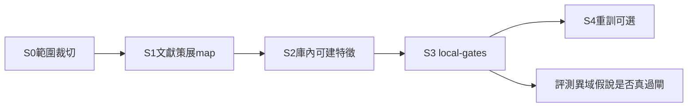

# PME 異域進化閉環開通計畫 [I]（2026-07-28）

* **性質**：[I] plan-first 計畫書（CLAUDE #16／#20；憲章第六部計畫完整性 v1.39.0）— **不創設 [N]**；**本輪只出計畫＋拍板碼，不實作放量**
* **授權觸發**：Steward 明示「**要開進化閉環**」＝撤銷／取代同日 `PME-XDOM-NO`，開通異域 know-how → PME 灌預測因子路徑
* **前置**：既有 PME ✅ `PME-Efull-yes`／AUTO-B／KILL／PRODSET／P2H；MAP-E012 CLOSED；KH-XDOM S01 CLOSED（顧問跨域作答）；HANDOFF §4.0 近程「不做他域進化閉環」＝本計畫待撤銷對象
* **姊妹／正交**：`reports/augur_knowhow_cross_domain_advisor_plan_20260728.md`（**讀與答**）；本檔＝**寫進預測假說鏈**（見 §1.4）
* **治權錨**：憲章 v1.47.0「跨域原理映射準則」；A.16／共同不變式②（素養不進預測 runtime）；soul-vs-raw；predict-vs-market-api；FZ-keep

### Steward 拍板欄（待填）

| 欄 | 內容 |
|---|---|
| **日期** | （待） |
| **狀態** | ⏳ 待拍板（計畫已出；**未**開工實作） |
| **建議碼** | `PME-XDOM-YES` ＋ `PME-XDOM-SUNZI-MGMT`（或更窄 `PME-XDOM-PILOT-1`）＋ `GATE-keep` ＋ `FZ-keep` |
| **效力預期** | 廢止 `PME-XDOM-NO`；HANDOFF §4.0「不做他域進化」改指本計畫分階；實作另待「開 PME-XDOM-S0」或等價執行碼 |
| **留痕預期** | 拍板後寫 `audits/PME-XDOM-PLAN-APPROVED-20260728.md`；HANDOFF 一句 |

---

## 0. 一句結論

允許**異域 know-how 抽象出的可證偽概念**，經 **investment school 全鏈**（`philosophy_principle` → `principle_factor_map` → G-PROM／G-ECON → AUTO-B → prodset）進入台股預測假說池——**仍**禁 AI 造原則、禁降閘、禁 runtime 灌語料、禁自動下單、**預設 FZ-keep**。  
**顧問跨域作答（KH-XDOM，已 S01）≠ 本計畫**；本計畫＝把「知相關」落到「假說能否過市場閘」。

---

## 1. What／Why／非目標

### 1.1 What（允許什麼進入 PME）

| 層 | 允許 | 機械載體 |
|---|---|---|
| **概念來源（異域）** | 孫子／兵法×企管；企管／ERP **know-how 概念**（非 dump 列）；太陽能材料／漿料×供應鏈；其他 Steward 納入之 know-how——凡能抽出**可證偽、可對映市場特徵**之假說 | 真實文獻 citation；可選 `principle_domain_map` **應用注記**（憲章 v1.47.0） |
| **量化載體（必經）** | 僅 **`domain='investment'` school** 下之人撰 `philosophy_principle`＋`principle_factor_map`（feature∈庫內可建／已有 `feature_values`） | 與既有 PME／MAP-E012 同鏈；**不**因異域標籤跳過閘 |
| **裁決／上線** | G-ISO／G-MAP／G-PROM／G-ECON／G-ATTEST／G-KILL／G-NOEXEC 全綠 ∧ kill clear → AUTO-B APPLY → `evolution_production_feature_set`；可選 S4 重訓 | 既有 `run_philosophy_evolution`／`apply_evolution_promotions`／P2H |
| **素養語料本身** | 仍住 `knowledge_*`／works／chunks——顧問可引用 | **永不**作 feature 列、永不 `import` 進 predict（A.16／`import_isolation`） |

**允許進入的「異域」具體邊界（建議拍板時釘死一條近程）**：

| 候選閉環 | 概念例（假說，非真兆） | 市場對映難度 | 近程建議 |
|---|---|---|---|
| **孫子×企管（文獻橋）** | 「先勝而後求戰」→ 財務／營運緩衝／品質穩定性代理特徵；「知彼知己」→ 資訊優勢／機構籌碼族 | 中（須人把戰略句譯成可驗方向＋既有 feature） | ✅ **建議首條**＝`PME-XDOM-SUNZI-MGMT` |
| **孫子×ERP dump** | 把 Tiptop 操作手冊／4gl 語意直接當因子 | **高危**：ERP 列≠市場可觀測；易噪音 map | ❌ 近程**不做**整庫灌；最多作**顧問引用／人讀靈感**，不自動 SEED map |
| **太陽能材料／漿料×電子供應鏈** | 材料／製程 know-how → 相關族群營收 YoY、毛利分位、庫存週轉等（若庫內有） | 中高（產業對映＋特徵缺口） | 次條候選＝`PME-XDOM-SOLAR`（首條綠機制後） |
| **既有 investment 擴大** | MAP-E012 路徑已開 | — | 本計畫**不取代**；正交並行 |

**憲章硬句（不可繞）**〔v1.47.0〕：`principle_domain_map.domain`＝**應用注記軸、非量化資格**；他域原理欲入量化，須以 **investment school 下 principle** 為載體另走全鏈——本表列**不構成**任何量化憑據。  
v2 I8／H10：注記人撰；禁 SQL join `principle_domain_map`→`principle_factor_map` 當資格捷徑。

### 1.2 Why

* Steward：「know-how 皆相關」→ KH-XDOM 已開**讀答**；同日 `PME-XDOM-NO` 曾鎖**寫進預測**——本令＝開寫側，與「相關性」哲學對齊。
* 靈魂／PME：哲學＝假說骨架；**驗證活下來、非大師／異域權威說了算**——異域開通後**更**需要 G-PROM／G-ECON，非更鬆。
* soul-vs-raw：進靈魂／假說層的是 raw **交互抽象出的概念**，不是 ERP／論文整庫 raw。
* 既有瓶頸（MAP／prodset）：覆蓋↑≠雙綠↑；異域是**新假說來源**，誠實預期多數仍不過閘——成功定義＝**可追溯過閘／誠實 FAIL**，非保證綠。

### 1.3 非目標（硬紅線）

| 不做 | 理由 |
|---|---|
| ≠ **自動下單**／券商執行 | G-NOEXEC；靈魂交易扣扳機仍為人 |
| ≠ **解凍 FinMind／FRED**（預設） | `FZ-keep`；庫內 as-of／可建特徵即可驗（predict↔API 正交） |
| ≠ **降閘假綠**／ECON-only 晉升／SKIP＝PASS | `GATE-keep`；AUTO-B 七閘 AND |
| ≠ **整庫 raw／knowledge 進靈魂或 feature** | soul-vs-raw；A.16；禁 embedding／全文當權重 |
| ≠ **AI 生成原則／詮釋／citation 入庫** | #1；`source_type`／`note_kind` CHECK；策展＝人＋可核文獻 |
| ≠ **runtime 哲學／顧問加權改預測分數** | 熱路徑只吃 prodset 特徵名；FORBIDDEN 不變 |
| ≠ **可交易／確立級宣稱** | `direction_gate.evaluated_pass` 門二未過；prodset≠門二 |
| ≠ **把 KH-XDOM 顧問評測當 PME 驗收** | 正交（§1.4）；答得出≠過閘 |
| ≠ **本輪放量實作**（無執行碼） | plan-first；僅計畫＋建議拍板 |

### 1.4 與 KH-XDOM 正交（必讀）

| | **KH-XDOM（顧問）** | **本計畫 PME-XDOM（進化）** |
|---|---|---|
| **是什麼** | 跨域**檢索作答**；去作答 `domain=` 閘；ATA 終態推進 | 異域概念→**investment 假說→map→閘→prodset** |
| **成功尺** | 多標籤引用／誠實缺料／guard 過 | G-PROM∧G-ECON 真裁決；APPLY 可追溯 |
| **寫入預測？** | **否**（`import_isolation`） | **是**（僅經 feature／prodset，非語料 runtime） |
| **同日狀態** | ✅ S01 CLOSED；仍可另拍 EVAL／QUAL | ⏳ 本計畫待 `PME-XDOM-YES`；廢止 `PME-XDOM-NO` |
| **一句** | 跨域＝**讀與答** | 異域進化＝**寫進假說鏈並過市場閘** |

二者可並行：顧問繼續降噪音（`KH-XDOM-QUAL`）；進化另開策展與閘——**不得**用顧問命中率宣稱因子已驗證。

---

## 2. 撤銷機制（`PME-XDOM-NO` → `PME-XDOM-YES`）

| 步驟 | 動作 | 誰 |
|---|---|---|
| 1 | Steward 明示拍板句含 **`PME-XDOM-YES`**（廢止同日 `PME-XDOM-NO`）＋範圍碼＋`GATE-keep`＋`FZ-keep` | 人 |
| 2 | 寫 `audits/PME-XDOM-PLAN-APPROVED-YYYYMMDD.md`（四／五碼效力表；簽名誠實：決策者＝hugo、繕寫＝agent） | 拍板後 agent |
| 3 | 更新 `HANDOFF.md` §4.0：刪／改「不做他域進化閉環」→「PME-XDOM 已開通；近程範圍＝〈範圍碼〉；執行另令」；KH-XDOM 列保留正交註 | 拍板後 |
| 4 | 本檔 Steward 欄改「已拍」；KH-XDOM 計畫 §1.3／§1.4 之「近程不做異域進化」改為「已由 PME-XDOM-YES 取代」（互鏈一句，不重寫顧問計畫正文） | 拍板後 |
| 5 | **實作**仍須另碼（如 `PME-XDOM-S0` 或「開 PME-XDOM-S01」）——`YES`＝開通授權＋範圍，**≠**默認放量 SEED／跑閘 | 另令 |

**效力邊界**：`PME-XDOM-YES` **不**暗含解凍、不暗含降閘、不暗含 ERP dump→feature、不暗含改 [N]。

---

## 3. 分階（S0→S4）＋評測



| 階段 | 名稱 | 內容 | 依賴 | 驗收摘要 |
|---|---|---|---|---|
| **S0** | 範圍裁切 | 釘首條閉環（建議孫子×企管文獻橋）；列候選假說 3–8 條；對既有 `feature_values` 做可對映／缺特徵／不可對映三桶；明示 ERP dump／solar 是否進近程 | `PME-XDOM-YES`＋範圍碼 | 書面範圍＋三桶表可複現；**零**寫 DB（或僅診斷帳） |
| **S1** | 文獻策展 map | 人撰 investment school 下 principle（citation 可核）；`principle_factor_map` 冪等 upsert；可選 `principle_domain_map` 注記（孫子→企管等）；**禁** AI 造句；沿 `curate_pme_map_expand` 範式新 SEED 或新 script | S0 | 新 map 列皆有 source；selftest 禁 ai_generated；I8 無資格捷徑 join |
| **S2** | 庫內可建特徵 | 僅對 missing 且**零 API**可建者寫 builder；不可建→誠實缺列；blocked_div 仍 blocked | S1；FZ-keep | 可建者有 `feature_values`；不可建不標 validated |
| **S3** | local-gates | `run_philosophy_evolution`／verify＋G-PROM＋G-ECON；FAIL_SIGN 紀律；AUTO-B 僅雙綠∧kill clear 才 APPLY | S2；GATE-keep | gate_json 可追溯；異域來源 map **允許大量 FAIL**（誠實） |
| **S4** | 重訓 | 僅當 prodset active 變動後 P2H 重訓；FC-empty 不變 | S3 APPLY 有變 | n_feats／rows 誠實；≠可交易 |
| **E** | 評測尺 | 「異域假說是否真過閘」＝專表：map_id×來源閉環×verdict；對照同窗隨機／既有 investment map 基線；**禁止**用顧問 cite 率當通過 | S3 | 報告數字出自 run／DB；不過閘不敘事美化 |

**建議近程一次拍開通、分次開工**：  
`PME-XDOM-YES`＋範圍 → 另令 `PME-XDOM-S0`（或 S0＋S1 包）→ S2／S3／S4 再碼。

---

## 4. Schema／Python 規畫

### 4.1 表（預設不綠地重寫）

| 物件 | 角色 | 本計畫 |
|---|---|---|
| `philosophy_school`／`philosophy_principle` | 量化鏈載體（investment） | S1 **INSERT** 人撰原則（新 school 可選，如 `strategy_sunzi_invest` **仍標 investment 量化域**） |
| `principle_factor_map` | feature＋direction 假說 | S1 upsert；S3 回填 validated_* |
| `philosophy_source`／work／thinker | 溯源；禁 ai_generated | S1 必填 citation |
| `principle_domain_map` | 跨域**應用注記**（非資格） | S1 可選 INSERT；**不** join 當過閘憑據 |
| `knowledge_*`／ERP／solar items | 素養／顧問 | **只讀靈感**；不寫入 map 自動管線 |
| `feature_values`／builders | 市場真兆 | S2 庫內建；預測側只讀 |
| `evolution_run`／`promotion_queue`／`evolution_apply_log`／`evolution_production_feature_set`／`evolution_kill_switch` | PME 帳本 | S3／S4 既有路徑 |
| `evolution_hypothesis_hint`（若用 RAW→TW） | 跨軸 hint | 可選；仍須 H3 人 approve 後才 curate（既有）——**異域 SEED 可直 curate，不強制走 hint** |

**不產新表（近程）**；若 S0 診斷要固化「異域來源標籤」，優先用 `principle_factor_map.provenance` JSONB（既有 DDL 擴充欄）標 `xdom_loop=sunzi_mgmt`，避免第二套資格表。

### 4.2 Python／腳本

| 檔 | 角色 | 階段 |
|---|---|---|
| **新或擴** `scripts/curate_pme_xdom_map.py`（建議名） | 異域→investment SEED；dry-run／`--apply`／`--selftest`；禁 ai_generated | S1 |
| 既有 `scripts/curate_pme_map_expand.py` | 範式；investment 擴大仍用 | 對照 |
| 既有 feature builders／`scripts/build_*.py` | S2 缺特徵 | S2 |
| 既有 `scripts/run_philosophy_evolution.py`／`verify_candidate_promotion.py`／`run_economic_eval.py` | S3 閘 | S3 |
| 既有 `scripts/apply_evolution_promotions.py` | AUTO-B APPLY | S3 |
| 既有 P2H 重訓入口 | S4 | S4 |
| **新** `scripts/report_pme_xdom_gate_eval.py` | 異域 map 過閘專表（stdout／JSON） | E |
| `src/augur/audit/import_isolation.py`＋isolation tests | 回歸：knowledge／advisor 不進 predict | U |
| HANDOFF／audits | 撤銷登錄 | 拍板後 |

**強制不變式**：predict 零 import knowledge／philosophy runtime 內容；map 策展可寫 philosophy 表（與現行 PME 相同）；閘閾不降。

---

## 5. 驗收

| ID | 條件 | 否證 |
|---|---|---|
| V-REV | `PME-XDOM-YES` 登錄後 HANDOFF 不再把「不做他域進化」當現行近程鎖 | 仍寫死 NO 為有效禁令 |
| V-ORTH | 文件／測試區分 KH-XDOM 作答 vs PME-XDOM 灌因子 | 用顧問命中率宣稱 G-PROM PASS |
| V-CHAIN | 每條異域來源 map 皆掛 investment principle＋可核 citation | 僅有 `principle_domain_map` 或 knowledge 列就進 queue |
| V-I8 | 無 code 以 domain_map join 當量化資格 | join 捷徑或自動晉升 |
| V-GATE | GATE-keep：閾值不變；雙綠才 APPLY；FAIL 可佔多數 | 降閾／ECON-only 上線 |
| V-FZ | 零 FinMind／FRED（除非另明示解凍） | sync 當本計畫前置 |
| V-RAW | 無整庫 ERP／論文 raw 進 feature／靈魂 | embedding 當權重；dump 列 SEED |
| V-AI | source_type／note 無 ai_generated | AI 摘要原則入庫 |
| V-EVAL | 異域過閘報告出自 run／DB | 記憶／估算數字 |
| V-NOEXEC | APPLY 路徑無下單 | 交易 API |

---

## 6. 風險

| 風險 | 緩解 |
|---|---|
| **噪音 map**（戰略金句硬套動能／籌碼） | S0 三桶嚴選；每條假說寫「可否證條件」；FAIL_SIGN／對照臂；寧可少 map |
| **ERP 無市場特徵對映** | 近程排除 dump→map；ERP 僅顧問／人讀；若強行對映須 S0 書面「觀測定義」否則拒 SEED |
| **太陽能特徵缺口** | 次條再開；缺庫內序列→缺列不幻造；不解凍硬補 |
| **與顧問噪音同源**（solar_rd／erp 字面命中） | 進化策展**不**自動吃 retrieve 結果；人揀概念 |
| **假綠／Goodhart** | GATE-keep；禁事後改閾；provenance＋run SHA |
| **隔離破口** | isolation 回歸；A.16 |
| **範圍膨脹** | 範圍碼鎖首條；加域另拍 `PME-XDOM-SOLAR` 等 |
| **與 MAP-E012／TWEVO 搶產能** | 分令開工；heavy_slot／kill scope 既有紀律 |

---

## 7. Steward 拍板碼建議

| 碼 | 含義 | 建議 |
|---|---|---|
| **`PME-XDOM-YES`** | 廢止 `PME-XDOM-NO`；採納本計畫為異域進化開通藍圖 | ✅ 必拍 |
| **`PME-XDOM-SUNZI-MGMT`** | 近程範圍＝孫子×企管**文獻橋**（investment 原則＋既有／可建 feature）；**不含** ERP dump 自動 map | ✅ 建議首範圍 |
| **`PME-XDOM-PILOT-1`** | （更窄替代）僅 1 條原則×≤3 map，機制驗證用 | 若要極窄可取代上一碼 |
| **`PME-XDOM-SOLAR`** | 太陽能材料閉環 | ⏸ 次拍 |
| **`PME-XDOM-SUNZI-ERP`** | 孫子↔ERP **含**操作語料對映嘗試 | ⚠ **不建議近程**；若拍須另附「觀測定義＋否證」附件 |
| **`GATE-keep`** | 不降 G-PROM／G-ECON；SKIP≠PASS | ✅ 必拍 |
| **`FZ-keep`** | 不解凍 FinMind／FRED | ✅ 必拍（解凍另句） |
| **`PME-XDOM-S0`** | （執行碼）開工 S0 診斷／裁切 | 拍 YES 後另令或同包 |

### 建議拍板句（可直接貼回）

```text
PME-XDOM-YES + PME-XDOM-SUNZI-MGMT + GATE-keep + FZ-keep
```

含義摘要：開通異域進化閉環；近程只做孫子×企管文獻→investment 假說→map→閘；維持閘與 API 凍結；**實作另候執行碼**。

更窄機制試跑：

```text
PME-XDOM-YES + PME-XDOM-PILOT-1 + GATE-keep + FZ-keep
```

若要連 S0 診斷一起開：

```text
PME-XDOM-YES + PME-XDOM-SUNZI-MGMT + PME-XDOM-S0 + GATE-keep + FZ-keep
```

---

## 8. 回報摘要（給拍板頁）

| 項 | 內容 |
|---|---|
| **路徑** | `reports/augur_pme_cross_domain_evolution_enable_plan_20260728.md` |
| **What 一句** | 異域概念→investment principle→factor_map→G-PROM／G-ECON→prodset（仍 AUTO-B／禁 AI 造原則） |
| **正交** | KH-XDOM＝讀答（S01 已閉）；本計畫＝寫進假說鏈過市場閘 |
| **撤銷** | `PME-XDOM-YES` 廢止 `PME-XDOM-NO`＋更新 HANDOFF |
| **建議拍板** | `PME-XDOM-YES`＋`PME-XDOM-SUNZI-MGMT`＋`GATE-keep`＋`FZ-keep` |
| **本輪** | **不實作** |

---

## 9. 修訂／對照

| 日期 | 說明 |
|---|---|
| 2026-07-28 | 初版：Steward「要開進化閉環」→ plan-first；對照 KH-XDOM／PME-Efull／憲章 v1.47.0／HANDOFF §4.0；建議首範圍孫子×企管文獻橋、排除 ERP dump 自動 map |

**對照索引**：PME 主計畫＝`reports/augur_philosophy_market_evolution_loop_plan_20260724.md`；MAP 擴大＝`reports/augur_pme_expand_hypothesis_map_coverage_plan_20260724.md`；KH-XDOM＝`reports/augur_knowhow_cross_domain_advisor_plan_20260728.md`；拍板 NO 登錄＝`audits/KH-XDOM-PLAN-APPROVED-20260728.md`。
