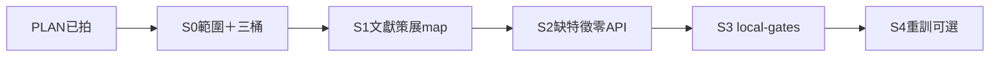

# PME-XDOM-SOLAR 異域進化軸計畫 [I]（2026-07-29）

* **性質**：[I] plan-first 計畫書（CLAUDE #16／#20；憲章第六部計畫完整性 v1.39.0）— **不創設 [N]**  
* **母計畫**：`reports/augur_pme_cross_domain_evolution_enable_plan_20260728.md`（`PME-XDOM-YES` 已開通異域寫側）  
* **範式對照**：SUNZI-MGMT＝`audits/PME-XDOM-SUNZI-MGMT-S01-CLOSED-20260728.md`；AI-PREDICT＝`reports/augur_pme_xdom_ai_predict_plan_20260728.md`  
* **授權觸發**：Steward WAVE2＝`PME-XDOM-SOLAR-PLAN`＋`FZ-keep`（＋本計畫守 `GATE-keep`）  
* **本輪交付**：**僅**計畫書＋拍板登錄；**不**跑 S0／S1／local-gates／APPLY／map INSERT

### Steward 拍板欄

| 欄 | 內容 |
|---|---|
| **日期** | 2026-07-29 |
| **狀態** | ✅ **PLAN 已拍**＝開工授權僅及計畫＋登錄；**執行 S0 須另令**（如 `開 PME-XDOM-SOLAR-S0`） |
| **拍板碼** | `PME-XDOM-SOLAR-PLAN`＋`GATE-keep`＋`FZ-keep` |
| **效力** | 採納本藍圖為 **太陽能材料／供應鏈概念 → 台股預測假說鏈** 之近程範圍；對齊 `PME-XDOM-YES`；**不解凍**；**不降閘**；**不**暗開 S1／S3 |
| **留痕** | `audits/PME-XDOM-SOLAR-PLAN-APPROVED-20260729.md`；WAVE2 §三 |

---

## 0. 一句結論

把「太陽能材料／製程／供應鏈 **可證偽概念**」（非漿料配方原文、非研發探针命中）人撰成 **investment** school 原則＋`principle_factor_map`（對映庫內台股 `feature_values`），走既有 G-PROM／G-ECON 全鏈——**仍**禁 AI 造原則、禁降閘、禁 FinMind／FRED、禁顧問／RKI hardcode 專答、禁自動下單、**不**把探針／顧問 cite 當過閘憑據。

---

## 1. What／Why／正交邊界

### 1.1 What（Solar×台股預測因子鏈——明示範圍）

| 層 | 允許（本軸） | 機械載體 |
|---|---|---|
| **概念來源（異域）** | 太陽能材料／電池／漿料／模組供應鏈之**公開文獻可溯源概念**（品質穩定性、產能週期、原物料成本敏感、下游電子／綠能資本支出代理等）——經人譯成可證偽投資假說 | 真實文獻 citation；可選 `principle_domain_map` 注記（非資格） |
| **量化載體（必經）** | 僅 `domain='investment'` school 下之人撰 `philosophy_principle`＋`principle_factor_map`；`feature` ∈ 庫內已有或 **零 API 可建**之 `feature_values` | 與 SUNZI／AI-PREDICT 同鏈；provenance 建議 `xdom_loop=solar` |
| **台股對映窗（近程建議桶）** | 營收成長／毛利／庫存週轉／資本支出敏感代理、族群相對動能等——**須 S0 三桶親驗後釘死**，本檔不幻造列數 | S0 診斷帳 |
| **裁決／上線** | G-PROM∧G-ECON 雙綠∧kill clear → AUTO-B APPLY → prodset；可選 S4 重訓 | 既有 evolution／P2H |
| **素養語料本身** | 仍住 knowledge／RKI／顧問 | **永不**作 feature；A.16 |

**近程範圍碼解讀（釘死一句）**：

> **`PME-XDOM-SOLAR`**＝**太陽能產業／材料供應鏈文獻橋 → investment 假說 → 台股特徵 map → 市場閘**。  
> **不是**「太陽能材料研發技術本身的進化閉環」；**不是**把漿料／製程配方寫成特徵列。

### 1.2 Why

* 母計畫已列「太陽能材料／漿料×電子供應鏈」為次條候選；SUNZI／AI-PREDICT 機制已綠路徑，本軸可開**範圍**而不急開閘。  
* soul-vs-raw：進假說層的是 raw **交互抽象概念**，不是論文／know-how 整庫。  
* 誠實預期：產業對映難＋特徵缺口 → 多數 map 可能 FAIL；成功＝可追溯過閘／誠實 FAIL，非保證綠。

### 1.3 正交邊界（硬；與他軌不可混）

| 他軌 | 本軸關係 | 禁混句 |
|---|---|---|
| **RKI AI×solar research probe**（`RKI-AI-SOLAR-RD`／`RKI-FP-AI-SOLAR`／KNI 三元） | **檢索／交互探針** | ≠ 本碼；探針綠 ≠ map 資格 ≠ G-PROM 憑據 |
| **`PME-XDOM-AI-PREDICT`** | AI／ML **方法論** × 投資預測模型進化 | ≠ 本碼；勿把 OOS／正則假說當「太陽能供應鏈」SEED；勿共用 SEED 腳本無分流 |
| **NHC advisor solar hardcode** | 顧問產生禁領域答案樹；A0 太陽能題＝檢索組答 | ≠ 本碼；產生答 ≠ 灌因子；禁為本軸寫死太陽能專答 |
| **KH-XDOM** | 跨域讀答 | 答得出 ≠ 過閘 |
| **ERP dump** | 操作語料 | 仍鎖；不因 SOLAR 開通而灌 |

### 1.4 非目標（硬紅線）

| 不做 | 理由 |
|---|---|
| 本輪跑 S0／S1／S3／S4／map INSERT／APPLY | WAVE2＝`…-PLAN`；執行另令 |
| 降閘／ECON-only／SKIP＝PASS | `GATE-keep` |
| FinMind／FRED sync／放量補太陽能相關 raw | `FZ-keep`；缺特徵＝缺列或零 API 可建 |
| AI 生成原則／citation／摘要入庫 | #1；philosophy 不變式 |
| 漿料配方／專利全文／embedding 當 feature | soul-vs-raw；A.16 |
| RKI／顧問 cite 率當過閘 | V-ORTH |
| 自動下單／可交易／確立級 | G-NOEXEC；門二未過 |
| **急開閘**（S1 後立即 S3 無另令） | 見 §6；S3 須明示 `開 PME-XDOM-SOLAR-S3` |
| 入憲改 [N] | 另開案 |

---

## 2. 分階（S0–S3；S4 可選）



| 階段 | 內容 | 依賴 | 本 WAVE2 |
|---|---|---|---|
| **PLAN** | 本檔＋approval audit | Steward `PME-XDOM-SOLAR-PLAN` | ✅ |
| **S0** | 範圍釘死；候選假說 3–8；`feature_values` 三桶（可對映／缺特徵／不可對映）；明示拒 SEED 清單（配方／RKI／embedding／AI-PREDICT 混軸） | 另令 `開 PME-XDOM-SOLAR-S0` | ❌ 未開 |
| **S1** | 人撰 investment school（建議名 `solar_supply_invest`）＋principle／source／map；可選 domain_note；`--selftest`；冪等 `--apply` | S0 書面驗收 | ❌ |
| **S2** | 缺特徵僅列帳；零 API 可建者另令才建；不可建不標 validated | S1 | ❌ |
| **S3** | local-gates；雙綠∧kill clear 才 APPLY；FAIL 可佔多數 | 另令 `開 PME-XDOM-SOLAR-S3`；`GATE-keep` | ❌ **禁急開** |
| **S4** | 僅 prodset active 變動後 P2H 重訓 | S3 APPLY 有變；另令 | ❌ 不建議急開 |

---

## 3. Schema 觸及（預設不綠地重寫）

| 物件 | 角色 | 本軸 |
|---|---|---|
| `philosophy_school` | investment 載體；可新建 `solar_supply_invest`（仍 `domain='investment'`） | S1 INSERT（待執行令） |
| `philosophy_principle`／`philosophy_source` | 人撰＋可核 citation；禁 `ai_generated` | S1 |
| `principle_factor_map` | feature＋direction；provenance `xdom_loop=solar` | S1 upsert；S3 回填 validated_* |
| `principle_domain_map` | 可選注記（如 `solar_materials`／`supply_chain`）— **非**量化資格 | S1 可選；禁 join 捷徑（I8） |
| `feature_values`／既有 builders | 台股真兆；S0 三桶對照 | S0 唯讀診斷；S2 可建才寫 |
| `knowledge_*`／`knowhow_interaction_probe` | RKI／顧問靈感 | **只讀**；不進 map 自動管線 |
| `evolution_run`／`promotion_queue`／`evolution_apply_log`／`evolution_production_feature_set`／`evolution_kill_switch` | PME 帳本 | **僅 S3＋**（另令） |
| **近程不產新表** | 來源標籤住 provenance JSONB | 避免第二套資格表 |

**乾式規劃註**：上表角色與母計畫／AI-PREDICT 同構；本輪**零 DDL APPLY、零 map INSERT**——列數／feature 窗留给 S0 親驗。

---

## 4. Python／模組角色

| 檔 | 角色 | 階段 |
|---|---|---|
| **新** `scripts/curate_pme_xdom_solar_map.py` | SEED dry-run／`--apply`／`--selftest`；禁 ai_generated；與 AI-PREDICT／SUNZI **分流** | S1 |
| 對照 `scripts/curate_pme_xdom_map.py`／`curate_pme_xdom_ai_predict_map.py` | 範式；勿混 SEED | 對照 |
| 既有 feature builders／`scripts/build_*.py` | S2 缺特徵（零 API） | S2 |
| 既有 `scripts/run_philosophy_evolution.py`／`verify_candidate_promotion.py`／`run_economic_eval.py` | S3 閘 | S3 |
| 既有 `scripts/apply_evolution_promotions.py` | AUTO-B APPLY | S3 |
| 既有 P2H 重訓入口 | S4 | S4 |
| 可選 `scripts/report_pme_xdom_gate_eval.py`（母計畫） | 異域過閘專表；本軸濾 `xdom_loop=solar` | E |
| `src/augur/audit/import_isolation.py` | knowledge／advisor 不進 predict | 回歸 |
| S0 報告 `reports/augur_pme_xdom_solar_s0_YYYYMMDD.md` | 三桶診斷；零寫 DB | S0 |

**強制不變式**：predict 熱路徑零 import knowledge／philosophy 內容；閘閾不降；策展腳本無參數 graceful＋指令矩陣（#18／#29）。

---

## 5. 驗收

| ID | 條件 | 否證 |
|---|---|---|
| **V-PLAN** | WAVE2／approval 標 PLAN 已拍；S0 未默認開工 | 未另令即跑 S0／S1 |
| **V-SCOPE** | 書面範圍＝太陽能文獻橋→台股 map；明示≠研發閉環本身 | 漿料配方當 feature；範圍模糊 |
| **V-ORTH** | 文件區分 RKI AI×solar／AI-PREDICT／NHC | 以探針或顧問命中宣稱過閘 |
| **V-CHAIN** | 每 map 掛 investment principle＋可核 citation | 僅 knowledge 列或 domain_map 進 queue |
| **V-I8** | 無 domain_map→map 資格 join | 捷徑晉升 |
| **V-AI** | 無 `ai_generated` | AI 摘要原則入庫 |
| **V-NHC** | 無太陽能領域專答 hardcode | 顧問答案樹餵 SEED |
| **V-GATE** | 閾值不變；雙綠才 APPLY；禁急開閘 | 降閾／S1 後擅自 S3 |
| **V-FZ** | 零 FinMind／FRED | sync 當本軸前置 |
| **V-NOEXEC** | APPLY 無下單；≠可交易／確立級 | 交易或門二宣稱 |

---

## 6. 禁急開閘（執行紀律）

| 禁 | 說明 |
|---|---|
| **禁 PLAN＝S0** | `PME-XDOM-SOLAR-PLAN` 只採納藍圖；S0 須 `開 PME-XDOM-SOLAR-S0`（或等價） |
| **禁 S1＝S3** | 策展後不自動 local-gates；S3 須明示 `開 PME-XDOM-SOLAR-S3` |
| **禁 假綠補洞** | 缺特徵不解凍 FinMind／FRED 硬補；不可對映桶拒 SEED |
| **禁 跨軸 SEED** | 本腳本不 INSERT AI-PREDICT／SUNZI 假說；RKI probe_id 不寫進 map |

建議後續拍板句（執行時可直接貼）：

```text
開 PME-XDOM-SOLAR-S0 + GATE-keep + FZ-keep
```

S0＋S1 包（若 Steward 要一次開策展、仍禁閘）：

```text
開 PME-XDOM-SOLAR-S0 + PME-XDOM-SOLAR-S1 + GATE-keep + FZ-keep
```

S3（雙綠才 APPLY；不建議與 S1 同輪）：

```text
開 PME-XDOM-SOLAR-S3 + GATE-keep + FZ-keep
```

---

## 7. 風險

| 風險 | 緩解 |
|---|---|
| 產業詞硬套台股動能（噪音 map） | S0 三桶嚴選；每假說寫可否證條件；寧可少 map |
| 太陽能專用序列庫內短缺 | 缺列誠實；S2 零 API 可建才建；FZ-keep |
| 與 RKI／顧問噪音同源 | 策展不自動吃 retrieve；人揀概念 |
| 與 AI-PREDICT 混軸 | 分腳本／分 provenance／分 school 名 |
| 假綠／Goodhart | GATE-keep；禁事後改閾；provenance＋run SHA |
| 範圍膨脹到「材料 R&D 進化」 | 範圍釘句；研發軸留 RKI／顧問 |

---

## 8. 回報摘要（給拍板頁）

| 項 | 內容 |
|---|---|
| **路徑** | `reports/augur_pme_xdom_solar_plan_20260729.md` |
| **What 一句** | 太陽能供應鏈文獻概念 → investment principle → 台股 feature map → 閘（另令） |
| **正交** | ≠ RKI AI×solar；≠ AI-PREDICT；≠ NHC solar hardcode |
| **本輪** | ✅ PLAN＋登錄；❌ S0／閘／APPLY |
| **下一步（人）** | `開 PME-XDOM-SOLAR-S0`＋GATE／FZ-keep |

---

## 9. 修訂

| 日期 | 說明 |
|---|---|
| 2026-07-29 | 初版：WAVE2 `PME-XDOM-SOLAR-PLAN`＋FZ-keep；對齊 AI-PREDICT／母計畫；明示 Solar×台股範圍與禁急開閘；執行 S0 另令 |

**對照索引**：母計畫＝`reports/augur_pme_cross_domain_evolution_enable_plan_20260728.md`；AI-PREDICT＝`reports/augur_pme_xdom_ai_predict_plan_20260728.md`；RKI solar 種子＝`audits/RKI-AI-SOLAR-RD-SEED-20260728.md`；WAVE2＝`audits/WAVE2-SIX-TRACK-APPROVED-20260729.md`。
