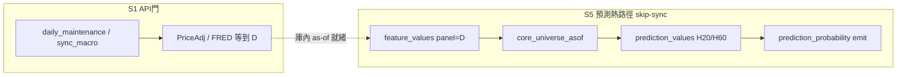

# 收盤後日更 as-of 作業設計（2026-08-05）

> **可行性一句**：**可以**——在庫內價已到收盤日 `D` 後，重跑特徵／core／predict／emit，使顧問 as-of＝`D`。  
> **已實證**：`D=2026-08-04` 全鏈＋P6 FREEZE refit（H20／H60）。  
> **不是**：默設掛 cron、自動解凍 FinMind、自動 P6 全日 refit、假關確立級。  
> **self-reported（#32a）**。

---

## 0. 兩車道（勿混）



| 車道 | 做什麼 | 時點建議 | 硬規則 |
|---|---|---|---|
| **A. 取數** | `daily_maintenance --end D`＋`sync_macro --no-catalog` | 收盤後、券商／FinMind 可得性穩定後（現行 arena 鏈約 **20:00** 已含 API 門） | **THAW-bounded**；403→停並記缺席；禁默認 `--with-dim-sync`／Dividend 放量 |
| **B. 出單** | runbook：feat→core→predict→emit | **A 完成且** `max(PriceAdj)≥D` 之後 | **`--skip-sync`**；只用庫內；人／standing GO |

預測路徑**不得**把「缺最新 sync」當硬拒——正交原則：有庫內 `D` 就用 `D`。

---

## 1. 每日最小閉環（建議「標準日」）

設 `D`＝當日台股最後已實現交易日（與 TAIEX／2330 `max(date)` 對齊）。

| 步 | 指令（摘要） | 估時* | 每日？ |
|---|---|---|---|
| 0 | 唯讀閘：價／fv／core／pp 覆蓋 | &lt;1 min | ✅ |
| 1 | `build_feature_panel.py --panels D --asof` | ~3–5 min | ✅ 若 fv 尚無 `D` |
| 2 | `build_core_universe.py --since 2014-01-01 --liquidity-pct 25 --exempt-revenue-financial --asof` | ~10–15 min | ✅（見 §3 瓶頸） |
| 3 | `predict_asof.py --run --horizon 20 --asof D` | &lt;1 min | ✅ |
| 4 | `predict_asof.py --run --horizon 60 --asof D` | &lt;1 min | ✅ 建議（經濟冠軍尺） |
| 5 | `calibrate_relative_probability.py --emit --horizon 20 --asof D` | &lt;1 min | ✅ |
| 6 | 同 `--emit --horizon 60 --asof D` | &lt;1 min | ✅ |
| 7 | 驗收：`build_single_ticker_rel_payload("2330",20).as_of == D` | &lt;1 min | ✅ |

\*依 08-05 實測量級；core 全窗重建為主成本。

**詳細 CLI／跳過條件**：見 `reports/augur_daily_asof_predict_emit_runbook_20260805.md`。

### 建議時程（與現有 cron 錯峰）

| 時刻 | 動作 |
|---|---|
| ~20:00 | 既有 arena 日鏈（含 sync）— **A 車道**可復用其價增量 |
| A 完成 + 抽樣 `PriceAdj max≥D` | 開工 **B 車道**（或固定 21:00–21:30，錯開 21:30 arena 結算搶資源） |
| 23:00 | TWEVO 夜輪較重——**B 應在此之前結束** |

---

## 2. 非每日（節奏表）

| 項 | 節奏 | 理由 |
|---|---|---|
| **P6 `--fit`／OOS 重建** | **週**或「累積 ≥N 個新實現 exit」再跑 | 08-04 全量 H20+H60 OOS ≈ **25–30+ min／horizon**；非收盤必要 |
| 日 emit | **每日** | 沿用最新 calibrator（現為 `…asof2026-08-04…`）套新分位即可 |
| NF 新族／β 特徵假說 | 凍結至撤 pause | 不進日鏈 |
| sim settle | 時鐘驅動（K/3） | 勿與日更捆綁 |
| 方向特徵日鏈 | 可選併 arena 20:00 | **不替代** `feature_values` 面板 |

---

## 3. 瓶頸與改進候選（另 GO）

**現況痛點**：每日 `build_universe_asof`＝**DELETE 全表再灌**全部 ≥2014 panel → 日更最貴步驟。

| 候選 | 效益 | 需 |
|---|---|---|
| **B1** 僅 append／upsert `as_of_date=D`（不 DELETE 全史） | 日更由 ~15 min→秒～分級 | **✅ 2026-08-05 EXECUTED**（`CORE-B1-INCREMENTAL`；~12s＠D；全量路徑保留） |
| **B2** standing GO：「交易日收盤後允許 B 車道自動跑」 | 少逐日 AskQuestion | Steward 採納句＋fail 告警 |
| **B3** 編排薄殼 `run_daily_asof_predict.sh`（顯式 `D`、RC 匯總） | 少手誤 | **✅ SHELL EXECUTED 2026-08-05**（dry-plan／selftest；仍非 cron） |

未裁前：**維持手跑／半自動**，以 runbook 為準。

---

## 4. Standing GO（已採納 · 2026-08-05）

```
POST-CLOSE-DAILY-ASOF-standing-go | FZ/GATE-keep | API-THAW-bounded-A | skip-sync-B | no-SIM-apply
# 範圍: 交易日 D=庫內 TAIEX max(date)
# 每日 B: feat(D) → core B1 incremental@D → predict H20+H60 → emit H20+H60
# 編排: bash scripts/run_daily_asof_predict.sh --date D   （B3；非 cron）
# 不含: P6 --fit／OOS 全量、NF-pause 解凍、β5 resume、Dividend／dim-sync
# 失敗: PriceAdj < D → 跳過 B 並告警；任一 RC≠0 → 停後續步
```

帳：`audits/POST-CLOSE-DAILY-ASOF-standing-go-ADOPTED-20260805.md`。  
**仍禁**：自行掛 systemd timer／改 `install_cron.sh`（需另句）。手觸發／半自動即可重用本句。

---

## 5. 失敗與誠實邊界

| 情況 | 處置 |
|---|---|
| 價未到 `D` | 不做 B；可重試 A 或不做 |
| core／feat 缺口 | 停 predict；勿用昨日 panel 假裝 `D` |
| emit 後顧問仍舊 as-of | 查 `max(panel_date)`；確認服務讀庫非快取 |
| 使用者問「漲或跌」 | 相對機率＋GATE／dead；**不**因日更而給絕對方向（切片：`augur_advisor_absolute_direction_honesty_constitutional_slice_20260805.md`） |
| `econ_verdict=dead` | 日更照常；標籤誠實保留 |

---

## 6. 與開問題清單對照

| 本設計覆蓋 | 仍開／另軌 |
|---|---|
| 日更 B 車道 SOP＋時程 | C1 EXPAND；C2（NF-pause）；sim 時鐘 |
| standing GO 底稿 | vendor baseline；`repair_priceadj` 豁免裁；core 增量 B1 |

---

## 7. Steward 裁示（已結）

**採納 `adopt_standing`（2026-08-05）** — §4 可重用；仍手觸發／半自動；**不掛 cron**。

後續可選：B1 core 增量 plan · B3 編排薄殼 · 另句才談 timer。
