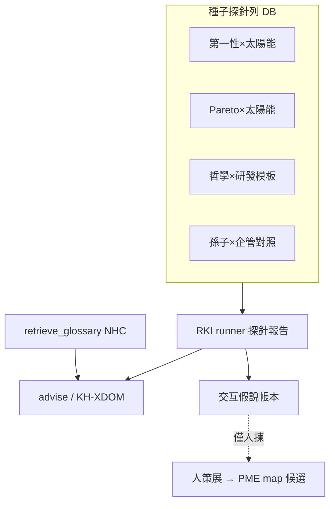

# Raw ↔ Know-how 交互核心探針計畫 [I]（2026-07-28）

* **性質**：[I] plan-first 計畫書（CLAUDE #16／#20；憲章第六部計畫完整性 v1.39.0）— **不創設 [N]**；**本輪只出計畫＋拍板碼，不實作放量**
* **授權觸發**：Steward——是否可寫計畫，對現行 DB 建 **raw data ↔ know-how 交互核心探針**（例：依第一性原理列太陽能材料研發技術核心＝**探針驅動產生，禁 hardcode**），用以**處理所有 know-how 交互議題**
* **治權錨**：`.cursor/rules/soul-vs-raw-correlation.mdc`（raw＝觀測呈現；升格＝交互抽象之概念／可證偽關係）；`predict-vs-market-api`／`finmind-fred-api-freeze`（`FZ-keep`）；原則精華 source-pure／anti-leakage；CLAUDE #29b（策展住 DB）
* **姊妹互鏈（正交，不取代）**：
  - `reports/augur_no_hardcode_db_ssot_constitution_plan_20260728.md`（**NHC**；產生禁 hardcode；A0 四探針＝本計畫種子祖先）
  - `reports/augur_knowhow_cross_domain_advisor_plan_20260728.md`（**KH-XDOM**；跨域讀答／去作答閘；S01 CLOSED）
  - `reports/augur_pme_cross_domain_evolution_enable_plan_20260728.md`（**PME-XDOM**；異域寫進假說鏈；近程僅 `SUNZI-MGMT`）
* **實證時點**：2026-07-28 對齊既有計畫＋soul-vs-raw；庫內盤點屬 S0（拍板後）

### Steward 拍板欄

| 欄 | 內容 |
|---|---|
| **日期** | 2026-07-28 |
| **狀態** | ✅ 已拍（`RKI-PLAN`＋`RKI-SCOPE-ALL-KH`＋`RKI-S01`＋`FZ-keep`＋`NHC-keep`） |
| **建議拍板碼** | `RKI-PLAN`＋`RKI-SCOPE-ALL-KH`＋`RKI-S01`＋`FZ-keep`＋`NHC-keep` |
| **效力** | 採納本計畫藍圖＋範圍定錨；開工 S0＋S1（DDL＋種子）；**不解凍** API；**不**取代 NHC／KH-XDOM／PME；禁領域 hardcode |
| **同日追加** | Steward：「AI 模型進化 × 投資預測模型進化」；「依第一性原理強化 AI 模型自我迭代再進化」；「依第一性原理強化投資模擬／預測模型自我迭代再進化」。種子＝`RKI-AI-PREDICT-*`／`RKI-FP-AI-ITER`／`RKI-FP-AI-PREDICT`／`RKI-FP-PREDICT-ITER`。**≠**自動開 `PME-XDOM-AI-PREDICT`（另需拍板） |
| **留痕** | `audits/RKI-PLAN-APPROVED-20260728.md` · 收官 `audits/RKI-S01-CLOSED-20260728.md` |

---

## 0. 一句結論

建 **DB 驅動的交互探針層**：對現行庫內 raw／features／philosophy／knowledge／embed，以可複現探針矩陣＋交互假說帳本，測「哪些 know-how 概念能與哪些 raw／特徵族／他域 know-how 對上、缺口、假相關風險」；顧問「列出技術核心」類產生＝**探針驅動的檢索＋組答**（走既有 `advise`），**零專題 hardcode**。成功＝任意新交互議題 **INSERT 一列 probe** 即可納入，不是一次枚舉宇宙。

---

## 1. 範圍定錨（§範圍 · 勿含糊）

### 1.1 四選一定錨

| # | 候選表述 | 採納？ |
|---|---|---|
| 1 | 第一性原理×太陽能等**全**交互議題 | ❌ 過窄（僅種子族之一） |
| 2 | 八二法則×太陽能等**全**交互議題 | ❌ 過窄（僅種子族之一） |
| 3 | **所有哲學×研發技術** | ❌ 過窄（漏原則×原則、原則×raw 概念橋、know-how×know-how 非哲學側） |
| 4 | **所有 know-how × 所有 know-how** | ✅ **方法論範圍＝此** |

**正式定錨（拍板碼 `RKI-SCOPE-ALL-KH`）**：

> **方法論上**＝**所有 know-how × 所有 know-how**——含：哲學×研發、原則×原則、原則×raw **概念橋**（非整庫 raw 灌入）、know-how×特徵族假說、跨域 know-how×know-how（如孫子×企管、**AI 模型進化×投資預測模型進化**、**第一性原理×AI 自我迭代**）。  
> **實作上**＝**DB 驅動探針列＋種子子集**——**不是**一次枚舉宇宙所有配對；擴充＝`INSERT` 進 `knowhow_interaction_probe`（或等價表），**零改碼**。

### 1.2 種子子集（近程必種；非範圍上限）

| 種子 ID（建議） | 軸 A（knowhow） | 軸 B（對側） | 變體／備註 |
|---|---|---|---|
| `RKI-FP-SOLAR-CORE` | 第一性原理 | 太陽能材料研發·技術核心 | 對齊 NHC A0-core |
| `RKI-FP-SOLAR-PHYS` | 第一性原理 | 太陽能材料·物理學技術核心 | A0-phys |
| `RKI-FP-SOLAR-CHEM` | 第一性原理 | 太陽能材料·化學技術核心 | A0-chem |
| `RKI-FP-SOLAR-APP` | 第一性原理 | 太陽能材料·如何應用 | A0-app |
| `RKI-PARETO-SOLAR` | 八二法則（Pareto） | 太陽能（研發／供應鏈／投資可推廣） | 可推廣模板：Pareto ×〈任意域〉 |
| `RKI-PHILO-RD-TMPL` | 哲學／原則（模板槽） | 研發技術（模板槽） | **通用模板探針**——`prompt_template` 含 `{{principle}}`×`{{tech_domain}}`；實例靠列參數，禁專支 |
| `RKI-SUNZI-MGMT` | 孫子兵法 | 企管／投資 | **對照臂**＝已開 PME-XDOM／KH-XDOM；探針測交互覆蓋，**不**暗開 `PME-XDOM-SOLAR` |
| `RKI-AI-PREDICT-EVO` | AI／ML 模型進化 | 投資／預測模型進化（PME／ranker／arena／提拔／經濟終關） | Steward 追加；**≠** `PME-XDOM-AI-PREDICT` |
| `RKI-AI-PREDICT-EVAL` | AI model evolution (EN) | Investment prediction evolution (gates／OOS) | EN 對照臂；NHC-keep |
| `RKI-FP-AI-ITER` | 第一性原理 | AI 模型自我迭代／再進化 | Steward 追加例；禁 hardcode 專答 |
| `RKI-FP-AI-PREDICT` | 第一性→AI 迭代（橋） | 投資預測模型進化（反饋） | **optional** 交叉軸；灌因子另拍 |
| `RKI-FP-PREDICT-ITER` | 第一性原理 | 投資模擬／預測模型自我迭代再進化 | Steward 追加例；PME／arena 僅檢索軸；NHC-keep |

### 1.3 成功定義（範圍驗收句）

1. 任意新交互議題（例：精實×半導體、複利×研發管線）→ **admin／migrate INSERT probe 列** → runner 可跑 → 報告可出；**repo 無**該題專用 `if`／Q&A／領域 prompt 分支。  
2. 方法論文件／評測集能描述「全 KH×KH」類問題如何入帳；種子≠宇宙。  
3. 交互升格路徑遵守 soul-vs-raw：**概念／可證偽關係**入假說帳本；**整庫 raw 不**進靈魂／原則文書。

---

## 2. What／Why／非目標

### 2.1 What

1. **交互核心探針（現行 DB）**：在 raw 表／`feature_values`／`philosophy_*`／`knowledge_item`（＋sentence／embed）之間，建可複現探針矩陣——對每列 probe：檢索命中、概念對齊候選、缺口、假相關風險旗標。  
2. **方法論覆蓋「所有 know-how 交互議題」**：探針**模板**＋評測集＋假說帳本；不是一次列完宇宙。  
3. **通用產生路徑**：顧問「列出技術核心」＝probe 展開之 query → 既有 KH-XDOM／NHC 管線（`advise`＋glossary＋guard）；**禁** hardcode 答案樹。  
4. **與三姊妹互鏈**：NHC＝產生不 hardcode／glossary SSOT；KH-XDOM＝跨域讀答；PME-XDOM＝過閘寫因子（僅人策展候選，本層不自動灌）。本計畫＝**交互探針層**（測與帳），居中餵評測／map 候選。

### 2.2 Why

* Steward 痛點：「第一性×太陽能技術核心」若寫死＝鎖死宇宙；正確槓桿＝**探針＋DB 列＋統一組答**。  
* soul-vs-raw：要處理的是 **交互抽象**，不是「有 raw 就升格」；需要機械探針把「對得上／對不上／假相關」說清楚。  
* NHC A0 已證明：四探針走統一 `advise`、無領域分支——本計畫把 A0 **升格為可擴探針帳本**（含 Pareto、通用哲學×研發、孫子對照）。  
* 不建此層 → 每個新「哲學×技術」題易滑向專支 hardcode，或與 PME／顧問範圍混淆。

### 2.3 非目標（硬紅線）

| 不做 | 理由 |
|---|---|
| ≠ 硬編碼太陽能／第一性／Pareto **專支**答案樹或 `if-domain` | `NHC-keep`；#29b |
| ≠ 把整庫 raw 灌進靈魂／原則精華／[N] | soul-vs-raw |
| ≠ 自動下單／確立級／可交易宣稱 | G-NOEXEC；門二未過 |
| ≠ 解凍 FinMind／FRED／放量 sync | `FZ-keep`；探針用**庫內** raw／features as-of |
| ≠ 取代 NHC／KH-XDOM／PME-XDOM | 本層＝交互探針；互鏈三者 |
| ≠ 因本計畫開通 `PME-XDOM-SOLAR` 或自動 SEED map | PME 近程仍僅 `SUNZI-MGMT`；S3 僅**人策展候選清單** |
| ≠ 因本計畫開通 `PME-XDOM-AI-PREDICT` | AI×預測／FP×AI 僅 **RKI 探針列**；異域灌因子**另需拍板** |
| ≠ 預測熱路徑 import knowledge／probe 結果當權重 | `import_isolation`；探針報告≠特徵 |
| ≠ AI 造原則／把探針報告當 citation 權威入庫 | #1；策展＝人 |
| ≠ 本輪放量實作（無執行碼則不動 DDL） | plan-first；僅計畫＋建議拍板 |

---

## 3. 與 NHC／KH-XDOM／PME 正交表（必讀）

| | **RKI（本計畫）** | **NHC** | **KH-XDOM** | **PME-XDOM** |
|---|---|---|---|---|
| **是什麼** | 交互探針矩陣＋假說帳本＋通用產生驅動 | 策展映射住 PG；產生禁 hardcode | 跨域檢索作答 | 異域→investment map→閘→prodset |
| **成功尺** | 探針可複現；INSERT 擴題零改碼；缺口／假相關誠實 | glossary／映射 SSOT；A0 無專支 | 可引用終態＋guard | G-PROM∧G-ECON 真裁決 |
| **寫預測？** | **否**（可產出**候選**供人策展） | 否 | 否 | **是**（僅已拍範圍） |
| **本輪狀態** | ✅ S01 CLOSED（含 AI／FP-AI 追加） | ✅ S12 CLOSED；待 S3／CONSTITUTE | ✅ S01 CLOSED | ✅ YES＋SUNZI-MGMT |
| **一句** | **測與帳交互** | **禁 hardcode 產生／詞表** | **讀與答** | **寫進假說鏈過閘** |



---

## 4. 分階（S0→S3＋U）

| 階段 | 名稱 | 內容 | 依賴 | 驗收摘要 |
|---|---|---|---|---|
| **S0** | 庫內盤點 | 列現行 raw 表族／`feature_values` 族／philosophy／knowledge／embed  consumable 現況；對種子探針做**唯讀**命中診斷（可沿 NHC A0）；標缺口桶（語料缺／特徵缺／概念無橋／假相關風險） | `RKI-PLAN`＋`RKI-SCOPE-ALL-KH` | 盤點報告可複現；**零**寫生產表（或僅診斷 JSON） |
| **S1** | DDL＋種子 | 建 `knowhow_interaction_probe`（＋可選 run／result 帳本）；INSERT §1.2 種子；migrate `--check`／`--apply`／`--selftest` | S0；開碼 `RKI-S01` | `\d`＋種子列齊；無太陽能專支 code |
| **S2** | 跑探針報告 | runner：讀 active probe → 展開 template → 庫內檢索／對齊分數／缺口旗標 → stdout／JSON／`reports/` 或 result 表 | S1 | 種子全跑；數字出自 DB／程式；禁幻造對齊 |
| **S3** | 餵評測／PME 候選 | 探針結果 → 顧問評測集擴列（KH-XDOM EVAL 可消費）；**人**從假說帳本揀候選 → 可選交 PME（仍受 `SUNZI-MGMT` 範圍；solar 候選**只列不灌**除非另拍） | S2 | 評測列可追溯 probe_id；無自動 map APPLY |
| **U** | 回歸 | isolation 綠；FZ-keep；NHC-keep（repo 無領域硬分支）；SCOPE 句：新探針 INSERT 演練通過 | S2+ | 見 §7 |

**建議近程一次開**：`RKI-S01`＝S0＋S1（盤點＋表＋種子）。S2／S3 可同包或另碼 `RKI-S2`／`RKI-S3`。

---

## 5. Schema／Python 規畫

### 5.1 建議表：`knowhow_interaction_probe`（PG SSOT）

```sql
CREATE TABLE IF NOT EXISTS knowhow_interaction_probe (
    probe_id           TEXT PRIMARY KEY,              -- 如 RKI-FP-SOLAR-CORE
    prompt_template    TEXT NOT NULL,                 -- 可含 {{slot}}；禁寫死長答
    knowhow_axis       TEXT NOT NULL,                 -- 軸 A：原則／哲學／法則／know-how 標籤
    raw_axis           TEXT NOT NULL,                 -- 軸 B：對側域／技術／特徵族／他域 know-how
    expected_family    TEXT,                          -- 期望命中族（語料／feature／principle）；可空＝純探針
    interaction_kind   TEXT NOT NULL
        CHECK (interaction_kind IN (
            'kh_x_kh',           -- know-how × know-how
            'principle_x_rd',    -- 原則／哲學 × 研發
            'principle_x_principle',
            'principle_x_raw_bridge',  -- 原則 × raw 概念橋（非灌 raw）
            'kh_x_feature_family'
        )),
    template_params    JSONB NOT NULL DEFAULT '{}',   -- 槽位實例化
    active             BOOLEAN NOT NULL DEFAULT TRUE,
    provenance         TEXT,
    note               TEXT,
    created_at         TIMESTAMPTZ NOT NULL DEFAULT now(),
    updated_at         TIMESTAMPTZ NOT NULL DEFAULT now()
);
CREATE INDEX IF NOT EXISTS idx_rki_probe_active
  ON knowhow_interaction_probe (active, interaction_kind)
  WHERE active;
COMMENT ON TABLE knowhow_interaction_probe IS
  'RKI: raw↔know-how 交互探針列(#29b；擴題=INSERT；runner 讀表；非答案 SSOT／非預測特徵)';
```

**可選帳本**（S2 起）：

| 表 | 角色 |
|---|---|
| `knowhow_interaction_probe_run` | 一次跑批：run_id、as_of、git／script SHA、started_at |
| `knowhow_interaction_probe_result` | probe_id×run_id：hit_counts、citation_ids、gap_flags、spurious_risk、raw_json |

**讀側（不新建亦可先報）**：既有 `philosophy_principle`／`principle_domain_map`／`principle_factor_map`／`knowledge_*`／`feature_values`／dataset catalog——S0 盤點釘實際表名。

### 5.2 Python／腳本

| 檔 | 角色 | 階段 |
|---|---|---|
| **新** `scripts/migrate_knowhow_interaction_probe_ddl.py` | 冪等 DDL＋種子；`--check`／`--apply`／`--show`／`--selftest`（#29） | S1 |
| **新** `scripts/run_knowhow_interaction_probes.py` | 讀 active 列 → 展開 → 庫內檢索／對齊 → 報告；`--probe-id`／`--as-of`／`--dry-run`；**零** FinMind／FRED | S2 |
| **新** `scripts/report_knowhow_interaction_gaps.py` | 缺口／假相關彙總表（stdout／JSON） | S2／S3 |
| 既有 `advise`／retrieval／`retrieve_glossary` | 產生路徑消費端；探針 query 可呼叫同一管線 | S2 |
| 既有 isolation／`import_isolation` | U 回歸：probe 結果不進 predict | U |
| **不**新建 `if 太陽能`／答案樹模組 | 硬紅線 | — |

**不變式**：runner 只讀庫內；缺語料→誠實 `gap`；禁把報告數字寫進原則表；禁 AI 自動 INSERT principle。

---

## 6. 探針方法論（模板＋評測）

### 6.1 單探針輸出欄（建議）

| 欄 | 含義 |
|---|---|
| `probe_id` | 列鍵 |
| `expanded_prompt` | template 實例化後問句 |
| `kh_hits` | philosophy／knowledge 命中摘要（id＋snippet 指標，非全文灌報） |
| `raw_or_feature_bridge` | 若有：對得上的特徵族／raw 概念標籤（**概念名**，非整表 dump） |
| `gap_flags` | `no_corpus`／`no_principle`／`no_feature`／`domain_map_missing`／… |
| `spurious_risk` | 字面共現高、概念橋弱 → 高；供人裁 |
| `advise_ok` | 可選：走 `advise` 是否 guard 過／誠實 decline |
| `pme_candidate` | 預設 false；僅人標 true 才進 S3 候選清單 |

### 6.2 假相關防護

* 字面共現 ≠ 交互概念（例：「太陽」命中天文語料）。  
* 升格條件＝可陳述**可否證關係**＋（若餵 PME）可對映庫內特徵——對齊 soul-vs-raw。  
* 探針報告標 `spurious_risk`；**不**自動寫入靈魂。

### 6.3 通用模板例（`RKI-PHILO-RD-TMPL`）

```text
依「{{principle}}」列出在「{{tech_domain}}」研發技術核心？（要求：可溯源引用；缺料則誠實說明缺口）
```

Pareto 推廣：`{{principle}}=八二法則／Pareto`，`{{tech_domain}}=太陽能材料|任意 INSERT 域`。

---

## 7. 驗收

| ID | 條件 | 否證 |
|---|---|---|
| **V-SCOPE** | 文件與拍板含 `RKI-SCOPE-ALL-KH`：方法論＝全 KH×KH；實作＝種子＋INSERT | 寫成「只做太陽能」或「一次枚舉宇宙」 |
| **V-SEED** | §1.2 種子（含 FP×solar 變體、Pareto×solar、通用模板、孫子對照）皆在表且 active | 缺 Pareto／模板／對照臂 |
| **V-INSERT** | 新增一假探針列（如精實×半導體）零改碼可被 `--show`／runner 看見 | 須改 `.py` 分支才跑新題 |
| **V-NHC** | repo **無**太陽能／第一性／Pareto 專用組答／Q&A hardcode | 為探針加 `if` |
| **V-SOUL** | 無整庫 raw 寫入靈魂／原則文書；報告只持概念橋 | dump 列貼進原則 |
| **V-FZ** | 探針／盤點零 FinMind／FRED | sync 當前置 |
| **V-ORTH** | 不取代 NHC／KH-XDOM／PME；不暗開 `PME-XDOM-SOLAR` | 探針綠＝因子已驗證 |
| **V-ISO** | predict isolation 綠；probe 非 feature 權重 | advisor 結果 import 進熱路徑 |
| **V-TRACE** | 報告數字出自 stdout／JSON／DB | 記憶估算對齊率 |
| **V-AI** | 不因探針自動 AI 造原則入庫 | staging 無闸灌 principle |

---

## 8. 風險

| 風險 | 緩解 |
|---|---|
| 範圍誤解成「必須一次做完全宇宙配對」 | `RKI-SCOPE-ALL-KH` 雙層句；種子≠上限 |
| 滑向領域專支 hardcode | `NHC-keep`＋V-NHC；產生只走 `advise` |
| 假相關當真兆 | `spurious_risk`＋人裁；soul-vs-raw |
| 與 PME 範圍膨脹 | S3 只列候選；solar 灌因子另拍 |
| 探針變第二套答案 SSOT | COMMENT／非目標：probe≠答案；答案仍 citation＋guard |
| API 解凍誘惑（補 raw 洞） | `FZ-keep`；缺口诚实 `no_feature`／as-of |

---

## 9. Steward 拍板碼（分離）

| 碼 | 含義 | 建議 |
|---|---|---|
| **`RKI-PLAN`** | 採納本計畫 what／範圍／分階／非目標／互鏈 | ✅ 必拍 |
| **`RKI-SCOPE-ALL-KH`** | 釘死 §1：方法論＝所有 know-how×所有 know-how；實作＝DB 探針列＋種子子集 | ✅ **必拍（範圍碼）** |
| **`RKI-S01`** | 開工 S0＋S1（盤點＋DDL＋種子） | ✅ 近程建議 |
| **`RKI-S2`** | 開工 runner／報告（可另拍） | 可併入 S01 或次拍 |
| **`RKI-S3`** | 開工評測餵養／PME 人候選 | 次拍 |
| **`FZ-keep`** | 不解凍市場 API | ✅ 必拍 |
| **`NHC-keep`** | 禁領域 hardcode；產生走統一管線＋DB 策展 | ✅ 必拍 |
| **（附帶）** | PME 近程仍僅 `SUNZI-MGMT`；本計畫**不**暗含 `PME-XDOM-SOLAR` | 確認即可 |

### 建議拍板句（可直接貼回）

```text
RKI-PLAN + RKI-SCOPE-ALL-KH + RKI-S01 + FZ-keep + NHC-keep
```

含義摘要：採納 raw↔know-how 交互探針藍圖；範圍＝方法論上全 KH×KH、實作上種子＋INSERT 零改碼；開工盤點＋DDL＋種子；維持 API 凍結與禁 hardcode；**S2／S3 放量另候或同句加碼**。

若要連 runner 一起開：

```text
RKI-PLAN + RKI-SCOPE-ALL-KH + RKI-S01 + RKI-S2 + FZ-keep + NHC-keep
```

---

## 10. 回報摘要（給拍板頁）

| 項 | 內容 |
|---|---|
| **可以？** | ✅ 可以且應該 plan-first（本輪只出計畫） |
| **路徑** | `reports/augur_raw_knowhow_interaction_probe_plan_20260728.md` |
| **一句範圍** | 方法論＝所有 know-how×所有 know-how（含哲學×研發、原則×原則、原則×raw 概念橋）；實作＝DB 探針列＋種子子集（FP×solar／Pareto×solar／通用模板／孫子對照），擴題＝INSERT 零改碼 |
| **建議拍板** | `RKI-PLAN`＋`RKI-SCOPE-ALL-KH`＋`RKI-S01`＋`FZ-keep`＋`NHC-keep` |
| **範圍碼** | ✅ **建議必加** `RKI-SCOPE-ALL-KH`（避免被讀成「只做太陽能」或「枚舉宇宙」） |
| **本輪** | ✅ 計畫已寫；**不實作放量** |

---

## 11. 修訂

| 日期 | 說明 |
|---|---|
| 2026-07-28 | 初版：交互探針層；互鏈 NHC／KH-XDOM／PME；FZ-keep／NHC-keep |
| 2026-07-28（同日） | Steward 追問四選一 → §1 釘死 `RKI-SCOPE-ALL-KH`；種子補 Pareto＋通用哲學×研發模板；拍板句含範圍碼 |
| 2026-07-28（同日·拍板後） | 拍板 `RKI-PLAN`＋SCOPE＋S01＋FZ＋NHC；追加種子 AI×預測（`RKI-AI-PREDICT-*`）＋第一性×AI 迭代（`RKI-FP-AI-ITER`／optional `RKI-FP-AI-PREDICT`）＋第一性×投資預測迭代（`RKI-FP-PREDICT-ITER`）；明示 `PME-XDOM-AI-PREDICT` 另拍 |

**對照索引**：soul-vs-raw＝`.cursor/rules/soul-vs-raw-correlation.mdc`；NHC A0＝`reports/augur_no_hardcode_db_ssot_constitution_plan_20260728.md` §0.5；KH-XDOM＝`reports/augur_knowhow_cross_domain_advisor_plan_20260728.md`；PME-XDOM＝`reports/augur_pme_cross_domain_evolution_enable_plan_20260728.md`。

*位階：[I] 計畫。治理原文仍以憲章 [N] 與 constitution-mcp 為準。*
