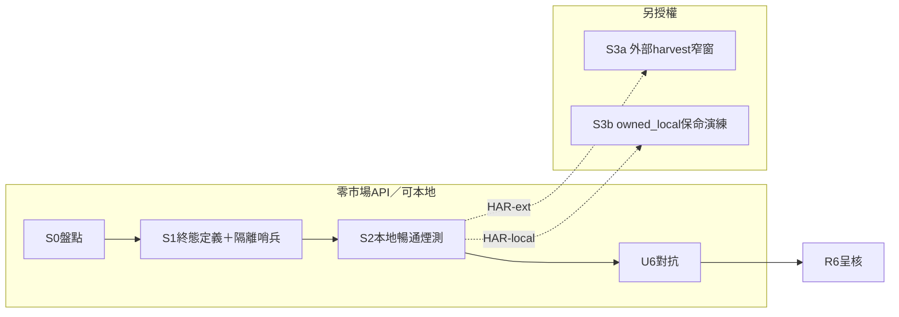

# Roadmap R6 計畫 — 素養／顧問半系統對齊落地 [I]（2026-07-24）

* **性質**：[I] plan-first 計畫書（CLAUDE #16／#20；領域大憲章第六部計畫完整性 v1.39.0）— **不創設 [N] 義務**；**計畫已出／執行未開**；**Steward 拍板句待用戶回（本檔不假已拍板）**
* **授權觸發**：Steward「**開 R6 計畫**」＝只寫計畫（本輪）；「**開 R6**」／分階碼＝實作另待
* **對齊落地 〔A〕**：`reports/augur_constitution_to_implementation_roadmap_20260724.md` §3.7／§4.3 U6／§7.1
* **Gap SSOT**：`reports/augur_roadmap_r3_gap_ledger_20260724.md`（G-ISO-1／G-FT-1＝**none** 維持；G-KDO-1＝calendar／DEFER **禁假關**；G-ATTEST＝R4 殘留、非 R6 主閉合）
* **前置**：R0–R4 ✅ DONE；近程 R5 ✅ DONE（S1–S3＋U5；**≠** 確立級／可交易）；FinMind／FRED **操作凍結**仍有效；Dividend API 線 **PAUSED**
* **詳設計既有（對齊落地、不綠地重寫）**：`reports/augur_knowledge_harvest_landing_plan_20260702.md` · `reports/augur_knowledge_text_understanding_plan_20260702.md` · `reports/augur_knowledge_deep_harvest_plan_20260710.md` · `reports/augur_omniscient_e2e_master_plan_20260710.md`（產品閘屬 R7；本計畫只借其煙測／暢通機械）

### Steward 拍板（待回 —— 本輪空白）

| 欄 | 內容 |
|---|---|
| **日期** | （待填） |
| **建議四碼** | 見 §10（例：`R6-P-yes` ＋ `R6-E12` ＋ `HAR-local` ＋ `FZ-keep`） |
| **效力** | **未登錄**——僅產出計畫；**執行未開** |
| **解凍／Dividend 邊界** | FinMind／FRED 凍結至 **constitution-to-implementation 全部階段落地＋用戶明示解凍**（R6 計畫／近程執行 **≠** 解凍）；不續 Dividend；不改 [N]；不假關 10-14／G-KDO-1 |
| **留痕** | 計畫本檔；封存 tag 預期 `archive-20260724-roadmap-r6-plan` |

---

## 0. 一句結論

R6 要把「素養／顧問半系統」從**既有引擎腳本＋G-FT-1 CHECK 綠**，推進到 **harvest 終態定義可機械驗**（license 允許→可答；非授權→誠實 `knowledge_fulltext_status`／blocked，**禁 metadata 當可答**）、**隔離命門雙向不破**（預測零 import 素養；顧問不得反向污染預測特徵）、**owned_local 永不離本機（本機 LLM）**——近程預設 **零 FinMind／FRED**；知識域外部 API 放量另碼授權，**不解凍**市場 API。

---

## 1. What／Why（對齊 〔A〕）

### 1.1 What — R6 要閉的義務簇

| 義務簇 | 帳本／錨 | R6 目標狀態 | 現況（2026-07-24 計畫時點） |
|---|---|---|---|
| 全文三軌＋owned_local 綁 private | **G-FT-1**（none） | 維持 CHECK＋promote／fetch 閘可重建 | ✅ live CHECK 親驗；migrate 可重套 |
| 靜態隔離命門 | **G-ISO-1**（none） | 維持 AST；R6 回歸哨兵必綠 | ✅ `test_philosophy_isolation` 綠（R5 再親驗） |
| 動態 predict role | **G-ISO-2**（none） | 維持；**顧問／knowledge 不得誤接 predict** | ✅ R5 S3；R6 驗收加「advisor 仍走 app role」 |
| harvest 終態誠實 | 路線圖 §3.7；CLAUDE #29b；憲章 v1.20／v1.36／v1.40 | 「完成」＝license 允許終態；blocked≠漏做 | 引擎在；缺 R6 統一哨兵／宣稱鎖＋U6 |
| 素養零量化價值 | 共同不變式②；A.16／T.27 | 素養不進預測特徵／訓練 | AST＋predict FORBIDDEN；U6 打反向污染 |
| 本機 LLM／owned_local | 憲章 v1.37；L7.33；A.44 | 顧問禁外部 LLM；私有不外流 | 服務在；須哨兵＋U6 打虛報 |
| KS 量測 DEFER | **G-KDO-1** calendar | **不閉／不假關** | R2 誠實；10-14 或實作觸發另案 |
| 市場 attestation | **G-ATTEST** partial | **非本計畫主閉**（知情邊界） | R4 史料；刷新另授權 |

路線圖 §3.7 原文步驟：`knowledge_source→acquire→staging→promote→（license 閘）fetch_fulltext→sentences→embed→advisor`；ERP `owned_local`＝dump-only 保命。

### 1.2 Why

* 〔A〕＝對齊落地：knowledge／advisor **code 與表已在**；缺口是 **終態宣稱誠實、半套 harvest 禁令、隔離雙向、本機推理硬界** 的對齊與可驗，不是重寫半系統。
* U5 已釘：近程 R5 DONE ≠ 可交易；對稱地 U6 須釘：**管線腳本在 ≠「可答完成」**、metadata ≠ 可答。
* A.16／A.44／L7.33／L6.15：素養零預測證據價值；三軌授權；物理隔離與用途邊界——R6 是執行層閉合面，不另立法。

### 1.3 明確不做（本計畫／預設近程執行）

| 不做 | 理由 |
|---|---|
| **R5 確立級／econ／FinMind 放量** | 近程 R5 已閉；市場 API 凍結 |
| **Dividend 續跑／DROP** | PAUSED；凍結規則 |
| **假關 G-KDO-1／10-14** | R2 誠實 |
| **改 MC／specs／原則精華／領域大憲章 [N]** | 硬邊界 |
| **把 R7 產品計畫（omniscient 全量等）併吞進 R6** | 路線圖另段；各須獨立 plan-first |
| **外部雲端 LLM「換穩定度」** | v1.37 owned_local 鐵律 |
| **AI 生成入庫／AI 摘要版權著作** | P4.E7／共同不變式① |
| **新知識域無 Steward 拍板 INSERT** | A.44「能抓≠該抓」；決策層 |

---

## 2. 治權錨點（原文路徑；不另寫第二套法）

| 錨 | 用途 | 取法 |
|---|---|---|
| **A.16** | 素養語料不進預測；量化零證據價值 | constitution-mcp `get_spec_clause A.16` |
| **A.44** | license 三軌閉集；AI 生成不得入庫；能抓≠該抓 | `get_spec_clause A.44` |
| **T.27** | KnowledgeCorpus 隔離宣告（型別層） | `get_spec_clause T.27` |
| **L7.33** | 語料隔離機器強制；不入預測特徵；本地部署登錄 | `get_spec_clause L7.33` |
| **L6.15** | 授權受限資料不得路由入預測特徵／訓練 | `get_spec_clause L6.15` |
| **P4.E7** | NoLaundering；synthetic 永久標記 | `get_clause P4.E7` |
| 領域大憲章第三部 philosophy／知識層 | 共同不變式；全文三軌；暢通不變式；本機 LLM | `docs/系統架構大憲章_v1.46.0.md`（執行時親讀；本計畫不改） |
| 第六部計畫先行／完整性 v1.39.0 | 本檔義務形狀（schema＋python） | 同檔第六部 |
| CLAUDE #29b | harvest 終態定義；fulltext_blocked 誠實 | `CLAUDE.md` |

> 治理權威路徑不做 LLM 濃縮；上表僅索引。衝突時以 [N] 原文＋Steward 為準。

---

## 3. 依賴與並行（凍結／Dividend／知識外部 API）

### 3.1 凍結與並行作業（只讀邊界）

| 作業 | 狀態 | 對 R6 |
|---|---|---|
| FinMind／FRED 操作凍結 | **有效**（至全路線圖落地＋明示解凍） | **零觸發**；R6 不依賴市場 sync |
| Dividend 重建＋窄窗 audit | **PAUSED** | **不續**；不改 `augur_dividend_rebuild_*` |
| 近程 R5／U5 | DONE | 隔離哨兵復用；不重開確立級 |
| G-ATTEST 當日 e2e | R4 SKIP／史料 | 非 R6 預設；另授權 |
| G-KDO-1 | calendar／DEFER | 知情；禁寫「已閉」 |

### 3.2 可零外部網路／零市場 API 落地（近程建議核）

| 工作 | 說明 |
|---|---|
| 本計畫書修訂與拍板登錄 | 純文件 |
| **S0** 盤點 | 讀 code／DDL／服務；可選本機 DB 唯讀計數 |
| 隔離回歸 | `test_philosophy_isolation`／`import_isolation`／predict ping（不打市場 API） |
| DDL／CHECK 哨兵 | `migrate_text_understanding_ddl`／`migrate_fulltext_status_ddl --check`；G-FT-1 存在性 |
| **本地** e2e 煙測 | `verify_knowledge_e2e_smoke.py --run`（sentinel＝公版；零雲端 LLM；`--with-llm`＝本機 Ollama） |
| promote／embed／sentences | **僅消費庫內既有** staging／text（不新抓外部） |
| owned_local／manual 本地匯入 | `acquire_local_files`／dump-only 路徑（不離本機） |
| advisor／chat／admin 本機服務 | 確認 `llm_fn`＝本機；禁外部 LLM 接線 |
| U6 對抗 | 只讀宣稱／HANDOFF／admin 文案 |

### 3.3 依賴外部抓取（非 FinMind／FRED；仍須另授權）

| 工作 | 外部 | 何時可開 |
|---|---|---|
| `acquire_knowledge`／`harvest_knowledge` 放量 | OpenAlex／Crossref／arXiv／Unpaywall 等 | Steward **`HAR-ext`**（或等價）明示；**仍 ≠** FinMind／FRED 解凍 |
| `fetch_oa_fulltext`／`fetch_pd_fulltext`／`fetch_entity_fulltext` 放量 | Unpaywall／公版源 | 同上；須 `UNPAYWALL_EMAIL` 等；#25 最小單位先 |
| 新 domain／source `active` | 審批狀態機 | 決策層人 approve／activate（AI 永不代簽） |
| 全量 embed／vector_export 放量 | 本機算力為主；匯出不經雲端 LLM | 可與 `HAR-local` 並行；大放量另碼 |

**判準句**：R6 **對齊／哨兵／本地煙測／本機顧問** 可在 API 凍結下做；R6 **外部 knowledge harvest／OA 全文放量** 須另授權且**不**解凍 FinMind／FRED；**「可答／harvest 完成」宣稱** 須 U6＋終態機械驗。



---

## 4. 分階段

### S0 — 盤點（只讀）

| | |
|---|---|
| **輸入** | 路線圖 §3.7；Gap 帳本；既有 knowledge 計畫；`refresh_knowledge_pipeline` STAGES；live 可選計數 |
| **輸出** | 本計畫 §1／§5／§6 凍結為執行清單；可選 `audits/ROADMAP-R6-INVENTORY-*.md` |
| **風險** | 把 omniscient／deep-harvest 產品範圍誤當 R6 必做全量 |
| **停手** | 需改 [N]；假關 G-KDO；觸發 FinMind／FRED |

**盤點檢查清單（執行輪）**：

1. `knowledge_*`／`philosophy_*` 表存在性＋ G-FT-1 CHECK  
2. `knowledge_fulltext_status` 狀態分布（blocked vs 未嘗試）  
3. harvest／promote／fetch／embed／advisor 入口矩陣是否可個別執行  
4. advisor `llm_fn` 是否本機；有無外部 LLM 殘線  
5. predict isolation 對 `augur.knowledge`／`augur.advisor`／`augur.philosophy` 仍綠  

### S1 — 終態定義鎖定＋隔離哨兵（零外部放量）

| | |
|---|---|
| **輸入** | S0；CLAUDE #29b 終態句；G-ISO-1／G-FT-1 |
| **輸出** | 機械驗收腳本或既有指令組合釘死（見 §7）；Gap／路線圖證據路徑；**宣稱詞彙表**（完成／可答／blocked） |
| **風險** | 只改文件不掛哨兵＝假閉合 |
| **停手** | 把「metadata 有列」寫成可答 |

**終態定義（本計畫鎖定，供 U6 攻擊）**：

| 宣稱 | 允許條件 | 禁止 |
|---|---|---|
| **harvest 完成（單 item）** | 達該 item **license 允許**之最終可檢索態：有全文→sentences→（scope 啟用則）embed；或無授權全文→metadata＋`knowledge_fulltext_status` 終態列 | 僅 title／staging pending 稱完成 |
| **可答** | advisor 檢索路徑能對該內容產出 guard 通過之引用（或誠實固定句）；owned_local 僅本機 | metadata 當答案；外部 LLM |
| **blocked** | license／OA／resolver 阻擋已落帳 | 把 blocked 說成漏做，或把未嘗試說成 blocked |

### S2 — 本地暢通（e2e 煙測＋七段一驅狀態）

| | |
|---|---|
| **輸入** | S1；`verify_knowledge_e2e_smoke`；`refresh_knowledge_pipeline --status` |
| **輸出** | 煙測 exit 0 親驗（或誠實 SKIP＋理由）；管線債冊（未啟用 scope≠破暢通） |
| **風險** | 煙測綠＝全宇宙可答（過度推廣） |
| **停手** | 為綠燈關掉 fail-closed／private 反向斷言 |

### S3 — 可選放量／保命（須拍板碼）

| 子段 | 內容 | 授權碼 |
|---|---|---|
| **S3a** | 知識外部 API **窄窗** harvest／fetch（#25；resume-safe；見訊號即停） | `HAR-ext` |
| **S3b** | owned_local dump→load→檢索保命演練（永不離本機） | `HAR-local`（建議與近程一併） |
| **S3c** | 既有庫內 embed／export 有界放量（本機） | 可含於 `R6-E123` |

**預設近程建議**：`R6-E12`＝S1＋S2（＋可選 S3b）；**不含** S3a。

### U6 — 對抗（「可答／完成」宣稱前）

| | |
|---|---|
| **輸入** | S2／S3 證據；路線圖 U6 焦點 |
| **輸出** | `audits/ROADMAP-U6-*.md`（Find→Verify→Critic→Synthesize） |
| **攻擊焦點** | ① metadata 當可答 ② 隔離被顧問反向污染（素養→特徵／訓練） ③ RBAC／role 虛報（predict／app／private） |
| **停手** | 存活 finding 未處置卻稱 R6 DONE＝可答完備 |

---

## 5. (a) Table schema

### 5.1 不產新表（預設近程）

R6 近程 **不**新建表。讀／強制既有物件（DDL 住所已在 migrate／harvest scripts）：

| 物件 | 角色 | 結果落哪 |
|---|---|---|
| `knowledge_source`／`knowledge_query`／`knowledge_taxonomy`／`knowledge_domain*` | registry；active 閘 | 排程／審批；R6 不擅自 activate |
| `knowledge_staging` | provenance 暫存 | promote 輸入 |
| `knowledge_item`／`knowledge_item_text` | metadata／全文；**license＋access_scope**；`chk_itext_owned_local_private` | G-FT-1 |
| `knowledge_fulltext_status` | **blocked 終態帳**（非 ok） | 誠實「非漏做」 |
| `knowledge_sentence`／`knowledge_concordance`／`knowledge_lexicon` | 切句／逐字／辭書 | embed／檢索上游 |
| `knowledge_*_embedding`／`knowledge_embed_ledger` | 向量＋排除帳 | 檢索 |
| `knowledge_harvest_log`／coverage 視圖／snapshot | resume／覆蓋 | 進度誠實 |
| `philosophy_*`（含 `philosophy_work_text` 公版） | 哲學原典軌 | 與 item 分軌 |
| `knowledge_vectorstore_config` | 後端切換 | pgvector／qdrant |
| predict／素養隔離相關 | `augur_predict` GRANT；FORBIDDEN 表 | G-ISO-＊ 維持 |

**`knowledge_item_text` 關鍵約束（引用，非新 DDL）**：

* `license` 白名單（公版／CC 白名單／`owned_local`）— migrate CHECK  
* `owned_local` ⇒ `access_scope='local_private'`（`chk_itext_owned_local_private`）  
* `source_type` 禁 AI 生成  

**`knowledge_fulltext_status`**（引用）：

```text
-- 既有（migrate_fulltext_status_ddl.py）；本計畫不改封閉集除非另案
item_id PK → knowledge_item
status ∈ {skip_no_oa, skip_license, skip_pdf, ... abstract_*}
reason, source_url, checked_at
-- status='ok' 不入本表（全文在 knowledge_item_text）
```

### 5.2 若執行輪發現缺表／缺 CHECK

* 只跑**既有**冪等 migrate（`--check` 先）；**禁止**手改 production CHECK 當「修計畫」  
* 新狀態值擴 CHECK＝另案＋#19 跨檔一致（fetch 三支＋migrate）

### 5.3 禁止本輪 DDL

* DROP／TRUNCATE knowledge／philosophy 生產語料  
* 偽造 `approval_status='active'` 或人手洗白 staging→正式無閘  
* 改方向／預測 gate（屬 R5 外）  
* 任何 FinMind／FRED／Dividend raw DDL  

---

## 6. (b) Python 程式規畫

| 檔／入口 | 函式／角色 | 階段 | 零外部？ |
|---|---|---|---|
| `scripts/harvest_knowledge.py` | 矩陣驅動 acquire→promote；resume log；**無參數＝不打 API** | S0／S3a | 無參／dry-run＝是；放量＝否 |
| `scripts/acquire_knowledge.py` | 外部／manual 入 staging | S3a／S3b | manual／local＝可；API＝否 |
| `scripts/promote_knowledge.py` | staging→正式；冪等 | S1–S3 | 是（庫內） |
| `scripts/fetch_oa_fulltext.py`／`fetch_pd_fulltext.py`／`fetch_entity_fulltext.py` | license 閘全文；寫 blocked 帳 | S3a | 放量＝否 |
| `scripts/build_sentences.py` | 切句 | S2–S3 | 是（庫內） |
| `scripts/embed_knowledge.py` | 三粒度嵌入；CLEAN 閘 | S2–S3 | 是（本機模型） |
| `scripts/refresh_knowledge_pipeline.py` | 七段一驅編排；`--status` 唯讀 | S0–S3 | status＝是 |
| `scripts/verify_knowledge_e2e_smoke.py` | 暢通機械判定 | S2 | 是（本機 LLM 可選） |
| `scripts/export_qdrant_index.py` | 向量匯出（config 驅動） | S3c | 本機 |
| `scripts/migrate_text_understanding_ddl.py` | text／sentence／embed DDL＋owned_local CHECK | S1 | 是 |
| `scripts/migrate_fulltext_status_ddl.py` | blocked 帳本 | S1 | 是 |
| `scripts/serve_advisor_openai.py`／`src/augur/advisor/*` | 顧問前端；guard；本機 llm_fn | S1–S2 | 是（禁雲端） |
| `src/augur/philosophy/retrieval.py` | RAG；verbatim | S2 | 是 |
| `src/augur/audit/import_isolation.py`＋`tests/test_philosophy_isolation.py` | 預測←素養靜態閘 | S1 | 是 |
| `tests/test_predict_role_isolation.py`／`db.connect_predict` | 動態閘；顧問勿誤接 | S1 | 是 |
| `scripts/load_knowledge_dump.py`／`acquire_local_files.py` | owned_local／本地保命 | S3b | 是 |
| `scripts/check_cmd_matrix.py` | 新入口矩陣稽核 | 若新增腳本 | 是 |

**強制／消費關係**：

* **建表**：近程無；缺則既有 migrate  
* **遷移**：冪等 DDL／COMMENT；禁手改  
* **消費**：advisor／retrieval **唯讀**素養；predict 七 package **零 import** knowledge／advisor／philosophy  
* **強制**：license CHECK；fulltext_status 收斂；AST 隔離；guard 誠實閉集；本機 LLM  

---

## 7. 驗收表（機械 PASS／FAIL）

| ID | 驗收項 | PASS | FAIL |
|---|---|---|---|
| A1 | G-FT-1：`chk_itext_owned_local_private`（或等價）存在於 `knowledge_item_text` | pg_constraint 親驗 | 缺 CHECK 卻稱三軌閉 |
| A2 | `knowledge_fulltext_status` 表＋ status CHECK 可 `--check` | migrate --check 綠 | 無終態帳卻稱 blocked 誠實 |
| A3 | 終態詞彙：報告／HANDOFF **無**「僅 metadata＝harvest 完成／可答」 | 抽樣零命中 | 出現半套完成宣稱 |
| A4 | `tests/test_philosophy_isolation.py`（含 knowledge） | 全 passed | 任一 failed |
| A5 | predict role：素養表 SELECT＝false；**advisor 預設非 predict role** | 親驗 | role 虛報 |
| A6 | `verify_knowledge_e2e_smoke.py --run`（本機） | exit 0；含 private 反向＋隔離斷言 | 破暢通仍稱 DONE |
| A7 | advisor／embed 路徑：**無**外部雲端 LLM 接線（owned_local 風險） | 設定／code 可證本機 | 外部 API key 路徑殘留當預設 |
| A8 | 本輪 diff：**無** FinMind／FRED 放量 log；**無** Dividend 續跑／DROP | 乾淨 | 有凍結破口 |
| A9 | U6 呈核檔存在且含 Critic「未查項」＋三攻擊焦點 | 有 audits | 無對抗即稱可答完備 |
| A10 | Gap：G-ISO-1／G-FT-1 維持 none 證據；G-KDO-1 **仍** calendar（不假關） | 帳本誠實 | 偷改 G-KDO→none |

**R6 近程 DONE（建議定義，拍板確認）**＝ A1–A8＋A10 全 PASS，且 A9 滿足；**≠** 全域 harvest 放量完成、≠ 全語料可答、≠ R7 產品計畫併吞、≠ FinMind 解凍。

---

## 8. 風險與停手總表

| 風險 | 緩解 | 停手訊號 |
|---|---|---|
| metadata 當可答 | A3＋U6＋fulltext_status | 完成句無終態證據 |
| 隔離反向污染 | A4／A5；L6.15／L7.33 | features 字面／import 素養 |
| owned_local 外流 | A7；禁雲端 LLM | 外部 LLM「暫用」 |
| 知識 API 與凍結混淆 | §3 分表；A8 | 借 R6 打 FinMind |
| 假關 G-KDO／10-14 | A10 | calendar→none 無 RULING |
| 範圍膨脹吞 R7 | §1.3／§9 | omniscient 全量當 R6 必做 |
| harvest 放量 ban／429 | #17／#25；見訊號即停 | 重試風暴 |

---

## 9. 明確不在範圍（再聲明）

1. FinMind／FRED 解凍或試打  
2. Dividend 續跑  
3. 假關 10-14／G-KDO-1  
4. 改 [N]  
5. 確立級／可交易宣稱（R5 門柱）  
6. R7 活躍產品計畫實作併吞  
7. 無 `HAR-ext` 之外部 knowledge 放量  

---

## 10. Steward 拍板句（請擇一或組合回覆 —— **待用戶回**）

> 回覆字串即可生效為本計畫授權登錄（路線圖同例；**不**自動等於「開 R6 實作」除非含執行項）。
>
> **本輪狀態**：**尚未登錄**（僅「開 R6 計畫」＝產出本檔）。

### 10.1 計畫採納（必選）

- **〔R6-P-yes〕** 採納本計畫為 R6 執行藍圖；**實作另待「開 R6」／分階授權**。  
- **〔R6-P-rev〕** 須修訂後再呈（請註條款號）。  
- **〔R6-P-no〕** 否決；R6 改定義或延期。

### 10.2 執行範圍（計畫採納後、開實作時）

- **〔R6-E0〕** 只做 S0 盤點留痕。  
- **〔R6-E12〕** 授權 S1＋S2（終態定義＋本地暢通／隔離哨兵；**零市場 API**；**零知識外部放量**）— **建議近程**。  
- **〔R6-E123〕** 授權至 S3b／S3c（含 owned_local 保命與庫內 embed 有界）；仍禁 S3a 除非另附 `HAR-ext`。  
- **〔R6-Efull〕** S0–S3＋U6 一次授權（S3a 仍建議顯式附 `HAR-ext`）。

### 10.3 外部 knowledge 抓取

- **〔HAR-local〕** 僅本地／manual／owned_local／庫內消費（預設建議）。  
- **〔HAR-ext〕** 授權知識域外部 API **窄窗**（非 FinMind／FRED；#25；見訊號即停）。  
- **〔HAR-deny〕** 本階段禁止任何新外部 knowledge 抓取。

### 10.4 凍結確認

- **〔FZ-keep〕** 確認：R6 不解凍 FinMind／FRED；Dividend 維持 PAUSED（採納 §3）。  
- **〔FZ-wait〕** R6 實作整體等到市場解凍後再開（較保守；通常不必要）。

### 10.5 明確不授權（預設）

- 不放量 FinMind／FRED；不續 Dividend；不改 [N]；不假關 G-KDO／10-14；不無 U6 宣稱「可答完備」；不接外部雲端 LLM。

**建議回覆組合（近程）**：`R6-P-yes` ＋ `R6-E12` ＋ `HAR-local` ＋ `FZ-keep`  
（開實作時另說「開 R6」或貼上列執行碼。）

---

## 11. 產物與下一步

| 產物 | 路徑 |
|---|---|
| **本計畫** | `reports/augur_roadmap_r6_plan_20260724.md` |
| 路線圖 R6 節 | `reports/augur_constitution_to_implementation_roadmap_20260724.md` §3.7 |
| Gap 帳本 | `reports/augur_roadmap_r3_gap_ledger_20260724.md` |
| R5 近程閉合（前置） | `reports/augur_roadmap_r5_plan_20260724.md`；`audits/ROADMAP-R5-*`／`ROADMAP-U5-*` |
| 凍結規則 | `.cursor/rules/finmind-fred-api-freeze.mdc` |
| Dividend（只讀邊界） | `reports/augur_dividend_rebuild_20260724.md`（PAUSED） |

**建議下一句（用戶）**：回 §10 拍板碼（或 `R6-P-rev` 註條款）；拍板後若要執行再明示「開 R6」／`R6-E12`——**仍禁** FinMind／FRED、**仍禁** metadata 當可答。

---

## 12. 本輪邊界（誠實）

- ✅ 產出本 plan-first 計畫書  
- ✅ 對齊 〔A〕／R6 定義／U6／Gap／凍結與知識 API 分界  
- ✅ 附 schema＋python 規畫＋驗收表＋拍板句  
- ✅ 路線圖標「R6 計畫已出／執行未開」  
- ❌ **未**假 Steward 已拍板  
- ❌ **未**開 R6 實作、**未**打 FinMind／FRED、**未**續 Dividend、**未**改 [N]  
- ⚠ 知識外部 API ≠ 已解凍；放量須 `HAR-ext`  
- ⚠ G-FT-1／G-ISO-1 為 **none**＝維持義務，非「R6 無事可做」  
