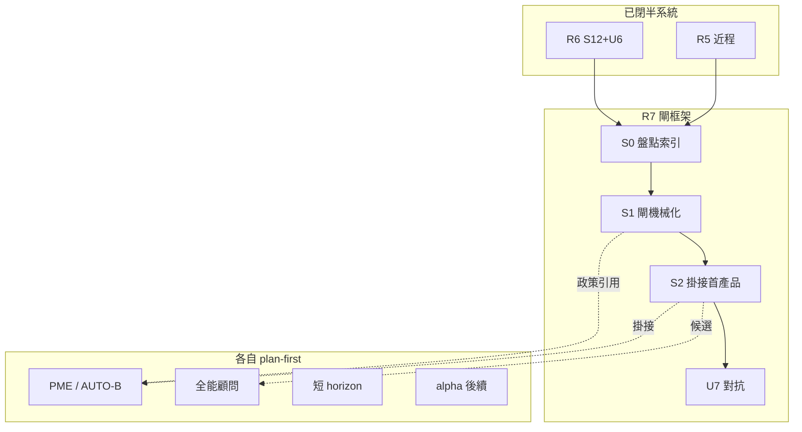

# Roadmap R7 計畫 — 產品閘＋持續 ultracode [I]（2026-07-24）

* **性質**：[I] plan-first 計畫書（CLAUDE #16／#20；領域大憲章第六部計畫完整性 v1.39.0）— **不創設 [N] 義務**；**計畫已拍板；S1＋S2＋U7 DONE**
* **授權觸發**：Steward「**開 R7 計畫**」＝只寫本檔（已履）；「**開 R7，只跑 S1**」＝S1 已履；「**開 R7 S2**」＝S2 已履；「**開 U7**」（2026-07-24）＝U7 已履
* **對齊落地 〔A〕**：`reports/augur_constitution_to_implementation_roadmap_20260724.md` §3.8／§4.3 U7／§7.1
* **範式**：`reports/augur_roadmap_r5_plan_20260724.md`／`reports/augur_roadmap_r6_plan_20260724.md`
* **上線政策 SSOT（引用，不重寫）**：`reports/augur_philosophy_market_evolution_loop_plan_20260724.md` → **PME-AUTO-B**（有界自動上線＋緊急停）；R7 **勿**寫死「一律人准特徵上線」
* **前置**：R0–R4 ✅；近程 R5 ✅（S1–S3＋U5；**≠** 確立級／可交易）；R6 ✅（S1＋S2＋U6；**≠** 可答完備；G-HAR-1 partial；S3a／HAR-ext pending）；FinMind／FRED **操作凍結**至路線圖全部落地＋明示解凍；G-DIV-1 **PAUSED**
* **本檔定位**：R7＝**產品閘＋持續 ultracode 框架**（非單一產品綠地）；活躍產品計畫各自獨立 plan-first；本檔只規定閘與掛接紀律
* **留痕**：`audits/ROADMAP-R7-PLAN-APPROVED-20260724.md`

### Steward 已拍板（2026-07-24）

| 欄 | 內容 |
|---|---|
| **日期** | 2026-07-24 |
| **四碼** | `R7-P-yes` ＋ `R7-G12` ＋ `FZ-keep` ＋ `PME-AUTO-B` |
| **效力** | **計畫採納**為 R7 閘框架藍圖；S1＝閘機械化已履；**S2＝首掛 P-PME 已履**；**U7 DONE**（`audits/ROADMAP-U7-R7-ULTRACODE-20260724.md`） |
| **硬邊界** | 零 FinMind／FRED；不改 [N]；不搶改靈魂措辭（PME 張力另案）；不假關 10-14；禁可答完備／確立級可交易宣稱（除非對應閘通過） |
| **PME 誠實邊界** | **PME-AUTO-B**＝R7 上線政策引用（G-P6）；PME 本體已 `PME-P-yes`＋近程／E123 落地；**S2 閘掛接 ≠** 開 U-PME／PME-Efull；靈魂措辭另案 pending |

**四碼展開（§10 原文對照）**：

| 碼 | 含義 |
|---|---|
| **R7-P-yes** | 採納本計畫為 R7 閘框架藍圖；實作另待「開 R7」／分階授權 |
| **R7-G12** | 預選＝S1＋S2；**S1＋S2 均已履**（S2 首掛 P-PME ✅）；**U7 已履** |
| **FZ-keep** | 不解凍 FinMind／FRED；Dividend 維持 PAUSED |
| **PME-AUTO-B** | **R7 上線政策引用已採納**：特徵／原則狀態上線以 PME 有界自動＋kill-switch 為準；**PME 本體亦已 `PME-P-yes`**（執行仍待「開 PME」） |

---

## 0. 一句結論

R7 不「做出一個新品」——它把路線圖 §3.8 的四條閘變成**可盤點、可機械驗、可掛接、可 ultracode** 的產品準入框架；每個活躍產品（全能顧問／短 horizon／alpha／omniscient／PME…）仍各自 plan-first。特徵上線政策**引用 PME-AUTO-B**，不在本檔寫死「一律人准」。

---

## 1. What／Why／非目標

### 1.1 What — R7 要閉的義務簇

| 義務簇 | 路線圖／錨 | R7 目標狀態 | 現況（2026-07-24 計畫時點） |
|---|---|---|---|
| 計畫完整性閘 | §3.8①；憲章第六部 v1.39.0 | 每產品計畫附 (a) schema＋(b) python；缺則不得稱「可開實作」 | 活躍計畫多數早於 v1.39；須盤點補齊或標欠 |
| 執行前四判準 | §3.8②；CLAUDE #20 | 完整／內部一致／與現況一致／可實作——過閘才動工 | 慣例在；缺統一檢查單／哨兵 |
| 階段 ultracode／審議 | §3.8③；§4.3 U7；#28 | 高風險／階段邊界：機械可驗→本地審議；其餘定向 ultracode | U5／U6 已跑；U7＝產品拍板前對抗 |
| major→Steward；禁假關 10-14 | §3.8④；R2 | 治權判準變更／major finding → 人裁；calendar 項不偷關 | R2 checklist 誠實 open |
| 產品掛接（非綠地） | HANDOFF 活躍計畫索引 | 閘掛接既有計畫；首個產品走 S2 示範 | 計畫散在 `reports/`；閘未統一 |
| 上線政策對齊 | PME §2／§4.1 | R7 敘事／驗收**引用 PME-AUTO-B**；不另立法「人准上線」 | R7 已綁 B（2026-07-24）；**PME 本體亦已 `PME-P-yes`**（執行未開） |

路線圖 §3.8 原文：活躍產品計畫**各須獨立 plan-first**；本路線圖（與本 R7 計畫）**只規定閘**。

### 1.2 Why

* 〔A〕＝對齊落地：R5／R6 半系統近程已對齊；下一步風險是**產品工單繞過 plan-first／假完備／範圍膨脹**，不是再寫第八層憲章。
* U5／U6 已釘：半系統綠 ≠ 可交易／可答完備。對稱地 U7 須釘：**有產品計畫檔 ≠ 過閘 ≠ 可開工 ≠ 產品 DONE**。
* PME-AUTO-B 已採納（R7 引用＋PME 本體）：若 R7 閘文寫死「特徵上線一律人准」，會與 PME 衝突並逼搶改靈魂——**R7 只引用、不重寫、不搶 [N]**。

### 1.3 明確不做（硬非目標）

| 不做 | 理由 |
|---|---|
| **單一產品綠地重寫**（假稱「R7＝做出全能顧問」） | §3.8＝閘框架；產品各自獨立計畫 |
| **併吞／取代 PME 閉環設計** | PME 為 R7 **候選產品計畫**；本檔只掛接＋上線政策引用 |
| **寫死「一律人准特徵上線」** | 與 **PME-AUTO-B** 衝突；上線＝PME 機械閘全綠＋kill-switch |
| **改靈魂／原則／MC／specs [N]** | 硬邊界；PME 張力另案修措辭 |
| **FinMind／FRED 放量／解凍** | 凍結至全路線圖落地＋明示解凍；R7 計畫／閘 ≠ 解凍 |
| **續 G-DIV-1／Dividend API** | PAUSED |
| **假關 10-14／G-KDO-1** | R2 誠實 |
| **宣稱確立級可交易／可答完備** | `evaluated_pass=0`；G-HAR-1 partial；除非對應閘通過 |
| **本輪實作 U7** | ✅ 已履（2026-07-24；`audits/ROADMAP-U7-R7-ULTRACODE-20260724.md`） |

---

## 2. 治權錨點（原文路徑；不另寫第二套法）

| 錨 | 用途 | 取法 |
|---|---|---|
| 領域大憲章第六部 | 計畫先行；完整性＝schema＋python（v1.39.0） | `docs/系統架構大憲章_v1.46.0.md`（執行時親讀；本計畫不改） |
| CLAUDE #20／#19／#28 | plan-first；一支一支；usage／本地優先 | `CLAUDE.md` |
| `ULTRACODE-SCHEDULE.md` | 階段對抗方法；鐵律不改 [N] | repo 根 |
| 路線圖 §3.8／§4.3 U7 | 閘四條；U7＝產品拍板前 | 本路線圖 |
| PME-AUTO-B | 有界自動上線＋緊急停 | `reports/augur_philosophy_market_evolution_loop_plan_20260724.md` |
| A.16／L7.33／G-ISO-* | 產品不得破隔離命門 | constitution-mcp／Gap 帳本 |
| 原則 #15／direction_gate | 確立級門柱 | `docs/原則精華_v1.10.0.md` |

> 治理權威路徑不做 LLM 濃縮；上表僅索引。衝突時以 [N] 原文＋Steward 為準。

---

## 3. 與 PME／R5／R6 邊界表

| 面向 | R5（預測半系統） | R6（素養／顧問半系統） | PME（進化閉環；R7 候選產品） | **本檔 R7（閘框架）** |
|---|---|---|---|---|
| **主責** | predict wiring／G-PV／輸出契約近程 | harvest 終態誠實／隔離／本機 LLM | 哲學假說↔市場 #14↔有界自動上線 | **產品準入閘＋持續 ultracode** |
| **近程狀態** | DONE（≠可交易） | S1＋S2＋U6 DONE（≠可答完備） | **已拍板／近程＋E123＋U-PME＋PRODSET 真寫**（≠可交易） | **S1＋S2＋U7 DONE**（2026-07-24） |
| **上線／準入** | direction／arena 門柱；人 approve gate | source activate／HAR-ext 人裁 | **PME-AUTO-B**：機械閘全綠→引擎上線；人＝監控＋kill＋治權 | **R7 已綁引用 B**；不另定「人准特徵上線」 |
| **API** | FZ-keep | FZ-keep；HAR-ext≠FinMind | FZ-keep | **FZ-keep** |
| **ultracode** | U5 ✅ | U6 ✅ | U-PME ✅（≠Efull） | **U7 ✅**（閘框架／首掛對抗） |
| **禁宣稱** | 確立級／可交易 | 可答完備 | 同左＋禁 runtime 哲學加權 | 禁「R7 DONE＝全產品出貨」 |
| **交界句** | R7 產品若碰預測 → 須過 R5 門柱＋本閘 | 若碰顧問／harvest → 須過 R6 終態＋本閘 | 掛接 R7 閘後才開 PME 實作 | 閘過 ≠ 產品實作授權（另句「開 〈產品〉」） |



---

## 4. 產品閘檢查清單（掛接 HANDOFF 索引）

### 4.1 閘條（機械化目標；S1 落地）

對**每一**擬開工產品計畫，開實作前須可勾：

| 閘 ID | 檢查項 | PASS | FAIL |
|---|---|---|---|
| **G-P1** | 獨立 plan-first 檔存在且標 [I] | path 可指 | 口頭／聊天當計畫 |
| **G-P2** | (a) table schema：產表附 DDL；不產表列所讀既有表＋結果落點 | 節完整 | 缺 schema 節仍開工 |
| **G-P3** | (b) python 規畫：建表／遷移／消費／強制之檔·函式·角色 | 節完整 | 邊做邊想無清單 |
| **G-P4** | 執行前四判準書面：①完整 ②內部一致 ③與現況／code 一致 ④可實作 | 四勾＋證據 | 任一空勾仍「開幹」 |
| **G-P5** | 非目標／硬邊界明示（API 凍結、[N]、隔離、禁假關） | 有專節 | 範圍膨脹吞 R5／R6／治權 |
| **G-P6** | 上線／準入政策：**特徵狀態**引用 **PME-AUTO-B**（或明示為何本產品不適用＋Steward） | 對齊或豁免登錄 | 寫死「一律人准上線」且無豁免 |
| **G-P7** | 階段邊界 ultracode／審議計畫（U* 或 `deliberate.py` 模式） | 有插入點 | 無對抗即稱產品 DONE |
| **G-P8** | major／治權變更路徑 → Steward；**不**假關 10-14／G-KDO | 明示 | calendar 偷關／AI 代裁 major |
| **G-P9** | 宣稱鎖：不宣稱確立級可交易（除非 `direction_gate.evaluated_pass`＋授權）；不宣稱可答完備（除非 R6 終態＋授權） | 文案乾淨 | 假兆行銷 |
| **G-P10** | 與 R5／R6／PME／凍結邊界表（或引用本檔 §3） | 有 | 借產品工單打 FinMind |

### 4.2 活躍產品計畫索引（自 HANDOFF＋路線圖；S0 盤點用）

> 狀態以各檔為準；本表＝閘掛接索引，**不**等於已拍板可開工。

| 代號 | 計畫檔（HANDOFF／路線圖） | 類型 | 閘注意 | 建議掛接序 |
|---|---|---|---|---|
| **P-ADV** | `reports/augur_omniscient_advisor_plan_20260709.md` | 活躍① 全能顧問 E2E | 早於解凍／擂台；須時效複核（HANDOFF 4.5）；重疊 R6／omniscient | 候選 |
| **P-SH** | `reports/augur_prediction_short_horizon_model_plan_20260709.md` | 活躍② 短 horizon | 日曆日／交易日釐清；碰 R5 門柱；禁假確立 | 候選 |
| **P-OMNI** | `reports/augur_omniscient_e2e_master_plan_20260710.md`（＋`omniscient_master`／`omniscient_advisor`） | omniscient 主計畫簇 | 勿與 R6 半系統閉合混淆；產品全量另閘 | 候選 |
| **P-ALP** | `reports/taiwan_alpha_improvement_plan_20260717.md`；尾案 `alpha_phase1_tail_verdict_20260717.md` | alpha 後續／9 拍板點 | C2 DSR 等決策層；API 凍結下禁放量補季 | 候選 |
| **P-PME** | `reports/augur_philosophy_market_evolution_loop_plan_20260724.md` | 哲學↔市場進化閉環 | **上線＝PME-AUTO-B**；✅ `PME-P-yes`＋E123；**S2 首掛 DONE** | **✅ S2 已掛** |
| **P-PDF** | `reports/knowledge_pdf_extraction_plan_20260712.md` | PDF 抽取 P0 | 知識域；非 FinMind；仍須 G-P* | 可後 |
| **P-SOP** | `reports/augur_prediction_sop_master_20260706.md` | 預測 SOP 主計劃 | 可能部分被 R5／arena 超越；S0 標 obsolescence | 複核後 |
| **P-ARENA** | `reports/augur_direction_live_arena_plan_20260711.md`；`arena_g1g5_admission_gate_plan_20260716.md` | 擂台（多已 live） | 新波次仍走閘；確立唯門二 | 增量才掛 |

**S2 首掛預設建議**：`P-PME`（閘示範＋上線政策引用一體）；Steward 可改選 `P-ADV`／`P-SH`／`P-ALP`（拍板時註明）。

### 4.3 依賴與並行（凍結／殘留）

| 作業 | 狀態 | 對 R7 |
|---|---|---|
| FinMind／FRED 操作凍結 | **有效**（至全路線圖落地＋明示解凍） | **零觸發**；閘機械化不依賴 sync |
| G-DIV-1 Dividend | **PAUSED** | 產品若消費 Dividend 特徵 → 閘內標「須解凍／重建後」；本輪不續 API |
| G-HAR-1 | **partial** | 顧問類產品禁「可答完備」 |
| `direction_gate.evaluated_pass` | **0** | 預測／確立宣稱鎖 |
| 10-14／G-KDO-1 | calendar／DEFER | **禁假關** |
| PME 正式拍板 | ✅ `PME-P-yes`＋B＋KILL＋FZ-keep（2026-07-24；執行未開） | R7 上線政策引用與 PME 本體均已對齊 B；實作各待「開 R7」／「開 PME」 |

---

## 5. 分階段


### S0 — 盤點（只讀）

| | |
|---|---|
| **輸入** | 本檔 §4.2；HANDOFF §1／§4.5；路線圖 §3.8；各產品計畫檔頭 |
| **輸出** | 產品索引現況表（path／拍板態／schema·python 有無／與 R5·R6·PME 重疊／時效風險）；可選 `audits/ROADMAP-R7-INVENTORY-*.md` |
| **風險** | 把「有報告檔」當「過閘」；把 R6 omniscient 煙測當產品 DONE |
| **停手** | 需改 [N]；觸發 FinMind／FRED；假關 calendar |

**盤點檢查清單（執行輪）**：

1. §4.2 每列：檔存在？標待拍板／已執行／部分超越？  
2. v1.39 schema＋python 節：有／缺／過時  
3. 與 PME-AUTO-B 衝突句（「一律人准上線」等）標記  
4. API／Dividend／確立／可答 宣稱抽樣  

### S1 — 閘機械化（零產品功能實作）✅ DONE（2026-07-24）

| | |
|---|---|
| **輸入** | S0；§4.1 G-P1–G-P10 |
| **輸出** | `scripts/verify_roadmap_r7_gate.py`（`--check-framework`／`--check --plan`／`--inventory`／`--selftest`）；`audits/ROADMAP-R7-PRODUCT-GATE-CHECKLIST-TEMPLATE.md`；閉合 `audits/ROADMAP-R7-S1-CLOSED-20260724.md` |
| **風險** | 只改文件無哨兵＝假閉合；哨兵過嚴擋合法舊計畫→應「欠項清單」非靜默 PASS |
| **停手** | 借 S1 實作 PME／顧問功能；解凍 API |

**機械化範圍（誠實）**：

* **做**：標題／章節存在性、必備表頭欄、禁語（可答完備／確立級可交易／解凍暗示）、PME-AUTO-B 引用或豁免欄、四判準 checklist 區塊。  
* **不做**：語義上「計畫夠好」之 LLM 自動核准（屬 U7／人裁）；不改產品業務 code。
* **本輪親驗（S1）**：`--selftest` 綠；`--check-framework` 綠；`--inventory` 8/8 path 在；R7 本檔 `--check` 綠；當時 P-PME 欠 G-P4 → 交 S2。
* **S2 親驗（2026-07-24）**：PME §4.2 四判準補齊；P-PME `--check` **PASS**；閘紀錄 `audits/ROADMAP-R7-GATE-PME-20260724.md`；閉合 `audits/ROADMAP-R7-S2-CLOSED-20260724.md`。

### S2 — 掛接首個產品（示範過閘，非全量實作）✅ DONE（2026-07-24）

| | |
|---|---|
| **輸入** | S1 哨兵綠；首選產品 **P-PME**；PME-E123 證據（`run_id=5`；不重跑） |
| **輸出** | `audits/ROADMAP-R7-GATE-PME-20260724.md`（G-P* 逐項證據）；PME 計畫 §4.2 四判準；閉合本檔 S2；哨兵 PASS |
| **風險** | 掛接＝偷跑產品實作；或掛接後宣稱 R7＝該產品 DONE |
| **停手** | 無「開 U-PME／U7」卻開對抗；打 FinMind |
| **本輪** | **已開並閉**——Steward「開 R7 S2」（E123 後約定） |

**掛接定義（鎖定）**：補齊閘文件＋哨兵對該 path PASS（或登錄豁免）＋四判準書面 → 產品進入「**可申請執行授權**」狀態；執行仍須用戶「開 〈產品〉」或產品專屬碼。**S2 DONE ≠** PME-Efull／可交易／解凍 API。

### U7 — 對抗（產品計畫拍板前／閘框架宣稱前）

| | |
|---|---|
| **輸入** | S1／S2 證據；路線圖 U7 焦點；#20 高風險分級 |
| **輸出** | `audits/ROADMAP-U7-*.md`（Find→Verify→Critic→Synthesize） |
| **攻擊焦點** | ① 閘幽靈（文件有、無機械驗）② 產品範圍膨脹吞半系統／治權 ③ 上線政策與 PME-AUTO-B 衝突或搶改 [N] ④ 假關 10-14／假確立／假可答 ⑤ 凍結破口 |
| **停手** | 存活 major 未呈 Steward 卻稱 R7 閘 DONE＝可開工全部產品 |

---

## 6. (a) Table schema

### 6.1 預設：不產新表

R7 閘框架近程 **不**需要新業務表。讀／引用既有物件即可：

| 物件 | 角色（閘相關） | 結果落哪 |
|---|---|---|
| （無新表） | 閘＝計畫文件＋scripts 哨兵＋audits 留痕 | `reports/`／`audits/`／可選 CI |
| `direction_gate`／arena 相關 | G-P9 確立宣稱鎖（唯讀查） | 禁宣稱證據 |
| `knowledge_fulltext_status` 等 | G-P9 可答宣稱鎖（唯讀） | 與 R6 一致 |
| Gap 帳本列 G-DIV-1／G-HAR-1／G-KDO-1 | 邊界誠實 | 不在 R7 改 gap_class 偷關 |

### 6.2 若未來閘要「過閘登錄入 DB」

僅當 Steward 明示要機器帳本時，另案 DDL（**非本計畫預設**），草案示意：

```text
-- 草案 ONLY；未授權不建
-- roadmap_product_gate_run (
--   run_id, plan_path, gate_version, checked_at,
--   gp1..gp10 jsonb, overall text, steward_exemption text
-- )
```

預設拒絕：用 `audits/ROADMAP-R7-GATE-*.md`＋git 即可追溯。

### 6.3 禁止本輪 DDL

* 任何 FinMind／FRED／Dividend raw DDL／DROP  
* 改 direction／knowledge／philosophy 生產約束「為了讓閘綠」  
* 手改 gap_class／假關 calendar  

---

## 7. (b) Python 程式規畫

| 檔／入口 | 函式／角色 | 階段 | 零外部？ |
|---|---|---|---|
| **新（建議）** `scripts/verify_roadmap_r7_gate.py` | `--check --plan PATH`：G-P1–G-P10 結構／禁語／引用檢查；`--json`；`--selftest`；無參＝印矩陣 | S1–S2 | 是（讀檔；可選唯讀 DB 查 pass 計數） |
| `scripts/deliberate.py` | 機械可驗宣稱優先本地審議 | U7／階段 | 是 |
| `scripts/verify_roadmap_r6_s12.py` | 顧問類產品掛接前復用 R6 哨兵 | S2（若掛 P-ADV／P-OMNI） | 是 |
| R5 相關 isolation／direction `--verify` | 預測類產品掛接前復用 | S2（若掛 P-SH／P-ALP） | 是 |
| `scripts/check_cmd_matrix.py` | 若新增 `verify_roadmap_r7_gate.py` 須含矩陣 | S1 | 是 |
| **不**新增產品業務模組於 R7 近程 | PME／顧問／horizon 實作屬各產品計畫 | — | — |

**強制／消費關係**：

* **建表**：近程無  
* **遷移**：無  
* **消費**：哨兵讀計畫 markdown（＋可選 DB 唯讀計數）  
* **強制**：閘 FAIL → 不得在 HANDOFF／路線圖寫「該產品已授權實作」；豁免須 Steward 字串  

---

## 8. 驗收表（機械 PASS／FAIL）— A*

| ID | 驗收項 | PASS | FAIL |
|---|---|---|---|
| **A1** | 本計畫＋路線圖 §3.8 標「R7 計畫已出／執行未開」（拍板前）或拍板後狀態誠實 | 文一致 | 假稱執行已開／產品全出貨 |
| **A2** | §4.2 產品索引完整（HANDOFF 活躍①②＋omniscient／alpha／PME／PDF／SOP 至少列齊） | 表在 | 索引空洞卻稱閘 DONE |
| **A3** | §4.1 G-P1–G-P10 為 S1 機械化 SSOT | 有 | 閘條只口頭 |
| **A4** | 上線政策：**引用 PME-AUTO-B**；正文**無**「一律人准特徵上線」硬句（除非標豁免＋Steward） | 對齊 | 與 PME 衝突未標 |
| **A5** | 與 R5／R6／PME 邊界表（§3）存在且禁宣稱句明確 | 有 | 範圍膨脹 |
| **A6** | S1：`verify_roadmap_r7_gate`（或等價）存在＋`--selftest` 綠（**執行輪**） | 親驗 | 無哨兵稱閘機械化 DONE |
| **A7** | S2：至少一產品閘通過紀錄在 `audits/`（**執行輪**） | 有 | 未掛接稱 R7 閉 |
| **A8** | 本輪／執行輪 diff：**無** FinMind／FRED 放量；**無** Dividend 續跑；**無** [N] 改動 | 乾淨 | 凍結破口／搶修靈魂 |
| **A9** | U7 呈核檔含 Critic「未查項」＋五攻擊焦點（**執行輪**） | 有 audits | 無對抗即全產品開工 |
| **A10** | 10-14／G-KDO／G-HAR-1／G-DIV-1／`evaluated_pass=0` 誠實；**不假關** | 帳本一致 | calendar→none 無 RULING |

**R7 閘框架近程 DONE（建議定義，拍板確認）**＝ A1–A5＋A8＋A10 在計畫輪可預先滿足；A6／A7／A9 須執行輪。**≠** 全產品出貨、≠ PME 實作完成、≠ 解凍 API、≠ 可答完備／可交易。

---

## 9. 風險與停手總表

| 風險 | 緩解 | 停手訊號 |
|---|---|---|
| R7 被讀成單一產品綠地 | §0／§1.3／A5 | 「開 R7＝做完顧問」 |
| 上線政策與 PME 打架 | A4；引用 B | 寫死人准上線且開工 |
| 閘幽靈 | A6／U7 | 無哨兵稱機械化 |
| 掛接偷跑實作 | S2 定義鎖 | 無產品授權碼卻寫業務 |
| 假關／假確立／假可答 | A10／G-P8／G-P9 | calendar 偷關；pass＝0 行銷 |
| 凍結破口 | A8；FZ-keep | sync／Dividend 進程 |
| 搶改 [N] | 硬邊界 | 靈魂措辭進本 diff |

---

## 10. Steward 拍板句（請擇一或組合回覆）

> ✅ **已登錄（2026-07-24）**：`R7-P-yes`＋`R7-G12`＋`FZ-keep`＋`PME-AUTO-B` — 見文首「Steward 已拍板」。
>
> **本輪狀態（2026-07-24）**：**S1＋S2＋U7 DONE**（U7＝`audits/ROADMAP-U7-R7-ULTRACODE-20260724.md`）。

### 10.1 計畫採納（必選）

- **〔R7-P-yes〕** 採納本計畫為 R7 閘框架藍圖；**實作另待「開 R7」／分階授權**。  
- **〔R7-P-rev〕** 須修訂後再呈（請註條款號）。  
- **〔R7-P-no〕** 否決；R7 改定義或延期。

### 10.2 閘範圍（計畫採納後、開實作時）

- **〔R7-G0〕** 只做 S0 盤點留痕。  
- **〔R7-G1〕** 授權 S1（閘機械化；零產品功能實作）— **已履**。  
- **〔R7-G12〕** 授權 S1＋S2（機械化＋掛接首個產品；預設 P-PME）— **S1＋S2 已履**（首掛 P-PME）。  
- **〔R7-Gfull〕** S0–S2＋U7 一次授權（仍逐產品另開執行）。

### 10.3 凍結確認

- **〔FZ-keep〕** 確認：R7 不解凍 FinMind／FRED；Dividend 維持 PAUSED。  

### 10.4 上線政策引用（建議與採納同回）

- **〔PME-AUTO-B〕** **引用**：特徵／原則狀態上線政策以 PME 之有界自動＋緊急停為準；R7 閘 G-P6 對齊；**不**在 R7 寫死一律人准；靈魂措辭另案（不本輪改 [N]）。**已於 R7 四碼採納為上線政策**；**PME 本體亦已 `PME-P-yes`**（`audits/PME-PLAN-APPROVED-20260724.md`；執行仍待「開 PME」）。  
- （可選）**〔PME-KILL〕** 強調 kill-switch 為 B 硬要件（PME 本體拍板已含）。

### 10.5 明確不授權（預設）

- 不放量 FinMind／FRED；不續 Dividend；不改 [N]；不假關 10-14；不無閘宣稱產品可開工全集；不無門柱宣稱確立級／可答完備。

**建議回覆組合（近程）**：

```text
R7-P-yes + R7-G12 + FZ-keep + PME-AUTO-B
```

（開實作時另說「開 R7」或貼 `R7-G12`；首掛非 PME 時註 `S2=P-ADV` 等。）

---

## 11. 產物與下一步

| 產物 | 路徑 |
|---|---|
| **本計畫** | `reports/augur_roadmap_r7_plan_20260724.md` |
| 路線圖 R7 節 | `reports/augur_constitution_to_implementation_roadmap_20260724.md` §3.8 |
| PME（上線政策／首掛候選） | `reports/augur_philosophy_market_evolution_loop_plan_20260724.md` |
| R5／R6 範式與前置 | `reports/augur_roadmap_r5_plan_20260724.md`；`r6_plan` |
| HANDOFF 活躍索引 | `HANDOFF.md` §1／§4.5 |
| 凍結規則 | `.cursor/rules/finmind-fred-api-freeze.mdc` |
| Ultracode 方法 | `ULTRACODE-SCHEDULE.md` |

**建議下一句（用戶）**：「**PME 補生產集登錄（消歧或真寫）**」——**仍禁** API 解凍、**仍禁**假完備／確立級宣稱；資料地基等解凍條件。

---

## 12. 本輪邊界（誠實）

- ✅ 產出本 plan-first 計畫書（what／why／非目標／閘清單／邊界／階段／schema／python／A*／拍板句）  
- ✅ **Steward 已拍板**（2026-07-24；`R7-P-yes`＋`R7-G12`＋`FZ-keep`＋`PME-AUTO-B`；`audits/ROADMAP-R7-PLAN-APPROVED-20260724.md`）  
- ✅ 對齊 §3.8；**R7 已綁引用 PME-AUTO-B**；不寫死一律人准上線；**PME 本體亦已 `PME-P-yes`＋`PME-KILL`**（靈魂措辭另案 pending）  
- ✅ 掛接 HANDOFF 活躍產品索引；標 G-DIV-1 PAUSED／G-HAR-1 partial／禁確立與可答完備  
- ✅ **S1 DONE**（2026-07-24；哨兵＋模板；`audits/ROADMAP-R7-S1-CLOSED-20260724.md`）  
- ✅ **S2 DONE**（2026-07-24；首掛 P-PME；G-P4＋閘紀錄；`audits/ROADMAP-R7-S2-CLOSED-20260724.md`）  
- ✅ **U7 DONE**（2026-07-24；`audits/ROADMAP-U7-R7-ULTRACODE-20260724.md`；A9 PASS；G-R7-1 doc-only；幽靈詞已補禁）  
- ✅ **PME PRODSET 真寫**（2026-07-24；`audits/PME-PRODSET-CLOSED-20260724.md`；G-PME-PRODSET=none）  
- ❌ **未**改 [N]、**未**解凍 FinMind／FRED、**未**續 Dividend、**未**假關 calendar  
- ⚠ R7 近程閘 DONE ≠ PME-Efull ≠ 八產品出貨 ≠ 路線圖「全部階段落地」≠ API 解凍 ≠ 可交易（philosophy prodset ≠ predict 熱路徑）  

---

*計畫完整性：閘框架層 schema／程式見 §6–§7；子產品產表者走各自計畫。30 分鐘可讀：§0–§1＋§3 邊界＋§4 閘＋§10 拍板句。*
