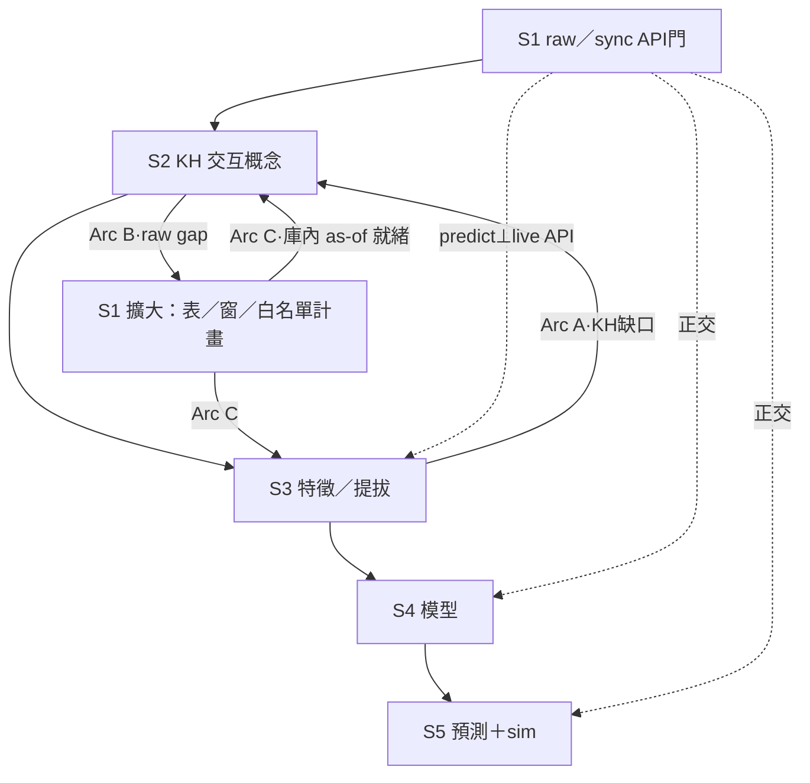

# S1–S2–S3 計畫閉環 · 2026-08-04

> **位階**：[I] 計畫書（CLAUDE #16／#20）。**不創設治權判準**；不改 [N]；不代簽。  
> **本輪**：plan-first——**零 API sync**、**零 feature build**、**不殺 A1**、**零 sim `--apply`**、**零 KH mass ingest**。  
> **parent**：`reports/augur_local_ai_predict_sim_self_evolve_opt_plan_20260804.md` §0.7（閉環 C1）。  
> **Arc A 細節**（既有）：`reports/augur_s2_kh_optimize_after_s3_plan_20260804.md`。

---

## 0. Steward mandate（要旨）

```
S3 特徵產出後回看 KH需求 → 優化 S2，再回頭去看需要哪些raw data，擴大S1，產生計畫閉環
```

**全鏈讀法**

| 方向 | 路徑 | 一句 |
|---|---|---|
| **Forward** | S1 raw／sync → S2 KH → S3 features →（S4 models → S5 predict） | 價值鏈主軸（parent §0） |
| **Feedback** | S3 特徵 done → 重估 KH → 優化 S2 → 重估所需 **raw** → **擴大 S1** → 再進 forward | **計畫閉環**（本檔＝PME 式連續改善） |

---

## 1. 閉環總圖（C1）



**ASCII（同義）**

```
  S1 raw/sync ──► S2 KH ──► S3 features ──► S4 ──► S5
       ▲             ▲            │
       │             │            │ Arc A: KH gap → S2 opt
       │             └────────────┘
       │
       │  Arc B: S2 opt → raw gap list → expand S1
       └──────────────────────────────────────────
              Arc C: expanded S1 → re-accept S2/S3
```

---

## 2. Doctrine（全弧強制）

| 錨 | 含義 |
|---|---|
| **predict ⊥ live API** | S3–S5 熱路徑消費 DB as-of；缺增量→告警續跑；**不得**因 API／凍結拒訓 |
| **S1 expand ≠ 解凍放量** | 擴大範圍仍 **THAW-bounded**；Dividend rebuild／寬窗／放量／`--with-dim-sync` **另句明示** |
| **KH ≠ dump raw** | KH＝raw **交互**概念／關係；禁整庫 raw／API 列入靈魂／[N]；指導假說、**不加權** runtime |
| **#8 anti-leakage** | 切分／as-of／特徵／圖邊／文本時點皆 PIT；閉環不鬆時點紀律 |
| **#1 source-pure** | 庫內列須真來源落地；禁 placeholder 補洞假完整 |
| **GATE／NHC／人門** | 每弧另 GO；禁偷 APPLY／降閘／假確立級 |

---

## 3. Arc A｜S3 → S2 KH 優化

> **詳細 SSOT**＝`reports/augur_s2_kh_optimize_after_s3_plan_20260804.md`（本節不重寫 16 組對映）。

| 項 | 內容 |
|---|---|
| **觸發** | T1 `S3-FEATURES-PLAN` 可引用／T2 `S3-WAVE-*` 收口／T3 特徵庫存或提拔結果可核（見 Arc A 檔 §2） |
| **做什麼** | feature group → raw 表族 → 缺的交互**概念**／相關假說 → KH backlog → probe／acquire／promote（授權後） |
| **產出** | `audits/S2-KH-BACKLOG-<date>.md`（或 reports）；probe 差；acquire 路徑帳 |
| **硬禁** | 未觸發即灌 KH；raw dump＝KH；knowledge＝預測特徵；異域灌因子未另拍 |
| **GO** | `LOOP-S3-TO-S2-go`（≡／可連書 `S2-KH-OPT-AFTER-S3-go`） |

**本輪**：Arc A 地圖已就緒；T2／T3 未（無放量 build）→ **不**開工 ingest。

---

## 4. Arc B｜S2 → S1 raw gap → sync／表擴大計畫

### 4.1 觸發

| 觸發 | 證據 |
|---|---|
| **B1** | Arc A backlog 已標 `gap_corpus`／`raw_tables` 缺庫內可算原料（非僅概念缺） |
| **B2** | S3 特徵報告狀態＝**partial／missing** 且根因為 **raw 未落地／窗不足**（非 builder 債 alone） |
| **B3** | S4 Wave SKIP 明示「缺 raw／表族」（非缺 adapter） |

### 4.2 方法：raw gap list（每列一缺口）

| 欄 | 含義 |
|---|---|
| `gap_id` | 穩定 ID（例 `RG-MACRO-PIT-01`） |
| `from_arc_a` | 連到 feature_group／KH 概念列 |
| `raw_need` | 所需表族／series（概念級；禁臆造 FinMind 欄） |
| `in_db_now` | have／partial／missing（執行時 live 刷新；本輪計畫草圖） |
| `expand_class` | `thaw_daily`（白名單日頻）／`narrow_auth`（須另句窄窗）／`dividend_auth`／`wide_forbid`／`defer_infra` |
| `s1_action` | 計畫：納入日頻 heal／另授窄窗／記另帳／不做 |
| `predict_impact` | 擴大前可否用庫內 as-of 續跑（預設 **可**） |

### 4.3 種子缺口桶（計畫級；非 live 普查）

> 對齊 S3 特徵報告 §3 與 Arc A §3.2；**self-reported**。

| 桶 | 例 | expand_class 初判 | 備註 |
|---|---|---|---|
| 熱路徑價量／籌碼 | PriceAdj／法人／融資券 | `thaw_daily` | 既有 THAW 日頻；擴大＝覆蓋／as-of 誠實，非 339 表 |
| 股級 macro PIT | FRED series→股級特徵原料 | `thaw_daily`（`sync_macro --no-catalog`）＋概念先 | 特徵缺≠解凍放量 |
| 截面／產業相對化 | Info／產業欄 | 多已庫內；expand＝覆蓋債 | 常是 S3 builder／KH 概念，非新 sync |
| 序列窗原料 | 多通道價量歷史深度 | `thaw_daily` 或 `narrow_auth` | 窗深不足→記帳；禁寬窗 probe 假測 |
| 圖邊 | 產業／相關邊產物 | `defer_infra` 偏 | 邊＝S3-D／infra；非默授放量 |
| Dividend／G-DIV | 股利重建 | **`dividend_auth` 另句** | 本閉環 **不**默授 |
| LOB L2／未授權 NLP | — | `wide_forbid`／gated | 不造欄 |

### 4.4 產出

| 產出 | 落點 |
|---|---|
| **raw gap list** | `audits/S1-RAW-GAP-FROM-S2-<date>.md`（執行波） |
| **S1 expand plan 切片** | 白名單表／節奏／驗收 as-of；對齊 parent §0.5 S1「資料完整」 |
| **另帳項** | Dividend／寬窗／放量——明示「待另句」，不混入 `LOOP-S2-TO-S1-EXPAND-go` |

### 4.5 GO

```text
LOOP-S2-TO-S1-EXPAND-go + GATE-keep + NHC-keep + API-THAW-bounded
```

**含義**：採納 raw gap list＋THAW-bounded 擴大**計畫**；允許依既有白名單節奏執行日頻／macro（若當日 THAW／arena 豁免仍有效）。  
**不含**：Dividend rebuild、寬窗／放量 sync、kill A1、預測硬閘「必須先 sync」。

---

## 5. Arc C｜擴大後 S1 → 重跑 S2／S3 驗收

### 5.1 觸發

| 觸發 | 證據 |
|---|---|
| **C1** | Arc B 中 `thaw_daily`（或已另授窄窗）項 as-of／對帳達標有書面 |
| **C2** | Steward 明示進入下一輪 cycle（見 §6 `LOOP-CYCLE-N-go`） |

### 5.2 重驗收清單（不混尺）

| 層 | 驗收 | 非驗收 |
|---|---|---|
| **S1** | THAW-bounded 熱路徑 as-of＋無未結致命洞；禁稱 339 全齊 | 放量完成＝可交易 |
| **S2** | 新 raw 上的交互概念／probe／corpus 可引用；V-SOUL | D-KH 地板＝本輪完成 |
| **S3** | 對缺口組重跑／提拔＋#11；誠實覆蓋；對齊特徵矩陣 | median-fill 假 100%；未授即全量 rebuild |
| **S4／S5** | 可並行消費新特徵——仍 `--skip-sync`／庫內 as-of；SKIP 可解除者改記 | 本弧默授全族開訓／假確立級 |

### 5.3 產出

| 產出 | 落點 |
|---|---|
| cycle N 收口 audit | `audits/SIM-LOOP-CYCLE-<N>-<date>.md` |
| 更新缺口狀態 | 回寫 Arc A backlog／Arc B gap list（closed／defer／still-gap） |
| 下一輪觸發 | 若仍有 gap → 再 Arc A／B；否則前進 S4 波次（另 GO） |

---

## 6. Steward GO phrases（每弧／每輪）

| 碼 | 弧 | 含義 | 不含 |
|---|---|---|---|
| **`LOOP-S3-TO-S2-go`** | A | 開 S3→S2 KH 缺口帳／優化波（≡可連 `S2-KH-OPT-AFTER-S3-go`） | mass ingest 細句未另加時不寫庫灌 |
| **`LOOP-S2-TO-S1-EXPAND-go`** | B | 採納 raw gap＋THAW-bounded S1 擴大計畫／白名單執行 | Dividend／寬窗／放量；kill A1 |
| **`LOOP-CYCLE-N-go`** | C（＋整輪） | 授權第 N 輪：Arc C 重驗收＋可再進 A／B；N＝1,2,… | 自動無限輪；降閘；假確立級 |

Paste-ready 套組：

```text
LOOP-S3-TO-S2-go + GATE-keep + NHC-keep + API-THAW-bounded
```

```text
LOOP-S2-TO-S1-EXPAND-go + GATE-keep + NHC-keep + API-THAW-bounded
```

```text
LOOP-CYCLE-1-go + GATE-keep + NHC-keep + API-THAW-bounded + no-SIM-apply
```

採納本閉環地圖（不開工執行）：

```text
SIM-S1-S2-S3-CLOSED-LOOP-PLAN-ack + FZ-keep + NHC-keep
```

與既有碼連書示例：

```text
S3-FEATURES-PLAN-go + LOOP-S3-TO-S2-go + LOOP-S2-TO-S1-EXPAND-go + GATE-keep + NHC-keep + API-THAW-bounded
```

（仍**不含** `S3-WAVE-*-go` build、Dividend、`S4-WAVE-A-go`、sim `--apply`。）

---

## 7. 每弧 artifacts／節奏

| 弧 | 觸發後 artifacts | Steward |
|---|---|---|
| **A** | KH backlog；probe 差；acquire 路徑 | `LOOP-S3-TO-S2-go` |
| **B** | raw gap list；S1 expand 切片；另帳清單 | `LOOP-S2-TO-S1-EXPAND-go` |
| **C** | cycle N audit；S2／S3 重驗收證據；(a)(b)(c) | `LOOP-CYCLE-N-go` |

**錯峰**：S1 sync（API 門）⊥ S3–S5 train；Arc C 重跑特徵須 `heavy_slot`／不與 A1 疊第二支。  
**本輪硬禁**：不開 API sync、不 feature build、不殺 A1。

---

## 8. Schema／程式規畫（#20｜本輪零開工）

### 8.1 表（既有；不產新業務表）

| 域 | 表 | 弧 |
|---|---|---|
| S1 | PriceAdj 等 raw；`fred_series`；`data_audit_log` | B／C 讀；expand 寫＝API 門另授 |
| S2 | `knowledge_*`；`knowhow_interaction_probe`；principle／map | A／C |
| S3 | `feature_values`／candidates／panel | C 重驗；build 另授 |

### 8.2 Scripts（既有入口；本檔不新開碼）

| 入口 | 弧 | 角色 |
|---|---|---|
| `daily_maintenance.py`／`sync_macro.py` | B／C | THAW 白名單；403→停 |
| harvest／acquire／promote；RKI runner | A／C | license-gated；INSERT 零改碼 |
| `build_feature_panel.py`／`verify_candidate_promotion.py` | C | 庫內 as-of；`--skip-sync` 精神 |
| reconcile／audit 族 | B／C | 對帳；偽完整禁 |

**預期新增（須另開工碼）**：可選 `scripts/report_s1_raw_gap_from_s3.py`（唯讀 gap 報告）——**本輪不寫**。

---

## 9. 交叉連結

| 檔 | 關係 |
|---|---|
| `reports/augur_local_ai_predict_sim_self_evolve_opt_plan_20260804.md` | parent §0.7 閉環 C1／§7.2d GO |
| `reports/augur_s2_kh_optimize_after_s3_plan_20260804.md` | **Arc A** 詳細 |
| `reports/augur_s3_features_for_market_model_families_20260804.md` | S3 輸入／重驗收尺 |
| `reports/augur_s4_market_model_families_opt_plan_20260804.md` | Forward 下游；SKIP↔raw／特徵缺口 |
| `reports/augur_market_stock_predict_model_taxonomy_20260804.md` | 12 大類版圖 |
| `audits/API-THAW-20260804.md` | S1 擴大上界 |
| `audits/PREDICT-ORTHOGONAL-API-RULING-20260724.md` | predict ⊥ API |
| `audits/S2-KH-AFTER-S3-LOOP-20260804.md` | Arc A 登錄 |
| `audits/SIM-S1-S2-S3-CLOSED-LOOP-20260804.md` | 本檔登錄 |

---

## 10. 變更紀錄

| 日 | 內容 |
|---|---|
| 2026-08-04 | 初版：閉環 C1＝Arc A／B／C；GO `LOOP-S3-TO-S2-go`／`LOOP-S2-TO-S1-EXPAND-go`／`LOOP-CYCLE-N-go`；鏈既有 S3→S2 計畫；零 sync／零 build／不殺 A1 |

*完。self-reported（#32a）。*
