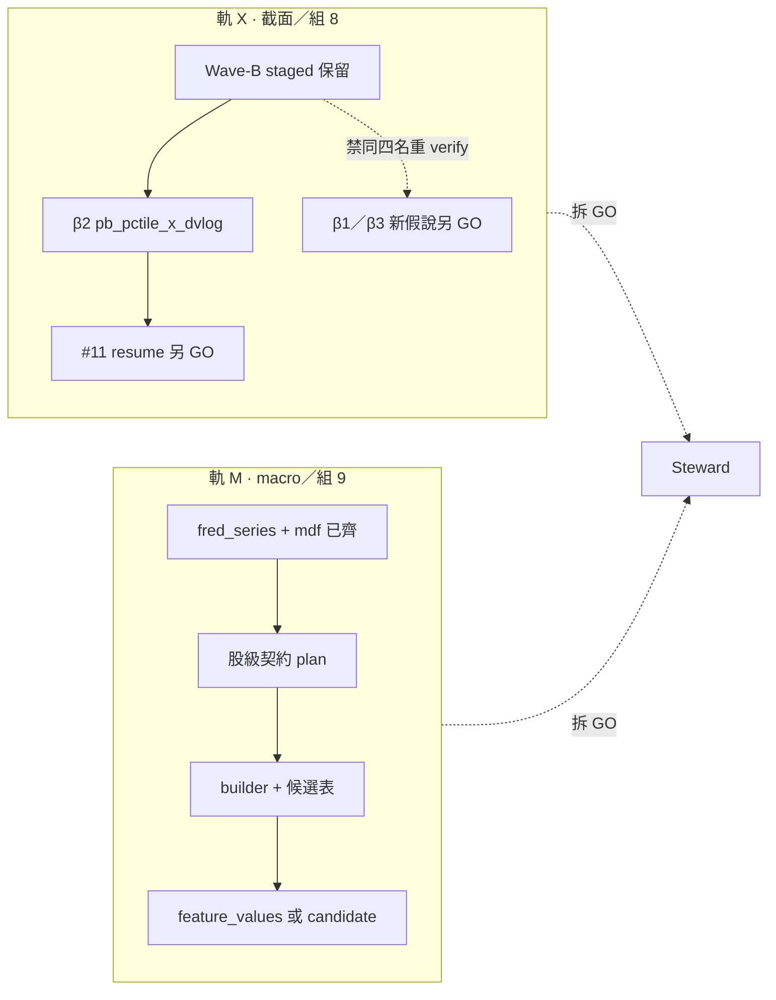

# S3 #3｜xsec 路徑 × 股級 macro（2026-08-05）

> **一句**：組 8「有候選、0 晉升」與組 9「股級 `feature_values` SKIP」是**兩條正交殘帳**——寫進**同一 plan** 對齊 #3，**執行必須拆 GO**；禁綁成一波假綠。  
> **本檔**：plan-first · **零** materialize · **零** verify · **零** prodset · **零** sync。  
> **self-reported（#32a）**。

---

## 0. 為何不是「重跑 Wave-B」

| 事實 | 含義 |
|---|---|
| Wave-B 四候選 **0/4 提拔** | 同定義＋同尺**禁**再跑一次裝推進 |
| `pb_pctile_x_dvlog`（β2）IC 過門、符號負；**#11 未完成**（KInterrupt） | 續跑＝**另 GO**，且受 **β5_stop** 約束 |
| 股級 macro **從來沒有 builder** | SKIP＝契約債，非「再 sync 就有」 |
| Cycle-1／EXPAND | 已閉 macro **raw／PIT 旁路**（fred／mdf＠08-04）；**未**解鎖股級 FV |

對齊既有：殘帳 β plan、β5 停帳、S3-E 軌 β「股級 macro＝另契約」。

---

## 1. 雙軌總圖



| 軌 | 關閉什麼 | 執行波名（建議） | 依賴 |
|---|---|---|---|
| **X · xsec** | 「未晉升」殘帳的**誠實下一手**（非強晉升） | `S3-XSEC-β2-VERIFY-go` 或 `S3-XSEC-β{1,3}-go` | 撤／例外 **β5_stop** |
| **M · macro** | 「股級 FV SKIP」根因＝**無契約／無 builder** | `S3-MACRO-STOCK-CONTRACT-go`→`S3-MACRO-STOCK-BUILD-go` | PIT 門已存在（`macro_vintage`） |

**不**使用 `S3-WAVE-C/D` 舊名（已佔）；**不**與 S3-E 組 14–16 綁批。

---

## 2. 軌 X — 截面晉升路徑

### 2.1 已死路（寫入紀律）

- 重跑 `pb_xsec_rank`／`pb_industry_demean`／`pb_self_pctile_252d`／`inst_govbank_divergence` 同一 `#11` 口徑  
- 放寬 HAC／「Δ≈0 當過」強進 prodset  
- 自動 promote  

### 2.2 仍開之路（擇一另授）

| 代號 | 內容 | 產出 | 風險 |
|---|---|---|---|
| **X-A** | 續完 β2 `#11`（單名 `pb_pctile_x_dvlog`、H60、`--seeds 3 --keep`） | Δ 終表；仍可能 0 提拔 | CPU 重；勿∥ 聊天／evo |
| **X-B** | β1：PB 族符號翻轉後 **新名** 再 IC→#11 | 新 staged 列 | 研究債 |
| **X-C** | β3：僅對曾過 HAC 者加 H20 臂 | 異質 horizon 帳 | 較輕 |
| **X-D** | 維持 β5：只 KEEP／記帳 | 零 CPU | **現狀預設** |

**預設建議**：維持 **X-D（β5）**直到 Steward 顯式例外；若要動碼，**優先 X-A**（終表未完成，資訊密度最高），勿開平行假說。

### 2.3 paste-ready（軌 X）

```text
S3-XSEC-beta2-VERIFY-go | FZ/GATE-keep | skip-sync | no-SIM-apply | beta5-exception
# single: pb_pctile_x_dvlog · H60 · seeds=3 · --keep · no prodset
```

或繼續停：

```text
S3-XSEC-beta5-KEEP | FZ/GATE-keep | skip-sync | no-SIM-apply
```

---

## 3. 軌 M — 股級 macro 契約（SKIP 根因）

### 3.1 問題精確化

| 層 | 現況 | SKIP？ |
|---|---|---|
| FRED 觀測 | `fred_series`＠**2026-08-04**（EXPAND） | 否 |
| PIT 讀門 | `augur.features.macro_vintage` | 門在；**FV 無消費** |
| 市場截面旁路 | `market_direction_feature`＠**08-04** | 非股級 FV |
| 股級 `feature_values` | **零** macro／vix／fred 名 | **是＝本軌要解** |

`macro_vintage.py` 自陳：**尚無生產特徵消費總經**——接線前契約。

### 3.2 設計原則（必須寫進 CONTRACT GO）

1. **#8**：每特徵 `visible_date`／消費謂詞只走 `macro_vintage.as_of`（禁 raw SQL 掃 `fred_series`）。  
2. **#1**：算不出→缺列；禁 forward-fill 假齊、禁 median-fill。  
3. **截面異質**：股級 ≠ 複製市場標量到每列就叫「股級」——須至少一類異質化（見種子假說），否則應誠實標 `market_broadcast` 旁路、**不**進 FV。  
4. **先候選表**：首輪進 `feature_candidate_values`（或等價 staging），**過 #11 才**談 prodset／寫入生產 `feature_values`。  
5. **skip-sync**：只用庫內 as-of；不因本 GO 放量 FRED。

### 3.3 種子假說（CONTRACT 階段挑 ≤3 名；勿一次灌）

| 候選名（例） | 定義草案 | 異質化 |
|---|---|---|
| `mkt_vix_asof` | `macro_vintage.as_of(VIXCLS, panel)` 廣播 | **弱**——僅作對照臂／可標 broadcast |
| `beta_vs_mkt_60d × vix` | 股對 TAIEX 60d β × VIX 分位 | **強** |
| `ret_20d × t10y2y_chg` | 股動能 × 曲線變化（PIT） | **中** |
| `industry_ret_exmkt × spread` | 產業相對大盤 × 利差 | **中**（吃 Info／Industry） |

CONTRACT 產出必須含：最終選名表、visible_date 規則、panel 頻率（對齊 FV **月頻**）、與 `market_direction_feature` 邊界（不雙算）。

### 3.4 (a)(b) schema／程式（拍板後才寫）

| 層 | 提案 |
|---|---|
| **schema** | 優先重用 `feature_candidate_values`；**不**新造 macro 寬表 |
| **python** | 新：`src/augur/features/macro_stock.py`（只經 `macro_vintage`）＋薄 CLI `scripts/build_macro_stock_candidates.py` |
| **驗收** | 材料化列數＋as-of IC；**另** `#11` GO；禁自動晉升 |

### 3.5 分階段

| 階段 | 內容 | GO |
|---|---|---|
| **M0** | 本檔（#3 雙軌總 plan） | 無碼 |
| **M1** | 契約定稿（選 ≤3 名＋PIT／異質規則＋驗收尺） | `S3-MACRO-STOCK-CONTRACT-go` |
| **M2** | builder＋材料化＋IC（候選表） | `S3-MACRO-STOCK-BUILD-go` |
| **M3** | `#11` 多 seed（過 M2 門檻才） | `S3-MACRO-STOCK-VERIFY-go` |
| **M4** | prodset（極少；另明示） | 極高門檻另句 |

### 3.6 paste-ready（軌 M）

```text
S3-MACRO-STOCK-CONTRACT-go | FZ/GATE-keep | skip-sync | no-SIM-apply
# deliverable: reports/ or audits contract sheet ≤3 names; zero build
```

```text
S3-MACRO-STOCK-BUILD-go | FZ/GATE-keep | skip-sync | no-SIM-apply
# after CONTRACT accepted; candidates only; no prodset
```

---

## 4. 與 #4／#7／凍結項正交

| 項 | 關係 |
|---|---|
| #4 序列／圖 | S3-D **已**落地；SKIP 轉消費端＝S4 adapter——**本 plan 不開** |
| #7 core B1 | 日更成本——正交；可∥ 文件 |
| NF-pause／β5 | S4 新族／特徵面預設停：**X 軌例外須明示** |
| 方向誠實切片 | 股級 macro ≠ 絕對漲跌可答 |

---

## 5. 驗收（plan 本身）

1. Steward 知雙軌拆 GO、知 β5／Wave-B 死路。  
2. 任一執行波不得同時默授 X＋M 全鏈。  
3. M 軌未 CONTRACT 前禁止開 builder 碼。

---

## 6. 請 Steward 裁示（本 plan 後）

1. **x_keep_m_contract** — X 維持 β5；下一步只開 **M1 CONTRACT**（推薦若要閉 SKIP 根因）  
2. **x_verify_m_plan** — 例外開 **X-A** β2 `#11`；M 僅留本總 plan  
3. **x_and_m1** — X-A∥ M1（兩 GO；CPU 錯峰）  
4. **plan_ack_only** — 只承認本檔，暫不開執行 GO  

*定版。下一步＝上表擇一。*

---

## 追記｜軌 M 停（2026-08-05）

Steward `m_stop` → `audits/S3-MACRO-STOCK-M-STOP-ACCEPTED-20260805.md`。VERIFY-v2-P2 keep_staged 後暫停軌 M；重開須 CONTRACT-v3 另句。
