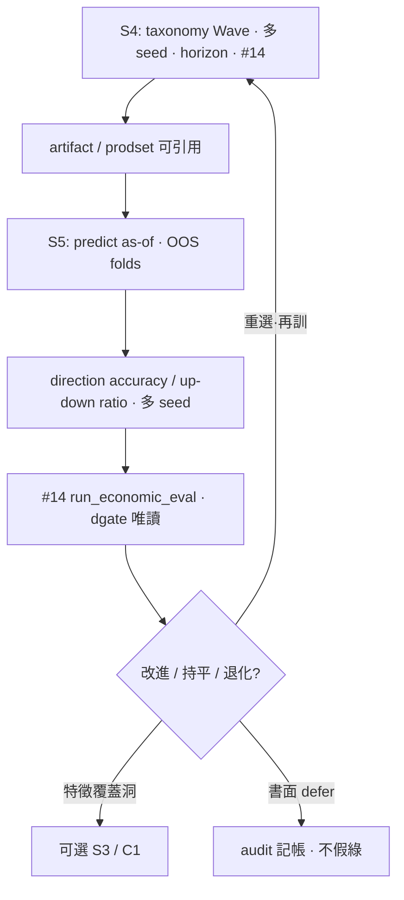
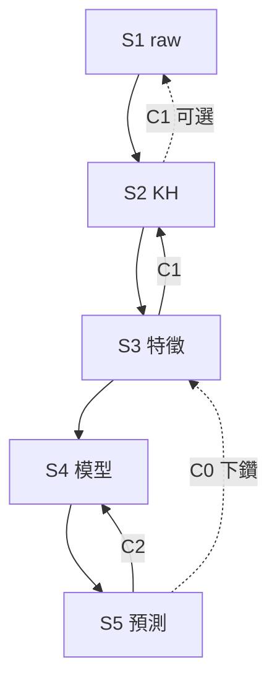

# S4↔S5 閉環計畫 · 2026-08-04

> **位階**：[I] 計畫書（CLAUDE #16／#20）。**不創設治權判準**；不改 [N]；不代簽。  
> **授權（2026-08-04）**：`LOOP-S4-TO-S5-go`／`LOOP-S5-TO-S4-OPT-go`／`LOOP-FULL-CHAIN-go`＋GATE-keep／NHC-keep／API-THAW-bounded／no-SIM-apply／skip-sync；`S4-WAVE-A` ack in-flight（**不重啟**）。GO＝`audits/LOOP-S4-S5-FULL-GO-20260804.md`。  
> **C0 效力**：地圖授權＝yes；**≠**一鍵 S1–S5 重建／predict 寫／sim apply／放量 API。  
> **parent**：`reports/augur_local_ai_predict_sim_self_evolve_opt_plan_20260804.md` §0.7／§0.8／§7.2d（rev `approved+c2-loop`）。

---

## 0. Steward mandate（要旨）

```
產生模型(最佳化多種模型重覆驗証)S4->產生預測股價(最佳化準確率的漲跌比率重覆驗証 )S5。同樣也產生閉環
```

**解讀**

| 是 | 不是 |
|---|---|
| **正向**：S4 多族／多 seed／horizon／#11／#14 → S5 方向 accuracy／漲跌比 **OOS folds／多 seed** | 單臂 IC／單次 dry 綠＝完成 |
| **回饋**：S5 OOS → 重選／重訓 S4 族／horizon／family 優先 | 自動 APPLY／偷降閘 |
| **可選全鏈**：缺口下鑽 S3 特徵／C1（S2 KH／S1 raw 記帳） | 一次 GO 默授 ingest+build+train+predict 寫+sync |
| 庫內 as-of；predict ⊥ API；`no-SIM-apply` until separate go | 假確立級；sim 校準綠＝經濟綠 |

**對齊既有閉環**：與 **C1**（S3→S2→S1；`augur_s2_kh_optimize_after_s3_plan_20260804.md`）同型——前向＋回饋＋人閘；合成 **C0**（parent §0.8）。

---

## 1. Doctrine（釘死｜繼承 parent §1）

1. **predict／train ⊥ live API**：DB as-of；`--skip-sync`；缺增量告警續跑、不拒訓。  
2. **#8 anti-leakage**：OOS folds／label／切分＝已實現時點。  
3. **#11**：stochastic ≥3 seed（min／median／max／mean）；單次極值註明。  
4. **#14**：經濟終關可跑且數字 (a)(b)(c)；**IC ≠ 可交易**。  
5. **禁假確立級**：唯 `direction_gate.status='evaluated_pass'`；現況 pass＝0 → 誠實呈報。  
6. **sim ≠ 預測尺**：校準綠 ≠ #14；**no-SIM-apply until separate go**。  
7. **GATE-keep／NHC／API-THAW-bounded**：禁偷 APPLY；THAW ≠ 放量。

---

## 2. 閉環地圖

### 2.1 ASCII（C2 本體）

```
                    ┌──────────────────────────────────────┐
                    │              閉環 C2                   │
  S4 多模型重覆驗 ──► S5 漲跌比 OOS 重覆驗 ──► 分數表      │
  (#11/#14/Wave)     (folds·seeds·direction)   │           │
       ▲                                       ▼           │
       └──── 重選族 / horizon / 再訓帳 / SKIP 升級 ────────┘
                              │
                              ▼（可選）
                    S3 特徵缺口 → C1（S2 KH → 可選 S1 記帳）
```

### 2.2 Mermaid（C2）



### 2.3 Mermaid（全鏈 C0）



---

## 3. 正向：S4 → S5（`LOOP-S4-TO-S5-go`）

### 3.1 觸發

| 觸發 | 證據例 |
|---|---|
| **T1** | `S4-FAMILIES-PLAN-go` 已拍（**是**）且至少一 Wave／可引用 artifact 收口（Wave 待 `S4-WAVE-*-go`） |
| **T2** | `P1-DRIFT: C-go` 或既有 ranker／direction 臂產出可核 artifact（庫內 as-of） |
| **T3** | S5 重跑請求（同 artifact 換 OOS 窗／seed） |

**本輪**：地圖就緒；**未**開 train／predict 寫——T1 計畫側成立、執行側待 Wave／LOOP GO。

### 3.2 S4 驗收（進入 S5 前）

對齊 `augur_s4_market_model_families_opt_plan_20260804.md`：

| 項 | 要求 |
|---|---|
| 多模型 | Wave 內 ≥1 族（基線 2 族≠全普查完成） |
| #11 | ≥3 seed 分布可陳 |
| #14 | 經濟終關可跑或誠實 SKIP（非截面尺另標） |
| SKIP | 缺 adapter／資料＝記帳，不假 pass |
| 八閘 | APPLY 另句；本 LOOP **不含** APPLY |

### 3.3 S5 驗收（本迴路核心尺）

| 項 | 要求 |
|---|---|
| 方向／漲跌比 | OOS folds × 多 seed；accuracy／up-down hit ratio |
| 溯源 | 每數字 (a) stdout／(b) DB／(c) API——禁記憶補 |
| #14 | 與方向尺並列；IC 撐住 ≠ 可交易 |
| 確立級 | **禁假關**；`direction_gate` 唯讀；pass=0 誠實 |
| 寫庫 | 預設 dry／唯讀；寫＝`predict-asof-write-go` |
| sim | 旁軸；**no-SIM-apply** |

### 3.4 產出

| 產出 | 落點 |
|---|---|
| OOS 分數表（族 × horizon × seed 分布） | `audits/S5-OOS-<date>.md` 或 stdout 歸檔（執行波） |
| 失敗模式帳（regime／覆蓋／leak 嫌疑） | 同上 |
| 是否觸發 S5→S4 | 決策列＋GO |

---

## 4. 回饋：S5 → S4（`LOOP-S5-TO-S4-OPT-go`）

### 4.1 動作選單（人裁；非自動）

| 動作 | 何時 | 硬禁 |
|---|---|---|
| **重排 Wave 優先** | 某大類 OOS 穩定優於他類 | 未驗證改寫 families SSOT 驗收尺 |
| **重訓同族** | seed 方差大／as-of 漂移 | 偷看未來窗 |
| **換 horizon 臂** | 短窗／長窗分數分裂 | 混窗當單分 |
| **SKIP→adapter 債** | 缺 infra 致無法測 | SKIP 當 pass |
| **下鑽 S3／C1** | 特徵覆蓋／KH 概念洞 | 硬灌特徵／整庫 raw 入靈魂 |
| **defer** | 無統計效力／樣本不足 | 沉默消失 |

### 4.2 產出

| 產出 | 落點 |
|---|---|
| S4 再訓／再驗 backlog | `audits/S4-REOPT-BACKLOG-<date>.md`（執行波） |
| 可選 S3／C1 開帳指針 | 連書既有 GO（不另創第二套尺） |

---

## 5. 全鏈 C0（`LOOP-FULL-CHAIN-go`）

| 層 | 含義 |
|---|---|
| **採納** | 承認 C1∪C2 為管線閉環地圖；parent §0.8 為 SSOT 圖 |
| **仍須** | 各段各自 GO：`S2-KH-OPT-AFTER-S3-go`／`S3-WAVE-*`／`S4-WAVE-*`／本檔 LOOP／`predict-asof-write-go`／sim 另句 |
| **不是** | 一鍵授權全鏈寫庫／放量 sync／APPLY／sim apply |

---

## 6. Schema／Python（#20｜本輪不開碼）

| 域 | 既有入口（代表） | 本計畫 |
|---|---|---|
| S4 | `train_ranker.py`／`train_daily_direction.py`／`run_economic_eval.py`／`run_evolution_iteration.py` | 授權後才跑；本輪零 |
| S5 | `predict_asof.py`（dry）／`run_economic_eval.py`／`run_arena_daily_pipeline.py --skip-sync` | 授權後才跑；本輪零寫 |
| 確立 | `direction_gate` 唯讀 | 禁假 pass |
| sim | `run_sim_calibration_cell.py` 等 | **no-SIM-apply** |
| 新表 | — | **不產**；分數落 audit／既有 eval 落點 |

---

## 7. Paste-ready GO

正向（S4→S5 地圖／開工節奏；**不**默授寫庫／Wave 全開）：

```text
LOOP-S4-TO-S5-go + GATE-keep + NHC-keep + API-THAW-bounded + no-SIM-apply + skip-sync
```

回饋（S5→S4 優化帳）：

```text
LOOP-S5-TO-S4-OPT-go + GATE-keep + NHC-keep + API-THAW-bounded + no-SIM-apply + skip-sync
```

全鏈地圖：

```text
LOOP-FULL-CHAIN-go + GATE-keep + NHC-keep + API-THAW-bounded + no-SIM-apply
```

僅 ack：

```text
LOOP-S4-S5-PLAN-ack + FZ-keep + NHC-keep + no-SIM-apply
```

與 Wave／寫庫連書示例（仍逐段）：

```text
S4-WAVE-A-go | LOOP-S4-TO-S5-go | FZ/GATE-keep | no-SIM-apply | skip-sync
```

```text
LOOP-S5-TO-S4-OPT-go | predict-asof-write-go | FZ/GATE-keep | no-SIM-apply | skip-sync
```

（第二句**才**含寫庫；無第二句＝dry／唯讀。）

---

## 8. 交叉連結

| 檔 | 關係 |
|---|---|
| `reports/augur_local_ai_predict_sim_self_evolve_opt_plan_20260804.md` | parent §0.7 C2／§0.8 C0／§7.2d |
| `reports/augur_s4_market_model_families_opt_plan_20260804.md` | S4 族 SSOT（**Steward-approved** `S4-FAMILIES-PLAN-go`） |
| `reports/augur_s3_features_for_market_model_families_20260804.md` | 可選下鑽特徵缺口 |
| `reports/augur_s2_kh_optimize_after_s3_plan_20260804.md` | **C1** S3→S2→S1 |
| `audits/S2-KH-AFTER-S3-LOOP-20260804.md` | C1 登錄 |
| `audits/S4-MODELS-TRIED-LIST-20260804.md` | 基線 2 族（≠ C2 完成） |
| `audits/S4-MARKET-FAMILIES-PLAN-20260804.md` | S4 族計畫登錄 |
| `audits/SIM-S4-S5-CLOSED-LOOP-20260804.md` | 本計畫登錄 |

---

## 9. 風險

| 風險 | 緩解 |
|---|---|
| 單次 OOS 幸運當優勝 | #11 多 seed＋folds；陳報分布 |
| 假確立級 | dgate 唯讀；pass=0 釘死 |
| sim／#14 混尺 | no-SIM-apply；分尺 audit |
| LOOP-FULL 被讀成一鍵全開 | §5 明示逐段 GO |
| 為漲跌比解凍 API | THAW-bounded；predict ⊥ API |
| 基線 2 族假關「多模型完成」 | tried-list ≠ Verified 全族 |

---

## 10. 變更紀錄

| 日 | 內容 |
|---|---|
| 2026-08-04 | 初版：C2 正向／回饋／C0／GO；零 train／零 predict 寫／零 sim-apply |
| 2026-08-04 | Steward 三連 GO＋WAVE-A 協調；status→authorized；執行帳見 `LOOP-S4-S5-FULL-GO`／`LOOP-*-EXECUTED` |

### 授權 checkbox（2026-08-04）

- [x] `LOOP-FULL-CHAIN-go` — C0 地圖授權（docs；非瞬間全鏈重建）
- [x] `LOOP-S4-TO-S5-go` — 對可用 S4 artifact 跑 S5（dry＋OOS；無寫庫）
- [x] `LOOP-S5-TO-S4-OPT-go` — S5 分數後 backlog／最小 opt（無全 taxonomy 重訓）
- [x] `S4-WAVE-A` ack — **不重啟**；協調 `/tmp/s4-wave-a-20260804`
- [x] keep：GATE／NHC／API-THAW-bounded／no-SIM-apply／skip-sync
- [ ] `predict-asof-write-go` — **未授**
- [ ] sim `--apply` — **未授**
- [ ] `S4-WAVE-A-EXECUTED*` 正式收口（方向臂／#14 全表另帳；train-matrix 已 DONE）
- [x] 執行帳：`audits/LOOP-S4-TO-S5-EXECUTED-20260804.md` · `audits/LOOP-S5-TO-S4-OPT-EXECUTED-20260804.md` · `audits/S5-OOS-20260804.md` · `audits/S4-REOPT-BACKLOG-20260804.md`

*完。self-reported（#32a）。*
