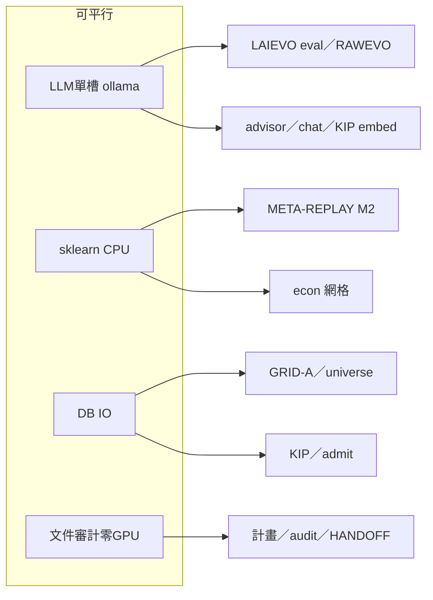

# Augur 自進化／迭代——最佳下一步與可同步執行計畫（2026-07-30）

> **位階**：[I] 執行計畫書（Steward「所有自進化迭代計畫最佳下一步？或可同步執行作業？請做出可以列出逐步執行的計畫書」）  
> **性質**：彙整總控＋各軸＋知識／顧問近程；**不創設新治權判準**；API **FZ-keep**（預測⊥API）  
> **承接**：[`HANDOFF.md`](../HANDOFF.md) §4.0／§4.0b · [`augur_self_evolution_master_plan_v2_20260726.md`](augur_self_evolution_master_plan_v2_20260726.md) · [`augur_all_evolution_next_steps_20260729.md`](augur_all_evolution_next_steps_20260729.md) · [`augur_open_problems_schedule_20260730.md`](augur_open_problems_schedule_20260730.md) · [`augur_future_development_plan_20260730.md`](augur_future_development_plan_20260730.md)  
> **本日會話已落地（須納入序）**：LSR-INGRESS S0–S2 · KH9-first 作答排序 · CJK／KH0 相關度底線 · ERP re-home `local` · admin／advisor／chat 重啟  

**一句話**：力氣留在 **SUNSET (b) prodset 成長＋PME／庫內預測**；本地 AI／arena **誠實量測**；知識線把「可答」從入庫打通到登入顧問；**不解凍 FinMind／FRED**。

---

## 一、現況總覽（六大自進化／迭代軸＋兩條支撐）

| 軸／線 | SSOT／狀態 | 最佳下一步（本計畫） | 阻塞 |
|---|---|---|---|
| **L1 LAIEVO** 本地 AI | V2 尺已換；現行凍結集 robot 五格全 1.000 → live 至多 `none` | **S-4：重建可證能力凍結集**（或顯式標「本集無可證格」停宣稱） | 無 peft／當家機無 GPU；LoRA 僅 DESKTOP |
| **L2 TWEVO／特徵** | prodset **active=2**；INTERACT 材料在；SUNSET (b) 未達 | INTERACT wave-2 四關 → 存活者 **人裁促升** | econ 網格須釘死；樹淨才評門 |
| **L3 Arena live** | 常態 cron；**cluster≈2／門檻 250** | 監看出單／結算；**勿賭 SUNSET(a)** | (a) 物理不可達至 10-31 |
| **L4 REPLAY** | 六門在；momentum／mc **evaluated_fail** | 待評門補評（樹淨）；外隊發布日親驗另排 | 純度閘／工作樹乾淨 |
| **L5 META-REPLAY** | M1／門已凍 | M2 月頻正式掃 → 程序增益門評 | sklearn 道＋長跑 |
| **L6 GRID-A／宇宙** | 月頻 panel 地基 | 收槍驗證 as-of 宇宙 | IO／DB 道 |
| **RAWEVO** | 週六 cron；本機輪次少 | 下輪全自動閉環監看 | LLM 單槽鎖 |
| **PME／XDOM** | SUNZI／AI-PREDICT S3 CLOSED；active 極窄 | **不急 S4**；庫內 n=2 訓練／dry-run 可續 | GATE-keep；≠可交易 |
| **知識／顧問** | KIP／KH9-first／KH0 已開；508 卡 depth3 | **登入顧問驗 ERP**；depth3 誠實帳；KH10-ENABLE 另拍 | RBAC session；≠入憲 grant＝admit（未拍） |

---

## 二、車道規則（可同步的物理極限）



| 道 | 同時上限 | 誰用 |
|---|---|---|
| **`/tmp/augur_llm.lock`** | **1** | ollama：advisor、embed、RAWEVO、LAIEVO eval、ATA、assist |
| **sklearn／CPU 重算** | 建議 1 長跑 | META-REPLAY、econ、own_daily 重演 |
| **DB 重寫／長交易** | 避與 dump／DDL 並行 | GRID-A、大 admit、bulk embed |
| **文件／audit** | 無限 | 本計畫書、CLOSED、HANDOFF 指針 |
| **DESKTOP-8MQPFS8 GPU** | 與當家機平行 | 僅 LoRA／重 embed（顯式搬資料） |

**禁同步**：門評（`direction_gate --evaluate`）↔ 治權檔未提交編輯；FinMind／FRED sync ↔ 任何「解凍幻想」。

---

## 三、逐步執行計畫（建議 5 個波次）

### Wave 0——今日收口（知識／顧問可答；30–90 分）

> 目標：Steward 親問「ERP災難還原演練」在**已登入 admin**下有引文作答；確認 KH0／KH9-first 生效。

| 步 | 動作 | 指令／驗收 | 道 |
|---|---|---|---|
| 0.1 | 確認服務 | `curl :8399/v1/models`、`:8090`、`:8500` → 200 | — |
| 0.2 | **重新登入** chat（重啟後 cookie 常失效） | admin + `AUGUR_INTERNAL_SECRET` 路徑 | — |
| 0.3 | 檔位 **fast／think**（勿先 ultracode 佔鎖） | 問「ERP災難還原演練」／「國碩 DR RMAN」 | LLM |
| 0.4 | 尾註看 `citations>0` | =0 → session／RBAC；>0 仍固定句 → guard | — |
| 0.5 | 可選：本機匯入走 `local_files_local` | admin 重啟後新匯勿再 smoke_test | — |

**可與 Wave 0 同步（文件）**：更新 HANDOFF 一句「顧問 KH9-first＋KH0 底線已落地」（零 LLM）。

---

### Wave 1——SUNSET (b) 主線（本週核心；預測自進化）

> 目標：prodset active **2→≥3**（唯一尚可能達標之 SUNSET 條）；≠可交易宣稱。

| 步 | 動作 | 驗收 | 道 | 人裁 |
|---|---|---|---|---|
| 1.1 | 釘 econ 網格參數（`--panels`／hash 自證） | 書面網格＋panel hash | 文件 | — |
| 1.2 | INTERACT wave-2 候選過四關 | 存活清單＋ledger | sklearn | — |
| 1.3 | **【裁決】**存活者促升 | `PRODSET-PROMOTE` 類一句 | — | **要** |
| 1.4 | 庫內 as-of 重訓／dry-run predict（`--skip-sync`） | audit 列；FZ-keep | CPU／DB | — |
| 1.5 | 實查 `evolution_production_feature_set` active 數 | SQL 親驗 ≥3 才稱 SUNSET(b) 進展 | DB | — |

**可與 1.2 同步**：arena 唯讀監看（不評門）；RAWEVO 週六照 cron（不搶 1.2 的 sklearn 長跑）。

---

### Wave 2——量測誠實（LAIEVO／尺；與 Wave 1 平行但搶 LLM 時錯開）

| 步 | 動作 | 驗收 | 道 | 人裁 |
|---|---|---|---|---|
| 2.1 | 盤點現行 `eval_code_hash`／robot 格 | 文件釘「本集無可證」或開 S-4 | 文件 | — |
| 2.2 | **【裁決】**S-4 重建凍結集 vs 暫停能力宣稱 | 一字 | — | **要** |
| 2.3 | 若 S-4-go：建新 `set_id`＋五臂離線 | robot 不得五格全滿可證格 | LLM 短＋DB | — |
| 2.4 | LoRA **僅**在 DESKTOP 且 **B1-go** 後 | 當家機禁止假裝 GPU | GPU | **要** |

**不可與 advisor 尖峰同步**（同 LLM 鎖）。

---

### Wave 3——重演／程序增益（長跑；錯開 Wave 1 sklearn）

| 步 | 動作 | 驗收 | 道 | 人裁 |
|---|---|---|---|---|
| 3.1 | 工作樹乾淨 | `git status` | — | — |
| 3.2 | META-REPLAY M2 月頻正式 | 新 `proc_sha` 家族帳本 | sklearn 長 | — |
| 3.3 | `evaluate_meta_replay_gate`（n 夠才判） | 程序增益首判 audit | — | 知悉 |
| 3.4 | REPLAY 待評門補評 | 已 fail 兩門不重開幻想 | — | — |
| 3.5 | GRID-A／universe as-of 收槍抽查 | panel 數／特徵抽樣 | DB IO | — |

**可與 Wave 2.1 文件同步**；**不可與 1.2 同時佔满 CPU**。

---

### Wave 4——知識進化閉環（KIP／KH／RKI；FZ-keep）

| 步 | 動作 | 驗收 | 道 | 人裁 |
|---|---|---|---|---|
| 4.1 | depth=3 殘留分類帳（non-semantic vs 缺嵌） | SQL 分桶報告 | DB | — |
| 4.2 | 缺嵌者：scoped KIP `--needs-kip --apply` | embed↑；junk 誠實 | LLM／DB | — |
| 4.3 | KH10-ENABLE（人裁 collect） | **另句拍板**才開 | — | **要** |
| 4.4 | RKI-S3／KNI-S2 | 另令；探針≠過閘 | — | **要** |
| 4.5 | PME-XDOM-SOLAR／S4 | **不建議急開** | — | 另拍 |

---

### Wave 5——開放問題與治權（日曆位）

| 步 | 動作 | 來源 | 人裁 |
|---|---|---|---|
| 5.1 | `min_clusters` 治權「≥60」vs 凍結 **250** | 呈裁，AI 不擅改 | **要** |
| 5.2 | arena 08-03± 第二批＋W2 預案 | 條件觸發 | 知悉 |
| 5.3 | NHC-CONSTITUTE／SH-REVAL／GBDT registry | 各計畫待拍 | **要** |
| 5.4 | API 洞另帳 | **明示解凍句**前不動 | 解凍句 |

---

## 四、建議「本週」同步矩陣（一頁）

| 時段 | LLM 道 | sklearn／CPU | DB／IO | 人 |
|---|---|---|---|---|
| 今日 | Wave 0 顧問驗答 | — | — | 登入＋試問 |
| 明～後 | 錯開：embed／KIP 或停 | Wave 1.2 四關 | 1.1 網格文件 | — |
| 裁決窗 | 停 LLM 重活 | pause | — | **1.3 促升** |
| 促升後 | dry-run predict | 1.4 重訓 | 帳本 | — |
| 夜間／週末 | RAWEVO cron | Wave 3 長跑（選一夜） | GRID 收槍 | — |
| 穿插 | — | — | 4.1 depth3 帳 | 5.1 呈裁 |

---

## 五、表／程式對照（計畫完整性精簡）

| 用途 | 既有表（讀／寫） | 主要程式 |
|---|---|---|
| 特徵促升 | `evolution_production_feature_set`、`trial_ledger`、四關工具 | `scripts/verify_candidate_promotion.py`、econ eval |
| 三軸帳本 | `evolution_*` 10 表 | `evolve_*`／iteration runners |
| LAIEVO 尺 | `local_model_eval_*` | `eval_local_model.py`、`behavior_rubric.py`、`evidence_protocol.py` |
| Arena | `direction_arena_prediction`、`direction_gate` | `run_arena_daily_pipeline.py`、`settle_*` |
| 知識入庫 | `knowledge_*`、`knowhow_auto_admit_*`、`knowledge_ingress_kip_run` | `run_knowledge_ingress_kip.py`、`auto_admit`、`relevance`（KH0／CJK） |
| 顧問 | session／RBAC | `serve_advisor_openai`、`serve_chat_ui`、`advise` |

**本計畫不新建表**；若 S-4／KH10-ENABLE 另開案再附 DDL。

---

## 六、驗收總表

| ID | 準則 |
|---|---|
| V0 | 登入後 ERP／國碩問句 `citations≥1` 且非空庫固定句 |
| V1 | prodset active 親驗增長或書面「本週無存活」誠實 |
| V2 | 不引用 robot 滿分集上之假能力數字 |
| V3 | 任一長跑 resume-safe；斷則停該線＋audit |
| V4 | 全程無 FinMind／FRED 外部呼叫 |
| V5 | 無「可交易／確立級」宣稱（除非原閘 evaluated_pass） |

---

## 七、明確不做

- 解凍 API／Dividend 放量／假補洞  
- SUNSET (a) 用「等 cluster 到 250」當本季主線  
- 當家機跑 LoRA／假裝有 GPU  
- KH admit 自動＝RBAC 廣授（**未入憲前不做**；另句）  
- PME-XDOM S4／SOLAR 自動開  
- AI 代簽人閘／自動下單  

---

## 八、請 Steward 拍板（執行本計畫時）

回覆建議格式（可刪減）：

```text
EVO-EXEC-20260730 + W0-go + W1-go + FZ-keep
（可加：S4-eval-set-go / KH10-ENABLE-S1 / 暫緩 W3）
```

| 碼 | 含義 |
|---|---|
| `W0-go` | 今日顧問可答收口 |
| `W1-go` | 本週 SUNSET(b)／INTERACT 促升鏈 |
| `W2-go` | LAIEVO S-4 或誠實停宣稱 |
| `W3-go` | META-REPLAY／GRID 長跑窗 |
| `FZ-keep` | 維持 API 凍結 |

---

## 九、拍板狀態（2026-07-30）

登錄＝[`audits/EVO-EXEC-20260730-APPROVED.md`](../audits/EVO-EXEC-20260730-APPROVED.md)

| 碼 | 狀態 |
|---|---|
| `EVO-EXEC-20260730`／`W0-go`／`W1-go`／`FZ-keep` | **生效** |
| 暫緩 W3 | **deferred** |
| `S4-eval-set-go`／`KH10-ENABLE-S1` | **已補開**（`audits/EVO-S4-KH10-S1-APPROVED-20260730.md`） |

## 十、修訂

| 日 | 說明 |
|---|---|
| 2026-07-30 | 初版：匯總 V2／07-29 六線／開放問題／本日知識顧問落地；波次＋車道＋拍板碼 |
| 2026-07-30 | Steward 拍板登錄；W3 暫緩；S4／KH10 未開 |
