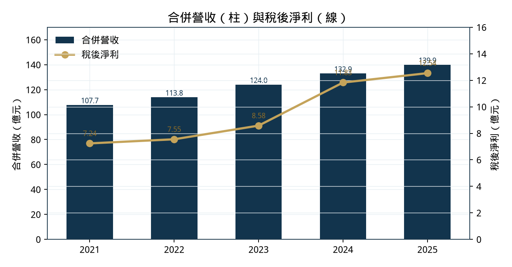
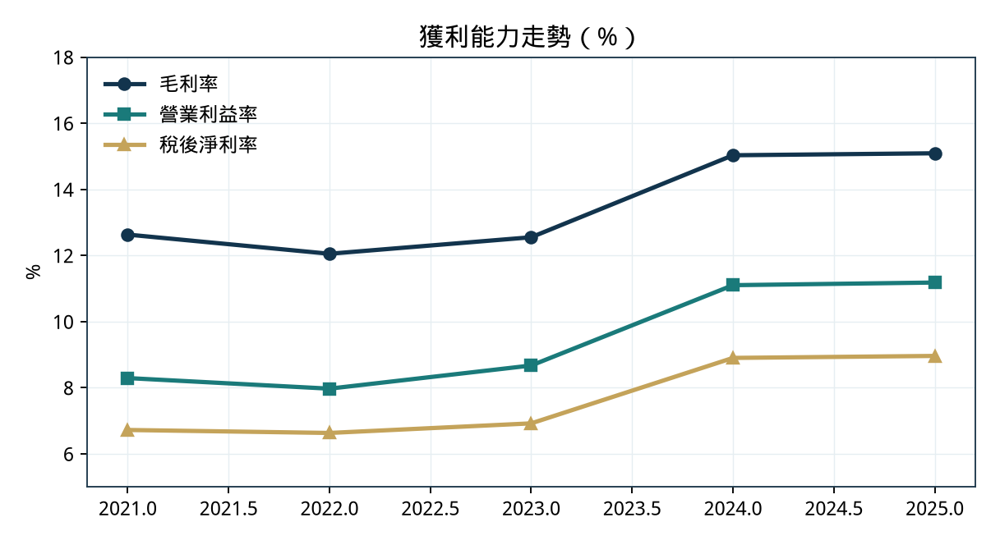
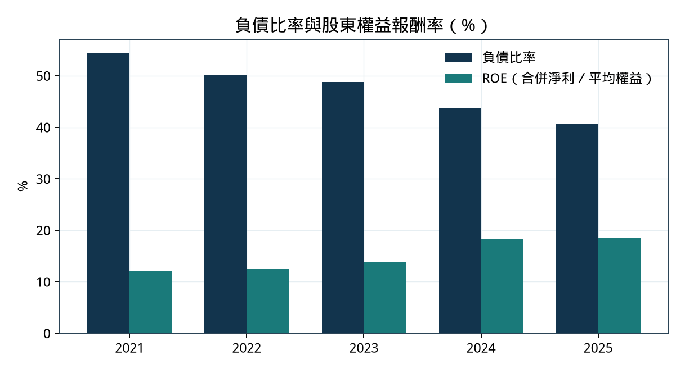
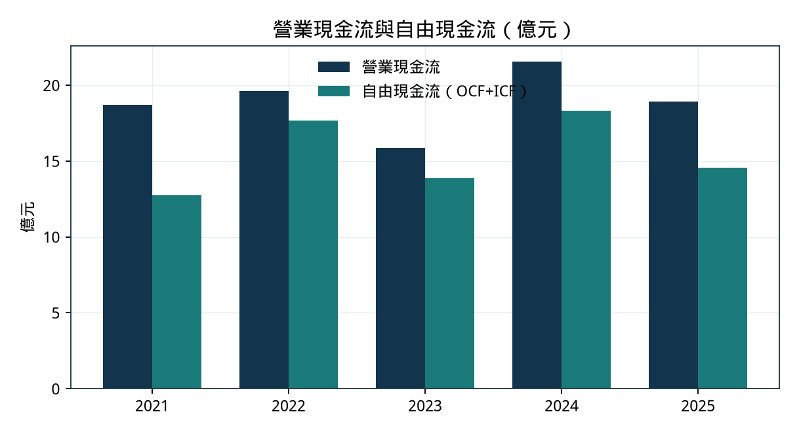
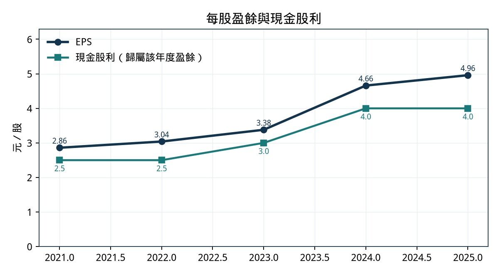
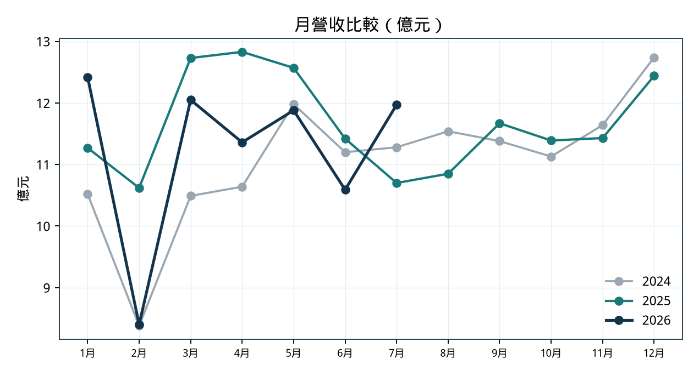

# 9930 中聯資源｜近五年財務分析與未來五年前景、全球競爭力報告

- **截止：** 2026-08-27
- **排版 PDF：** [`chc_9930_financial_outlook_20260827.pdf`](chc_9930_financial_outlook_20260827.pdf)
- **HTML 原稿：** [`chc_9930_financial_outlook_20260827.html`](chc_9930_financial_outlook_20260827.html)
- **性質：** 公開資料研究備忘，**非投資建議**；前瞻段落為 self-reported 分析。

英文簡稱 CHC Resources Corporation。上市綠能環保。董事長周文賢、總經理吳一民。實收資本額 24.854 億元，流通 248,540,368 股。

## 0. 資料範圍與限制

本雲端環境無法連 augur 本地 PostgreSQL，故未使用庫內財報表，亦**未呼叫 FinMind／FRED**。數字來自：

- TWSE OpenAPI（基本資料、2026-07 月營收、2026-08-26 本益比／淨值比／殖利率）
- MOPS 重大訊息：114 年度合併財報（2026-02-25）、115 年上半年（2026-08-06）
- 公司法說簡報 2026-03-25（`chc.com.tw/pdf/pst_1150325.pdf`）
- HiStock 季報序列（2025 全年加總與 MOPS 114 年度逐項相符）
- ifa.ai 月營收彙編（2021–2025 十二個月加總與年報營收誤差 ≤ 1 千元）

## 1. 執行摘要

| 指標 | 數值 |
|---|---|
| 2025 合併營收 | 139.91 億（MOPS） |
| 2025 EPS／母公司淨利 | 4.96 元／12.33 億 |
| 2021–25 營收 CAGR | 6.8% |
| 2021–25 稅後淨利 CAGR | 14.7% |
| 2026-08-26 收盤／本益比／淨值比／殖利率 | 63.70／14.41x／2.56x／6.28% |
| 近四季 EPS | 4.42 元 |

近五年主軸是量穩、利潤在 2024 上台階、負債下降。2026 上半年轉弱（營收年減 6.7%、淨利年減 19.7%），7 月單月年增 11.9%。公司是台灣爐石粉龍頭、全球噸數利基者。

## 2. 近五年財務（合併）

| 年度 | 營收億 | YoY | 毛利率 | 營益率 | 淨利率 | 稅後淨利億 | EPS |
|---|---:|---:|---:|---:|---:|---:|---:|
| 2021 | 107.71 | — | 12.6% | 8.3% | 6.7% | 7.24 | 2.86 |
| 2022 | 113.83 | +5.7% | 12.0% | 8.0% | 6.6% | 7.55 | 3.04 |
| 2023 | 123.95 | +8.9% | 12.6% | 8.7% | 6.9% | 8.58 | 3.38 |
| 2024 | 132.91 | +7.2% | 15.0% | 11.1% | 8.9% | 11.83 | 4.66 |
| 2025 | 139.91 | +5.3% | 15.1% | 11.2% | 9.0% | 12.54 | 4.96 |

| 年底 | 總資產 | 總負債 | 權益合計 | 負債比 | 流動比 | ROE |
|---|---:|---:|---:|---:|---:|---:|
| 2021 | 131.29 | 71.44 | 59.85 | 54.4% | 101% | 12.1%* |
| 2022 | 122.67 | 61.49 | 61.18 | 50.1% | 85% | 12.5% |
| 2023 | 122.71 | 59.86 | 62.85 | 48.8% | 98% | 13.8% |
| 2024 | 118.03 | 51.49 | 66.54 | 43.6% | 121% | 18.3% |
| 2025 | 114.96 | 46.69 | 68.27 | 40.6% | 130% | 18.6% |

單位億元。ROE 2022–2025 採公司 IR；2021 為合併淨利／年底權益。2025 母公司權益 65.94 億（MOPS）。

| 年度 | 營業現金流 | 投資現金流 | 自由現金流 | 融資現金流 | OCF／淨利 |
|---|---:|---:|---:|---:|---:|
| 2021 | 18.70 | −6.00 | 12.74 | −14.64 | 2.58x |
| 2022 | 19.60 | −1.92 | 17.67 | −18.78 | 2.60x |
| 2023 | 15.84 | −1.96 | 13.88 | −13.02 | 1.85x |
| 2024 | 21.53 | −3.21 | 18.32 | −16.48 | 1.82x |
| 2025 | 18.91 | −4.33 | 14.57 | −15.78 | 1.51x |

盈餘年度現金股利：2021–2025 為 2.5／2.5／3.0／4.0／4.0 元，配發率約 81–89%。

### 2026 迄今

| 期間 | 營收 | 毛利 | 營業利益 | 本期淨利 | EPS |
|---|---:|---:|---:|---:|---:|
| 2025 H1 | 71.44 | 11.19 | 8.60 | 6.82 | 2.70（季報合計） |
| 2026 H1 | 66.69 | 9.49 | 6.53 | 5.48 | 2.16 |
| 變動 | −6.7% | −15.2% | −24.1% | −19.7% | −20% |

2026-07 營收 11.97 億（年增 11.9%）；1–7 月累計 78.66 億（年減 4.2%）。H1 負債比 43.2%。

## 3. 前景與全球競爭力（摘要）

**需求：** 碳費 2026 開徵（標準 300 元／噸，高碳洩漏可優惠）；飛灰隨燃煤轉燃氣減少；2026 公共建設相關預算 6,704 億（+5.6%）。拉力是 2025 建照面積 −17.4%、開工 −9.0%。

**供給：** 中鋼＋中龍水淬爐石年約 420 萬噸。中鋼壹號高爐最遲 2029Q1 除役（約減 150 萬噸粗鋼產能）。南部研磨 +48 萬噸（2026Q4）、中部 +58 萬噸（2028Q3）；越南 2025 產量近 70 萬噸、年營收約 12.5 億、場地預留擴建未核准。

**全球：** TechSci 估全球 GGBFS 2025 年約 4.18 億噸、2031 年約 4.95 億噸。中聯約 300–340 萬噸 → 全球噸數市占約 0.7–0.8%。競爭力是台灣循環節點（料源、執照、水泥股東），不是全球價格制定者。

**基準情境（self-reported）：** 高點已過、進入消化；新產能先換電費調度而非填滿利用率。最大實質風險是 2029 前後高爐渣減量。

完整論證、風險矩陣與來源清單見 PDF。
