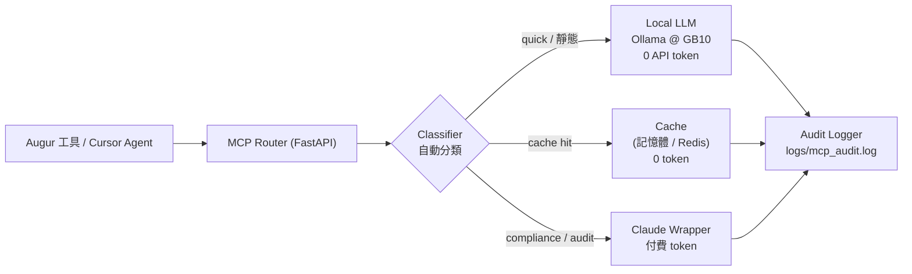

# MCP 設計概覽 — Augur 的 Token 最佳化代理層

> **文件性質**：Layer 7（Infrastructure）之資訊性設計文件 [I]，不具規範力。實作前須依 AUGUR-L7 L7.30（Selection Registry）登錄選型，並通過 §8.3 機器稽核。
> **盤點基準環境**：本機 GB10（aarch64、Ubuntu 24.04.4、CUDA 13.0、統一記憶體 121 GiB、Ollama 已就緒）。見 [ENVIRONMENT-SPEC.md](../infrastructure/ENVIRONMENT-SPEC.md)。

---

## 1. 目標

在 Augur 工具鏈（`constitution_lint`、報表產生、未來 Agent Runtime）與付費 LLM（Claude）之間，插入一層**自動切換的代理**，達成三件事：

- **重複請求走 cache** → 第二次起零 token。
- **低風險、確定性請求走本地 LLM 或直接讀檔** → 零 API token。
- **高風險（compliance／audit）請求才走 Claude** → 保留品質，並留 audit log。

> **名詞澄清**：本文件的 **MCP = Multi-Channel Proxy（多通道代理）**，是一個 HTTP 路由服務，與 Cursor 的 **Model Context Protocol** 是不同東西。兩者可疊加：Proxy 負責「選哪個後端最省 token」，Cursor MCP Server 負責「把工具暴露給 IDE Agent」。整合見 §8。

---

## 2. 架構圖



### 元件職責

| 元件 | 檔案 | 職責 |
|---|---|---|
| **Router** | `mcp/router.py` | 收 `POST /invoke {prompt, type}`；查 cache → 依分類選後端 → 回傳並留痕 |
| **Classifier** | `mcp/classifier.py` | 規則式（關鍵字／regex）將請求標為 `quick` / `compliance` / `audit` |
| **Cache** | `mcp/cache.py` | `hash(type + prompt) → response`，TTL 分級；預設本地記憶體，可切 Redis |
| **Local LLM** | `mcp/local_llm.py` | 呼叫 GB10 本機 Ollama（`qwen3:4b`）；未就緒時回 stub |
| **Claude Wrapper** | `mcp/claude_cli.py` | 呼叫 Claude 並解析 token 用量；**MVP 先留 stub**，之後接 CLI 或 API |
| **Logger** | `mcp/logger.py` | 寫 JSON lines：時間、type、prompt hash、backend、token 數 |

---

## 3. 自動切換規則

切換的核心是「用最便宜且足夠的後端」。決策順序固定為：**cache → 本地／讀檔 → Claude**。

```python
# mcp/router.py（概念）
BACKEND_MAP = {
    "quick":      "local",    # Ollama，零 API token
    "compliance": "claude",   # 合規檢查，必走 Claude
    "audit":      "claude",   # 審計級，必走 Claude
}

@app.post("/invoke")
async def invoke(body: dict):
    prompt   = body["prompt"]
    req_type = body.get("type") or classify(prompt)

    # 1) 所有類型都先查 cache
    if (cached := get_cache(prompt, req_type)) is not None:
        log_request(prompt, req_type, "cache", tokens=0)
        return {"response": cached, "backend": "cache", "tokens": 0}

    # 2) 依分類路由；預設保守走本地
    if BACKEND_MAP.get(req_type, "local") == "local":
        resp, tokens = await ask_ollama(prompt), 0
    else:
        resp, tokens = await ask_claude(prompt)   # (response, tokens)

    set_cache(prompt, req_type, resp)
    log_request(prompt, req_type, BACKEND_MAP.get(req_type, "local"), tokens)
    return {"response": resp, "backend": BACKEND_MAP.get(req_type, "local"), "tokens": tokens}
```

### Classifier 規則

```python
# mcp/classifier.py
import re

RULES = [
    (r"compliance|合規|lint|WM\.\d+|L[0-9]\.\d+|§8\.\d", "compliance"),
    (r"audit|審計|裁決|ruling|RULING-\d{4}",             "audit"),
    (r"explain|解釋|什麼是|overview|概覽|summary|摘要|白話", "quick"),
]

def classify(prompt: str) -> str:
    for pattern, req_type in RULES:
        if re.search(pattern, prompt, re.I):
            return req_type
    return "quick"          # 預設走本地，保守省 token（非合規語義，安全）
```

| 類型 | 路由 | 範例 | Token 成本 |
|---|---|---|---|
| `quick` | Ollama（本地） | 「解釋 L2 是什麼」「L0-L1 白話摘要」 | 0（本地） |
| `compliance` | Claude | 「檢查 WM.44 合規性」「L7.40 是否弱化監督」 | 付費 |
| `audit` | Claude | 「審計 RULING-2026-012 的處置」 | 付費 |
| （cache hit） | Cache | 任一重複請求 | 0 |

> **fail-closed 原則**：分類錯誤只允許「保守方向」——把低風險誤判為 `quick` 走本地，最壞是答案較弱；但**絕不可**把 `compliance`／`audit` 誤降級到本地。若無法判定，寧可標為 `compliance` 走 Claude。這對齊 AUGUR-L7 L7.47（資源不足不得降低監督）。

---

## 4. Cache 設計

```python
# mcp/cache.py（預設：本地記憶體 dict，可切 Redis）
import hashlib, time

TTL = {"quick": 7*86400, "compliance": 24*3600, "audit": 3600}
_store: dict[str, tuple[float, str]] = {}   # key -> (expire_ts, response)

def _key(prompt, req_type):
    return hashlib.sha256(f"{req_type}:{prompt}".encode()).hexdigest()

def get_cache(prompt, req_type):
    hit = _store.get(_key(prompt, req_type))
    if hit and hit[0] > time.time():
        return hit[1]
    return None

def set_cache(prompt, req_type, response):
    _store[_key(prompt, req_type)] = (time.time() + TTL[req_type], response)
```

- **預設本地記憶體**：零外部依賴，適合單機 GB10 與 CI 先跑起來。
- **可切 Redis**：多程序共享或需持久化時，把 `_store` 換成 `redis.Redis`（同介面），由 `MCP_CACHE_BACKEND` 環境變數選擇。
- **TTL 分級**：`quick` 7 天、`compliance` 24 小時、`audit` 1 小時；CI 跑 lint 前先清空，避免 stale 結果。

---

## 5. Local LLM（接 GB10 的 Ollama）

本機已有 Ollama（`127.0.0.1:11434`，模型 `qwen3:4b`、`qwen3:8b`）。GB10 統一記憶體 121 GiB，可承載比原 GTX 1650 4GB 更大的模型。

```python
# mcp/local_llm.py
import os, httpx

OLLAMA_URL = os.getenv("OLLAMA_URL", "http://127.0.0.1:11434/api/generate")
MODEL      = os.getenv("MCP_LOCAL_MODEL", "qwen3:4b")

async def ask_ollama(prompt: str) -> str:
    try:
        async with httpx.AsyncClient(timeout=120) as client:
            r = await client.post(OLLAMA_URL, json={
                "model": MODEL, "prompt": prompt, "stream": False,
            })
            r.raise_for_status()
            return r.json()["response"]
    except (httpx.HTTPError, KeyError):
        return "(local LLM unavailable — stub answer)"   # 保守 fallback
```

---

## 6. Claude Wrapper（MVP 先 stub）

高風險後端先以 stub 佔位，避免現在就需要 API key；之後可接 `claude` CLI 或 Anthropic API。

```python
# mcp/claude_cli.py
import os

def _stub(prompt: str) -> tuple[str, int]:
    return ("(claude backend not wired — stub)", 0)

async def ask_claude(prompt: str) -> tuple[str, int]:
    mode = os.getenv("MCP_CLAUDE_MODE", "stub")   # stub | cli | api
    if mode == "stub":
        return _stub(prompt)
    if mode == "cli":
        # subprocess: claude -p "$prompt"，解析輸出末行的 token 用量
        ...
    if mode == "api":
        # Anthropic SDK：key 由 ANTHROPIC_API_KEY 讀取，回 (text, usage.total_tokens)
        ...
```

---

## 7. 工具端統一入口

`constitution_lint` 目前是純 Python、**不呼叫 LLM**（見 `report.py`），這是最省 token 的狀態，應維持。只有需要「理解／解釋／推理」時才透過下列入口：

```python
# tools/constitution_lint/mcp_client.py
import os, httpx

MCP_URL = os.getenv("MCP_URL", "http://localhost:8000/invoke")

def invoke_mcp(prompt: str, req_type: str | None = None) -> dict:
    r = httpx.post(MCP_URL, json={"prompt": prompt, "type": req_type}, timeout=120)
    r.raise_for_status()
    return r.json()   # {"response", "backend", "tokens"}
```

---

## 8. 與 Cursor MCP（Model Context Protocol）整合（可選）

若要讓 Cursor IDE 的 Agent 也走這套省 token 路由，再包一層 MCP Server 暴露 tools：

```json
// ~/.cursor/mcp.json
{
  "mcpServers": {
    "augur": {
      "command": "python",
      "args": ["-m", "mcp.server"],
      "cwd": "/home/giga/augur",
      "env": { "MCP_ROUTER_URL": "http://localhost:8000" }
    }
  }
}
```

| MCP Tool | 路由 | 說明 |
|---|---|---|
| `constitution_lint` | 不走 LLM | 直接跑 Python lint（零 token） |
| `get_spec_section` | Cache／讀檔 | 直接讀 markdown（零 token） |
| `explain_clause` | → Ollama | 白話解釋某條款 |
| `compliance_check` | → Claude | 合規深度分析 |

**關鍵**：讀檔、跑 lint 這類確定性操作不應經任何 LLM——最大的 token 節省來自「根本不呼叫模型」，而非「呼叫較便宜的模型」。

---

## 9. 執行時範例流程

1. 工具要一份 compliance 摘要 → `invoke_mcp(prompt, type="compliance")`。
2. Router 收到；`type` 已給定，否則由 Classifier 判定。
3. 先查 cache；命中即回，`tokens=0`。
4. 未命中 → 依 `BACKEND_MAP` 走 Claude（`compliance`）。
5. 回應寫入 cache 並回傳。
6. Logger 追加一行（只存 prompt 的 SHA-256 hash，不存全文）：
   ```json
   {"ts":"2026-07-21T10:00:00Z","type":"compliance","prompt_hash":"a1b2c3","backend":"claude","tokens":84}
   ```
7. 之後相同 prompt 命中 cache → **0 token**。

---

## 10. Token 節省估算

| 場景 | 無 MCP | 有 MCP | 節省 |
|---|---|---|---|
| CI nightly 相同摘要 ×5 | 5 × 30 = 150 | 30 + 0×4 = 30 | **80%** |
| 「解釋 L2」類查詢 ×10 | 10 × 25 = 250 | 0（全走 Ollama） | **100%** |
| 合規深度審計 ×1 | 120 | 120 | 0%（正確，不該省） |

節省全部來自 cache 命中與本地承接；高風險審計刻意維持 Claude，不追求省 token。

---

## 11. 風險與緩解

| 風險 | 影響 | 緩解 |
|---|---|---|
| stale cache → 過時的合規資料 | lint 誤判 | TTL 分級 + CI 前清空 cache |
| 本地 LLM 答案不準 | 低風險查詢被誤導 | 僅用於 `quick`；答案標記來源為 `local` |
| 高風險請求被誤降級 | 監督弱化（違 L7.47） | fail-closed：無法判定即走 Claude |
| port 衝突 | 服務起不來 | 用高位 port，經 `MCP_PORT` 環境變數設定 |
| log 洩漏敏感 prompt | 隱私風險 | 只存 SHA-256 hash，不存全文 |

---

## 12. 與 Augur 憲章的對齊（L7）

- **L7.30 Selection Registry**：Ollama、模型名、cache 後端均為「參考實作之登錄 [I]」，須登錄且可替換；不得使憲章依賴特定產品。
- **L7.47 資源不足不得降低監督**：任何切換規則只能降吞吐、不可把 `compliance`／`audit` 降級到本地。
- **audit log 留痕**：所有路由決策記為 Observation（只存 hash），對齊 §P4.E1 追溯義務。
- **刪名測試**：把「Ollama／qwen3／Redis／Claude」等產品名刪去後，本設計的規範內涵（分類→路由→留痕）不變——故為登錄，非依賴。

---

## 13. 實作優先順序

| 階段 | 內容 | 建議預設 | 預估 |
|---|---|---|---|
| **P0** | `router` + `classifier` + `cache` + `logger` | cache 用本地記憶體、Claude 用 stub | 1 天 |
| **P1** | 接 GB10 本機 Ollama（`qwen3:4b`） | 已就緒，快速接上 | 0.5 天 |
| **P2** | `mcp_client.py` 整合 + CI token 報表 | — | 1 天 |
| **P3** | Cursor MCP Server + docker-compose（Redis 可選） | 單機可先略過 Redis | 1–2 天 |

---

## 14. 下一步

目前 repo 僅有本設計文件、尚無 `mcp/` 程式。建議自 **P0** 起步（cache 用本地記憶體、Claude 先 stub、Ollama 於 P1 接上）。經確認後即可建立 `mcp/` 套件並實作。

---

*本文件存於* `reports/mcp_design_overview.md`*，為 [I] 設計參考，不具規範力；實作選型須依 L7.30 登錄。*
